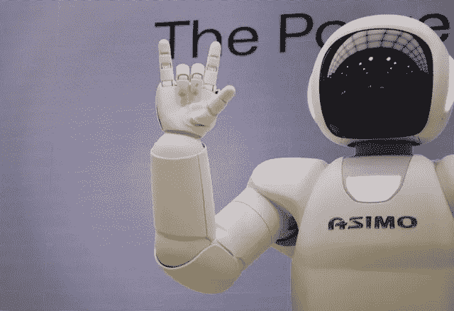

# 张量流中的 NLP

> 原文：<https://towardsdatascience.com/nlp-in-tensorflow-generate-an-ed-sheeran-song-8f99fe76662d?source=collection_archive---------52----------------------->

## 生成一首艾德·希兰歌曲

写歌是有史以来最困难的任务之一。在本文中，我将向您介绍我编写一个模型的经历，这个模型将学习一些艾德·希兰歌曲，并尝试为一首歌曲创作一些开头的句子。我很清楚，最好是制作一个能产生声音的模型，而不仅仅是一首诗，因为艾德·希兰的作品主要是留在我们脑海中的朗朗上口的节奏。然而，我并不想创造莎士比亚的文本。我想要更现代的东西。用它的音频乐队创作歌词应该很棒，但让我们先集中精力创作歌词，一步一步来！



摄影爱好在 [Unsplash](https://unsplash.com/s/photos/robot?utm_source=unsplash&utm_medium=referral&utm_content=creditCopyText) 上

让我们开始吧！

对于我的代码的基本概念，请看看我的文章[在 Tensorflow 的 NLP:情绪分析](https://medium.com/@amel.nozieres/nlp-in-tensorflow-sentiment-analysis-55e27663685b)

首先，让我们导入一些艾德·希兰歌曲的库和源文件。我拿了最后两张专辑开始我们的训练。你可以在我的 Github [这里](https://github.com/AmelNozieres/NLP_Generate_poems/blob/master/Ed_sheeran_songs)找到它。

在标记化、排序和填充之后，我们就可以预测了。生成文本就是预测下一个单词是我们语料库中的哪个单词。一个几乎简单的多类预测不是吗？！是的，差不多了！

所以让我们建立一个简单的模型。我们从嵌入层开始。请看我之前关于[嵌入](https://medium.com/@amel.nozieres/nlp-in-tensorflow-sentiment-analysis-55e27663685b)的文章。

通过嵌入，我们得到了每个单词的向量。向量按距离排序。例如“草是……”下一个单词预测应该是“绿色”。简单！但是有时候你需要在段落的开头提供信息。那么我们如何分析我们的句子，并在记忆中保留之前的单词，不管之前有多少个句子。

答案是 RNN 循环神经网络。对于视频中的帧序列、文字序列中的单词、音乐序列中的音符，它都非常方便。所以序列数据通常需要 RNN。请阅读 Christopher Olah 关于[理解 LSTM 网络](https://colah.github.io/posts/2015-08-Understanding-LSTMs/)的基础文章和 Andrej Karpathy 的[递归神经网络](http://karpathy.github.io/2015/05/21/rnn-effectiveness/)的不合理有效性以获得更多信息。

如果你对 RNN 和 LSTM 背后的数学或理论不感兴趣，请随意跳到文章的结尾，但我希望你会和我一样发现学习人工智能背后的数学魔力是令人惊讶和兴奋的。

简而言之，RNN 是一个神经网络，其中每个细胞都有来自前一个细胞的隐藏信息作为其条目之一。这里有三个带有 tanh 激活功能的节点。


图片来自 [Christopher Olah 博客](https://colah.github.io/posts/2015-08-Understanding-LSTMs/)

理论上，这应该能很好地记忆上下文，但事实并非如此。这可以用消失梯度问题来解释。事实上，为了测量我们预测的质量，我们需要知道输出单元——预测向量(通过权重乘以先前单元输出的激活函数加上偏差的连续计算——顺便说一下，这是正向传播)和实际向量之间的差异。在我们的例子中，输出是一个单词的预测。所以预测向量减去实际向量，得到损失值或误差值。这种差异越小，我们的预测就越接近。最小化这个误差就是通过提高我们的权重值(学习的能力)来最大化我们预测的准确性。在数学中，为了最小化一个函数，我们计算偏导数，从最后一个节点到第一个节点。这是反向传播。我们在每一层反向传播误差梯度。通常，梯度很小，以至于导数变得越来越小，然后消失。因此，当我们开始反向传播时，改变权重值的幅度在最后的节点中比在第一个节点中更有效。所以当我们反向传播时，我们不能记住梯度的大小。那么我们如何记住节点间的梯度呢？RNN 的黄金之星 LSTM 来了！

# LSTM

LSTM 或长短期记忆。对于每个 RNN 单元格，我们用一个 LSTM 单元格来代替，如下所示:


图片来自[克里斯托弗·奥拉的博客](https://colah.github.io/posts/2015-08-Understanding-LSTMs/)

在每个细胞中，我们制作一个小的神经网络，它的度量能够基于梯度下降来学习要记住什么和要注意什么。是不是很神奇？！

# 模型

所以，回到我们的艾德·希兰艾歌。我们的简单模型是一个嵌入层，一个双向的 LSTM - *请阅读* [*本文*](https://arxiv.org/pdf/1508.01991.pdf) *了解更多信息-* 所以我们解析过去和未来的句子，并用一个密集的层来包装这一切。让我们创作歌曲吧！

因此，我们的艾德·希兰人工智能模型将从“爱是什么”这句话中创造出什么:

以下是生成的文本:

```
I don't know about me 
know i love someone else 
i've either way to dress 
that i really wanna know
that i'll be creeping a long time 
a bit too way up we found love 
right where we are 
oh a mystery 
a purse a time to move home 
that could breathe 
still oh still time can it takes to get a long
```

让我们试试“爱是什么”

```
What love is a blaze time 
that it takes to give out all 
when you stand upon my bed 
are changed of crisps 
but i guess that plays never leave me 
a stage a song that i wrote 
that mixing fitting at my erasing 
and a song my heart is a getting ahead of a couple of days 
a new you take a
```

对于第一个简单的模型来说还不错。它可以给人灵感来重写它，使它更准确，但不知何故，它是诗意的。

我肯定会在我的语料库中添加更多的歌曲，看看它的表现如何。但是在内存饱和之前，我们不能添加那么多到我们的语料库中。

你可以在 Github [这里](https://github.com/AmelNozieres/NLP_Generate_poems/blob/master/Generate_ed_sheeran_poem.ipynb)找到我的代码。

我希望你喜欢这个与 TensorFlow 艾德·希兰一代歌曲代码的演练。喜欢的请给它掌声。这是一个基线，所以请随意复制我的代码，并让我知道你对它的看法。编码快乐！