# 金融市场中的 NLP 情绪分析

> 原文：<https://towardsdatascience.com/nlp-in-the-financial-market-sentiment-analysis-9de0dda95dc?source=collection_archive---------8----------------------->

## 最新的自然语言处理模型在多大程度上优于传统模型——从词汇方法到用于金融文本情感分析任务的 BERT


马库斯·斯皮斯克在 [Unsplash](https://unsplash.com?utm_source=medium&utm_medium=referral) 上的照片

D 自 2012 年先驱 CNN 在 ImageNet 上推出 AlexNet 以来，计算机视觉中的 eep 学习已经成功应用于各种应用中。相反，NLP 在深度神经网络应用方面已经落后了。许多声称使用人工智能的应用程序通常使用某种基于规则的算法和传统的机器学习，而不是深度神经网络。2018 年，一种名为 BERT 的最先进(STOA)模型在一些自然语言处理任务中的表现超过了人类的分数。在这里，我将几个模型用于情绪分析任务，看看它们在我所在的金融市场中有多大用处。代码在 jupyter 笔记本中，可以在 git [repo](https://github.com/yuki678/financial-phrase-bert) 中获得。

# 1.介绍

NLP 任务可以大致分为以下几类。

1.  文本分类—过滤垃圾邮件，对文档进行分类
2.  单词序列—单词翻译、词性标签、命名实体识别
3.  文本含义—主题建模、搜索、问题回答
4.  序列对序列—机器翻译、文本摘要、问答
5.  对话系统

不同的任务需要不同的方法，在大多数情况下是多种自然语言处理技术的结合。开发机器人时，后端逻辑通常是基于规则的搜索引擎和排名算法，以形成自然的交流。

这是有充分理由的。语言有语法和词序，这可以通过基于规则的方法更好地处理，而机器学习方法可以更好地学习搭配和单词相似性。word2vec、词袋等矢量化技术有助于模型以数学方式表达文本。最著名的例子是:

```
King - Man + Woman = QueenParis - France + UK = London
```

第一个例子描述了性别关系，第二个例子描述了首都的概念。然而，在这些方法中，由于在任何文本中相同的单词总是由相同的向量表示，所以上下文没有被捕获，这在许多情况下是不正确的。递归神经网络( **RNN** )架构使用来自输入序列的先前信息并处理时间序列数据，在捕获和记忆上下文方面表现良好。典型的架构之一是长短期记忆( **LSTM** )，由输入门、输出门和遗忘门组成，以克服 RNN 的清漆梯度问题。有许多基于 LSTM 的改进模型，例如双向 LSTM，不仅可以从前面的单词中捕捉上下文，还可以从后面捕捉上下文。这些对于一些特定的任务是好的，但是在实际应用中不太好。

2017 年，我们看到了一种无需递归或卷积架构即可解决该问题的新方法。[注意力是你需要的全部](https://arxiv.org/abs/1706.03762)提出了一种 transformer 架构，这是一种基于注意力机制的编解码栈。[来自 Transformers ( **BERT** )](https://arxiv.org/abs/1810.04805) 的双向编码器表示，是 Google 在 2018 年推出的具有多个编码器堆栈的掩码语言模型，在 GLUE、SQuAD 和 SWAG 基准测试中实现了较大的改进。有很多文章和博客解释这个架构，比如 Jay Alammar 的文章。

在金融行业工作，我很难看到过去几年在交易系统中生产使用的 NLP 上的机器学习模型在我们过去的 R&D 中足够稳健的性能。现在，由于 [Huggingface](https://huggingface.co/transformers/index.html) 的实施，基于 BERT 的模型变得越来越成熟和易于使用，并且许多预先训练的模型已经公开。我的目标是看看 NLP 的最新发展是否达到了在我的领域中使用的良好水平。在这篇文章中，我在一个相当简单的金融文本情感分析任务上比较了不同的模型，作为判断是否值得在实际解决方案中尝试另一个 R & D 的基线。

这里比较的模型有:

1.  使用词典的基于规则的方法
2.  使用 Tfidf 的传统机器学习方法
3.  作为递归神经网络结构的 LSTM
4.  伯特(和艾伯特)

# 2.输入数据

对于情感分析任务，我采用以下两种输入来代表行业中的不同语言。

1.  金融标题作为更正式的风格
2.  来自 Stocktwits 的 Tweets 作为交易者的非正式谈话

后者我会再写一篇，所以这里重点说一下前者的数据。这是一个包含更正式的金融领域特定语言的文本示例，我使用了 Malo 等人(2014) 的 [FinancialPhraseBank，它由 16 个人的 4845 个手写标题文本组成，并提供了 agree 级别。我用 75%同意的标签和 3448 个文本作为训练数据。](https://www.researchgate.net/publication/251231107_Good_Debt_or_Bad_Debt_Detecting_Semantic_Orientations_in_Economic_Texts)

```
## Input text samples**positive** "Finnish steel maker Rautaruukki Oyj ( Ruukki ) said on July 7 , 2008 that it won a 9.0 mln euro ( $ 14.1 mln ) contract to supply and install steel superstructures for Partihallsforbindelsen bridge project in Gothenburg , western Sweden."**neutral** "In 2008 , the steel industry accounted for 64 percent of the cargo volumes transported , whereas the energy industry accounted for 28 percent and other industries for 8 percent."**negative** "The period-end cash and cash equivalents totaled EUR6 .5 m , compared to EUR10 .5 m in the previous year."
```

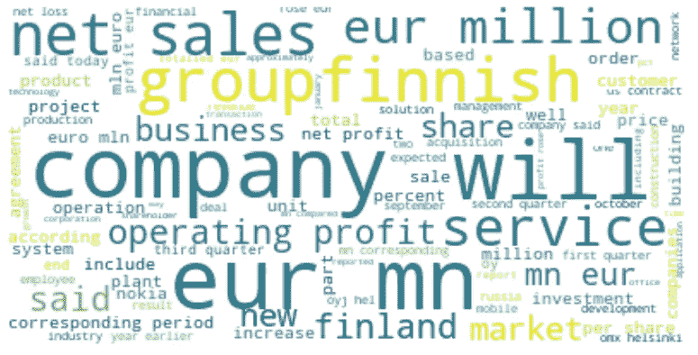

词云为第一次输入训练文本，图片由作者提供

请注意，所有的数据属于来源，人们必须尊重他们的版权和许可条款。

# 3.模型

下面是我对比的四款机型的性能。

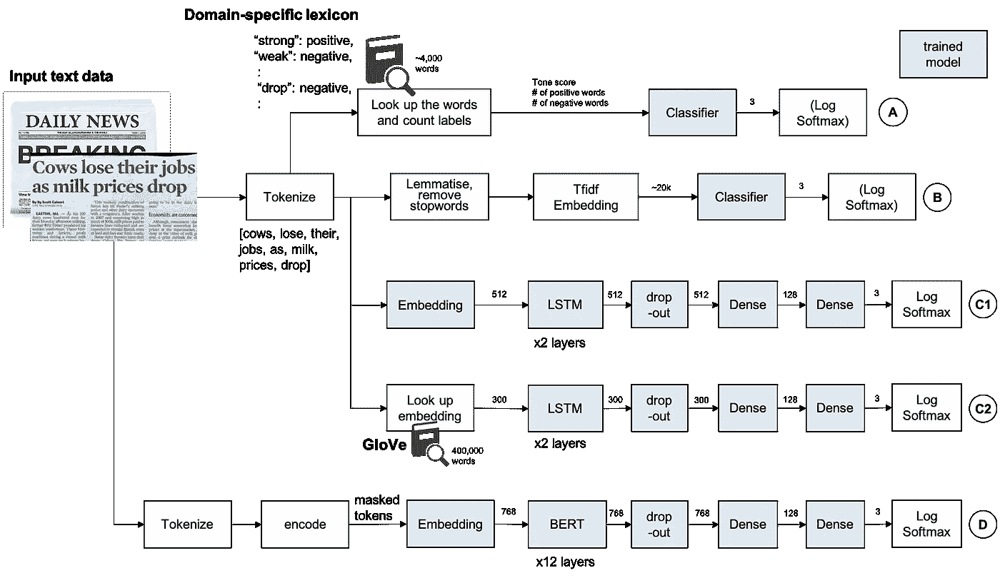

NLP 模型评估，图片由作者提供

## A.基于词典的方法

创建特定领域的词典是一种传统的方法，在某些情况下，当来源来自特定的人或媒体时，这种方法简单而有效。[拉夫兰和麦克唐纳感情词表](https://sraf.nd.edu/textual-analysis/resources/)。这个列表包含超过 4k 个单词，出现在带有情绪标签的财务报表上。注意:这些数据需要许可证才能用于商业应用。请在使用前查看他们的网站。

```
## Samplenegative: ABANDON
negative: ABANDONED
constraining: STRICTLY
```

我用了负 2355 字，正 354 字。它包括单词形式，所以不要对输入进行词干分析和词条解释。对于这种方法，考虑否定是很重要的。不，不，不要等词语。把否定词的意思改成肯定词，如果否定词之一出现在肯定词之前的三个词里，我就简单地颠倒一下情绪。

然后，音调分数定义如下，并沿正/负计数送入分类器。

```
tone_score = 100 * (pos_count — neg_count) / word_count
```

使用默认参数训练 14 个不同的分类器，然后使用网格搜索交叉验证进行随机森林的超参数调整。

## B.基于 Tfidf 向量的传统机器学习

输入由 NLTK word_tokenize()进行标记化，然后移除词条和停用词。然后输入到 tfidf 矢量器，通过逻辑回归和随机森林分类器进行分类。

## C.LSTM——一种递归神经网络

由于 LSTM 被设计为记住表达上下文的长期记忆，所以使用定制的标记器来提取字母，因为它们没有词条满足或停用词移除。然后输入被送入一个嵌入层，然后是两个 lstm 层。为了避免过度拟合，通常情况下应用 dropout，然后是完全连接的层，最后是 log softmax。

作为替代，也尝试了斯坦福的 [GloVe word embedding，这是一种无监督学习算法，用于获取单词的矢量表示。在这里，采取了预先训练的维基百科和千兆字 6B 令牌，40 万词汇大小和 300 维向量。我们的词汇库中大约 90%的单词是在这个手套词汇库中找到的，其余的是随机初始化的。](https://nlp.stanford.edu/projects/glove/)

## D.伯特(还有阿尔伯特作为伯特模型的替代)

我用 pytorch 实现了来自 Huggingface 的[变形金刚的 BERT 模型。现在(v3)他们提供了标记器和编码器，可以生成文本 id、填充掩码和段 id，可以直接在他们 BertModel 中使用，标准训练过程不需要定制实现。](https://huggingface.co/transformers/index.html)

类似于 LSTM 模型，来自 BERT 的输出然后被传递到退出的、完全连接的 layters，然后应用 log softmax。如果没有足够的计算资源预算，也没有足够的数据，从头开始训练模型不是一个选项，所以我使用预训练的模型并进行微调。预训练模型使用如下:

*   伯特:伯特-基地-无壳
*   艾伯特:艾伯特-基地-v2

预训练的 bert 的训练过程如下所示。

# 4.估价

首先，输入数据以 8:2 的比例分成训练集和测试集。测试集保持不变，直到所有参数都固定下来，并且每个模型只使用一次。由于数据集不大，交叉验证用于评估参数集。此外，为了克服不平衡和较小数据集的问题，分层 K-Fold 交叉验证被用于超参数调整。

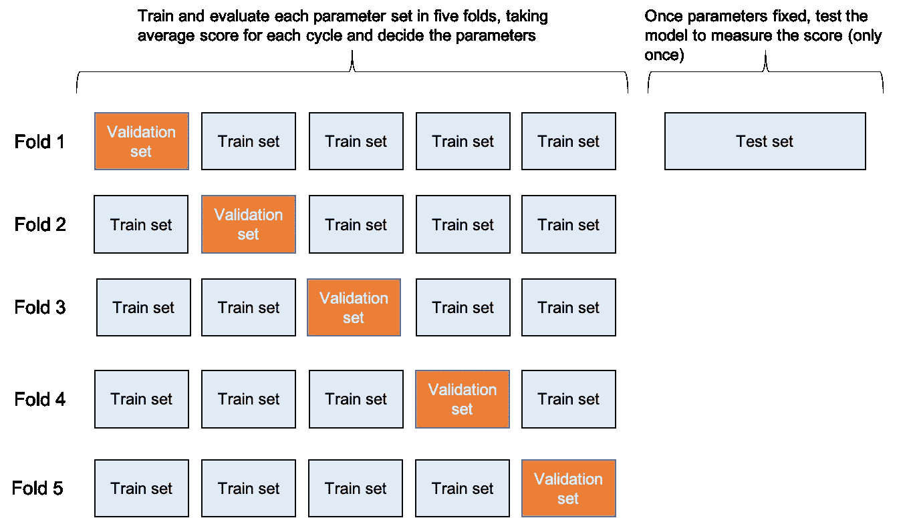

交叉验证和测试集分割，按作者分类的图像

由于输入数据不平衡，评估基于 F1 分数，同时也参考了准确性。

网格搜索交叉验证用于模型 A 和 B，而定制交叉验证用于深度神经网络模型 C 和 d

# 5.结果

在花费或多或少相似的时间进行超参数调优后，基于微调的 BERT 模型明显优于其他模型。

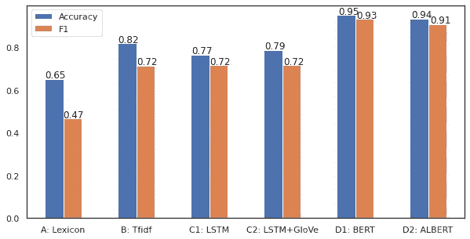

每个模型的评估分数，按作者排序的图像

**模型 A** 表现不佳，因为输入过于简化为音调得分，这是判断情绪的单个值，随机森林模型最终对大多数数据标注了中性的多数类别。简单线性模型仅通过将阈值应用于音调得分而表现得更好，但是在准确性和 f1 得分方面仍然相当低。

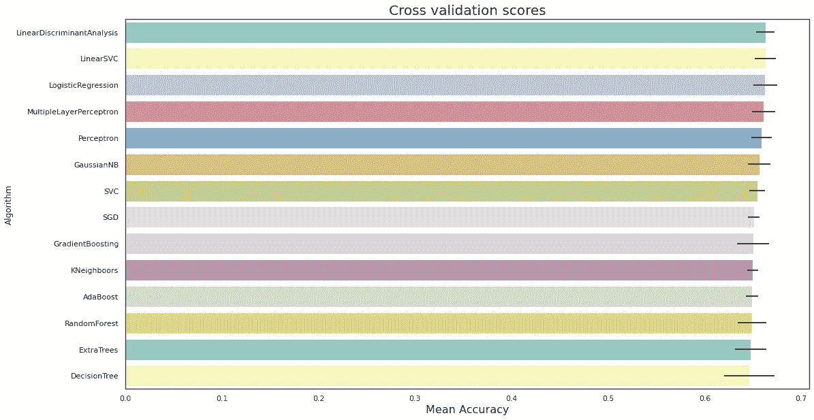

每个分类器的准确性，按作者分类的图像

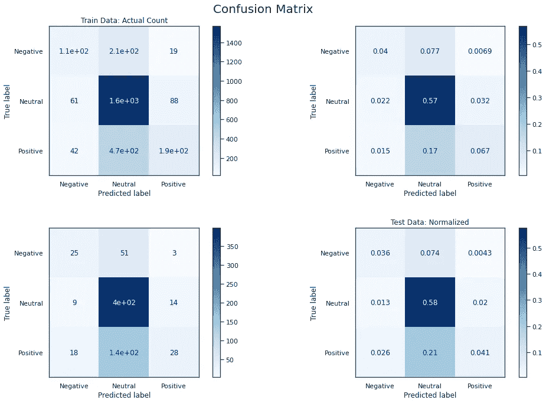

混淆矩阵，作者图片

我们没有使用欠采样/过采样或 SMOTE 等方法来平衡输入数据，因为它可以纠正这个问题，但会偏离不平衡存在的实际情况。对该模型的潜在改进是，如果为要解决的每个问题建立词典的成本是合理的，则建立定制词典来代替 L-M 词典。更复杂的否定也可以提高预测的准确性。

**模型 B** 比前一个模型好得多，但是它以几乎 100%的准确度和 f1 分数过度适合训练集，并且未能被通用化。我试图降低模型的复杂性，以避免过度拟合，但它最终在验证集中得分较低。平衡数据可以帮助解决这个问题或收集更多的数据。

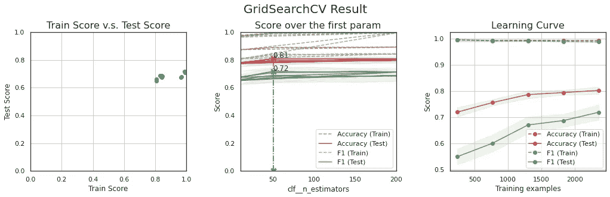

网格搜索交叉验证结果，按作者排序的图像

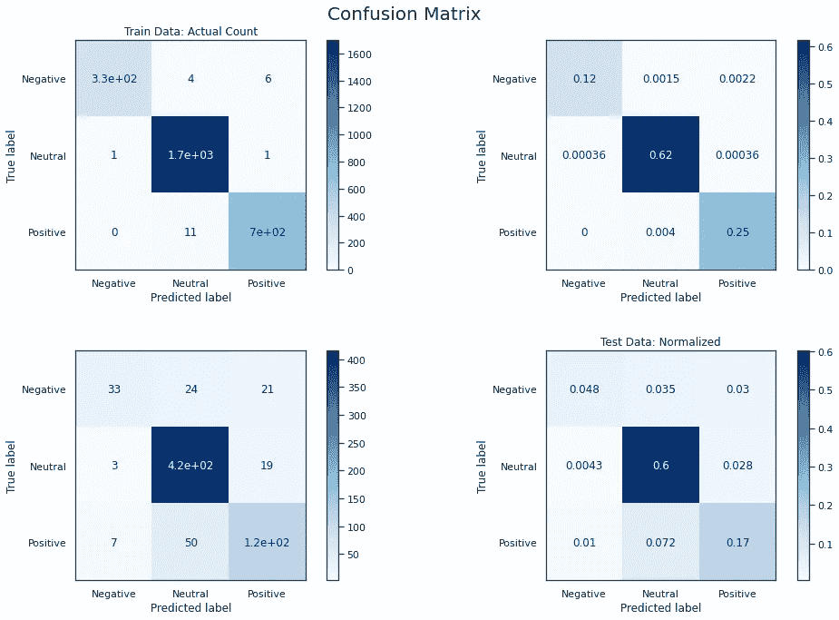

混淆矩阵，作者图片

**模型 C** 产生了与先前模型相似的结果，但改进不大。事实上，训练数据的数量不足以从零开始训练神经网络，并且需要多个时期，这往往会过度拟合。预训练的手套嵌入不会改善结果。对后一种模型的一个可能的改进是使用来自类似领域(如 10K、10Q 财务报表)的一串文本来训练手套，而不是使用来自维基百科的预训练模型。

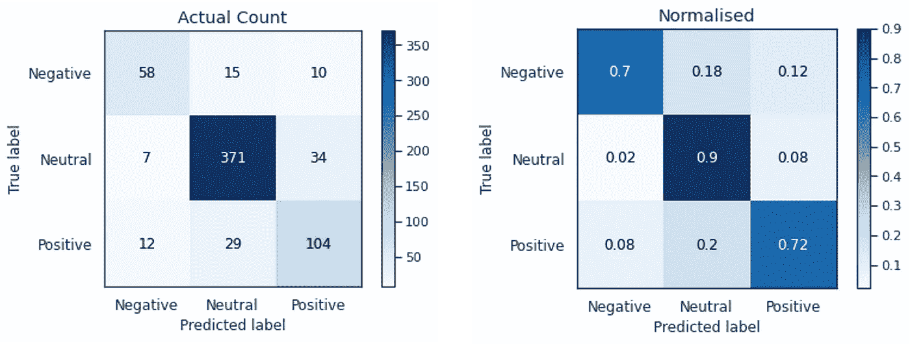

混淆矩阵，作者图片

**D 型**表现相当不错，在交叉验证和最终测试中，准确率和 f1 分均超过 90%。它对负面文本的正确分类率为 84%，而对正面文本的正确分类率为 94%，这可能是由于输入的数量，但最好仔细观察以进一步提高性能。这表明，由于迁移学习和语言模型，预训练模型的微调在这个小数据集上表现良好。

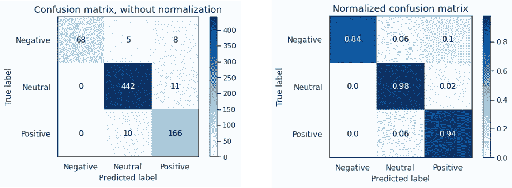

最终测试集上的混淆矩阵显示了良好的性能，图片由作者提供

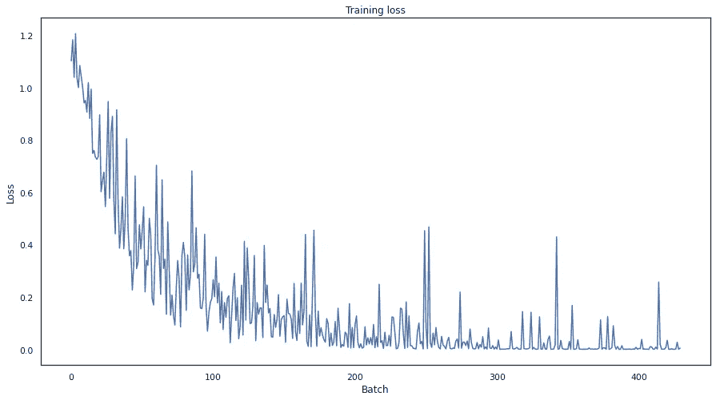

训练数据的丢失随着训练的进行而减少，图片由作者提供


验证数据的损失并没有像训练数据那样下降

# 5.结论

这个实验显示了基于 BERT 的模型在我的领域中的应用潜力，在这个领域中，以前的模型未能产生足够的性能。然而，结果是不确定的，并且基于在自由层 GPU 上的相当简单的手动超参数调整，并且它可能根据输入数据和调整方法而不同。

同样值得注意的是，在实际应用中，获得适当的输入数据也是相当重要的。如果没有高质量的数据，就不能很好地训练模型，这通常被称为“垃圾输入，垃圾输出”。

我将在下次讨论这些问题。这里使用的所有代码都可以在 git [repo](https://github.com/yuki678/financial-phrase-bert) 中获得。