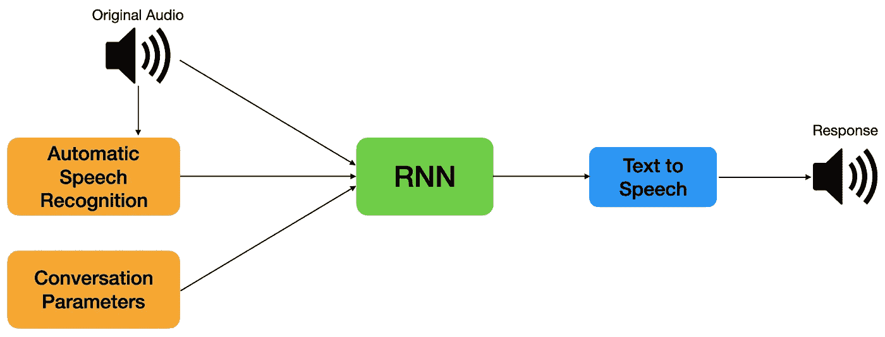

# 现实世界中的 NLP:Google Duplex

> 原文：<https://towardsdatascience.com/nlp-in-the-real-world-google-duplex-d96160d3770b?source=collection_archive---------36----------------------->

## 随着 NLP 的所有最新进展，看到该领域的实际应用中的新发展令人耳目一新。

几年前，我看到谷歌展示了他们新的谷歌双工系统。如果你不熟悉 Duplex，它本质上是一个人工智能，可以帮助通过电话完成任务(例如，安排约会，预订预订等。).

照片由[米切尔罗](https://unsplash.com/@mitchel3uo?utm_source=medium&utm_medium=referral)在 [Unsplash](https://unsplash.com?utm_source=medium&utm_medium=referral)

**问题。也许这只是我这一代人，但我宁愿发短信也不愿打电话，因为发短信意味着我可以发短信，然后很快忘掉它。然而，这并不总是可能的，因为许多任务都需要给企业打电话。这就是 Duplex 的用武之地。**

**想法。Duplex 背后的 overaching 思想是，例如，你只需让谷歌助手在某个餐馆预订，然后输入一些参数，如人数、日期和时间，以及预订名称。一旦你这样做了，Google Assistant 将自动使用 Duplex 给那家餐馆打电话并为你预订，一旦完成就发送一个确认。双工将在模仿人类的同时尝试这样做，以便电话对话是自然的(并且不会惊动另一端的人)。**

> [这里有一个系统打电话安排发廊预约](http://www.gstatic.com/b-g/DMS03IIQXU3TY2FD6DLPLOMBBBJ2CH188143148.mp3)的例子。
> 
> [这是另一个 Duplex 呼叫餐馆的例子。](http://www.gstatic.com/b-g/KOK4HAMTAPH5Z96154F6GKUM74A3Z1576269077.mp3)

Duplex 的成功。在这些例子中，我对 Duplex 模仿人类的能力印象深刻。这些声音听起来像真人，Duplex 甚至添加了像“嗯”这样的感叹词，让它听起来更像人(确实没有比说“嗯”更像人的方法了)。双工还可以控制其响应的延迟。例如，如果这个人说“你好？”然后你必须迅速做出反应，但如果他们说了一个很长的句子，你必须花一些时间在模仿思维时间之前做出反应。尽管它很强大，但 Duplex 在这些示例呼叫中仍然会犯一些小错误(例如，当 Duplex 在第一次呼叫中说“上午 10 点至下午 12 点之间的任何时间”时，“下午 12 点”会有不自然和机械的音调变化)，但这些甚至不是真正的问题，因为它们足够小，电话另一端的人不会太在意，如果他们甚至注意到它的话。

**需要改进的地方。**尽管 Duplex 可以很好地处理基本任务，但总有一些边缘情况需要进一步调查。双工可能无法轻松处理复杂的语句[ [示例](http://www.gstatic.com/b-g/BT5EH08P73O41Q94PTWNMV42DAWU8Z192313240.mp3) ]或背景噪音或音质问题。这些案例需要进一步改进。目前，在 Duplex 无法完成其任务的情况下，内置了一个故障保险来移交给人类操作员来完成任务。

双工系统的简单示意图。RNN 使用来自电话呼叫的音频、自动语音识别(ASR)软件和对话参数来获得文本响应。该响应通过文本到语音转换程序运行，以获得口头响应。

**Duplex 与 NLP 的关系。当然，能够在打电话时模仿人类需要一些疯狂的自然语言处理。首先，需要有一个准确的语音到文本的翻译器，甚至能够理解打电话的人在说什么。接下来，另一个模型必须在电话呼叫目标的上下文中解释这一点。然后必须做出适当的反应。最后，文本到语音转换模型需要将这种响应翻译成类似人类的声音在电话中说出来。这些步骤需要在整个通话过程中实时地不断重复，因此模型需要既准确又快速。**

**必要的 NLP 模型。**为了做到这一点，Duplex 使用递归神经网络(RNN)结合谷歌的自动语音识别(ASR)技术、对话参数(例如，所需时间、姓名)和文本到语音(TTS)系统。值得注意的是，这些模型必须在狭窄的领域进行训练。例如，预约和预订需要单独的培训——Duplex 不是作为一般的聊天机器人进行培训的，谷歌希望使用 Duplex 的任何新领域都需要新的培训。

**结论。**该系统已经推出，并将逐步完善。尽管还有待改进，但我仍然对 Google 如何能够结合多种 NLP 模型并创建一个像 Duplex 一样工作的可用应用程序印象深刻。我相信，如果我们能够以这种方式不断进行新的创新，NLP 将有一个光明的未来，因为单个模型很棒，但将多个模型组合起来形成一个发电站系统可能是在现实世界中应用 NLP 的未来所在。

延伸阅读:

*   [Google AI 关于 Duplex 的博文](https://ai.googleblog.com/2018/05/duplex-ai-system-for-natural-conversation.html)
*   [谷歌 2018 年 Duplex 揭秘](https://www.youtube.com/watch?v=D5VN56jQMWM)
*   《纽约时报》关于谷歌 Duplex 的一篇报道