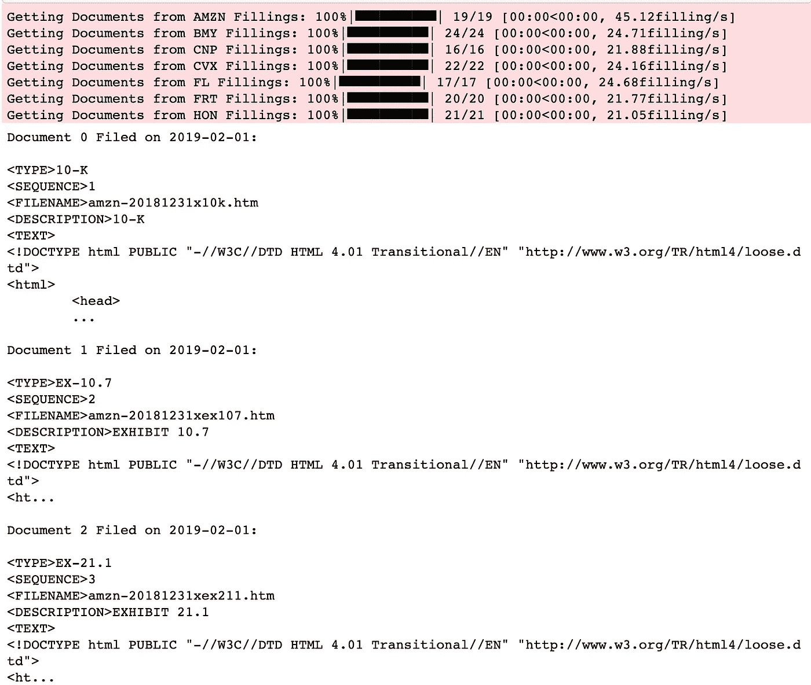
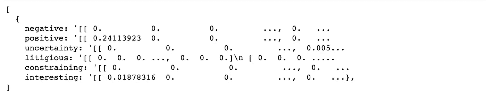

# 股票市场中的自然语言处理

> 原文：<https://towardsdatascience.com/nlp-in-the-stock-market-8760d062eb92?source=collection_archive---------4----------------------->

## 金融中的人工智能

## 利用对 10k 填充物的情感分析作为优势


图片来源:纽约时报

在交易中实现的机器学习模型通常根据历史股价和其他定量数据进行训练，以预测未来的股价。然而，自然语言处理(NLP)使我们能够分析财务文档，如 10-k 表单，以预测股票走势。10-k 表是由公司提交的年度报告，用于提供其财务业绩的综合摘要(这些报告是由证券交易委员会强制要求的)。对投资者来说，梳理这些报告通常很乏味。通过自然语言处理的一个分支——情感分析，投资者可以快速了解报告的语气是积极的、消极的还是诉讼的等等。以 10-k 形式表达的总体情绪可以用来帮助投资者决定他们是否应该投资该公司。

# NLP 解释道


图片来源:[亚当·盖特基](https://medium.com/@ageitgey?source=post_page-----9a0bff37854e----------------------)

自然语言处理是人工智能的一个分支，涉及教计算机阅读并从语言中获取意义。由于语言如此复杂，计算机在理解文本之前必须经过一系列的步骤。以下是对典型 NLP 管道中出现的步骤的快速解释。

1.  句子分割
    文本文档被分割成单独的句子。
2.  一旦文档被分解成句子，我们进一步将句子分解成单个单词。每个单词称为一个标记，因此得名标记化。
3.  词性标注
    我们将每个单词及其周围的一些单词输入到预先训练的词性分类模型中，以接收该单词的词性作为输出。
4.  词汇化
    词语在指代同一个物体/动作时，往往以不同的形式出现。为了防止计算机将一个单词的不同形式视为不同的单词，我们执行了词条化，即将一个单词的各种词形变化组合在一起，作为一个单一项目进行分析的过程，通过该单词的词条(该单词在字典中的出现方式)进行识别。
5.  停用词
    非常常见的词，如“and”、“the”和“a”不提供任何值，因此我们将它们标识为停用词，以将其排除在对文本执行的任何分析之外。
6.  依存解析
    给句子分配一个句法结构，并通过将单词输入依存解析器来理解句子中的单词是如何相互关联的。
7.  名词短语
    把一个句子中的名词短语组合在一起，有助于在我们不关心形容词的情况下简化句子。
8.  命名实体识别
    命名实体识别模型可以标记对象，例如人名、
    公司名称和地理位置。
9.  共指消解
    由于 NLP 模型分析单个句子，它们会被其他句子中指代名词的代词所混淆。为了解决这个问题，我们使用了共指消解来跟踪句子中的代词以避免混淆。

*关于 NLP 更深入的描述:阅读* [*这个*](https://medium.com/@ageitgey/natural-language-processing-is-fun-9a0bff37854e)

完成这些步骤后，我们的文本就可以进行分析了。现在我们更好地理解了 NLP，让我们来看看我的项目代码(来自 Udacity 的 [AI for Trading](https://www.udacity.com/course/ai-for-trading--nd880) 课程的项目 5)。点击[这里](https://github.com/roshan-adusumilli/nlp_10-ks/blob/master/NLP_on_Financial_Statements.ipynb)查看完整的 Github 库

# 导入/下载

首先，我们进行必要的进口； [project_helper](https://github.com/roshan-adusumilli/nlp_10-ks/blob/master/project_helper.py) 包含各种实用程序和图形函数。

```
import nltk
import numpy as np
import pandas as pd
import pickle
import pprint
import project_helper

from tqdm import tqdm
```

然后，我们下载停用词语料库来移除停用词，并下载 wordnet 语料库来进行词汇化。

```
nltk.download('stopwords')
nltk.download('wordnet')
```

# 获得 10 公里

10-k 文档包括公司历史、组织结构、高管薪酬、股权、子公司和经审计的财务报表等信息。为了查找 10-k 文档，我们使用每个公司的唯一 CIK(中央索引键)。

```
cik_lookup = {
    'AMZN': '0001018724',
    'BMY': '0000014272',   
    'CNP': '0001130310',
    'CVX': '0000093410',
    'FL': '0000850209',
    'FRT': '0000034903',
    'HON': '0000773840'}
```

现在，我们从 SEC 提取一个已备案的 10-k 列表，并显示 Amazon 数据作为示例。

```
sec_api = project_helper.SecAPI()from bs4 import BeautifulSoupdef get_sec_data(cik, doc_type, start=0, count=60):
    rss_url = '[https://www.sec.gov/cgi-bin/browse-edgar?action=getcompany'](https://www.sec.gov/cgi-bin/browse-edgar?action=getcompany') \
        '&CIK={}&type={}&start={}&count={}&owner=exclude&output=atom' \
        .format(cik, doc_type, start, count)
    sec_data = sec_api.get(rss_url)
    feed = BeautifulSoup(sec_data.encode('ascii'), 'xml').feed
    entries = [
        (
            entry.content.find('filing-href').getText(),
            entry.content.find('filing-type').getText(),
            entry.content.find('filing-date').getText())
        for entry in feed.find_all('entry', recursive=False)]return entriesexample_ticker = 'AMZN'
sec_data = {}for ticker, cik in cik_lookup.items():
    sec_data[ticker] = get_sec_data(cik, '10-K')pprint.pprint(sec_data[example_ticker][:5])
```


我们收到一个 URL 列表，指向包含与每次填充相关的元数据的文件。元数据与我们无关，所以我们通过用填充 url 替换 url 来提取填充。让我们使用 tqdm 查看下载进度，并看一个示例文档。

```
raw_fillings_by_ticker = {}for ticker, data in sec_data.items():
    raw_fillings_by_ticker[ticker] = {}
    for index_url, file_type, file_date in tqdm(data, desc='Downloading {} Fillings'.format(ticker), unit='filling'):
        if (file_type == '10-K'):
            file_url = index_url.replace('-index.htm', '.txt').replace('.txtl', '.txt')            

            raw_fillings_by_ticker[ticker][file_date] = sec_api.get(file_url)print('Example Document:\n\n{}...'.format(next(iter(raw_fillings_by_ticker[example_ticker].values()))[:1000]))
```


将下载的文件分解成相关的文件，这些文件被分割成多个部分，每个文件的开头用标签<document>表示，每个文件的结尾用标签</document>表示。

```
import redef get_documents(text): extracted_docs = []

    doc_start_pattern = re.compile(r'<DOCUMENT>')
    doc_end_pattern = re.compile(r'</DOCUMENT>')   

    doc_start_is = [x.end() for x in      doc_start_pattern.finditer(text)]
    doc_end_is = [x.start() for x in doc_end_pattern.finditer(text)]

    for doc_start_i, doc_end_i in zip(doc_start_is, doc_end_is):
            extracted_docs.append(text[doc_start_i:doc_end_i])

    return extracted_docsfilling_documents_by_ticker = {}for ticker, raw_fillings in raw_fillings_by_ticker.items():
    filling_documents_by_ticker[ticker] = {}
    for file_date, filling in tqdm(raw_fillings.items(), desc='Getting Documents from {} Fillings'.format(ticker), unit='filling'):
        filling_documents_by_ticker[ticker][file_date] = get_documents(filling)print('\n\n'.join([
    'Document {} Filed on {}:\n{}...'.format(doc_i, file_date, doc[:200])
    for file_date, docs in filling_documents_by_ticker[example_ticker].items()
    for doc_i, doc in enumerate(docs)][:3]))
```



定义 get_document_type 函数以返回给定的文档类型。

```
def get_document_type(doc):

    type_pattern = re.compile(r'<TYPE>[^\n]+')

    doc_type = type_pattern.findall(doc)[0][len('<TYPE>'):] 

    return doc_type.lower()
```

使用 get_document_type 函数从填充物中过滤出非 10k 文档。

```
ten_ks_by_ticker = {}for ticker, filling_documents in filling_documents_by_ticker.items():
    ten_ks_by_ticker[ticker] = []
    for file_date, documents in filling_documents.items():
        for document in documents:
            if get_document_type(document) == '10-k':
                ten_ks_by_ticker[ticker].append({
                    'cik': cik_lookup[ticker],
                    'file': document,
                    'file_date': file_date})project_helper.print_ten_k_data(ten_ks_by_ticker[example_ticker][:5], ['cik', 'file', 'file_date'])
```


# 预处理数据

删除 html 并使所有文本小写，以清理文档文本。

```
def remove_html_tags(text):
    text = BeautifulSoup(text, 'html.parser').get_text()

    return textdef clean_text(text):
    text = text.lower()
    text = remove_html_tags(text)

    return text
```

使用 clean_text 函数清理文档。

```
for ticker, ten_ks in ten_ks_by_ticker.items():
    for ten_k in tqdm(ten_ks, desc='Cleaning {} 10-Ks'.format(ticker), unit='10-K'):
        ten_k['file_clean'] = clean_text(ten_k['file'])project_helper.print_ten_k_data(ten_ks_by_ticker[example_ticker][:5], ['file_clean'])
```


现在我们对所有数据进行假设。

```
from nltk.stem import WordNetLemmatizer
from nltk.corpus import wordnetdef lemmatize_words(words):

    lemmatized_words = [WordNetLemmatizer().lemmatize(word, 'v') for word in words]

    return lemmatized_wordsword_pattern = re.compile('\w+')for ticker, ten_ks in ten_ks_by_ticker.items():
    for ten_k in tqdm(ten_ks, desc='Lemmatize {} 10-Ks'.format(ticker), unit='10-K'):
        ten_k['file_lemma'] = lemmatize_words(word_pattern.findall(ten_k['file_clean']))project_helper.print_ten_k_data(ten_ks_by_ticker[example_ticker][:5], ['file_lemma'])
```


删除停用词。

```
from nltk.corpus import stopwordslemma_english_stopwords = lemmatize_words(stopwords.words('english'))for ticker, ten_ks in ten_ks_by_ticker.items():
    for ten_k in tqdm(ten_ks, desc='Remove Stop Words for {} 10-Ks'.format(ticker), unit='10-K'):
        ten_k['file_lemma'] = [word for word in ten_k['file_lemma'] if word not in lemma_english_stopwords]print('Stop Words Removed')
```


# 10k 上的情感分析

使用 Loughran-McDonald 情感词表对 10-k 进行情感分析(这是专门为与金融相关的文本分析而构建的)。

```
sentiments = ['negative', 'positive', 'uncertainty', 'litigious', 'constraining', 'interesting']

sentiment_df = pd.read_csv('loughran_mcdonald_master_dic_2018.csv')
sentiment_df.columns = [column.lower() for column in sentiment_df.columns] *# Lowercase the columns for ease of use*

*# Remove unused information*
sentiment_df = sentiment_df[sentiments + ['word']]
sentiment_df[sentiments] = sentiment_df[sentiments].astype(bool)
sentiment_df = sentiment_df[(sentiment_df[sentiments]).any(1)]

*# Apply the same preprocessing to these words as the 10-k words*
sentiment_df['word'] = lemmatize_words(sentiment_df['word'].str.lower())
sentiment_df = sentiment_df.drop_duplicates('word')

sentiment_df.head()
```


使用情感单词列表从 10k 文档生成情感单词包。单词包统计每篇文档中的情感词数量。

```
from collections import defaultdict, Counter
from sklearn.feature_extraction.text import CountVectorizerdef get_bag_of_words(sentiment_words, docs):

    vec = CountVectorizer(vocabulary=sentiment_words)
    vectors = vec.fit_transform(docs)
    words_list = vec.get_feature_names()
    bag_of_words = np.zeros([len(docs), len(words_list)])

    for i in range(len(docs)):
        bag_of_words[i] = vectors[i].toarray()[0]return bag_of_words.astype(int)sentiment_bow_ten_ks = {}for ticker, ten_ks in ten_ks_by_ticker.items():
    lemma_docs = [' '.join(ten_k['file_lemma']) for ten_k in ten_ks]

    sentiment_bow_ten_ks[ticker] = {
        sentiment: get_bag_of_words(sentiment_df[sentiment_df[sentiment]]['word'], lemma_docs)
        for sentiment in sentiments}project_helper.print_ten_k_data([sentiment_bow_ten_ks[example_ticker]], sentiments)
```


# 雅克卡相似性

现在我们有了单词包，我们可以将它转换成一个布尔数组，并计算 jaccard 相似度。jaccard 相似性被定义为交集的大小除以两个集合的并集的大小。例如，两个句子之间的 jaccard 相似度是两个句子之间的常用单词数除以两个句子中唯一单词的总数。jaccard 相似性值越接近 1，集合就越相似。为了更容易理解我们的计算，我们绘制了 jaccard 的相似点。

```
from sklearn.metrics import jaccard_similarity_scoredef get_jaccard_similarity(bag_of_words_matrix):

    jaccard_similarities = []
    bag_of_words_matrix = np.array(bag_of_words_matrix, dtype=bool)

    for i in range(len(bag_of_words_matrix)-1):
            u = bag_of_words_matrix[i]
            v = bag_of_words_matrix[i+1]

    jaccard_similarities.append(jaccard_similarity_score(u,v))    

    return jaccard_similarities# Get dates for the universe
file_dates = {
    ticker: [ten_k['file_date'] for ten_k in ten_ks]
    for ticker, ten_ks in ten_ks_by_ticker.items()}jaccard_similarities = {
    ticker: {
        sentiment_name: get_jaccard_similarity(sentiment_values)
        for sentiment_name, sentiment_values in ten_k_sentiments.items()}
    for ticker, ten_k_sentiments in sentiment_bow_ten_ks.items()}project_helper.plot_similarities(
    [jaccard_similarities[example_ticker][sentiment] for sentiment in sentiments],
    file_dates[example_ticker][1:],
    'Jaccard Similarities for {} Sentiment'.format(example_ticker),
    sentiments)
```


# TFIDF

从情感词表中，让我们从 10k 文档中生成情感词频-逆文档频率(TFIDF)。TFIDF 是一种信息检索技术，用于揭示一个单词/术语在所选文本集合中出现的频率。每个术语被分配一个术语频率(TF)和逆文档频率(IDF)分数。这些分数的乘积被称为该项的 TFIDF 权重。较高的 TFIDF 权重表示较罕见的术语，较低的 TFIDF 分数表示较常见的术语。

```
from sklearn.feature_extraction.text import TfidfVectorizerdef get_tfidf(sentiment_words, docs):

    vec = TfidfVectorizer(vocabulary=sentiment_words)
    tfidf = vec.fit_transform(docs)

    return tfidf.toarray()sentiment_tfidf_ten_ks = {}for ticker, ten_ks in ten_ks_by_ticker.items():
    lemma_docs = [' '.join(ten_k['file_lemma']) for ten_k in ten_ks]

    sentiment_tfidf_ten_ks[ticker] = {
        sentiment: get_tfidf(sentiment_df[sentiment_df[sentiment]]['word'], lemma_docs)
        for sentiment in sentiments}project_helper.print_ten_k_data([sentiment_tfidf_ten_ks[example_ticker]], sentiments)
```



# 余弦相似性

根据我们的 TFIDF 值，我们可以计算余弦相似度，并绘制出随时间变化的曲线。与 jaccard 相似性类似，余弦相似性是一种用于确定文档相似程度的度量。余弦相似性通过测量在多维空间中投影的两个向量之间的角度余弦来计算相似性，而不考虑大小。对于文本分析，使用的两个向量通常是包含两个文档字数的数组。

```
from sklearn.metrics.pairwise import cosine_similaritydef get_cosine_similarity(tfidf_matrix):

    cosine_similarities = []    

    for i in range(len(tfidf_matrix)-1):

cosine_similarities.append(cosine_similarity(tfidf_matrix[i].reshape(1, -1),tfidf_matrix[i+1].reshape(1, -1))[0,0])

    return cosine_similaritiescosine_similarities = {
    ticker: {
        sentiment_name: get_cosine_similarity(sentiment_values)
        for sentiment_name, sentiment_values in ten_k_sentiments.items()}
    for ticker, ten_k_sentiments in sentiment_tfidf_ten_ks.items()}project_helper.plot_similarities(
    [cosine_similarities[example_ticker][sentiment] for sentiment in sentiments],
    file_dates[example_ticker][1:],
    'Cosine Similarities for {} Sentiment'.format(example_ticker),
    sentiments)
```


# 价格数据

现在我们将通过与股票的年度定价进行比较来评估阿尔法因子。我们可以从 QuoteMedia 下载价格数据。

```
pricing = pd.read_csv('yr-quotemedia.csv', parse_dates=['date'])
pricing = pricing.pivot(index='date', columns='ticker', values='adj_close')

pricing
```

# 转换为数据帧

Alphalens 是一个用于 alpha 因子性能分析的 python 库，它使用数据帧，所以我们必须将字典转换成数据帧。

```
cosine_similarities_df_dict = {'date': [], 'ticker': [], 'sentiment': [], 'value': []}for ticker, ten_k_sentiments in cosine_similarities.items():
    for sentiment_name, sentiment_values in ten_k_sentiments.items():
        for sentiment_values, sentiment_value in enumerate(sentiment_values):
            cosine_similarities_df_dict['ticker'].append(ticker)
            cosine_similarities_df_dict['sentiment'].append(sentiment_name)
            cosine_similarities_df_dict['value'].append(sentiment_value)
            cosine_similarities_df_dict['date'].append(file_dates[ticker][1:][sentiment_values])cosine_similarities_df = pd.DataFrame(cosine_similarities_df_dict)
cosine_similarities_df['date'] = pd.DatetimeIndex(cosine_similarities_df['date']).year
cosine_similarities_df['date'] = pd.to_datetime(cosine_similarities_df['date'], format='%Y')cosine_similarities_df.head()
```


在我们可以使用许多 alphalens 函数之前，我们需要对齐索引并将时间转换为 unix 时间戳。

```
import alphalens as alfactor_data = {}
skipped_sentiments = []for sentiment in sentiments:
    cs_df = cosine_similarities_df[(cosine_similarities_df['sentiment'] == sentiment)]
    cs_df = cs_df.pivot(index='date', columns='ticker', values='value')

    try:
        data = al.utils.get_clean_factor_and_forward_returns(cs_df.stack(), pricing.loc[cs_df.index], quantiles=5, bins=None, periods=[1])
        factor_data[sentiment] = data
    except:
        skipped_sentiments.append(sentiment)if skipped_sentiments:
    print('\nSkipped the following sentiments:\n{}'.format('\n'.join(skipped_sentiments)))
factor_data[sentiments[0]].head()
```


为了与 alphalen 的 factor _ rank _ 自相关和 mean_return_by_quantile 函数兼容，我们还必须使用 unix time 创建因子数据帧。

```
unixt_factor_data = {
    factor: data.set_index(pd.MultiIndex.from_tuples(
        [(x.timestamp(), y) for x, y in data.index.values],
        names=['date', 'asset']))
    for factor, data in factor_data.items()}
```

# 因子回报

让我们来看看一段时间内的因子回报

```
ls_factor_returns = pd.DataFrame()for factor_name, data in factor_data.items():
    ls_factor_returns[factor_name] = al.performance.factor_returns(data).iloc[:, 0](1 + ls_factor_returns).cumprod().plot()
```


正如预期的那样，表达积极情绪的 10-k 报告产生了最多的收益，而包含消极情绪的 10-k 报告导致了最多的损失。

# 营业额分析

使用因子等级自相关，我们可以分析阿尔法随着时间的推移有多稳定。我们希望阿尔法等级在不同时期保持相对一致。

```
ls_FRA = pd.DataFrame()for factor, data in unixt_factor_data.items():
    ls_FRA[factor] = al.performance.factor_rank_autocorrelation(data)ls_FRA.plot(title="Factor Rank Autocorrelation")
```


# 夏普比率

最后，让我们来计算夏普比率，即平均回报减去无风险回报除以投资回报的标准差。

```
daily_annualization_factor = np.sqrt(252) (daily_annualization_factor * ls_factor_returns.mean() / ls_factor_returns.std()).round(2)
```


夏普比率 1 被认为是可接受的，比率 2 是非常好的，比率 3 是极好的。正如所料，我们可以看到积极情绪与高夏普比率相关，而消极情绪与低夏普比率相关。其他情绪也与高夏普比率相关。然而，由于影响股票价格的复杂因素如此之多，要在现实世界中复制这些回报要困难得多。

# 参考

[1] Udacity，[用于交易的人工智能](https://github.com/udacity/artificial-intelligence-for-trading/tree/master/project/project_5)，Github

**先别走**！

我是 Roshan，16 岁，对人工智能和金融的交叉领域充满热情。关于人工智能在金融领域的广泛观点，请查看这篇文章:[https://towards data science . com/artificial-intelligence-and-its-application-in-finance-9f1e 0588 e 777](/artificial-intelligence-and-its-application-in-finance-9f1e0588e777)。

在 Linkedin 上联系我:[https://www.linkedin.com/in/roshan-adusumilli-96b104194/](https://www.linkedin.com/in/roshan-adusumilli-96b104194/)