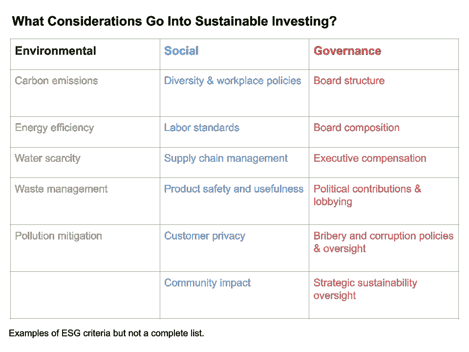
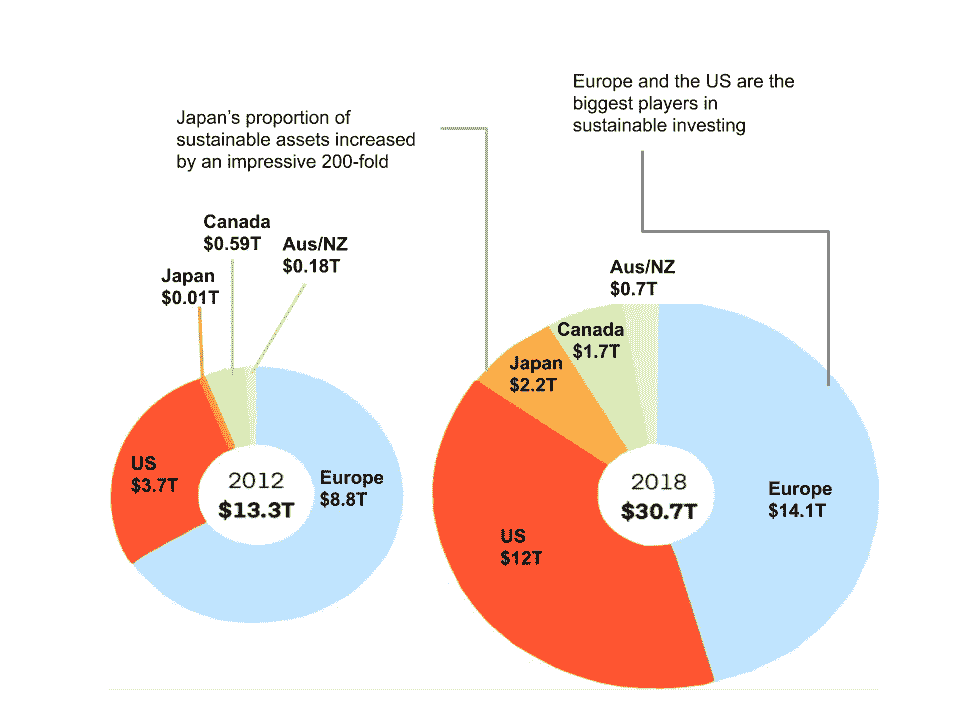
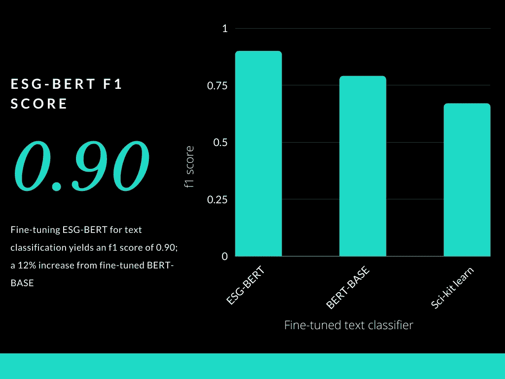

# ESG-BERT: NLP 符合可持续投资

> 原文：<https://towardsdatascience.com/nlp-meets-sustainable-investing-d0542b3c264b?source=collection_archive---------11----------------------->

## 在 [Parabole](http://parabole.ai) ，我在 [Charan Pothireddi 的](https://www.linkedin.com/in/sree-charan-pothireddi-6a0a3587/)指导下工作，探索自然语言处理如何应用于可持续性分析。这篇文章概述了我们的发现。

照片由 [Nathália Rosa](https://unsplash.com/@nathaliarosa?utm_source=medium&utm_medium=referral) 在 [Unsplash](https://unsplash.com?utm_source=medium&utm_medium=referral) 拍摄

*可持续投资是一种不断发展的投资策略，旨在寻求丰厚的财务回报，同时让世界变得更加美好。然而，对于许多投资者来说，这往往是一种具有挑战性的投资策略。幸运的是，自然语言处理可以帮上忙，下面是方法—*

# 什么是可持续投资？

可持续、负责任和有影响力的投资(SRI)是一种投资原则，它考虑了环境、社会和公司治理(ESG)标准，以产生长期有竞争力的财务回报和积极的社会影响。

作者图片

可持续投资有几个动机，包括个人价值观和目标、机构使命以及客户、委托人或计划参与者的需求。

可持续投资者的目标是强劲的财务表现，但也相信这些投资应该用于促进社会、环境和治理实践。[6]

他们可能会积极寻找可能提供重要社会或环境效益的投资，如社区发展贷款基金或清洁技术投资组合。

一些投资者采用可持续投资策略来管理风险和履行受托责任；他们审查环境、社会和公司治理标准，以评估其投资组合公司的管理质量和应对未来挑战的可能弹性。一些人寻求长期的财务优势；越来越多的学术研究表明，ESG 和财务表现之间有着密切的联系。[1]

全球可持续投资的增长(万亿美元)—作者图片

以可持续为卖点的投资——这意味着它们专注于将环境和社会公司治理实践纳入长期公司战略的公司——正在经历爆炸式增长。

尽管可持续投资出现于 20 世纪 70 年代，但这一运动在过去几年获得了令人瞩目的发展。

自 2012 年以来，可持续投资的总资产增加了一倍多。[2]

随着可持续投资成为主流，它不会简单地作为一个更广泛的战略中的利基——相反，它将自然地融入整个投资组合。

> “随着可持续性对投资回报的影响越来越大，我们相信可持续投资是客户投资组合未来最坚实的基础。”

*—贝莱德董事长兼首席执行官拉里·芬克*

可持续发展是一种全球性的力量，将继续成为日常决策的考虑因素。

# 可持续投资——挑战

目前围绕可持续发展的数据过于依赖企业自愿披露，如机构投资者汇总的年度可持续发展报告和公司问卷——其中许多人会提出不同的问题。[3]

> “个人投资者很难以容易获得的方式获得这种类型的信息，并为投资决策提供信息”

*——琼·罗杰斯，首席执行官，非营利组织可持续发展会计标准委员会的创始人*

对于投资者来说，仅仅依靠年度可持续发展报告等做出可持续的投资选择是具有挑战性的。它们通常长达数百页，并占用大量人力资源进行分析。随着时间的推移，随着可持续资产数量的增加，这个问题会变得更加复杂。这些报告也从来不是完全透明的。公司可能会选择在年度报告中略去某些内容。

年度可持续发展报告等也非常静态。它们并不实时反映公司的变化，它们只反映一段时间内变化的累积。这种方法错过了所有实时发生的变化，这些变化可能会反映在新闻报道中。

一种更具活力的可持续投资方法将考虑实时变化，同时降低分析年度可持续性报告的复杂性。这将使可持续投资更具可扩展性，提高效率，同时减少人为失误。

# NLP 如何提供帮助

自然语言处理可用于分析可持续发展报告和新闻文章，从中提取重要的 ESG 中心见解。这降低了手动分析报告的复杂性，同时还通过查看新闻文章中的实时变化使该方法更加动态。

让我们来看一个例子:

> 我们自豪地为苹果设施实现了 100%的可再生电力，并为苹果的企业排放实现了碳中和，包括商务旅行和员工通勤。我们正在着手一个新的目标，即到 2030 年实现我们整个碳足迹的碳中和。

*——摘自 2020 年苹果可持续发展报告[4]*

NLP 模型可以对报告执行下游 NLP 任务，如**文本分类**和**情感分析**，而不是手动读取和分析报告，从而降低分析报告的复杂性，并使整个过程更加节省时间和资源。在这种情况下，NLP 模型会将摘录分类为与“气候变化”相关，情绪值为“积极”。

NLP 使投资者能够对报告和文章进行更好和更有效的分析，从而做出更明智的可持续投资决策。

**在我在**[**parabole . ai**](http://parabole.ai)**的实习中，我能够通过进一步预先训练谷歌的“**[**BERT**](https://github.com/google-research/bert)**”语言模型，在大型非结构化可持续发展文本语料库上开发 ESG-BERT。**

我曾尝试使用' *sci-kit learn* 模型和'*计数矢量器*'来解决这个问题。鉴于这一领域的性质及其独特的词汇，传统的 ML 模型并没有产生令人满意的结果。另一方面，深度学习模型需要大量的**结构化**文本数据，这正是我们在这种情况下所缺乏的。有大量的**非结构化**文本数据，但是**结构化**数据却很少。

在尝试了这些方法之后，我转向了谷歌的 BERT，它是在大型非结构化文本语料库上预先训练的，因此对于下游的 NLP 任务，例如**文本分类**，需要更少的结构化数据。这似乎非常符合我们的情况。[5]

**BERT(来自变形金刚的双向编码器表示)**是 Google 开发的一项技术，用于自然语言处理模型的预训练。官方的 BERT [repo](https://github.com/google-research/bert) 包含不同的预训练模型，可以在下游 NLP 任务上进行训练，增加了一个输出层。然而，这些模型是在通用英语文本语料库上预先训练的，并且它们不能够理解特定领域的词汇。[5]

可持续投资作为一个领域有一个独特的词汇，ESG-BERT 能够理解。 **ESG-BERT** 在非结构化文本数据上进一步训练，准确率为 **100%** 和 **98%** ，用于下一句预测和屏蔽语言建模任务。针对文本分类的微调 **ESG-BERT** 产生了 **0.90** 的 F-1 分数。作为对比，一般的 BERT (BERT-base)模型在微调后得分 **0.79** ，sci-kit learn 方法得分 **0.67** 。

作者图片

ESG-BERT 的应用可以扩展到不仅仅是文本分类。它可以进行微调，以执行可持续投资领域中的各种其他下游 NLP 任务。

# 如何使用 ESG-BERT？

预先训练好的特定领域 **ESG-BERT** 模型可以从 GitHub 资源库[这里](https://github.com/mukut03/ESG-BERT)下载。可以对其进行微调，以执行下游的 NLP 任务，如情感分析等。

ESG-BERT 也进行了微调，以对可持续投资文本数据进行文本分类。如 GitHub repo 的 [readme 部分所述，可以下载并提供微调后的模型。](https://github.com/mukut03/ESG-BERT/blob/master/README.md)

照片由[诺亚·布舍尔](https://unsplash.com/@noahbuscher?utm_source=medium&utm_medium=referral)在 [Unsplash](https://unsplash.com?utm_source=medium&utm_medium=referral) 上拍摄

# 结论

这是可持续投资文本挖掘的重要一步。

ESG-BERT 可用于让投资者更容易获得可持续投资。它通过弥合复杂的可持续性数据和投资者之间的差距，使可持续性作为一个目标更容易实现。然而，它的影响不仅仅局限于文本挖掘。可持续发展报告通常长达数百页，充斥着大多数人无法理解的 ESG 术语。这个工具使这些可持续发展报告更具可读性，每个人都可以访问，因此增加了可持续投资的影响。这让我们离更绿色、更安全、更可持续的未来更近了一步。

在不久的将来，我将发布教程，介绍我如何进一步预训练 BERT 以创建 ESG-BERT，我如何使用 PyTorch 微调 BERT，并讨论其他使用“计数-矢量器”和“单词袋”模型的 NLP 方法。

# 参考

[1] — [可持续投资基础知识](https://www.ussif.org/sribasics)，美国 SIF:可持续和负责任投资论坛

[2] — [I](https://www.visualcapitalist.com/rise-of-sustainable-investing/) 曼·戈什，[可视化可持续投资的全球崛起(2020)](https://www.visualcapitalist.com/rise-of-sustainable-investing/) ，视觉资本家

[3] — Alex Davidson，[《可持续投资指南》(2015)](https://www.wsj.com/articles/a-guide-to-sustainable-investing-1447038115) ，华尔街日报

[4] — [环境进度报告(2020)](https://www.apple.com/environment/pdf/Apple_Environmental_Progress_Report_2020.pdf) ，苹果

[5] —Jacob Devlin 和 Chang Ming-Wei，[开源 BERT:自然语言处理的最先进预培训](http://ai.googleblog.com/2018/11/open-sourcing-bert-state-of-art-pre.html) (2018)，谷歌人工智能博客

[6] —凯伦·华莱士，[对可持续投资感兴趣？以下是你需要了解的关于可持续基金的信息](https://www.morningstar.com/articles/962827/interested-in-sustainable-investing-heres-what-you-need-to-know-about-sustainable-funds)

*随时在 LinkedIn 上联系我，给我发消息* [*这里*](https://www.linkedin.com/in/mukut-mukherjee-5a2049178/) *。*