# Office 系列中的 NLP

> 原文：<https://towardsdatascience.com/nlp-on-the-office-series-cf0ed44430d1?source=collection_archive---------38----------------------->

## 利用文本挖掘技术，如标记化、tf-idf 和情感分析来分析电视连续剧的脚本。

> 负责💬👂:为了让你相信我的分析和发现是有效的，你需要对这个节目“相当”熟悉。否则，您可能无法认识到文本挖掘和 NLP 提供了多么强大的工具来进行具有惊人发现的研究项目。

这篇博客有两个主要目标

1.  介绍文本分析方法，如标记化、n-grams、tf-idf、不同的情感提取和评分工具，并涵盖可用于查找主题/“聚类”文本的 LDA 算法的基础知识。
2.  当粉丝阅读他们最喜欢的节目时，给他们一种怀旧的感觉，看看数据科学如何支持信念和假设，例如安吉拉总体上是一个卑鄙的人，但对德怀特最好，或者如何从文本中轻松提取个人词汇，例如安迪著名的(大)金枪鱼，或瑞安的 WUPHF，并用于识别人。

我将在整个过程中使用 R，并将利用以下库:

*   **tidyverse** 和 **data.table** 进行数据操作
*   用于 NLP 相关工作的 tidytext、stringr、textdata、textstem、stopwords、sentimentr 和 **topicmodels**
*   用于可视化的 **ggplot、igraph** 和 **visnetwork**

*我不会做任何文本分析的深度学习，所以请不要期待任何嵌入层知识或 RNN / LSTM 网络。*

在进行任何分析之前，我需要从互联网上获取所有的脚本(所有季节的所有剧集)，为此我使用了网络抓取。要找到刮刀，请访问以下链接到我的 GitHub。

 [## kristofrabay/web_scraping

### 网页抓取任务。在 GitHub 上创建一个帐户，为 kristofrabay/web_scraping 开发做贡献。

github.com](https://github.com/kristofrabay/web_scraping/blob/master/the_office/office_transcripts_scraper.R) 

我还预先在 GitHub 上粘贴了实际分析代码的链接。分析的原始输出是一个闪亮的仪表板应用程序，所以代码可以在应用程序中找到。r 文件。我会在博客中嵌入 Github Gists，但是如果有人对我的部分分析特别感兴趣，可以在脚本的服务器端找到剧情和网络渲染。(对于不熟悉 Shiny 的，抱歉，有问题联系我，或者拉我回购，运行 app。享受我创建的漂亮的仪表板吧！)

 [## kristofrabay/办公室-NLP

### 对 Office 系列进行 NLP(符号化、tf-idf、情感、主题建模)。在闪亮的应用程序中输出…

github.com](https://github.com/kristofrabay/The-Office-NLP/blob/master/app.R) 

我想提到几个人，他们给了我与世界分享我的分析的想法:(1)爱德华多·阿里诺，他是硅谷的首席数据科学家，并教会了我 NLP([https://www.linkedin.com/in/earino](https://www.linkedin.com/in/earino))和(2)米哈里·奥索斯，他举办了 R 课程并展示了快速有效的网络抓取——这是一项非常非常有用的技能([https://github.com/misrori](https://github.com/misrori))。这两门课程都是匈牙利布达佩斯 CEU 大学商业分析硕士项目的选修课程([https://economics . ceu . edu/program/Master-science-Business-Analytics](https://economics.ceu.edu/program/master-science-business-analytics))。

# 我们开始吧！

资料来源:giphy

我把整篇博文分成 4 块。这是“教学大纲”:

1.  按季节统计字数，选择前 x 名合作者(有限的数据用于更好的可视化，更容易理解的结果)
2.  分析最常用的单词、短语(二元模型)和最个性化的单词(tf-idf)
3.  运行有无季节性的情绪分析，确定“谁对谁好，谁对谁坏，坏到什么程度”
4.  展示 LDA 的能力——注意:在此用例中没有用，使用新闻文章或博客的主题建模(其中可指定的主题数量确实有限)

# #1.熟悉数据，选择要处理的子数据

如上所述，我将和有限的几个人一起工作来降低我的视觉效果的复杂性。我会选出整个系列中台词最多的前 12 个人。他们覆盖了几乎 80%的台词，所以我觉得这是一个很好的比例。此外，当比较 12 个人时，我可以使用 3×4 的 ggplot 网格结构，使我的图形对称。

让我们看看这些人总共有多少条线，按季节划分。

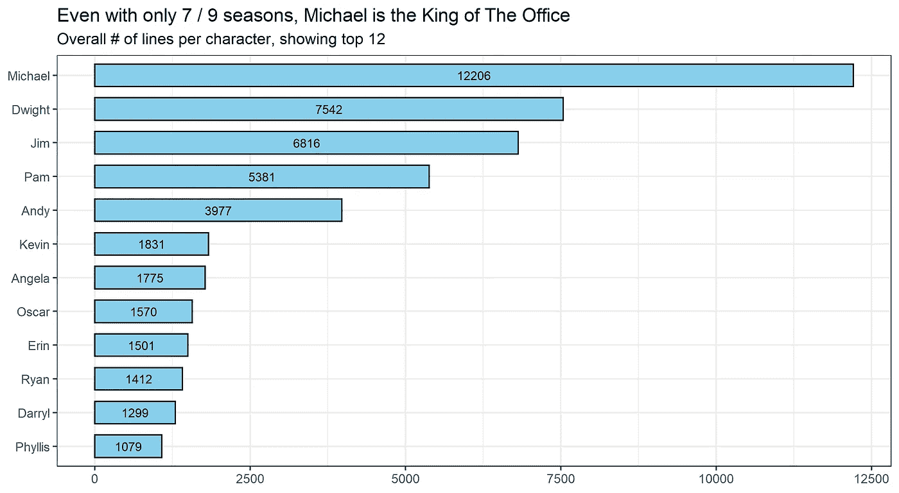

前 12 个字符的总行数

很明显迈克尔有最多的台词，即使没有参加最后两季。如果我们按季节检查线路数，我们就能确切地看到谁在迈克尔离开后得到了大多数线路。

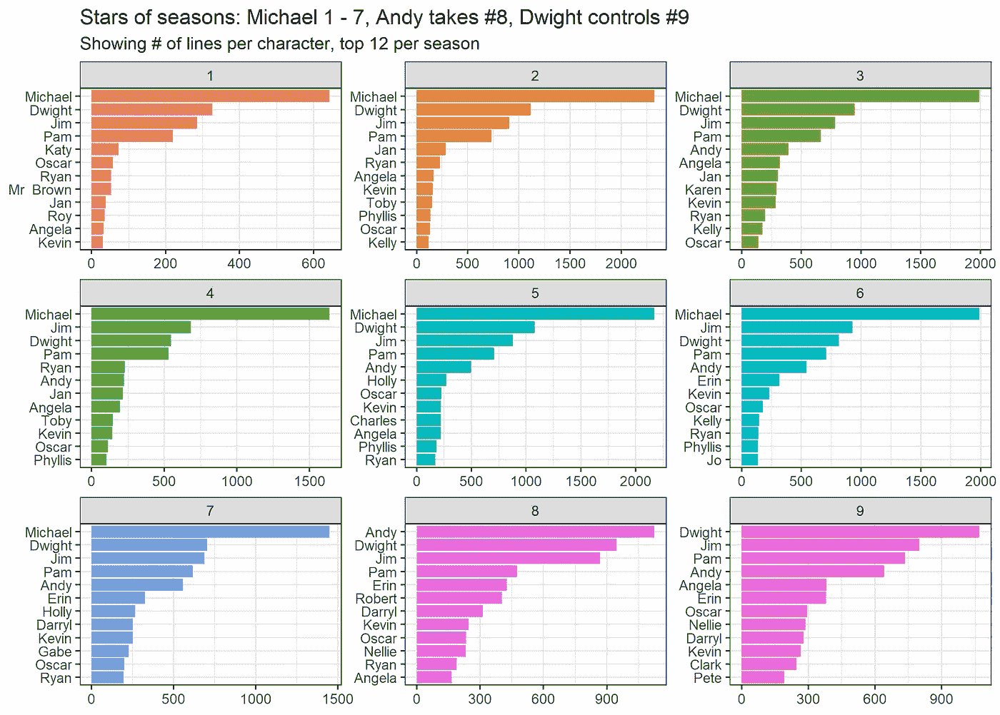

按季节的行数

ggplot 提供了一个很好的方法来自动排序每个类别/方面中的条形/柱形(在本例中是季节)。我提供了一个示例代码供您查看:

数据帧有 3 列使用:(1)姓名，表示谁说的线，(2)实际的线，和(3)给定季节的#号。我们在这里所做的是按季节和名称对数据进行分组，汇总计数，按季节选择前 12 个结果(人),然后在季节内重新排列条形(指示名称)。这个简单的 **reorder_within** 给了我们非常漂亮、平滑的图表。

现在我们知道了我们将和哪些人一起工作，我们可以开始做一些文本分析了。

# #2:文本分析(标记化、二元模型、tf-idf)

## A.标记化—检查最常用的单词

作为第一步，让我们看看人们最常用的词是什么。TidyText 提供了一个非常容易使用的函数，名为 **unnest_tokens** ，可以在任何字符串向量上运行，从其中取出每个字符串(单词)并将其存储在数据帧的“列”中。如果我们的字符串是**‘我的名字是约翰’**，那么它会把这个句子 unnest 成一个 4×1 的字符串向量，元素有**[‘我的’，‘名字’，‘是’，‘约翰’]**。

第二步，让我们意识到，在前面的字符串向量示例中，4 个单词中只有 2 个有意义/兴趣:“name”和“John”。“My”和“is”被视为**停用词**。这些是没有意义的常用词，在没有进一步信息的情况下增强文本。幸运的是，包含任何给定语言的停用词的词典是公开可用的，我们只需要将它们加载到我们的脚本中。英语的例子有‘onix’，‘snowball’，‘SMART’，但是有你想要的任何语言。

为了去掉新创建的字符串列中的停用词，其中每个单元格包含一个单词，我们需要做的是与 join 方法相反的事情。通过一个简单的连接(假设是左连接)，我们可以匹配左侧可以找到的所有内容。然而，在这里，如果一个停用词出现在左列，我们希望删除该观察/行。这就是为什么 **dplyr** 库提供 R 用户 **anti_join** 的原因，这就是为什么。在对先前的字符串向量应用了停用词的 **anti_join** 之后，我们从 **['My '，' name '，' is '，' John']** 到 **['name '，' John']** 。

在结果出来之前，这里是代码，使用 2 个不同的停用词词典和一个手动创建的字符串向量，这些字符串在文本中很常见，但没有“意义”。这里，我们取消了包含人的行的“文本”列，以创建一个名为“单词”的新列。然后我们删除带有停用词的行。

这是实际输出。

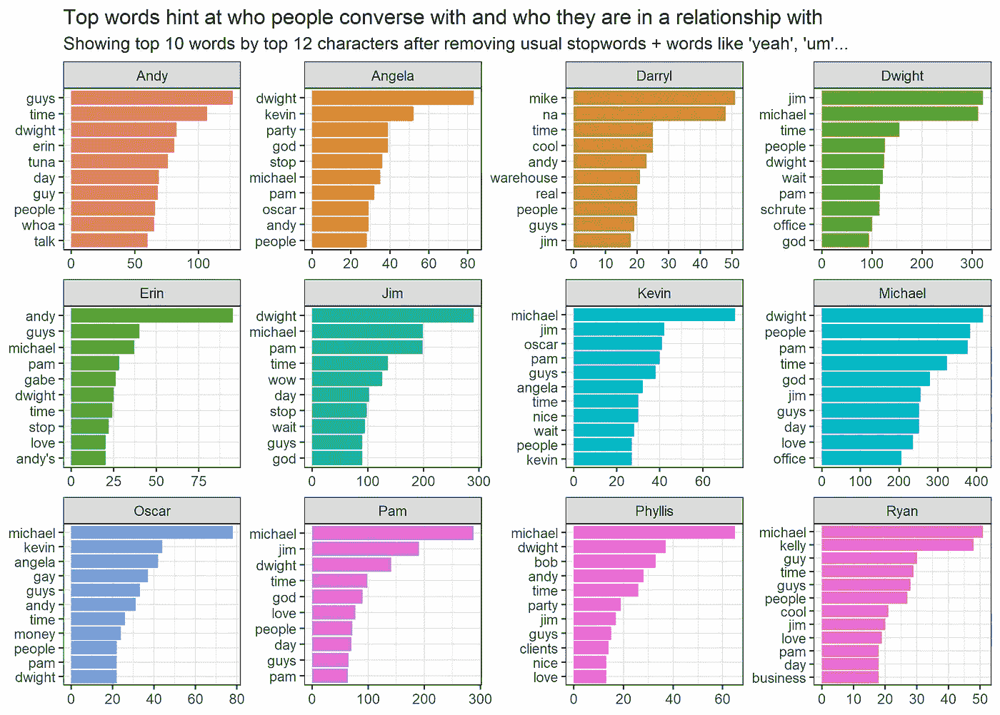

人们最常说的话

这里有些有趣的东西。对于每个人来说，包含他们的热门单词的列表包含其他人的名字。这是合乎逻辑的，因为这是一个基于对话的系列，当不考虑停用词时，最常见的标记是当人们转向他们的同事时，称呼他们的名字。有趣的是，有些人，像德怀特和帕姆，他们的名字在最上面。这是因为他们必须通过电话介绍自己:德怀特是推销员，帕姆是办公室接待员。

这真的给了我一个想法:让我们看看人们通常和谁交谈。为此，我将指示谁说了那句台词的列移动一行，然后我将看到谁说了那句台词以及这句台词是对谁说的，最后我将删除由同一个人说的和对同一个人说的台词(多行，或关闭和打开一个场景)。

不幸的是，我不能在这里粘贴一个交互式的 visNetwork 对象，但这里有一个截图。

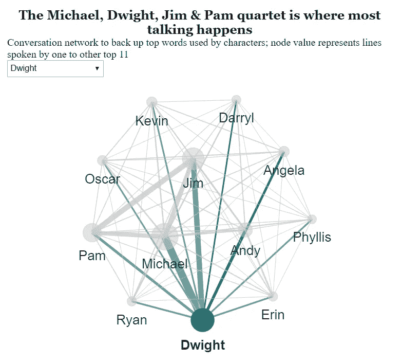

它试图表明大多数谈话发生在 Michael、Dwight、Jim 和 Pam 之间，同时我还选择了 Dwight 来展示如何按人检查结果。我将边缘的宽度设置为与两个字符之间的行数一致，并将节点的大小设置为代表总行数。visNetwork 是一个很棒的工具，非常容易使用！

## B.二元模型(n grams)——频繁短语分析

我们现在知道热门词汇包括其他人的名字，偶尔还有一些暗示一个人身份的符号(例如:达里尔说的“迈克”，安迪说的“金枪鱼”，菲利斯说的“万斯”)。让我们开始寻找人们最常用的短语。

短语是指你有不止一个单词。你可以分析任意数量的互相跟随的单词——这就是为什么这种方法被称为 **ngrams** analytics。如果 n 恰好是 2，那么我们称它们为**二元模型**。这就是我们现在要做的。

下面是如何做到这一点的代码。

我们可以利用相同的 **unnest_tokens** 函数，但是这次我们将调用输出列“bigram”，我们将使用“text”列来创建输出，我们将 token 参数设置为“ngrams”而不是“words”(默认设置)，并将“n”参数设置为 2，表示我们想要创建 bigram。

坚持**'我的名字是约翰'**的例子，而 tokenization (token = 'words ')创建了这个向量: **['我的'，'名字'，'是'，'约翰']** ，现在，bigram 方法产生了下面这个向量: **['我的名字'，'名字是'，'是约翰']** 。然后我们**通过获取二元模型的第一个和第二个令牌，将这个新列分成两部分。下一步，我们只对两个单词都不是停用词的二元模型感兴趣，因此两个单词都包含某种信息，所以我们从第一个和第二个单词向量中过滤出停用词。最后一步，我们用一个空间把两个柱子粘在一起。我们完成了，我们已经“大化”了文本数据。以下是按人分类的结果:**

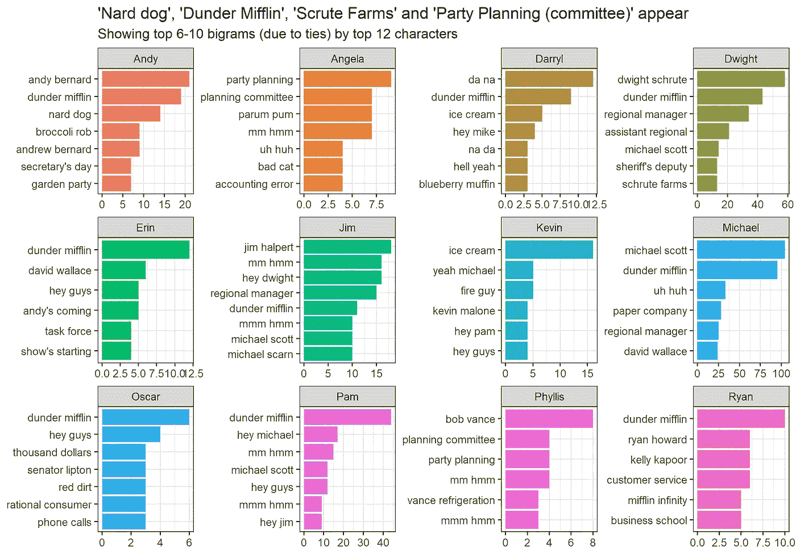

顶级人物使用的顶级二元模型(短语)

这下可好了！如果你熟悉这个节目，你会清楚地看到双面人物非常有能力识别人。除了安迪，还有谁会用‘纳德狗’和‘西兰花劫’呢？除了瑞安，还有谁会谈论“商学院”和“米夫林无限”？德怀特显然喜欢“区域经理”和“区域助理”这两个词。如果我们使用三元组(3 个单词组成一个短语)，我们肯定会在德怀特的列表中看到“助理区域经理”。

二元模型比简单的记号更能识别某个人。然而，有一种方法甚至比 ngrams 更值得信赖。它叫做 **tf-idf** ，是下一个话题的主题。

## C.tf-idf —按个人查找最个性化/独特的词语

我暗示了这个算法的能力，但是让我快速解释一下它是如何做到的。tf-idf 的 tf 部分代表**词频**，idf 表示**逆文档频率。**

第一部分很简单:它获取单词，按照文档中单词的绝对数量对它们进行排序(例如，Michael 在这里是一个“文档”，至少他的词汇表是——TF 找到 Michael 的热门单词)。基本的标记化和计数聚合。

IDF 是奇迹发生的地方。IDF 进行检查，考虑某些单词排名的所有文档(在这种情况下是人的词汇表)。它决定了，如果一个词出现在大多数文档中，那么它是常见的，如果它只出现在某些文档中，那么它是罕见的。

然后，tf-idf 将某个文档内的总频率与逆文档频率进行比较(相乘),并确定任何单词的**对于某个文档是否是唯一的**。例如，迈克尔可能说过很多次狂犬病，但是其他人并没有真正提到这个词。因此，tf-idf 算法将确定*狂犬病*在迈克尔的词汇中是一个独特的词。

理解了算法的基础之后，让我们将它应用到数据中，看看它发现了什么。首先是代码，然后是解释。

这里面好像有很多东西，但是很简单。

1.  我将字符串数据转换成记号——简单的单词
2.  这次我应用**术语化**。这是一个尝试将单词恢复到“正常”、“词根”形式的过程。它可以采用以下单词:**[' studing '，' studies '，' studied '，' study']** 并且在词汇化之后，所有单词都将是 **['study']** ，因为所有单词都源自这个单词。通过这种方式，我删除了单词的“结构”信息，但获得了关于哪个“词根”单词最常用的信息。
3.  然后我按人对单词进行计数，这是 tf-idf 确定一个单词的 idf 所必需的输入( **count** 函数是一个 group_by 函数，然后是一个 summary(count)函数)
4.  然后是最重要的部分:tidytext 的 **bind_tf_idf** 函数。没有比这更简单的了。它接受文档(人名)列、标记列(词汇化和取消嵌套后的单词)和计数列(单词在给定文档中出现的次数)并运行 tf-idf 数学公式。
5.  最后一步，由于关系，我决定只可视化每个人的前 8 个独特的单词。

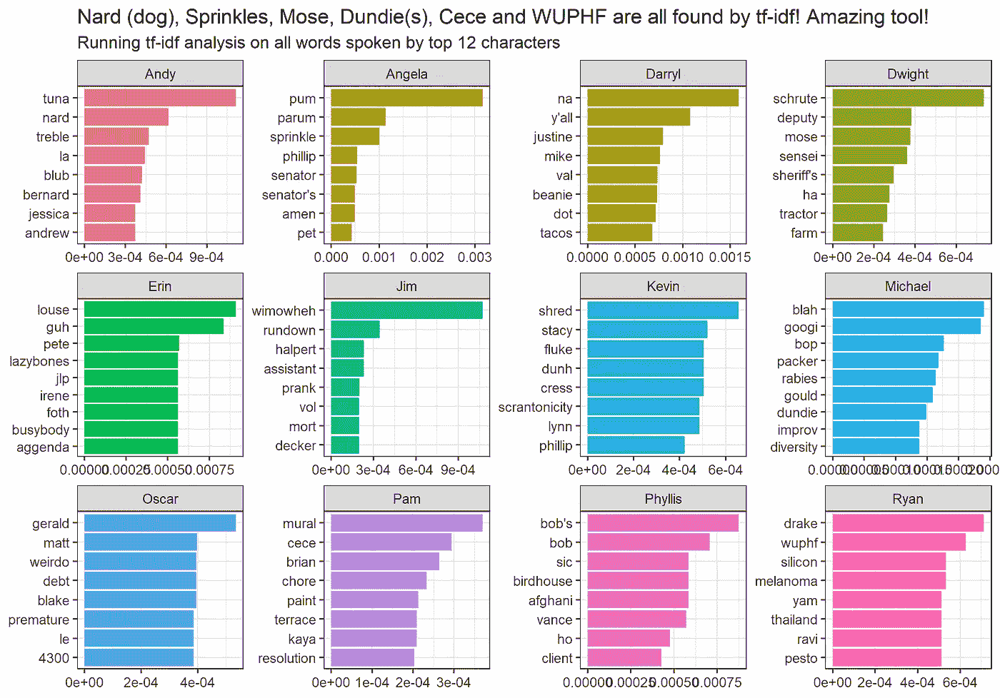

tf-idf 前 12 名

让我们来看看。已经识别出最独特的单词。真的，所有人看 tf-idf 的字就能被一个真正的办公室粉丝识别出来。

*   安迪:金枪鱼，纳德，高音，杰西卡
*   安琪拉:糖粉，小鼓手男孩送的帕伦彭
*   达里尔:杰斯丁的豆豆，迈克
*   德怀特:副警长，摩西，警长，农场
*   等等…

如此简单的工具却能产生如此巨大的效果。

熟悉词汇之后，让我们开始关注人们通常将 NLP 与**联系在一起的“另一件大事”:情感分析。**

# #3.情感分析

对文本数据进行情感分析/情感评分有多种方式。一些可能的方法是

*   按词分类的情感(即积极/消极类，如 Bing 词典，或情绪类，如愤怒、喜悦、信任、NRC 词典中的预期)
*   情绪的数字评分(AFINN 词典:美丽、令人惊叹+3、困扰、不便-2)
*   在 ngram /句子级别上运行情感评分—算法确定句子的总体情感，介于-1 和 1 之间，其中-1 表示全部负面，+1 表示全部正面，0 表示中性/不可分类。

在上述方法中，我将利用 3:

1.  我将标记分为正面和负面，按人计数，并为每个人创建一个列表，列出他们最常用的正面和负面词汇。
2.  我将应用 AFINN 词典，对每个单词进行评分，然后用该单词的频率乘以情绪得分，并创建一个单词列表，这些单词对人们的词汇产生了最积极或消极的影响。
3.  我将按字符级别对说出的句子/句子进行情感评分，并通过 AFINN 分数将结果与令牌级别的情感聚合进行比较。

## A.使用类别分类运行情感分析

这只是一个简单的介绍步骤。我把所有的单词，分成正反两类，统计每个单词，按人确定最常用的正反两类单词。这真的只是一个热身运动。

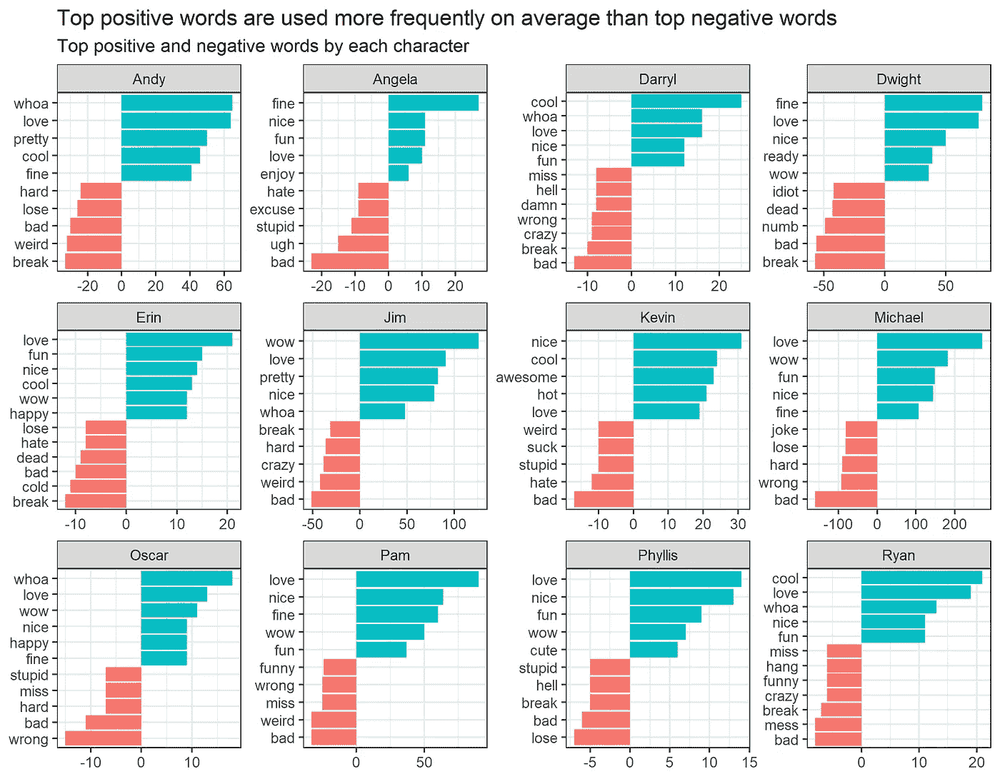

按字符排列的最常用的正面和负面单词

我们在这里看到的是，比较正面和负面词汇的数量，大多数人使用正面词汇的频率高于负面词汇。安吉拉可能是个例外，她最积极的词(好)和最不积极的词(坏)出现的次数几乎一样多(约 22 次)。这本身并不能真正代表个性。为此，我将使用 AFINN 词典。

## B.使用 AFINN 的数字情感评分

这一次，我不是简单地将单词分类，而是给每个单词分配代表积极和消极的数字。然后，我会将情感分数乘以单词数，得出一个“贡献”因子:一个单词对一个人的词汇有多少积极或消极的贡献。例如，‘*恶心*这个词的分数是-3，而‘*漂亮*这个词的分数是+1。这意味着需要 3 个*漂亮的*来抵消 1 个*恶心的*。

在显示结果之前，让我向您展示这样做的代码。

事情是这样的:

1.  我们由人们将台词分解成单词(保留关于谁说了台词的信息)
2.  我们应用词汇化使单词回到它们的词根形式(“学习”→“研究”)
3.  我们从 2 个词典、一个手动创建的列表和人名列表中删除了停用词(我们不能对姓名进行情感评分，它们将被归类为中性，并影响平均值和中值统计数据)
4.  我们应用“计数”函数，该函数首先按“名称”对数据进行分组，然后按计数聚合对数据进行“汇总”。我们现在有 3 列:(1)名称，(2)单词和(3)计数。
5.  我们通过“单词”列将 AFINN 词典加入到我们的数据中。现在每个单词的分数都在-3 到+3 之间(我们使用内部连接，所以最后只保留匹配)
6.  最后一步，我们将“分数”乘以“计数”来获得贡献因子

让我们检查一下视觉效果。

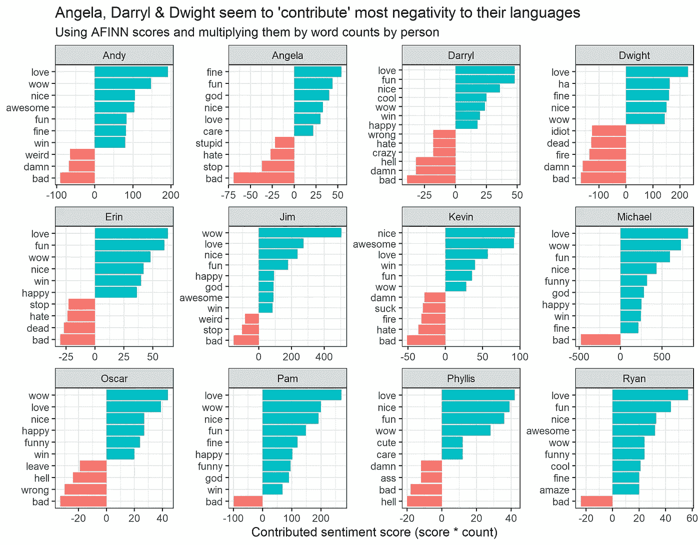

人们贡献的情感

现在我们需要寻找的是红色条最长的地方，以找到对他们的谈话贡献最消极的人。安吉拉、达里尔和德怀特似乎是红色条的平均长度接近绿色(正)条的人。

## C.人与人之间的感情

我意识到我应该对情感做更多的事情。其中之一是检查谁对谁最好，谁对谁最刻薄。为此，我将使用与我的“对话网络”相似的方法。我将确定谁对谁说了这句话，通过“ **from — to** ”列进行情感评分，并可视化我的结果！

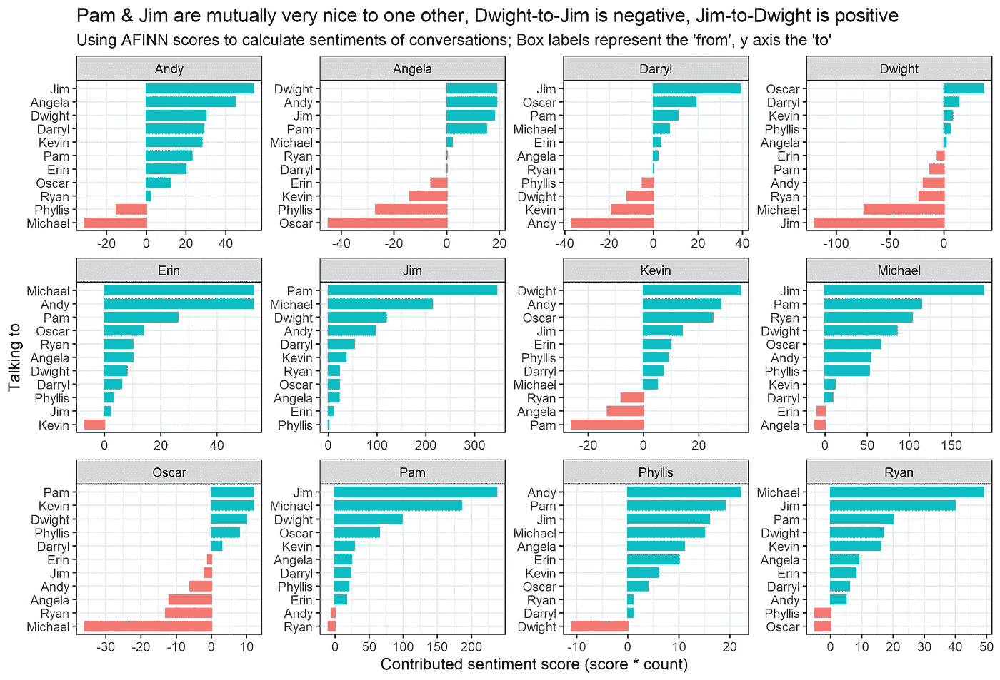

人与人之间的情感(条形图)

就拿安吉拉来说吧:她对德怀特最好，对奥斯卡最差。条形图很容易理解，但是网络会让它看起来更好。同样，我不能在这里粘贴一个 HTML 元素，所以请查看另外两个交互式网络的截图。

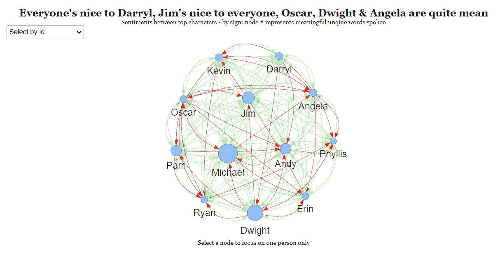

情感网络

多好啊！我还能做一件事让它看起来更好。我不一定要把所有的关系形象化，而是把重点放在最积极和最消极的关系上。但是，如何决定哪些“边缘”保留给网络呢？让我们按人对分数进行分布分析，去掉平均值/中值，只显示“极端”关系。

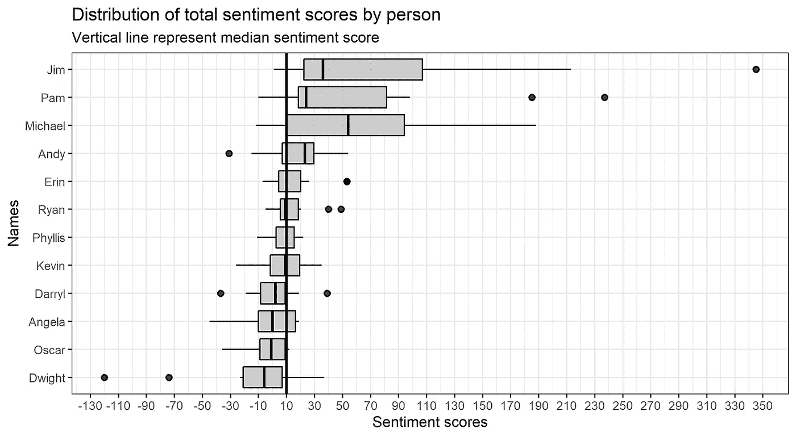

分数分布

下面是上图的意思。以吉姆为例——他对其他人的情感评分在 15 到 100 之间，有很高的极端值。大多数分数都在-10 到+30 之间，所以我会把所有的分数都保持在这个范围之外，以应对极端情况。包含大多数“极端”关系的 visNetwork 如下:

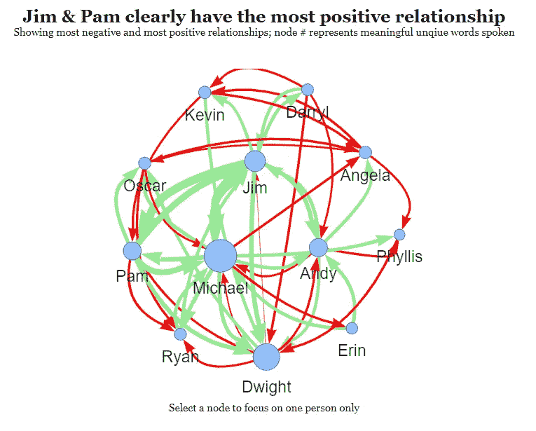

具有表示积极/消极度量的边的情感网络

我们可以看到(再次抱歉，这是一个互动网络)吉姆和帕姆之间的绿色边缘最宽，这意味着他们之间的情绪是所有人中最积极的。奥斯卡和安吉拉互相相当消极对方采取另一个例子，从网络。

## D.季节性情绪趋势

作为情绪分析的最后一步，让我快速运行所有人的逐集和逐季情绪趋势，看看我们是否能跟踪他们的快乐/悲伤。

首先，剧集层面的概述。

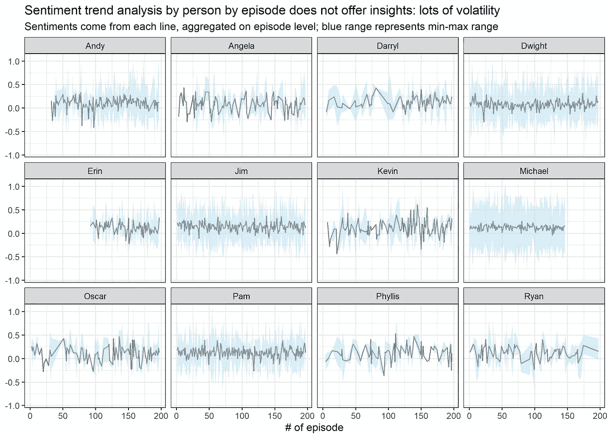

上面的图表没有提供任何信息。每集的平均情绪(通过使用**senmentr**包的**情绪 _by** 函数计算，其中每行的情绪得分在-1 和 1 之间)波动太大，无法提供任何见解。让我们检查季节性数据。

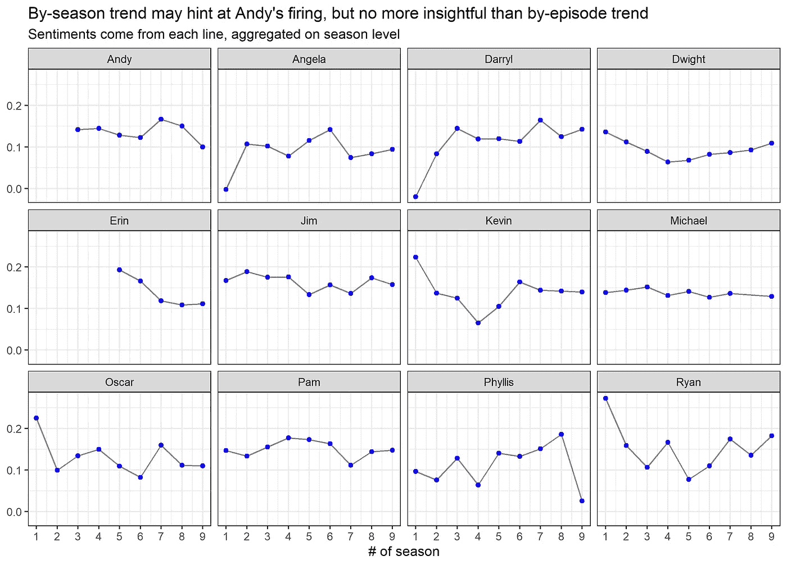

这在某种程度上更容易解释，但无法提取出明确的趋势。也许安迪的解雇是有暗示的，但季节平均情绪得分和人的快乐/悲伤之间没有明确的关系。

除此之外，我们还可以看到办公室的两个主要竞争对手吉姆和德怀特之间的平均情绪是如何随着时间的推移而发展的。

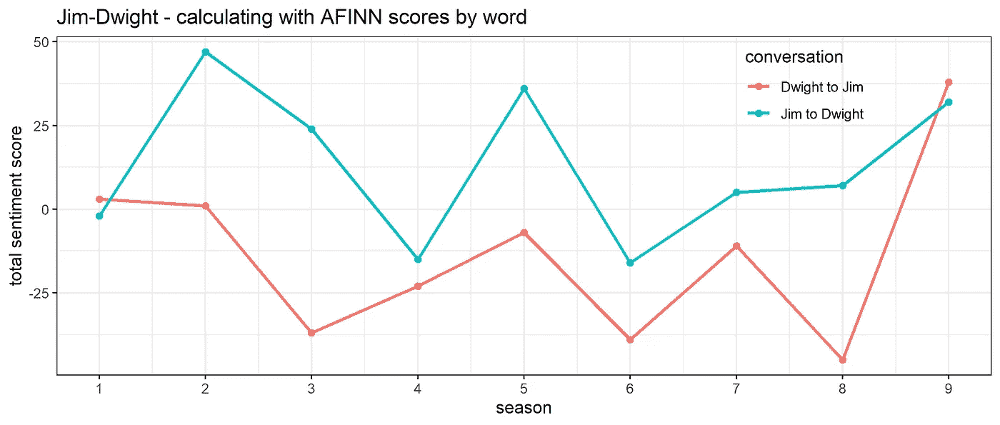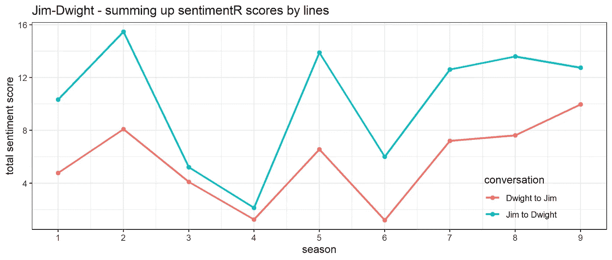

我对此运行了两个算法，首先在标记级别使用 AFINN，然后在行/句子级别使用 sentimentR，结果非常相似。

两人都暗示这对情侣的关系在接近尾声时变得更好，这与故事相符，因为竞争停止了，友谊开始了。这是有争议的，情感趋势很难在这里建模。

# #4.LDA 快速介绍

在结束之前，让我向您展示另一个典型的 NLP 工作:使用 LDA(潜在 Dirichlet 分配)运行主题建模。对我来说，这非常类似于一种无监督的机器学习算法，k-means 聚类完成它的工作。它在方法论上有很大的不同，但结果是相似的:最后，聚类找到多少“属于”在一起的数据点，形成“相似但未标记的组”。LDA 的输出是一个单词列表，这些单词“属于一起”，“组成一个未标记的主题”。

我不会详细说明算法实际上是如何运行的，但我会给你一个例子。我们一直在和前 12 名合作(按行数)。在这种情况下，我们可以使用 LDA 来寻找词汇相似的人。也就是让(force) LDA 创建 12 个聚类/主题，并吐出某个人是给定主题的一部分的概率。

我们就这么做吧。

下面是上面 3 行代码中发生的情况

1.  输入数据具有 3 列:(1)说出该行的人的姓名(通常称为文档)，(2)单词列(在标记化之后)以及(3)指示该单词在给定文档中出现了多少次的列
2.  我们需要为运行 LDA 创建一个文档术语矩阵
3.  我们将集群/主题的数量设置为 12，并设置一个随机状态以使我们的工作可重复
4.  一旦 LDA 算法完成，我们可以提取两个概率:(1)**beta**——一个单词成为主题的一部分的概率，以及(2) **gammas** —一个主题成为文档的一部分的概率:这里我们提取 **gammas** ，因为我们想要一个主题(词汇)成为文档(人)的一部分的概率

这是我们可视化后得到的结果

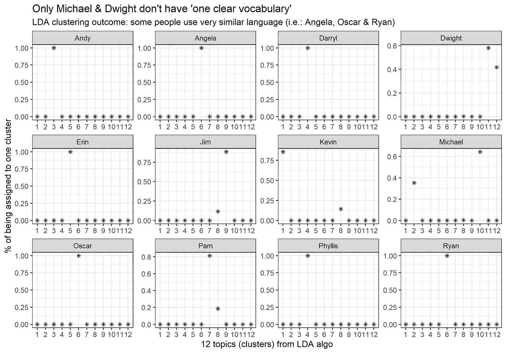

12 个人的 LDA 词汇

大多数人都有自己使用的特定词汇，然而德怀特和迈克尔似乎都根据他们选择的词汇组成了 2-2 个词汇。Oscar 和 Angela 共享一个群集，这意味着他们有相似的发音词汇(他们都是会计师)，有趣的是，虽然 Jim 和 Pam 有各自的话题，但他们共享一个话题(话题# 8 ),可能是他们的个人(办公室之外)生活，如他们的家庭、女儿、婚礼策划等…

这远非完美，LDA 不保证实际的主题，如“金融”或“IT”，这些主题需要由分析师在一些创造性的，但可能是主观的思考后命名。

# 收尾工作

在这篇博文中，我提到了以下 NLP 主题:

1.  标记化、双分枝化和 tf-idf 来从文本数据中提取单词、短语和唯一标记
2.  使用分类和数字结果的情感分析，如何使用它们来显示对文本的情感贡献
3.  最小 LDA 将发音相似的人“聚集”在一起，或者至少提取一个人与另一个人分享话题的可能性

我在 Office 脚本中展示了所有上述 NLP 方法，作为一个非常熟悉该节目的人，我可以诚实地说，这些方法中的一些，虽然很容易使用，但会产生令人敬畏的结果。关于 tf-idf 和 ngrams，毫无疑问它们能够对任何文本数据创造奇迹。甚至情感评分似乎也站得住脚，尽管句子级别的聚合和趋势分析很困难，但标记级别的比较是有希望的。关于 LDA，让我们只是“小心行事”。

总的来说，这是我尝试这些方法的一个很好的方式，看看它们如何处理“实时”数据。如果对我的代码有疑问，请访问我的 GitHub 页面([https://github.com/kristofrabay](https://github.com/kristofrabay))并在那里联系我。

资料来源:giphy