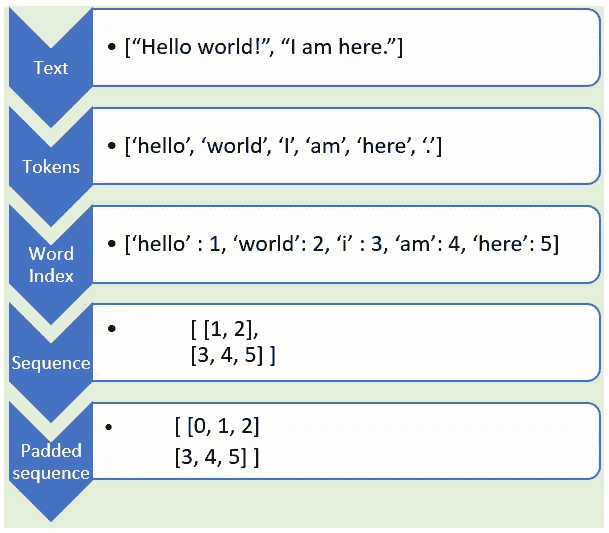

# NLP:使用 TensorFlow2 为深度学习模型准备文本

> 原文：<https://towardsdatascience.com/nlp-preparing-text-for-deep-learning-model-using-tensorflow2-461428138657?source=collection_archive---------8----------------------->

## TensorFlow2 中的文本预处理(标记化、排序、填充)是如何工作的。


作者图片

自然语言处理(NLP)通常用于文本分类任务，例如垃圾邮件检测和情感分析、文本生成、语言翻译和文档分类。文本数据可以被认为是字符序列、单词序列或句子序列。最常见的是，对于大多数问题，文本数据被认为是单词序列。在本文中，我们将深入研究使用简单示例文本数据的预处理。然而，这里讨论的步骤适用于任何 NLP 任务。特别是，我们将使用 TensorFlow2 Keras 进行文本预处理，包括:

*   标记化
*   定序
*   填料

下图描述了文本预处理过程以及示例输出。



从原始句子开始到填充序列的逐步文本预处理示例

首先，让我们导入所需的库。(我的 [GitHub 页面](https://github.com/ShresthaSudip/Text-Preprocessing-Tensorflow2)里有完整的 Jupyter 笔记本)。

```
import tensorflow as tf
from tensorflow.keras.preprocessing.text import Tokenizer
from tensorflow.keras.preprocessing.sequence import pad_sequences
```

*Tokenizer* 是 TensorFlow Keras 中提供的一个 API，用来对句子进行分词。我们将文本数据定义为句子(每个句子用逗号分隔)和一组字符串。共有 4 个句子，包括 1 个最大长度为 5 的句子。我们的文本数据还包括标点符号，如下所示。

```
sentences = ["I want to go out.",
             " I like to play.",
             " No eating - ",
             "No play!",
            ]
sentences['I want to go out.', ' I like to play.', ' No eating - ', 'No play!']
```

# **标记化**

由于深度学习模型不理解文本，我们需要将文本转换成数字表示。为此，第一步是标记化。TensorFlow Keras 的 *Tokenizer* API 将句子拆分成单词，并将这些单词编码成整数。以下是在*记号赋予器* API 中使用的超参数:

*   num_words:限制训练时保留的最常用单词的最大数量。
*   过滤器:如果没有提供，默认情况下过滤掉所有标点符号(！idspnonenote)。"#$%&()*+,-./:;<=>？@[\]^_'{|}~\t\n).
*   下限=1。这是默认设置，将所有单词转换为小写
*   oov_tok:当它被使用时，词汇外标记将被添加到用于建立模型的语料库中的单词索引中。这用于在 *text_to_sequence* 调用期间替换词汇表外的单词(不在我们的语料库中的单词)(见下文)。
*   word_index:将所有单词转换为整数索引。单词完整列表可用作键值属性:key =单词，value =单词的令牌

让我们使用*分词器*并打印出单词索引。我们已经使用了 num_words= 100，这对于这个数据来说是很多的，因为只有 9 个不同的单词和用于词汇外令牌的< OOV >字符串。

```
tokenizer = Tokenizer(num_words=100, lower= 1, oov_token="<OOV>")
tokenizer.fit_on_texts(sentences)
word_index = tokenizer.word_indexprint(word_index)
{'<OOV>': 1, 'i': 2, 'to': 3, 'play': 4, 'no': 5, 'want': 6, 'go': 7, 'out': 8, 'like': 9, 'eating': 10}
```

如上所述，我们句子中的每个单词都被转换成了数字符号。例如，“I”的值为 2。分词器也忽略了单词后面的感叹号。例如，单词“play”或“play！”只有一个标记即 4。

# **排序**

接下来，让我们使用来自 tokenizer 对象的 *texts_to_sequences* 用数字序列表示每个句子。下面，我们打印出原始句子、单词索引和序列。

```
sequences = tokenizer.texts_to_sequences(sentences)
print(sentences)
print(word_index)
print(sequences)['I want to go out', ' I like to play', ' No eating - ', 'No play!']{'<OOV>': 1, 'i': 2, 'to': 3, 'play': 4, 'no': 5, 'want': 6, 'go': 7, 'out': 8, 'like': 9, 'eating': 10}[[2, 6, 3, 7, 8], [2, 9, 3, 4], [5, 10], [5, 4]]
```

如上所示，文本由序列表示。举个例子，

*   “我要出去”——>[2，6，3，7，8]
*   “我喜欢玩”——>[2，9，3，4]
*   “不准吃东西”——>[5，10]
*   “不玩了！”— -> [5, 4]

# **填充**

在任何原始文本数据中，自然会有不同长度的句子。然而，所有的神经网络都要求具有相同大小的输入。为此，需要进行填充。下面，我们用 *pad_sequences* 进行填充。 *pad_sequences* 使用 sequences、padding、maxlen、truncating、value 和 dtype 等参数。

*   序列:我们之前创建的序列列表
*   padding = 'pre '或' post(默认 pre)。通过使用 pre，我们将在每个序列之前填充(添加 0 ), post 将在每个序列之后填充。
*   maxlen =所有序列的最大长度。如果没有提供，默认情况下它将使用最长句子的最大长度。
*   truncating = 'pre '或' post '(默认为' pre ')。如果序列长度大于提供的 maxlen 值，则这些值将被截断为 maxlen 值。“前”选项将在序列的开头截断，而“后”将在序列的结尾截断。
*   值:填充值(默认值为 0)
*   dtype:输出序列类型(默认为 int32)

让我们关注一下 pad_sequences 中使用的重要参数:padding、maxlen 和 truncating。

**前后填充**

使用“前”还是“后”填充取决于分析。在某些情况下，开头填充是合适的，而在其他情况下则不合适。例如，如果我们使用递归神经网络(RNN)进行垃圾邮件检测，那么在开始填充将是合适的，因为 RNN 不能学习长距离模式。开始时的填充允许我们保留最后的序列，因此 RNN 可以利用这些序列来预测下一个。然而，在任何情况下，填充都应该在仔细考虑和业务知识之后进行。

下面显示了“前置”和“后置”填充的输出，带有序列最大长度的默认 maxlen 值。

```
**# pre padding**
pre_pad = pad_sequences(sequences, padding='pre')print("\nword_index = ", word_index)
print("\nsequences = ", sequences)
print("\npadded_seq = " )
print(pre_pad)word_index =  {'<OOV>': 1, 'i': 2, 'to': 3, 'play': 4, 'no': 5, 'want': 6, 'go': 7, 'out': 8, 'like': 9, 'eating': 10}

sequences =  [[2, 6, 3, 7, 8], [2, 9, 3, 4], [5, 10], [5, 4]]

padded_seq = 
[[ 2  6  3  7  8]
 [ **0**  2  9  3  4] <---------- **0** Padded at the beginning
 [ **0  0  0**  5 10] 
 [ **0  0  0**  5  4]]
```

在我们上面的例子中，最大长度的序列是[ 2，6，3，7，8]，对应的是“我想出去”。当使用 padding ='pre '时，在所有其他序列的开头添加填充值 0。因为其他序列比[ 2，6，3，7，8]更短，填充实际上使所有其他序列与此序列大小相同。

然而，当使用 padding =“post”时，在序列的末尾添加填充值，即 0。

```
**# post padding**
post_pad = pad_sequences(sequences, padding='post')
print("\nword_index = ", word_index)
print("\nsequences = ", sequences)
print("\npadded_seq = " )
print(post_pad)word_index =  {'<OOV>': 1, 'i': 2, 'to': 3, 'play': 4, 'no': 5, 'want': 6, 'go': 7, 'out': 8, 'like': 9, 'eating': 10}

sequences =  [[2, 6, 3, 7, 8], [2, 9, 3, 4], [5, 10], [5, 4]]

padded_seq = 
[[ 2  6  3  7  8]
 [ 2  9  3  4  **0**]<---------- **0** Padded at the end
 [ 5 10  **0  0  0**]
 [ 5  4  **0  0  0**]]
```

**使用 maxlen 和截断选项进行前后填充**

如果需要，我们可以同时使用填充和截断参数。下面我们展示了两种情况，1)预截断的预填充和 2)后截断的预填充

使用“pre”选项截断允许我们在开始时截断序列。然而，用“post”截断将在最后截断序列。

让我们看一下使用前置截断进行前置填充的例子。

```
**# pre padding, maxlen and pre truncation**
prepad_maxlen_pretrunc = pad_sequences(sequences, padding = ‘pre’, maxlen =4, truncating = ‘pre’)
print(prepad_maxlen_pretrunc)[[ 6  3  7  8]<-----Truncated from length 5 to 4, at the beginning
 [ 2  9  3  4]
 [ **0  0**  5 10]<---------- Padded at the beginning
 [ **0  0 ** 5  4]]
```

通过使用 maxlen =4，我们将填充序列的长度截断为 4。如上所示，maxlen=4 的使用影响了第一个序列[2，6，3，7，8]。该序列的长度为 5，被截断为 4。截断发生在开始时，因为我们使用了 truncating = 'pre '选项。

让我们看看 truncation = 'post '选项。

```
**# pre padding, maxlen and post truncation**
prepad_maxlen_posttrunc = pad_sequences(sequences, padding = 'pre', maxlen =4, truncating = 'post')
print(prepad_maxlen_posttrunc)[[ 2  6  3  7]<-----Truncated from length 5 to 4, at the end
 [ 2  9  3  4]
 [ **0  0**  5 10]<---------- Padded at the beginning
 [ **0  0**  5  4]]
```

当我们使用 truncating = 'post '选项时，截断发生在最后。当应用后截断时，它影响第一个序列[ 2，6，3，7，8]并被截断为长度 4，从而产生序列[ 2，6，3，7]。

# **总结**

在本文中，我们专注于预处理原始文本数据，并为深度学习模型做准备。具体来说，我们讨论了对句子进行标记，将其表示为序列，并对其进行填充以使所有序列长度相同。该填充序列现在准备好用于神经网络的训练/测试分割。请参考 Laurence Moroney 的 [NLP zero to hero](https://www.youtube.com/watch?v=fNxaJsNG3-s) 的视频进行进一步阅读。

在未来的文章中，我将解释我们如何在真实世界的数据中使用预处理，并在深度学习模型中使用这种嵌入的填充序列数据。

感谢您的阅读，如果您有任何意见或建议，请留下。

## 快乐学习！！！