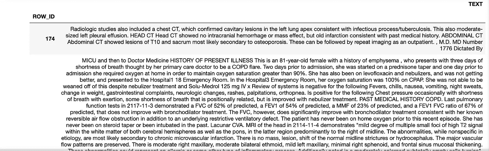
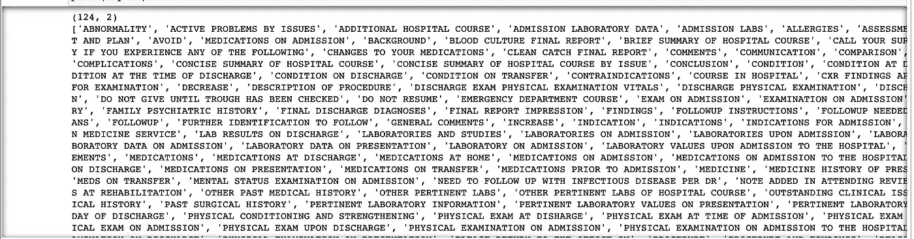
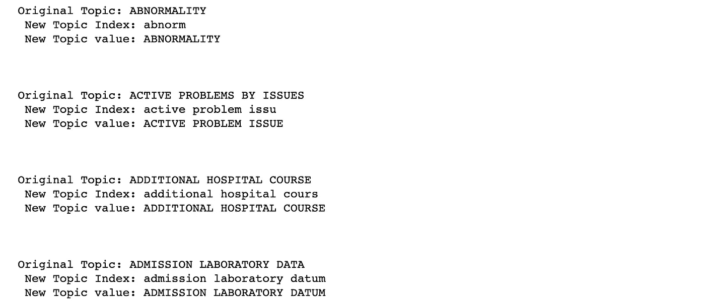
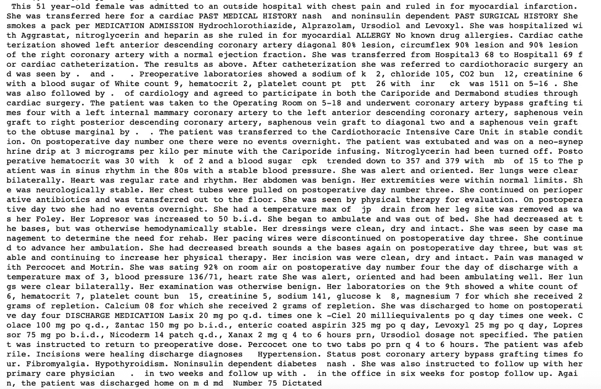

# NLP-预处理临床数据以找到切片

> 原文：<https://towardsdatascience.com/nlp-preprocessing-clinical-data-to-find-sections-461fdadbec77?source=collection_archive---------46----------------------->

## 清洗医学文本

在本帖中，我们将**使用医疗图表笔记数据** ( *医生的潦草笔记* ) **对临床笔记中存在的主题进行建模。记住，写这些笔记是没有结构的。**

在后面的故事中，我们将总结这些笔记。

# 将在 4 篇文章中讨论的 NLP 任务:

1.  **预处理和清洗**
2.  [文本摘要](https://medium.com/@tyagigaurika27/text-summarization-for-clustering-documents-2e074da6437a)
3.  [使用潜在狄利克雷分配(LDA)的主题建模](https://medium.com/@tyagigaurika27/nlp-topic-modeling-to-identify-clusters-ca207244d04f)
4.  [聚类](https://medium.com/@tyagigaurika27/identifying-relationships-in-clinical-text-nlp-clustering-929eb04b5942)

> 如果您想**亲自尝试整个代码或跟随，请**访问我在 GitHub 上发布的 jupyter 笔记本:[https://GitHub . com/gaurikatyagi/Natural-Language-Processing/blob/master/introduction % 20 to % 20 NLP-Clustering % 20 text . ipynb](https://github.com/gaurikatyagi/Natural-Language-Processing/blob/master/Introdution%20to%20NLP-Clustering%20Text.ipynb)

# 数据:

来源:[https://mimic.physionet.org/about/mimic/](https://mimic.physionet.org/about/mimic/)

医生在他们的电脑上做笔记，80%的记录是没有结构的。这使得信息处理更加困难。我们不要忘记，解释医疗术语也不是一件容易的事情。它需要大量的上下文来解释。让我们看看我们有什么:


按作者分类的图像:作为输入的文本数据

我们立即注意到的事情:

1.  这是没有标记的纯文本。如果它有标记，我们可以使用像[美丽的汤](https://www.pythonforbeginners.com/beautifulsoup/beautifulsoup-4-python)这样的库
2.  这些行被人工换行(每当您看到单个\n
3.  没有错别字..哇哦，但是太多首字母缩写和大写字母了
4.  有像逗号、撇号、引号、问号这样的标点，还有像“后续”这样的连字符描述
5.  使用了大量有序数据，因此出现了“1”, '2.'诸如此类。但是，请注意，即使在这些数字之前，实际上也有一个单线制动(如 2 中所示)
6.  看看那些不确定的名字是如何被替换成“姓”或“名 3”，“医院病房名”之类的，好在这些都在方括号内，很容易识别。这些后面也总是跟着一个括号。耶！一些我们可以从一开始就去除的东西！
7.  注意可能需要如何处理日期(如果它们都不是相同的格式)
8.  注意一些格式:比如:\n\n ******* \n\n 或者 n？？？？？？\tT。我们需要处理好这一切

# 1.预处理

a.**正则表达式**:我们将使用正则表达式模式来清理我们的文本。*是的，我们确实需要多次反复的清理！*

图片作者:Regex Cleaning



作者图片:正则表达式清理的输出

b.**添加** **Context 和 Lemmatize text:** 看，我们是怎么讲 Lemmatize 和 not stemming 的。理解两个之间的[差异很重要。](https://nlp.stanford.edu/IR-book/html/htmledition/stemming-and-lemmatization-1.html)

在本节中，我们使用大写单词提取“潜在主题”来识别图表中的子主题。然后，专家手动将这些短语标记为“T”或“F”，以表示*接受*。一旦我们有了它，我们就改变了所有其他单词的大小写。等等，没那么容易，记住我们需要把它归类。

作者图片:[为上下文添加子部分](https://gist.github.com/gaurikatyagi/c0546c357f181da82be8d4493a8b68ed#file-adding-subsections-with-context)



作者图片:确定了 124 个副标题

现在，我们将把所有大写单词的大小写改为小写，除非它们是上面确定的主题

通过运行 lemmatizer **找到上述所有主题的**词条**。我们删除了主题中的停用词，以便在“大写单词列表”**中捕捉更多的主题。

那么，这里发生了什么变化？

```
for index in range(len(lemmatized_topics_index)):
    print("Original Topic: %s \n New Topic Index: %s\n New Topic value: %s"%(topics[index],                                                                                       lemmatized_topics_index[index],                                                                lemmatized_topics_values[index]
)
)
    ##you can remove this to see all pairs
    if index>2:
        break
    print("\n\n")
```



作者图片:词汇化和词干化的区别

*比较每个主题的词干，如果与词条化主题的词干不匹配，则将其改为小写。*

> 为什么先做词条解释，然后只匹配词干？因为词汇化是根据单词属于哪个词类来完成的。然而，词干提取只是试图通过去除常见的复数(etc)字母来找到单词的词根。
> 
> 因此，我们与词干部分进行比较，但保留已识别主题的词汇作为最终主题。这甚至允许我们在不同的图表注释中获得标准化的主题



作者图片:已清理主题

这里是我们最终的主题列表，分析师可以使用 Spacy 中的 spans 来解析和提取所需的信息。这不是很好吗！

[在我的下一篇文章](https://medium.com/@tyagigaurika27/text-summarization-for-clustering-documents-2e074da6437a)中，我将谈论**文本摘要。**