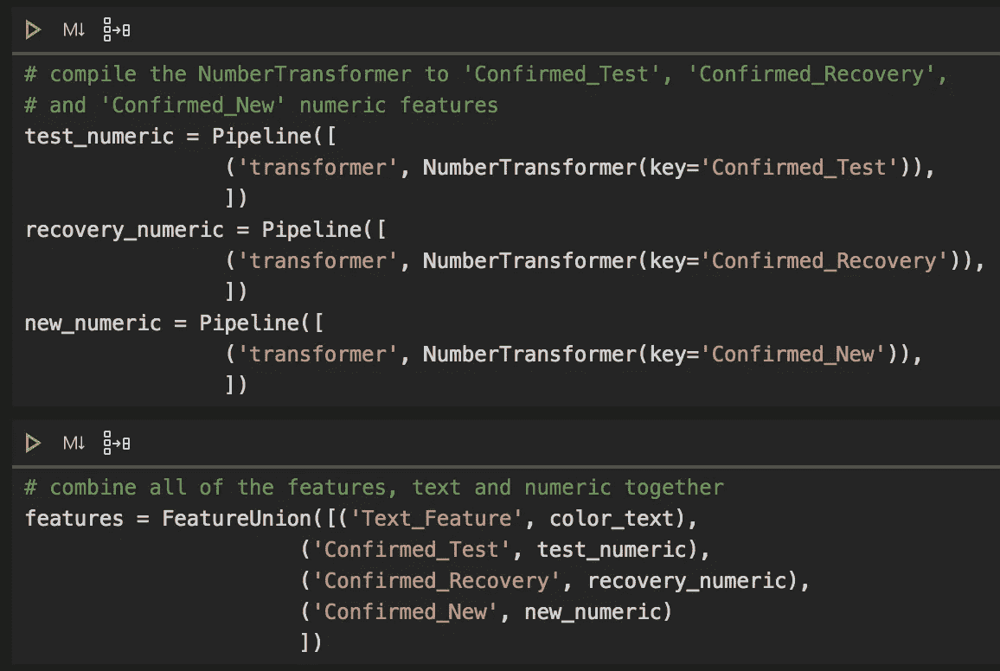

# 文本分类建模的 NLP 管道教程

> 原文：<https://towardsdatascience.com/nlp-python-pipeline-tutorial-for-text-classification-modeling-6eb1000f909c?source=collection_archive---------27----------------------->

## 关于使用 sklearn 的 FeatureUnion、Pipeline 和 transformers 预处理组合文本和数字数据的数据科学 python 教程



文本和数字特征转换器的 Python 代码。作者截图来自[GitHub](https://github.com/mprzybyla123/nlp-example)【1】代码。

# 目录

1.  什么是特征转换？
2.  NLP 对您的模型的好处
3.  关于数据
4.  文本和数字转换器教程
5.  摘要
6.  参考

# 什么是特征转换？

机器学习最困难的方面之一是为您的模型摄取文本数据。在构建模型时，有您的输入或特征，然后是您试图预测的内容。虽然某些类型的模型可以按数值或分类预测值或目标变量进行分组，但当您不仅要使用数值，还要使用文本作为要素类型时，并没有太多的文档说明该如何操作。要素变换是一种将两种类型结合起来并将其转换为可用格式的方法，可作为 X 变量来预测 Y 预测值或变量。下面的代码使用 sklearn 库将这两种类型的数据转换并组合成一个输入。

# NLP 对您的模型的好处

NLP，也称为自然语言处理，可用于将文本特征转换为数字表示。好处如下:

*   将输入要素转换为较小的尺寸
*   将目标变量转换成较小的大小
*   将分类数据转换成数字
*   将文本数据转换为数字
*   标准化您的输入数据
*   清理您的数据

# 关于数据

这里的数据集是随机的，有三个数字特征的虚拟数据；*‘已确认 _ 测试’，‘已确认 _ 恢复’，‘已确认 _ 新建’*，具有一个文本特征；*‘正文 _ 特写’*。在这种情况下，目标变量被标记为*‘Text _ Predictor’*。正常情况下，这个数据集很容易被消化到机器学习模型中，但这里我们引入了一个文本特征，这确实带来了一个问题。问题是，我们有两种截然不同的数据。按照下面的教程，这个问题是用 Python、[sk learn](https://scikit-learn.org/0.19/auto_examples/hetero_feature_union.html)【2】和[pandas](https://pandas.pydata.org/)【3】解决和描述的。


仔细观察所用的数据帧。作者截图来自[GitHub](https://github.com/mprzybyla123/nlp-example)【1】代码。

# 文本和数字转换器教程

下面是如何设置 Jupyter 笔记本的教程。ipynb 文件或您的 Python。py 文件。使用 sklearn 的库，您可以读入数据帧，转换输入要素和目标变量，然后开发一个随机森林模型来帮助预测新标签。

*   TfidfVectorizer —术语频率-逆文档频率矢量器，根据您的特征在词的语料库中找到您的术语的唯一性
*   base estimator——sk learn 库的基类
*   用于 sklearn 库的 transformer Mixin-Mixin 类
*   管道-将要素和分类器结合在一起
*   FeatureUnion 组合所有特征；文本和数字一起
*   pandas.get _ dummies 将分类目标转换为数字

要遵循本教程，请查找一个类似的数据集，该数据集同时具有数字和文本特征以及分类目标变量。首先，导入必要的库。参考 sklearn 代码和类:

```
BaseEstimator, TransformerMixin that are used in TextTransfomer and NumberTransformer classes.
```

接下来，读入你的数据帧。然后，创建您的 *vec_tdidf* 对象，该对象使用 *TfidVectorizer* ，通过利用其术语频率逆文档频率矢量器将文本计数转换为术语重要性的加权矩阵。使用*管道*创建一个管道对象，为“文本特征”一起编译转换器和矢量器。将相同的规则应用于数字要素，并分别对其进行标注。现在所有的特征类型都被转换了，使用 *FeatureUnion* 将它们合并成一个。

下一步是创建您的随机森林分类器。然后，将特征和分类器结合在一起，这就是你的模型对象。使用 *pd.get_dummies 将目标变量从分类变量转换为数字变量也很重要。*

为文本和数字特征创建一个列表，并分配目标变量。这些新项目将在 *train_test_split* 中从您的数据帧中引用。接下来，使用 *X_train* 和 *y_train* 装配您的模型。然后，可以从测试集 *X_test* 中预测。

最后，使用 sklearn *指标*，从你的 *y_test* 和 *preds* (预测)计算出你的 *accuracy_score* 。

整个 nlp-example.py 文件。由作者连同[sk learn](https://scikit-learn.org/)【2】和[熊猫](https://pandas.pydata.org/)【3】一起编码。

# 摘要

总之，sklearn 及其作者，以及 pandas，已经使编译杂乱和异构的数据变得简单，以便干净有效地输入到您的机器学习模型中。使用这些公共库，每个数据科学家现在不必仅仅依靠数字特征来预测他们的目标变量，而是也可以使用文本/单词/术语数据。使用这些 NLP 技术，可以很容易地对文本分类问题(如术语分类)进行建模。

# 参考

旁注——在我的代码、文本和文件中，我使用术语“预测器”作为预测的东西，也称为目标变量，或人们试图分类的东西。

[1] M.Przybyla， [GitHub](https://github.com/mprzybyla123/nlp-example) (2020)

[2] sklearn， [sklearn](https://scikit-learn.org/) (2020)

[3]熊猫，[熊猫](https://pandas.pydata.org/) (2020)