# NLP 情感分析手册

> 原文：<https://towardsdatascience.com/nlp-sentiment-analysis-for-beginners-e7897f976897?source=collection_archive---------12----------------------->

## 逐步了解文本块、NLTK、Scikit-Learn 和 LSTM 网络的方法


由 [Romain Vignes](https://unsplash.com/@rvignes?utm_source=medium&utm_medium=referral) 在 [Unsplash](https://unsplash.com?utm_source=medium&utm_medium=referral) 上拍摄的照片

# 介绍

自然语言处理(NLP)是机器学习的领域，专注于语言的生成和理解。它的主要目标是让机器能够理解人类，以自然的方式与人类交流和互动。

自然语言处理有许多任务，如文本生成、文本分类、机器翻译、语音识别、情感分析等。对于 NLP 的初学者来说，查看这些任务以及处理这些任务所涉及的所有技术可能会令人望而生畏。而且事实上，对于一个新手来说，确切地知道从哪里开始以及如何开始是非常困难的。

在所有的 NLP 任务中，我个人认为情感分析(SA)可能是最容易的，这使得它成为任何想开始进入 NLP 的人最合适的起点。

在本文中，我编译了各种如何执行 SA 的技术，从简单的 TextBlob 和 NLTK 到更高级的 Sklearn 和长短期记忆(LSTM)网络。

读完这篇文章后，你可以理解以下内容:

1.  **在 SA: TextBlob 和 NLTK 中使用的工具包**
2.  **SA 中使用的算法**:朴素贝叶斯、SVM、逻辑回归和 LSTM
3.  **术语**如停用词移除、词干、单词包、语料库、标记化等。
4.  创建一个**字云**

## 这篇文章的流程:

1.  数据清理和预处理
2.  文本 Blob
3.  算法:逻辑回归，朴素贝叶斯，SVM 和 LSTM

我们开始吧！


远程办公

# 问题定式化

在本文中，我将介绍由 3000 个句子组成的`sentiment`数据集，这些句子来自对`imdb.com`、`amazon.com`和`yelp.com`的评论。每个句子根据它是来自正面评论(标记为`1`)还是负面评论(标记为`0`)来标记。

数据可以从[网站](https://archive.ics.uci.edu/ml/datasets/Sentiment+Labelled+Sentences)下载。或者也可以从[这里](https://github.com/joetrankang/NLP.git)下载(强烈推荐)。文件夹`sentiment_labelled_sentences`(包含数据文件`full_set.txt`)应该和你的笔记本在同一个目录下。

# 加载和预处理数据

## 设置和导入库

```
%matplotlib inline
import string
import numpy as np
import matplotlib
import matplotlib.pyplot as plt
matplotlib.rc('xtick', labelsize=14) 
matplotlib.rc('ytick', labelsize=14)
```

现在，我们加载数据并查看前 10 条评论

```
with open("sentiment_labelled_sentences/full_set.txt") as f:
    content = f.readlines()content[0:10]
```

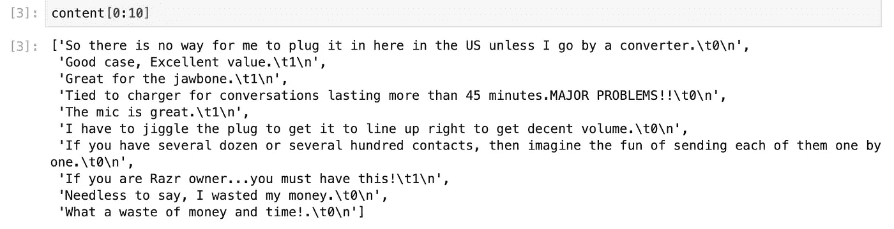

```
## Remove leading and trailing white space
content = [x.strip() for x in content]## Separate the sentences from the labels
sentences = [x.split("\t")[0] for x in content]
labels = [x.split("\t")[1] for x in content]sentences[0:10]
labels[0:10]
```

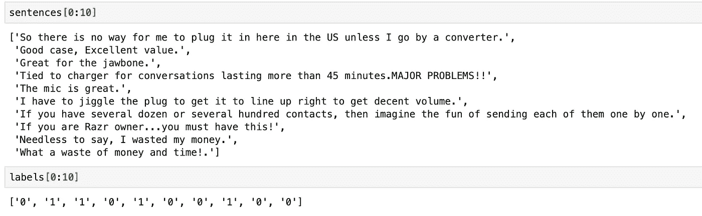

分开句子和标签

我们可以在这里停下来。但对我来说，我更喜欢把 y 变换成(-1，1)的形式，其中-1 代表负，1 代表正。

```
## Transform the labels from '0 v.s. 1' to '-1 v.s. 1'
y = np.array(labels, dtype='int8')
y = 2*y - 1
```

请注意，到目前为止，我们还没有对单词做任何修改！！！下一节重点是句子中的单词。

## 预处理文本数据

要将数据输入到任何模型中，输入的**数据必须为**矢量形式**。我们将进行以下转换:**

*   删除标点和数字
*   将所有单词转换成小写
*   删除*停用词*(例如，the，a，that，this，it，…)
*   将文本符号化
*   使用单词袋表示法将句子转换成向量

我将在这里解释一些术语。

1.  `Stop words`:对手头的任务不感兴趣的常用词。这些通常包括冠词，如“a”和“the”，代词，如“I”和“他们”，以及介词，如“to”和“from”，…

```
## Demonstrate ##
def removeStopWords(stopWords, txt):
    newtxt = ' '.join([word for word in txt.split() if word not in stopWords])
    return newtxt stoppers = ['a', 'is', 'of','the','this','uhm','uh']
removeStopWords(stoppers, "this is a test of the stop word removal code")
```

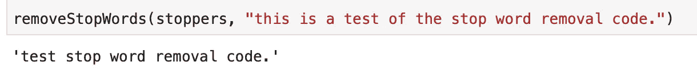

或者，如果我们确实想要使用一套完整的常用停用词，我们可以使用`NLTK`

```
from nltk.corpus import stopwordsstops = stopwords.words("English")removeStopWords(stops, "this is a test of the stop word removal code.")
```

*同样的结果*

2.`Corpus`:简单的文字集合。语序**事关**。“不伟大”和“伟大”是不同的

3.`Document-Term Matrix`或`Bag of Words` (BOW)只是文本句子(或文档)的矢量表示

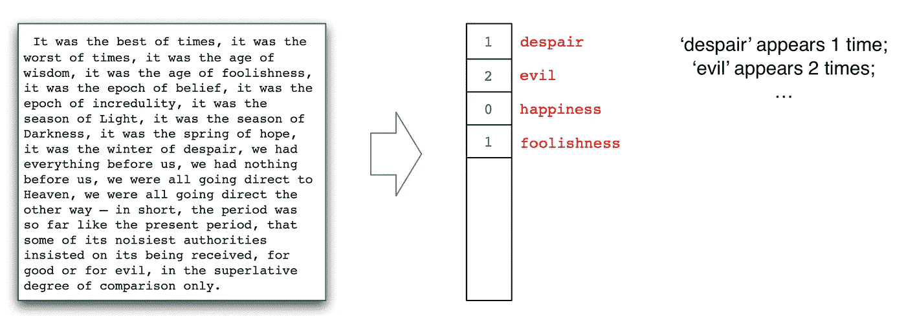

像这样表示一组要素的一种常见方法称为一键矢量。例如，假设我们文本集中的词汇是:

`*today, here, I, a, fine, sun, moon, bird, saw*`

我们要为之造弓的句子是:

`*I saw a bird today*`

`*1 0 1 1 0 0 1 1*`

为了创造一个单词包，我们需要将一个长句或一份文件分解成更小的部分。这个过程叫做`Tokenization`。最常见的标记化技术是将文本分解成单词。我们可以在 Scikit-Learn 中使用`CountVectorizer`来实现这一点，其中每一行代表一个不同的文档，每一列代表一个不同的单词。

现在让我们把所有东西放在一起，组成我们的数据集

```
def full_remove(x, removal_list):
    for w in removal_list:
        x = x.replace(w, ' ')
    return x## Remove digits ##
digits = [str(x) for x in range(10)]
remove_digits = [full_remove(x, digits) for x in sentences]## Remove punctuation ##
remove_punc = [full_remove(x, list(string.punctuation)) for x in remove_digits]## Make everything lower-case and remove any white space ##
sents_lower = [x.lower() for x in remove_punc]
sents_lower = [x.strip() for x in sents_lower]## Remove stop words ##
from nltk.corpus import stopwords
stops = stopwords.words("English")def removeStopWords(stopWords, txt):
    newtxt = ' '.join([word for word in txt.split() if word not in stopWords])
    return newtxtsents_processed = [removeStopWords(stops,x) for x in sents_lower]
```

让我们看看现在我们的句子是什么样子的

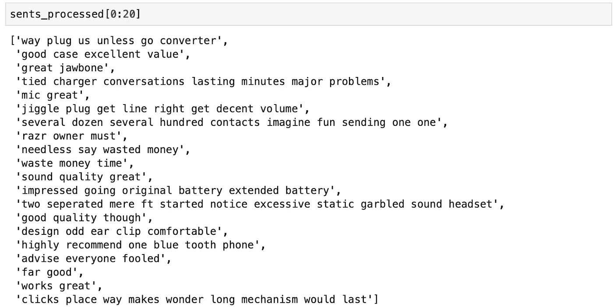

嗯，等一下！去掉很多停用词会让很多句子失去意义。例如，“`way plug us unless go converter`”对我来说没有任何意义。这是因为我们使用 NLTK 删除了所有常见的英语停用词。为了克服这个意义问题，让我们创建一套自己的停用词。

```
stop_set = ['the', 'a', 'an', 'i', 'he', 'she', 'they', 'to', 'of', 'it', 'from']sents_processed = [removeStopWords(stop_set,x) for x in sents_lower]
```

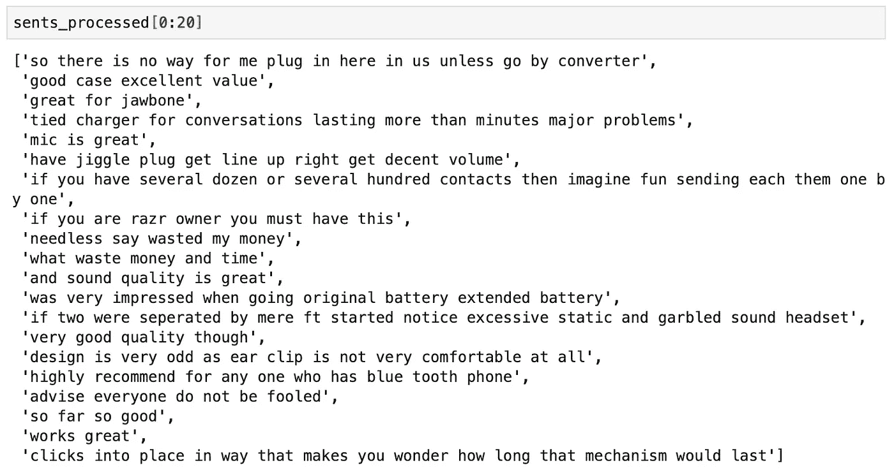

就此打住，转到标记化就可以了。然而，人们可以继续使用`stemming`。`stemming`的目标是去掉单词中的前缀和后缀，将单词转换成它的基本形式，`e.g. studying->study, beautiful->beauty, cared->care`，…在 NLTK 中，有两种流行的`stemming`技术，称为 porter 和 lanscaster。[参考:[数据营](https://www.datacamp.com/community/tutorials/stemming-lemmatization-python?utm_source=adwords_ppc&utm_campaignid=9942305733&utm_adgroupid=100189364546&utm_device=c&utm_keyword=&utm_matchtype=b&utm_network=g&utm_adpostion=&utm_creative=332602034349&utm_targetid=aud-299261629574:dsa-929501846124&utm_loc_interest_ms=&utm_loc_physical_ms=9062542&gclid=Cj0KCQjwuJz3BRDTARIsAMg-HxXScOjSXlUZMrEMQYLQWaEnrFIECMWrUZF3rnIWap5OyoW5QvtevvoaAjdkEALw_wcB)

```
import nltk
def stem_with_porter(words):
    porter = nltk.PorterStemmer()
    new_words = [porter.stem(w) for w in words]
    return new_words

def stem_with_lancaster(words):
    porter = nltk.LancasterStemmer()
    new_words = [porter.stem(w) for w in words]
    return new_words ## Demonstrate ##    
str = "Please don't unbuckle your seat-belt while I am driving, he said"print("porter:", stem_with_porter(str.split()))

print("lancaster:", stem_with_lancaster(str.split()))
```

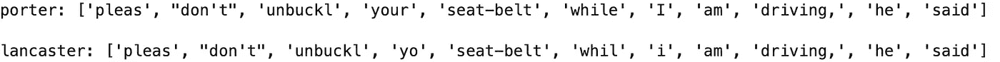

让我们试试我们的`sents_processed`看看它是否有意义。

```
porter = [stem_with_porter(x.split()) for x in sents_processed]porter = [" ".join(i) for i in porter]porter[0:10]
```

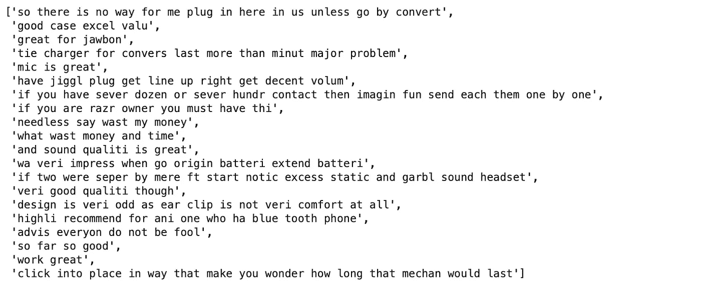

出现一些奇怪的变化，例如非常->真实，质量->质量，价值->价值，…

4.`Term Document Inverse Document Frequency` (TD/IDF)。这是在多个文档的上下文中，一个单词在一个文档中的*相对重要性的度量。在我们这里，多重审查。*

我们从 TD 部分开始——这只是文档中单词的**归一化频率**:

`(word count in document) / (total words in document)`

IDF 是所有文档中单词唯一性的加权。以下是 TD/IDF 的完整公式:

`td_idf(t,d) = wc(t,d)/wc(d) / dc(t)/dc()`

其中:
—`wc(t,d)`=【t 项在文档 d
中的出现次数】— `wc(d)` =【文档 d】中的字数
—`dc(t)`=【t 项在集合中至少出现 1 次的文档数】— `dc()` =【集合中的文档数】

现在，让我们创建一个单词包，并规范文本

```
from sklearn.feature_extraction.text import CountVectorizer
from sklearn.feature_extraction.text import TfidfTransformervectorizer = CountVectorizer(analyzer = "word", 
                             preprocessor = None, 
                             stop_words =  'english', 
                             max_features = 6000, ngram_range=(1,5))data_features = vectorizer.fit_transform(sents_processed)
tfidf_transformer = TfidfTransformer()
data_features_tfidf = tfidf_transformer.fit_transform(data_features)
data_mat = data_features_tfidf.toarray()
```

现在`data_mat`是我们的文档术语矩阵。输入已准备好投入模型。让我们创建训练集和测试集。在这里，我将数据分为 2500 个句子的训练集和 500 个句子的测试集(其中 250 个是正面的，250 个是负面的)。

```
np.random.seed(0)
test_index = np.append(np.random.choice((np.where(y==-1))[0], 250, replace=False), np.random.choice((np.where(y==1))[0], 250, replace=False))train_index = list(set(range(len(labels))) - set(test_index))train_data = data_mat[train_index,]
train_labels = y[train_index]test_data = data_mat[test_index,]
test_labels = y[test_index]
```

# 文本 Blob

1.  `**TextBlob**`:语言学研究者根据他们的专业领域给单词的情感贴上标签。单词的情感可以根据它在句子中的位置而变化。`TextBlob`模块允许我们利用这些标签。`TextBlod`找到**它可以分配**极性**和**主观性**的所有单词和短语**，然后**将它们全部平均**
2.  **情感标签**:语料库中的每个单词都根据极性和主观性进行标记(还有更多标签，但我们现在将忽略它们)。一个语料库的情感是这些的平均值。

*   ***极性*** :一个字有多正或多负。-1 是非常消极的。+1 很正。
*   ***主观性*** :一个词有多主观，或者说有多固执己见。0 是事实。+1 在很大程度上是一种观点。

```
from textblob import TextBlob#Create polarity function and subjectivity functionpol = lambda x: TextBlob(x).sentiment.polaritysub = lambda x: TextBlob(x).sentiment.subjectivitypol_list = [pol(x) for x in sents_processed]sub_list = [sub(x) for x in sents_processed]
```

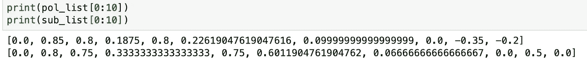

这是一种基于规则的方法，决定了评论的情绪(极性和主观性)。

下一节将介绍各种算法。

# 逻辑回归

```
from sklearn.linear_model import SGDClassifier## Fit logistic classifier on training data
clf = SGDClassifier(loss="log", penalty="none")
clf.fit(train_data, train_labels)## Pull out the parameters (w,b) of the logistic regression model
w = clf.coef_[0,:]
b = clf.intercept_## Get predictions on training and test data
preds_train = clf.predict(train_data)
preds_test = clf.predict(test_data)## Compute errors
errs_train = np.sum((preds_train > 0.0) != (train_labels > 0.0))
errs_test = np.sum((preds_test > 0.0) != (test_labels > 0.0))print("Training error: ", float(errs_train)/len(train_labels))
print("Test error: ", float(errs_test)/len(test_labels))**Training error:  0.0116
Test error:  0.184**
```

***影响力大的词***

决定一个句子是否为肯定的，哪些词最重要？作为对此的第一近似，我们简单地取其系数在`w`中具有最大正值的单词。

同样，我们看那些在`w`中系数具有最大负值的单词，我们认为这些单词对负面预测有影响。

```
## Convert vocabulary into a list:
vocab = np.array([z[0] for z in sorted(vectorizer.vocabulary_.items(), key=lambda x:x[1])])## Get indices of sorting w
inds = np.argsort(w)## Words with large negative values
neg_inds = inds[0:50]
print("Highly negative words: ")
print([str(x) for x in list(vocab[neg_inds])])## Words with large positive values
pos_inds = inds[-49:-1]
print("Highly positive words: ")print([str(x) for x in list(vocab[pos_inds])])
```

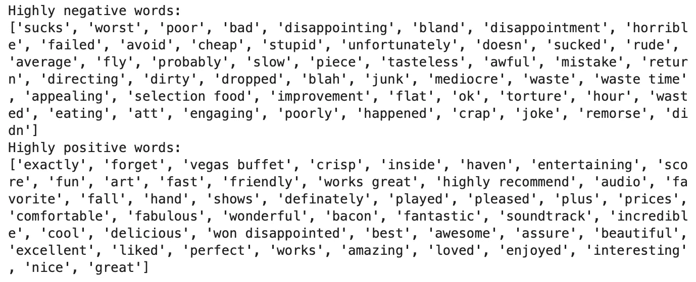

***创建字云***

```
from wordcloud import WordCloud
wc = WordCloud(stopwords=stop_set, background_color="white", colormap="Dark2",
               max_font_size=150, random_state=42)#plt.rcParams['figure.figsize'] = [16, 6]wc.generate(" ".join(list(vocab[neg_inds])))plt.imshow(wc, interpolation="bilinear")
plt.axis("off")    
plt.show()
```

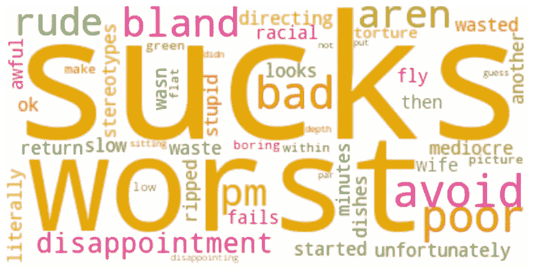

# 朴素贝叶斯

```
from sklearn.naive_bayes import MultinomialNB
nb_clf = MultinomialNB().fit(train_data, train_labels)nb_preds_test = nb_clf.predict(test_data)
nb_errs_test = np.sum((nb_preds_test > 0.0) != (test_labels > 0.0))
print("Test error: ", float(nb_errs_test)/len(test_labels))**Test error:  0.174**
```

我们来做一些预测案例。[1]表示正，而[-1]表示负

```
print(nb_clf.predict(vectorizer.transform(["**It's a sad movie but very good**"])))**[1]**print(nb_clf.predict(vectorizer.transform(["**Waste of my time**"])))**[-1]**print(nb_clf.predict(vectorizer.transform(["**It is not what like**"])))**[-1]**print(nb_clf.predict(vectorizer.transform(["**It is not what I m looking for**"])))**[1]**
```

最后一个测试用例有问题。这应该是负面评论，但模型预测是正面的。

# SVM

```
from sklearn.linear_model import SGDClassifiersvm_clf = SGDClassifier(loss="hinge", penalty='l2')
svm_clf.fit(train_data, train_labels)svm_preds_test = svm_clf.predict(test_data)
svm_errs_test = np.sum((svm_preds_test > 0.0) != (test_labels > 0.0))print("Test error: ", float(svm_errs_test)/len(test_labels))**Test error:  0.2**
```

再次，让我们做一些预测

```
print(svm_clf.predict(vectorizer.transform(["**This is not what I like**"])))**[-1]**print(svm_clf.predict(vectorizer.transform(["**It is not what I am looking for**"])))**[-1]**print(svm_clf.predict(vectorizer.transform(["**I would not recommend this movie**"])))**[1]**
```

SVM 可以正确预测评论“这不是我要找的”。然而，它无法预测评论“我不推荐这部电影”。

# LSTM 网络公司

关于 LSTM 网络的详细讨论可以在[这里](https://colah.github.io/posts/2015-08-Understanding-LSTMs/)找到。

```
from keras.models import Sequential
from keras.layers import Dense
from keras.layers import LSTM
from keras.layers import SpatialDropout1D
from keras.layers.embeddings import Embedding
from keras.preprocessing import sequence
from keras.preprocessing.text import Tokenizer
from keras.callbacks import EarlyStoppingmax_review_length = 200tokenizer = Tokenizer(num_words=10000,  #max no. of unique words to keep
                      filters='!"#$%&()*+,-./:;<=>?@[\]^_`{|}~', 
                      lower=True #convert to lower case
                     )
tokenizer.fit_on_texts(sents_processed)
```

截断并填充输入序列，使它们长度相同

```
X = tokenizer.texts_to_sequences(sents_processed)
X = sequence.pad_sequences(X, maxlen= max_review_length)
print('Shape of data tensor:', X.shape)**Shape of data tensor: (3000, 200)**
```

回想一下，y 是 1 和-1 的向量。现在我把它改成一个有 2 列的矩阵，分别代表-1 和 1。

```
import pandas as pd
Y=pd.get_dummies(y).values
Y
```

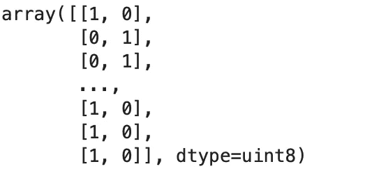

```
np.random.seed(0)
test_inds = np.append(np.random.choice((np.where(y==-1))[0], 250, replace=False), np.random.choice((np.where(y==1))[0], 250, replace=False))
train_inds = list(set(range(len(labels))) - set(test_inds))train_data = X[train_inds,]
train_labels = Y[train_inds]test_data = X[test_inds,]
test_labels = Y[test_inds]
```

***创建网络***

```
EMBEDDING_DIM = 200model = Sequential()
model.add(Embedding(10000, EMBEDDING_DIM, input_length=X.shape[1]))
model.add(SpatialDropout1D(0.2))
model.add(LSTM(250, dropout=0.2,return_sequences=True))
model.add(LSTM(100, dropout=0.2, recurrent_dropout=0.2))
model.add(Dense(2, activation='softmax'))
model.compile(loss='categorical_crossentropy', optimizer='adam', metrics=['accuracy'])
print(model.summary())
```

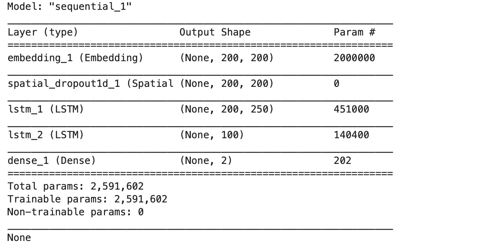

```
epochs = 2
batch_size = 40model.fit(train_data, train_labels, 
          epochs=epochs, 
          batch_size=batch_size,
          validation_split=0.1)
```

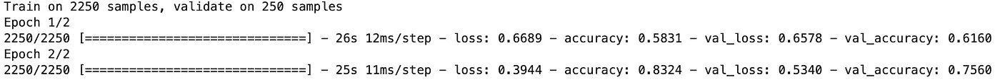

```
loss, acc = model.evaluate(test_data, test_labels, verbose=2,
                            batch_size=batch_size)print(f"loss: {loss}")
print(f"Validation accuracy: {acc}")
```

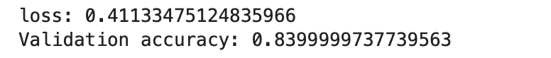

在迄今为止训练的所有模型中，LSTM 表现最好，即逻辑斯蒂、朴素贝叶斯和 SVM。现在让我们看看它如何预测一个测试用例

```
outcome_labels = ['Negative', 'Positive']new = ["**I would not recommend this movie**"]

seq = tokenizer.texts_to_sequences(new)
padded = sequence.pad_sequences(seq, maxlen=max_review_length)
pred = model.predict(padded)
print("Probability distribution: ", pred)
print("Is this a Positive or Negative review? ")
print(outcome_labels[np.argmax(pred)])
```

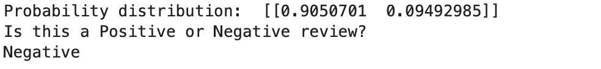

```
new = ["**It is not what i am looking for**"]
```

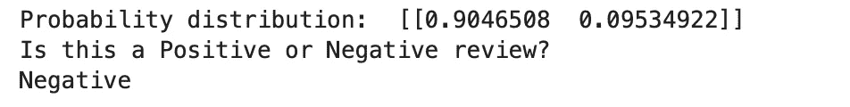

```
new = ["**This isn't what i am looking for**"]
```

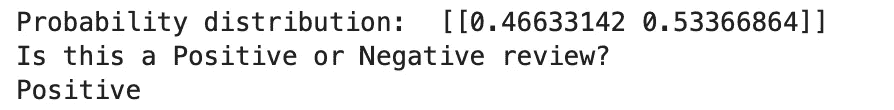

在这种情况下，否定和肯定的概率差别不大。LSTM 模型认为这是积极的。

```
new = ["**I wouldn't recommend this movie**"]
```

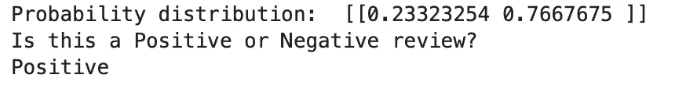

这个评论也是如此。因此，这意味着我们的模型不能区分`n't`和`not`。一个可能的解决方案是，在预处理步骤中，不是删除所有标点符号，而是将所有的`n't`简写改为`not`。这可以简单地用 Python 中的`re`模块来完成。您可以亲自查看一下，看看我们的模型预测是如何改进的。

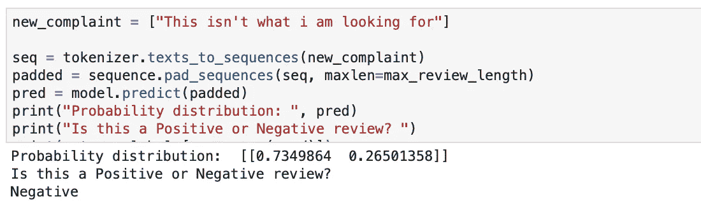

将“不”改为“不”并再次运行模型后

就是这样！希望你们喜欢这篇文章，并从中有所收获。如果你有任何问题，请在下面的评论区写下来。谢谢你的阅读。祝您愉快，保重！！


照片由[卢卡斯·克拉拉](https://unsplash.com/@lux17?utm_source=medium&utm_medium=referral)在 [Unsplash](https://unsplash.com?utm_source=medium&utm_medium=referral) 上拍摄