# NLP:使用深度学习检测短信(文本)数据中的垃圾邮件

> 原文：<https://towardsdatascience.com/nlp-spam-detection-in-sms-text-data-using-deep-learning-b8632db85cc8?source=collection_archive---------3----------------------->

## TensorFlow2 中使用密集网络、LSTM 和双 LSTM 架构的文本分类

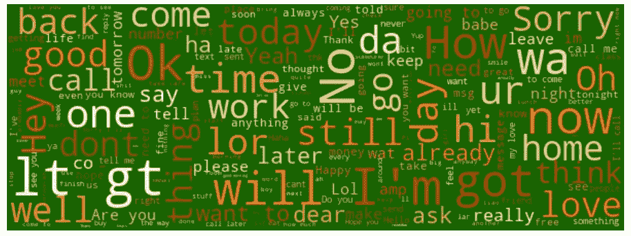

作者图片

# 介绍

如今，互联网和社交媒体已经成为获取信息最快捷、最简单的方式。在这个时代，评论、意见、反馈、信息和建议已经成为重要的信息来源。由于技术的进步，我们现在能够使用各种自然语言处理(NLP)技术从这些数据中提取有意义的信息。NLP 是人工智能(AI)的一个分支，它利用计算机和人类自然语言输出有价值的信息。NLP 通常用于文本分类任务，例如垃圾邮件检测和情感分析、文本生成、语言翻译和文档分类。

# 目的

本文的目的是了解我们如何使用 TensorFlow2 来构建垃圾短信检测模型。特别地，我们将建立一个二进制分类模型来检测一个文本消息是否是垃圾邮件。此外，我们将了解如何在 TensorFlow2 Keras API 中实现密集的长短期记忆(LSTM)和双向 LSTM(双 LSTM)深度学习模型。

# 数据

短信(文本)数据是从 [UCI 数据集](https://archive.ics.uci.edu/ml/datasets/SMS+Spam+Collection)下载的。它包含 5，574 条手机短信。这些数据是为了手机垃圾邮件研究而收集的，已经被贴上了垃圾邮件或垃圾邮件的标签。

# 方法

我们将使用密集文本分类器，LSTM 和双 LSTM，并比较这些方法在性能方面，并选择一个最终的。

以下是我们在本文中涉及的部分:

*   加载并浏览垃圾邮件数据
*   准备列车测试数据
*   使用上述三种方法训练垃圾邮件检测模型
*   比较并选择最终型号
*   使用最终训练的分类器对新消息进行分类

让我们开始吧，首先确定 TensrFlow 的版本。

```
import tensorflow as tf
print(tf.__version__)
2.2.0
```

## **导入所需包**

将所有的导入放在代码的开头是一个很好的做法。

```
# import libraries for reading data, exploring and plotting
import numpy as np
import pandas as pd
import seaborn as sns
import matplotlib.pyplot as plt
from wordcloud import WordCloud, STOPWORDS, ImageColorGenerator
%matplotlib inline# library for train test split
from sklearn.model_selection import train_test_split# deep learning libraries for text pre-processing
import tensorflow as tf
from tensorflow.keras.preprocessing.text import Tokenizer
from tensorflow.keras.preprocessing.sequence import pad_sequences# Modeling 
from tensorflow.keras.callbacks import EarlyStopping
from tensorflow.keras.models import Sequential
from tensorflow.keras.layers import Embedding, GlobalAveragePooling1D, Dense, Dropout, LSTM, Bidirectional
```

## 加载并浏览垃圾邮件数据

数据可以从 [UCI 数据集](https://archive.ics.uci.edu/ml/datasets/SMS+Spam+Collection)下载并保存在本地文件夹中。文本文件(和一个完整的 Jupyter 笔记本)也在我的 [github](https://github.com/ShresthaSudip/SMS_Spam_Detection_DNN_LSTM_BiLSTM) 位置提供，因此可以使用下面的语法阅读。文本文件是一个制表符分隔的(\t)文件，因此，我们可以使用 pandas 来读取数据。我们还可以通过传递*名称*来提供列名，称之为标签和消息。

```
url = '[https://raw.githubusercontent.com/ShresthaSudip/SMS_Spam_Detection_DNN_LSTM_BiLSTM/master/SMSSpamCollection'](https://raw.githubusercontent.com/ShresthaSudip/SMS_Spam_Detection_DNN_LSTM_BiLSTM/master/SMSSpamCollection')
messages = pd.read_csv(url, sep ='\t',names=["label", "message"])
messages[:3] 
```

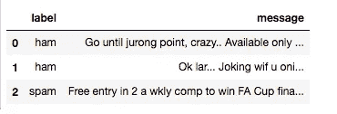

数据帧的前 3 行

让我们获得汇总统计数据并可视化数据。熊猫的 *describe()* 方法提供了一个汇总统计数据。例如，有 5，572 个标签和消息。有两个独特的标签标明“火腿”和“垃圾邮件”。我们还可以观察到，唯一消息(5，169)比总消息数(5，572)少，这表明有一些重复的消息。最上面的标签是“火腿”，数据中最上面的消息是“对不起，我稍后再打”。下面的*重复箭头*显示，有 403 条重复消息。

```
messages.describe()
```

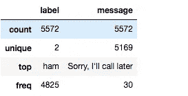

汇总统计数据

```
duplicatedRow = messages[messages.duplicated()]
print(duplicatedRow[:5])
```

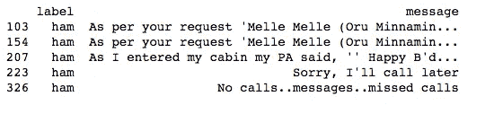

重复行

与 747 条垃圾消息相比，有 4，825 条 ham。这表示**不平衡的**数据，我们稍后会修复。最受欢迎的业余消息是“对不起，我稍后再打”，而最受欢迎的垃圾消息是“请打电话给我们的客户服务部……”，分别出现了 30 次和 4 次。

```
messages.groupby('label').describe().T
```

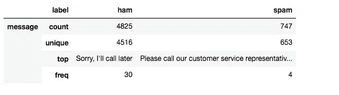

按标签(垃圾邮件)统计摘要

下面，我们通过创建一个 **WordCloud** 和一个**条形图**来进一步探索标签组的数据。首先，让我们为 ham 和 spam 消息创建一个单独的数据帧，并将其转换为 numpy 数组以生成 WordCloud。

```
# Get all the ham and spam emails
ham_msg = messages[messages.label =='ham']
spam_msg = messages[messages.label=='spam']# Create numpy list to visualize using wordcloud
ham_msg_text = " ".join(ham_msg.message.to_numpy().tolist())
spam_msg_text = " ".join(spam_msg.message.to_numpy().tolist())
```

为了使用 *WordCloud()* 进行可视化，我们提取了在垃圾邮件中最常见的单词，删除了无意义的停用词，如“the”、“a”、“is”等，并绘制了它。单词云将给定文本中最常用的单词可视化。

```
# wordcloud of ham messages
ham_msg_cloud = WordCloud(width =520, height =260, stopwords=STOPWORDS,max_font_size=50, background_color ="black", colormap='Blues').generate(ham_msg_text)
plt.figure(figsize=(16,10))
plt.imshow(ham_msg_cloud, interpolation='bilinear')
plt.axis('off') # turn off axis
plt.show()
```

下面的火腿消息 WordCloud 显示，“现在”、“工作”、“怎么样”、“还好”、“对不起”是火腿消息中最常出现的词。

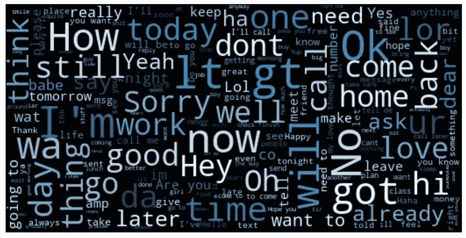

业余消息的单词库

下面的垃圾短信词云显示，“免费”、“通话”、“短信”、“认领”、“回复”是垃圾短信中最常出现的词。

```
# wordcloud of spam messages
spam_msg_cloud = WordCloud(width =520, height =260, stopwords=STOPWORDS,max_font_size=50, background_color ="black", colormap='Blues').generate(spam_msg_text)
plt.figure(figsize=(16,10))
plt.imshow(spam_msg_cloud, interpolation='bilinear')
plt.axis('off') # turn off axis
plt.show()
```


垃圾短信的文字云

现在，让我们进一步探讨不平衡的数据。下面的条形图显示了班级的不平衡。最常见的垃圾邮件(85%)多于垃圾邮件(15%)。

```
# we can observe imbalance data here 
plt.figure(figsize=(8,6))
sns.countplot(messages.label)
# Percentage of spam messages
(len(spam_msg)/len(ham_msg))*100 # 15.48%
```

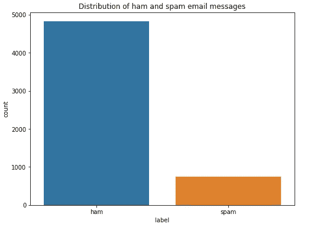

显示不平衡数据的条形图

有几种方法可以处理不平衡数据，例如

*   使用适当的评估指标
*   对训练集进行重采样:过采样/上采样或欠采样/下采样
*   集成不同重采样数据集

然而，对于我们的问题，我们使用下采样只是为了说明它是如何实现的。当然，您可以尝试其他技术并比较结果。

缩减采样是从多数类中随机删除一些观察值的过程，以便多数类和少数类中的数字相匹配。下面，我们对 ham 消息进行了缩减采样(多数类)。现在每个班有 747 条消息。

```
# one way to fix it is to downsample the ham msg
ham_msg_df = ham_msg.sample(n = len(spam_msg), random_state = 44)
spam_msg_df = spam_msg
print(ham_msg_df.shape, spam_msg_df.shape)(747, 2) (747, 2)
```

下图显示了在考虑不平衡数据后，不同消息类型之间的类似分布。

```
# Create a dataframe with these ham and spam msg
msg_df = ham_msg_df.append(spam_msg_df).reset_index(drop=True)
plt.figure(figsize=(8,6))
sns.countplot(msg_df.label)
plt.title('Distribution of ham and spam email messages (after downsampling)')
plt.xlabel('Message types')
```

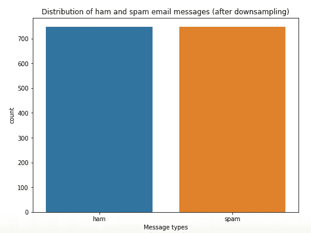

考虑不平衡数据后的条形图

此外，平均而言，ham 消息具有 73 个字的长度，而 spam 消息具有 138 个字。当我们稍后设置 *maxlen* 参数时，长度信息可能有用。

```
# Get length column for each text
msg_df['text_length'] = msg_df['message'].apply(len)#Calculate average length by label types
labels = msg_df.groupby('label').mean()
labels
```

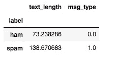

表中显示了垃圾邮件的文本长度

## 准备培训/测试数据和预处理文本

在探索和解决不平衡数据之后，接下来让我们将文本标签转换为数字，并将数据分成训练集和测试集。此外，将标签转换为 numpy 数组，以适应深度学习模型。80%的数据用于训练，20%用于测试。

```
# Map ham label as 0 and spam as 1
msg_df['msg_type']= msg_df['label'].map({'ham': 0, 'spam': 1})
msg_label = msg_df['msg_type'].values# Split data into train and test
train_msg, test_msg, train_labels, test_labels = train_test_split(msg_df['message'], msg_label, test_size=0.2, random_state=434)
```

现在，让我们使用文本预处理，包括标记化、排序和填充。

下图描述了文本预处理的流程示例以及预期输出。


关于使用 TensorFlow2 预处理文本数据的基本理解，请参考我之前的[文章](https://medium.com/@statistics.sudip/nlp-preparing-text-for-deep-learning-model-using-tensorflow2-461428138657)关于*预处理深度学习模型的数据。*

**标记化**

由于深度学习模型不理解文本，让我们将文本转换为数字表示。为此，第一步是标记化。TensorFlow Keras 的 Tokenizer API 将句子拆分成单词，并将这些单词编码成整数。 *Tokenizer()* 执行所有必需的预处理，例如

*   将符号化为单词或字符——这里我们在单词级别使用
*   num_words 表示唯一令牌的最大数量，因此我们可以过滤掉罕见的单词
*   过滤掉标点符号
*   将所有单词转换成小写
*   将所有单词转换为整数索引

首先，定义用于预处理的超参数。我们稍后将描述这些超参数。

```
# Defining pre-processing hyperparameters
max_len = 50 
trunc_type = "post" 
padding_type = "post" 
oov_tok = "<OOV>" 
vocab_size = 500
```

下面，我们用 *Tokenizer()* 对单词进行分词。

```
tokenizer = Tokenizer(num_words = vocab_size, char_level=False, oov_token = oov_tok)
tokenizer.fit_on_texts(train_msg)
```

Tokenizer 对象中使用的超级参数是:num_words 和 oov_token，char_level。

*   num_words:指示在训练和测试数据中要加载多少个唯一的单词。出于我们的目的，我们选择了 500 个单词(vocab_size)
*   oov_token:当它被使用时，词汇外的 token 将被添加到用于建立模型的语料库中的单词索引中。这用于在 text_to_sequence 调用期间替换词汇表之外的单词(不在我们的语料库中的单词)(见下文)。
*   char_level:如果为“真”,那么每个*字符*都将被视为一个令牌。我们将其设置为“假”，因此每个*字*将被视为一个令牌。

我们可以使用 *tokenizer.word_index* 得到 word_index。下面是 word_index 的快照。

```
# Get the word_index 
word_index = tokenizer.word_index
word_index
```

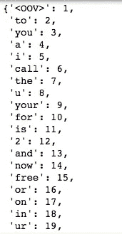

印刷单词索引的快照

```
# check how many words 
tot_words = len(word_index)
print('There are %s unique tokens in training data. ' % tot_words)There are 4169 unique tokens in training data.
```

**排序和填充**

在标记化之后，我们使用来自标记化器对象的 *texts_to_sequences()* 用数字序列表示每个句子。随后，我们使用 *pad_sequences()* 使得每个序列具有相同的长度。对训练和测试数据进行排序和填充。

```
# Sequencing and padding on training and testing 
training_sequences = tokenizer.texts_to_sequences(train_msg)
training_padded = pad_sequences (training_sequences, maxlen = max_len, padding = padding_type, truncating = trunc_type )testing_sequences = tokenizer.texts_to_sequences(test_msg)
testing_padded = pad_sequences(testing_sequences, maxlen = max_len,
padding = padding_type, truncating = trunc_type)
```

*   padding = 'pre '或' post(默认 pre)。通过使用 pre，我们在每个序列之前填充，通过使用 post，我们在每个序列之后填充。
*   maxlen =所有序列的最大长度。这里 max_len=50 因此，我们在一个句子中只使用 50 个单词。如果没有提供，默认情况下它将使用最长句子的最大长度。
*   truncating = 'pre '或' post '(默认为' pre ')。如果序列长度大于提供的 maxlen 值，则这些值将被截断为 maxlen。“pre”选项将在序列的开头截断，而“post”将在序列的结尾截断。

```
# Shape of train tensor
print('Shape of training tensor: ', training_padded.shape)
print('Shape of testing tensor: ', testing_padded.shape)Shape of training tensor:  (1195, 50)
Shape of testing tensor:  (299, 50)
```

在填充之前，第一个序列是 27 个字长，而第二个是 24 个字长。一旦应用了填充，两个序列的长度都是 50。

```
# Before padding
len(training_sequences[0]), len(training_sequences[1])Output:
(27, 24)# After padding
len(training_padded[0]), len(training_padded[1])Output:
(50, 50)
```

如下所示，填充序列的长度为 50。

```
print(training_padded[0])
```

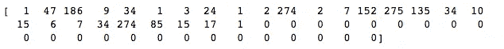

第一句的填充序列

## **密集垃圾邮件检测模型**

随着数据的加载和预处理，我们现在已经准备好使用神经网络架构对文本消息进行分类。让我们使用 LSTM 和双 LSTM 之后的密集架构来训练模型。

定义超参数:

```
vocab_size = 500 # As defined earlier
embeding_dim = 16
drop_value = 0.2 # dropout
n_dense = 24
```

下面是密集垃圾邮件检测模型的模型**架构。**

```
#Dense model architecture
model = Sequential()
model.add(Embedding(vocab_size, embeding_dim, input_length=max_len))
model.add(GlobalAveragePooling1D())
model.add(Dense(24, activation='relu'))
model.add(Dropout(drop_value))
model.add(Dense(1, activation='sigmoid'))
```

*   顺序调用 Keras 顺序模型，其中各层按顺序添加
*   第一层，即嵌入层，将每个单词映射到实数的 N 维向量。embeding _ dim 是这个向量的大小，在我们的例子中是 16。嵌入层表明具有相似意思的两个单词倾向于具有非常接近的向量。因为，嵌入层是我们模型网络中的第一个隐藏层，我们需要传递由 input_length (max_len =50)定义的输入层的形状。
*   池层有助于减少模型中的参数数量，从而有助于避免过度拟合。我们在这里使用了平均池，并将层转换为一维。
*   接下来，我们使用一个带有激活函数“relu”的密集层，然后是一个用于避免过拟合的下降层和一个带有 sigmoid 激活函数的最终输出层。由于只有两类(垃圾邮件或业余爱好者)要分类，我们只使用一个输出神经元。sigmoid 激活函数输出 0 到 1 之间的概率。

这里，我们使用一个相当浅的神经网络结构，然而，你可以通过增加更多的层使它更密集。

下面的 *model.summary()* 提供了层、形状和每个层中使用的参数数量。在嵌入层，8000 参数来自 500 个单词(vocab_size)，每个单词有一个 16 维的单词向量空间(500×16 = 8000)*。*嵌入层通过*globalaveragepool1d*并进入具有 16 形状的密集层(由于沿 16 嵌入维度的平均汇集)。我们为密集隐藏层选择了 24 个神经元。密集层中的 24 个神经元中的每一个都从来自 GlobalAveragePooling1D 层的 16 个值中的每一个获得输入，总共 384 (16 X 24)个权重和 24 个偏差(每 24 个神经元一个)。因此，总参数是 408。最后，输出层有 24 个权重(每个神经元一个)和一个偏置项，总共产生 25 个参数。

```
model.summary()
```

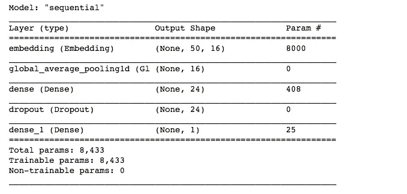

密集模型体系结构的模型概述

**编译密集模型**

让我们编译我们的密集垃圾邮件分类器模型。由于二进制输出，我们使用“二进制交叉熵”作为损失函数，“adam”作为优化器，其利用动量来避免局部最小值，而“准确性”作为模型性能的度量。

```
model.compile(loss='binary_crossentropy',optimizer='adam' ,metrics=['accuracy'])
```

**训练和评估密集模型**

接下来，让我们使用 *model.fit()* 参数来拟合我们的密集分类器。它使用填充的训练数据和训练标签来训练模型，并使用验证数据来进行验证。

*   epoch:学习算法在整个训练数据集中工作的次数。我们把它设置为 20。
*   回调:回调用于传递早期停止参数。early stopping(monitor = ' val _ loss '，patience=2)用于定义我们希望监控验证损失，如果验证损失在两个时期后没有改善，则停止模型训练。它有助于避免过度适应问题，并在学习者开始过度适应之前指示何时停止训练。如下面的历史结果所示，在时段 23 之后的 2 个时段(时段 24: 0.12 和时段 25: 0.13)中，验证损失连续增加(即，没有改善)，因此模型拟合已经在时段 26 处停止。
*   verbose =2:让打印每个时期的损失和准确性

```
# fitting a dense spam detector model
num_epochs = 30
early_stop = EarlyStopping(monitor='val_loss', patience=3)history = model.fit(training_padded, train_labels, epochs=num_epochs, validation_data=(testing_padded, test_labels),callbacks =[early_stop], verbose=2)
```

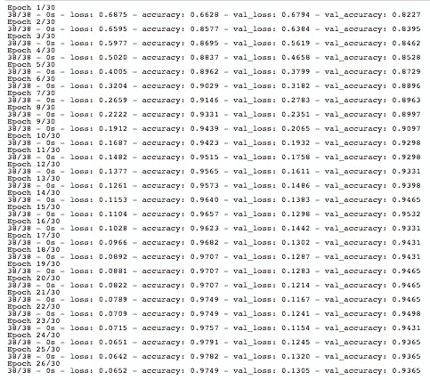

各时期的准确性和损失:密集分类器

模型得出，训练损失:0.07，训练准确率:97%，验证损失:0.13，验证准确率:94%。

```
# Model performance on test data 
model.evaluate(testing_padded, test_labels)Output: loss: 0.13 - accuracy: 0.94
```

我们可以通过按时期数绘制损失和准确性来进一步可视化历史结果。

```
# Read as a dataframe 
metrics = pd.DataFrame(history.history)
# Rename column
metrics.rename(columns = {'loss': 'Training_Loss', 'accuracy': 'Training_Accuracy', 'val_loss': 'Validation_Loss', 'val_accuracy': 'Validation_Accuracy'}, inplace = True)def plot_graphs1(var1, var2, string):
    metrics[[var1, var2]].plot()
    plt.title('Training and Validation ' + string)
    plt.xlabel ('Number of epochs')
    plt.ylabel(string)
    plt.legend([var1, var2])
```

下图显示了训练和验证数据集的历元数损失。正如预期的那样，随着历元数的增加，损耗在减少。在大约 5 个时期之后，验证损失高于训练损失，并且随着时期的增加，差异更加明显。

```
plot_graphs1('Training_Loss', 'Validation_Loss', 'loss')
```

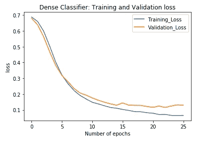

跟踪各时期的损失:密集分类器

下面的精度图显示，精度随着时间的推移而增加。正如预期的那样，该模型在训练集中的表现优于验证集。然而，如果模型在训练数据上表现得非常好，那么它在测试数据中的表现就更差，那么它是过度拟合的指示。在我们的模型中，我们没有看到过度拟合的重大问题。此外，我们已经通过前面使用的丢弃层和回调解决了过拟合问题。

```
plot_graphs1('Training_Accuracy', 'Validation_Accuracy', 'accuracy')
```

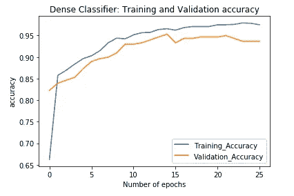

跟踪不同时期的准确性:密集分类器

## **长短期记忆(LSTM)模型**

下面，我们使用 LSTM 拟合垃圾邮件检测模型。下面是在 LSTM 使用的一些新的超级参数 *n_lstm* 和 *return_sequences* 。

*   n_lstm = 20 是 lstm 单元内隐藏层中的节点数
*   return_sequences=True 确保 LSTM 单元格返回一段时间内展开的 LSTM 单元格的所有输出。如果不使用该参数，LSTM 单元将简单地提供上一步中 LSTM 单元的输出。

以下是用于 LSTM 模型的超参数。

```
#LSTM hyperparameters
n_lstm = 20
drop_lstm =0.2
```

让我们定义一下 **LSTM 垃圾邮件检测模型架构**。在 Keras，通过简单地添加 LSTM，我们可以适应 LSTM 模型。

```
#LSTM Spam detection architecture
model1 = Sequential()
model1.add(Embedding(vocab_size, embeding_dim, input_length=max_len))
model1.add(LSTM(n_lstm, dropout=drop_lstm, return_sequences=True))
model1.add(LSTM(n_lstm, dropout=drop_lstm, return_sequences=True))
model1.add(Dense(1, activation='sigmoid'))
```

**编制 LSTM 模型**

```
model1.compile(loss = 'binary_crossentropy', optimizer = 'adam', metrics=['accuracy'])
```

**培训和评估 LSTM 模型**

训练和评估与我们对上面的密集模型所做的相同。

```
num_epochs = 30
early_stop = EarlyStopping(monitor='val_loss', patience=2)
history = model1.fit(training_padded, train_labels, epochs=num_epochs, validation_data=(testing_padded, test_labels),callbacks =[early_stop], verbose=2)
```

来自 LSTM 的验证损失和准确度分别为 0.31%和 91%。

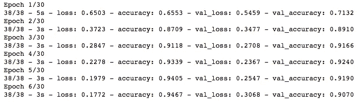

跨时代的准确性和损失:LSTM

```
# Create a dataframe
metrics = pd.DataFrame(history.history)# Rename column
metrics.rename(columns = {'loss': 'Training_Loss', 'accuracy': 'Training_Accuracy',
                         'val_loss': 'Validation_Loss', 'val_accuracy': 'Validation_Accuracy'}, inplace = True)
def plot_graphs1(var1, var2, string):
    metrics[[var1, var2]].plot()
    plt.title('LSTM Model: Training and Validation ' + string)
    plt.xlabel ('Number of epochs')
    plt.ylabel(string)
    plt.legend([var1, var2])plot_graphs1('Training_Loss', 'Validation_Loss', 'loss')
plot_graphs1('Training_Accuracy', 'Validation_Accuracy', 'accuracy')
```

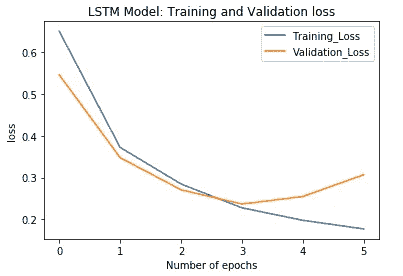

记录跨时代的损失:LSTM

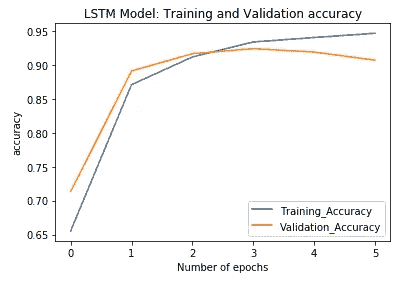

跟踪不同时代的准确性:LSTM

## 双向长短期记忆模型

与 LSTM 不同，双 LSTM 从文档中给定标记的前后学习模式。双 LSTM 在时间上向后和向前两个方向反向传播。因此，与 LSTM 相比，计算时间增加了。然而，在大多数情况下，双 LSTM 导致更好的准确性。

下面，我们可以看到**双向 LSTM 架构，**与 LSTM 的唯一区别是，我们使用*双向*包装器到 LSTM。

```
# Biderectional LSTM Spam detection architecture
model2 = Sequential()
model2.add(Embedding(vocab_size, embeding_dim, input_length=max_len))
model2.add(Bidirectional(LSTM(n_lstm, dropout=drop_lstm, return_sequences=True)))
model2.add(Dense(1, activation='sigmoid'))
```

**编译 BiLSTM 模型**

```
model2.compile(loss = 'binary_crossentropy', optimizer = 'adam', metrics=['accuracy'])
```

**培训和评估 BiLSTM 模型**

```
# Training
num_epochs = 30
early_stop = EarlyStopping(monitor='val_loss', patience=2)
history = model2.fit(training_padded, train_labels, epochs=num_epochs, 
                    validation_data=(testing_padded, test_labels),callbacks =[early_stop], verbose=2)
```

BiLSTM 的验证损失和准确度分别为 0.18 和 95%。

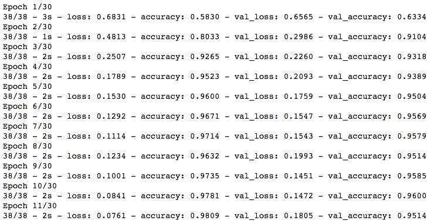

跨时代的准确性和损失:BiLSTM

```
# Create a dataframe
metrics = pd.DataFrame(history.history)# Rename column
metrics.rename(columns = {'loss': 'Training_Loss', 'accuracy': 'Training_Accuracy',
                         'val_loss': 'Validation_Loss', 'val_accuracy': 'Validation_Accuracy'}, inplace = True)
def plot_graphs1(var1, var2, string):
    metrics[[var1, var2]].plot()
    plt.title('BiLSTM Model: Training and Validation ' + string)
    plt.xlabel ('Number of epochs')
    plt.ylabel(string)
    plt.legend([var1, var2])# Plot
plot_graphs1('Training_Loss', 'Validation_Loss', 'loss')
plot_graphs1('Training_Accuracy', 'Validation_Accuracy', 'accuracy')
```

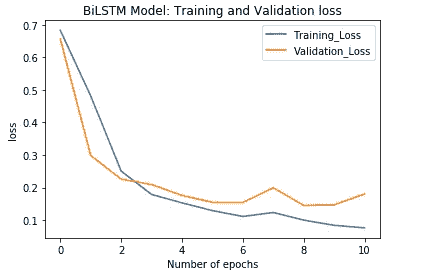

记录跨时代的损失

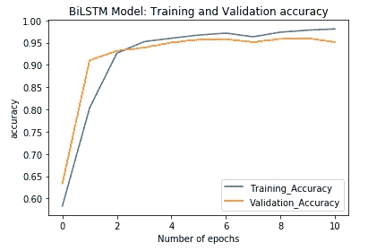

跟踪不同时期的准确性:BiLSTM

## 比较三种不同的型号，选择最后一种

所有密集、LSTM 和双 LSTM 模型在损失和准确性方面都是可比较的。这三个模型的验证损失分别为 0.13、0.31 和 0.18。验证准确率分别为 94%、91%和 95%。

其中，Dense 和 BiLSTM 的表现都优于 LSTM。基于损失、准确性和上面的图，我们选择密集架构作为用于分类垃圾邮件或 ham 的文本消息的最终模型。密集分类器具有简单的结构，并且在历元上的损失和精度比 BiLSTM 更稳定。

```
# Comparing three different models
print(f"Dense architecture loss and accuracy: {model.evaluate(testing_padded, test_labels)} " )
print(f"LSTM architecture loss and accuracy: {model1.evaluate(testing_padded, test_labels)} " )
print(f"Bi-LSTM architecture loss and accuracy: {model2.evaluate(testing_padded, test_labels)} " )
```

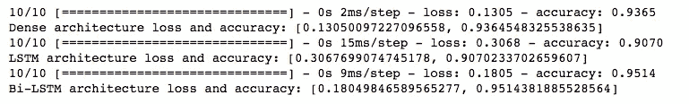

3 个模型的验证损失和准确性

## 预测新邮件中的垃圾邮件

**场景 1:使用我们数据中的原始文本:**

让我们评估我们的密集垃圾邮件检测模型如何根据原始数据中的文本预测/分类垃圾邮件或火腿。下面的第一条和第二条消息是垃圾邮件，而第三条是垃圾邮件。我们使用了之前在代码中创建的相同的标记器来将它们转换成序列。这确保了新单词将具有与训练集中相同的标记。标记化后，我们像前面一样使用填充，并提供与训练集中相同的维度。

```
# display long string 
pd.options.display.max_colwidth=100
messages[:3]
```

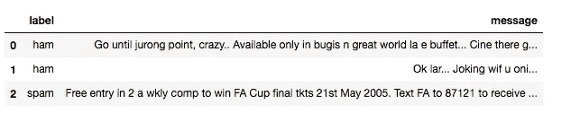

原始数据的前 3 个观察值

```
predict_msg = ["Go until jurong point, crazy.. Available only in bugis n great world la e buffet... Cine there got amore wat...",
          "Ok lar... Joking wif u oni...",
          "Free entry in 2 a wkly comp to win FA Cup final tkts 21st May 2005\. Text FA to 87121 to receive entry question(std txt rate)T&C's apply 08452810075over18's"]
```

*predict_spam* 函数定义如下。

```
# Defining prediction functiondef predict_spam(predict_msg):
    new_seq = tokenizer.texts_to_sequences(predict_msg)
    padded = pad_sequences(new_seq, maxlen =max_len,
                      padding = padding_type,
                      truncating=trunc_type)
    return (model.predict(padded))predict_spam(predict_msg)
```

如下所示，该模型正确地预测前两个句子不是垃圾邮件，而第三个句子是垃圾邮件。第三句有 99%的可能是垃圾邮件。

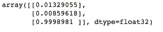

原始数据的预测结果

**场景 2:使用新创建的文本消息，看看模型如何对它们进行分类。**

下面，第一句更像是垃圾，而其余两句更像是火腿。

```
# The third one gives 0.99 indicating very high probabilty of spam
predict_msg = ["You are awarded a Nikon Digital Camera. Call now",
               "Call me",
          "What's up?"]
predict_spam(predict_msg)
```

我们的模型正确地将第一封邮件分类为垃圾邮件(94%的机会是垃圾邮件),其余的分类为垃圾邮件。

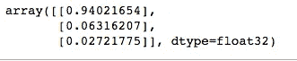

新短信的预测结果

# 摘要

我们使用来自 [UCI 数据集](https://archive.ics.uci.edu/ml/datasets/SMS+Spam+Collection)的文本消息，拟合深度学习模型，如密集架构、LSTM 和双 LSTM，并比较这些模型的准确性和验证集损失。最后，我们选择密集架构深度学习模型来将文本消息分类为垃圾邮件或 ham，并使用它来分类新的文本消息。本文概述了使用 TensorFlow2 Keras 使用不同的架构深度学习模型来解决 NLP 问题。

# 下一步/改进

接下来，我们可以探索更多的采样方法，如上采样、SMOTE、整体采样。我们还可以尝试使用不同的超参数，增加样本量，以进一步改善模型。

# 鸣谢！

我要感谢乔恩·克罗恩的书《深度学习图解》，感谢懒惰程序员公司的优秀课程《Tensorflow 2.0:深度学习和人工智能》，感谢何塞·波尔蒂利亚在 Udemy 上的精彩课程《完整的 Tensorflow 2 和 Keras 深度学习训练营》。

# 谢谢大家！

感谢大家的阅读，并请随时留下意见/建议。

# 快乐学习！！！