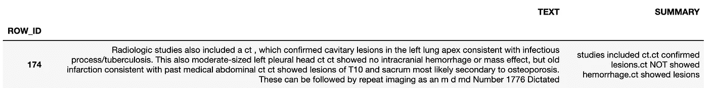
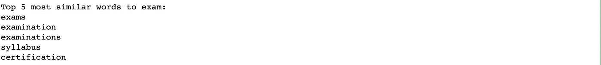
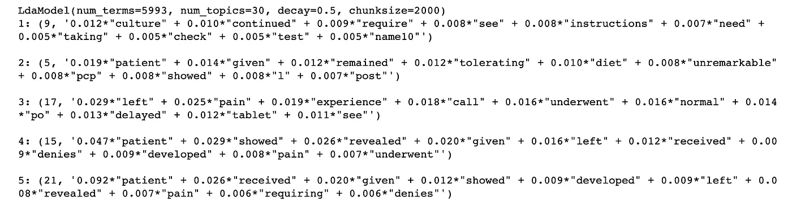
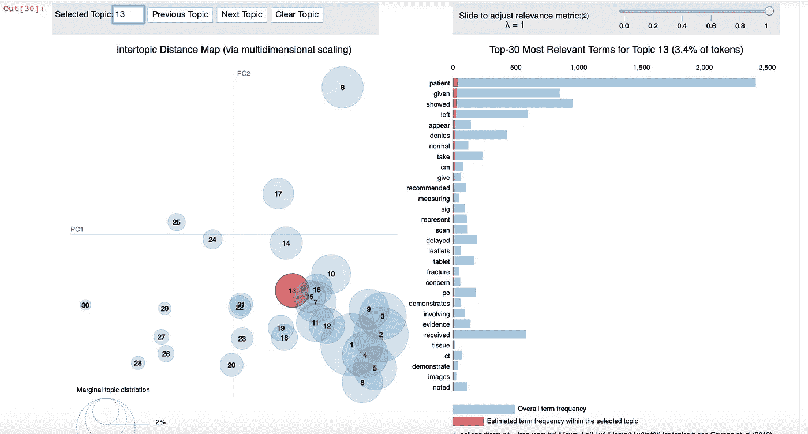
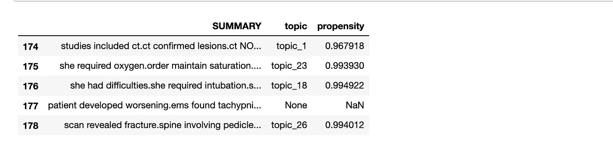
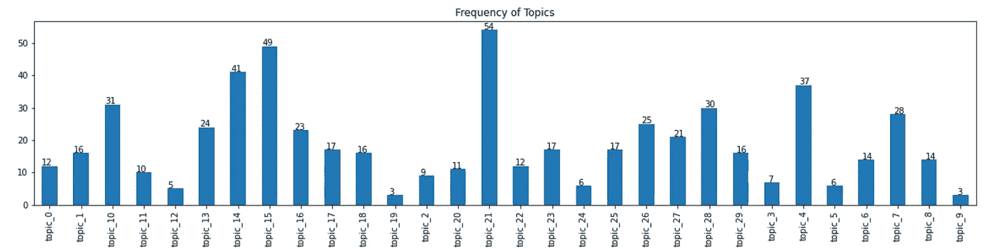

# 抽象主题建模

> 原文：<https://towardsdatascience.com/nlp-topic-modeling-to-identify-clusters-ca207244d04f?source=collection_archive---------37----------------------->

## 从长文本中引出主题

这是 4 部分文章的第 3 部分。到目前为止，我们一直在谈论:

1.  [预处理和清洗](https://medium.com/@tyagigaurika27/nlp-preprocessing-clinical-data-to-find-sections-461fdadbec77)
2.  [文本摘要](https://medium.com/@tyagigaurika27/text-summarization-for-clustering-documents-2e074da6437a)
3.  **使用潜在狄利克雷分配(LDA)的主题建模——我们在这里**
4.  [聚类](https://medium.com/@tyagigaurika27/identifying-relationships-in-clinical-text-nlp-clustering-929eb04b5942)

在本文中，我们将使用长文本文档 ***的摘要版本来查找构成每个文档*** 的主题。我们在主题建模之前对文本进行总结，因为在一些文档中可能会有额外的细节。然而，其他人可能只是抓住了要点。

***等等，但是为什么要模型题目呢？这到底是什么意思？***

> **主题建模**用于发现文档集合中出现的抽象“主题”。它是一个常用的文本挖掘工具，用于发现文本中隐藏的语义结构。


作者图片:原始文本文档

我们希望保持简洁明了的信息，以便识别每个长文档的主题。所以，我们把这段文字总结成这样:



图片 bu 作者:总结文字

# 主题建模

我们将不会做任何进一步的预处理，因为我们已经基本上预处理时，清理文本最初，只有短语在总结中。

和前面的章节一样，我们首先证明了总结是否可行。让我们看看集群是否可行。

```
from numpy import dot
from numpy.linalg import normexam = nlp.parser.vocab[u"exam"]# cosine similarity
cosine = lambda v1, v2: dot(v1, v2) / (norm(v1) * norm(v2))allWords = list({w for w in nlp.parser.vocab if w.has_vector and w.orth_.islower() and w.lower_ != "exam"})# sort by similarity to Exam
allWords.sort(key=lambda w: cosine(w.vector, exam.vector))
allWords.reverse()
print("Top 5 most similar words to exam:")
for word in allWords[:5]:   
    print(word.orth_)
```



哇！！！那么这是否意味着我们甚至可以找到文档之间的相似之处呢？是啊！！因此，我们有可能找到这些不同文档的集群！！！！

## 寻找主题的最佳数量

[潜在狄利克雷分配(LDA)](https://en.wikipedia.org/wiki/Latent_Dirichlet_allocation) 是文本文档的贝叶斯概率模型。它从未被观察的组中确定观察集。因此，解释了数据的相似部分。

> 观察是来自文档的单词。每个文档都是少量主题的组合。每个单词的出现都归因于文档的一个主题。

主题建模



你们中有多少人真正理解了上面部分发生的事情？如果你不知道，请告诉我，我很乐意再写一篇关于这本字典解释的文章！

我们能想象一下上面的话题吗？是的，我们可以。



作者图片:点击每个主题，了解它是如何由术语组成的

这表明话题是根据谈论的疾病/状况来分配的。太好了，让我们看看成绩单中的话题倾向。

当 LDA 找到上面的主题时，它本质上是试图在组中找到单词的出现。这确实意味着我们有一个与每个主题的每个图表相关联的概率分数。但是，我们并不是对它们都有信心。所以我们只提取 90%以上倾向的。

如果仔细观察，并不是所有的图表都有主题。这是因为该算法不符合我们的话题倾向性截止标准。



作者提供的图片:带有最终主题和主题倾向的图表注释(范围为 0–1)

让我们想象一下我们已经确定的图表的主题/集群和频率



作者图片:话题频率

# 结论

这里可以看到 *topic_21* 的图表最多。紧随其后的是 *topic_15* 和 *topic_14* 。

接下来，我们对这些文本文档进行聚类！

> 如果你想**自己尝试整个代码或跟随，请**到我在 GitHub 上发布的 jupyter 笔记本:[https://GitHub . com/gaurikatyagi/Natural-Language-Processing/blob/master/introduction % 20 to % 20 NLP-Clustering % 20 text . ipynb](https://github.com/gaurikatyagi/Natural-Language-Processing/blob/master/Introdution%20to%20NLP-Clustering%20Text.ipynb)