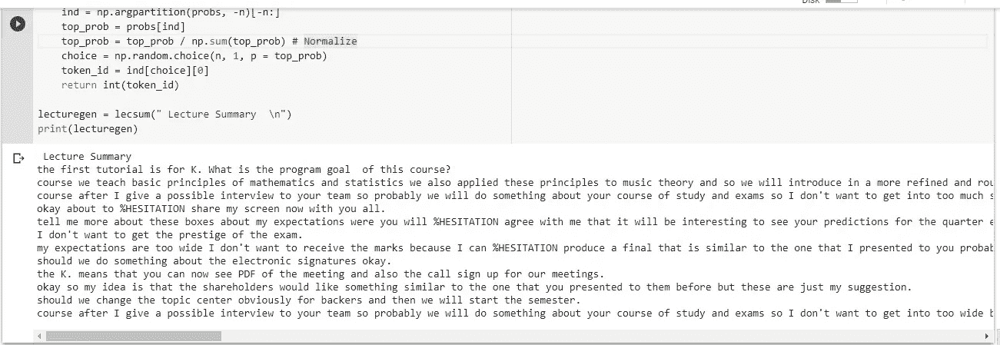

# 沃森和 GPT 的 NLP 视频摘要

> 原文：<https://towardsdatascience.com/nlp-video-summarization-with-watson-and-gpt-4d4db219b599?source=collection_archive---------49----------------------->

## Siri，请观看我长达 1 小时的大学讲座视频，并为我做一个总结

阿玛多·洛雷罗在 [Unsplash](https://unsplash.com/photos/0sBTrm726C8?utm_source=unsplash&utm_medium=referral&utm_content=creditCopyText) 上的照片

在这个项目中，我探索了 GPT2(它有大约 10 亿个参数)的能力，并且只能想象最近的 GPT3(它有 1750 亿个参数)的能力！，可以写从软件代码到艺术诗。在这个项目中，我使用了 Silvia Salini 教授(米兰大学数据科学负责人)的大学讲座-统计学习入门课程，并让 AI (IBM WATSON)观看了整个讲座并为我写下它，然后我训练了 GPT 2 模型，因此它可以将沃森写的 500 行文本总结为 10 行。

*   我使用 IBM Watson 是因为它可以让你免费使用 500 分钟的语音到文本，而不需要输入任何信用卡信息，不像 Google Cloud 和 Azure。
*   在 GPT2 模型中，我保持了低概率和高词汇使用率，因此 GPT2 不会从自身制造任何新信息，从而使讲座摘要完全错误
*   我只通过一次讲座来训练模型，从而创建了一个原型，但是为了更好地学习模型和词汇，您可以尝试特定主题的多次讲座。

**1 将讲座转换成音频文件**

**2 让沃森观看讲座并学习**

IBM Watson 基于文件持续时间和大小对免费用户的语音转文本文件有限制，所以我把 1 小时的演讲音频文件分成 6 个不同的音频文件。

Watson API 凭证可以从 cloud.ibm.com 的演讲文本资源中获得

让沃森听完我制作的所有 6 段音频，并将其写入文本，
我选择了第一个对准确性最有信心的选项。

将结果写入文本文件，并将所有音频的结果合并到一个名为 lecture.txt 的文本文件中

**3 GPT 2 模型调优**

GPT 2 是一个因果文本生成，来自开放人工智能的预训练模型，用于预测。

> GPT-2 生成合成文本样本，以响应用任意输入启动的模型。这个模型就像变色龙一样——它适应条件文本的风格和内容。这使得用户可以根据他们选择的主题生成真实且连贯的续篇—[https://openai.com/blog/better-language-models/](https://openai.com/blog/better-language-models/)

**4 讲座摘要生成**

# **结果**

虽然 GPT2 模型的能力令人印象深刻，但我们仍然不能依赖 GPT2 的确凿事实，尽管我发现它更准确，更省时，例如，当你在 NLP 上投资的资源较少时，像 GPT2 或罗伯塔这样的预训练模型显然会比一个人做单词嵌入和训练一周的 NLP 模型工作得更好，所以，GPT 2 是一个不错的开始，或者是引入像聊天机器人这样的实验项目， 或者会说话的网站，但是对于更专业的使用，好的资源需要根据自己的需要花在定制的 NLP 模型上。

关于完整的 jupyter 笔记本和代码，你可以在 github.com——[https://github . com/Alexa Mann/NLP-Video-summarying-with-Watson-and-GPT](https://github.com/Alexamannn/NLP-Video-Summarization-with-Watson-and-GPT)上查看我的知识库