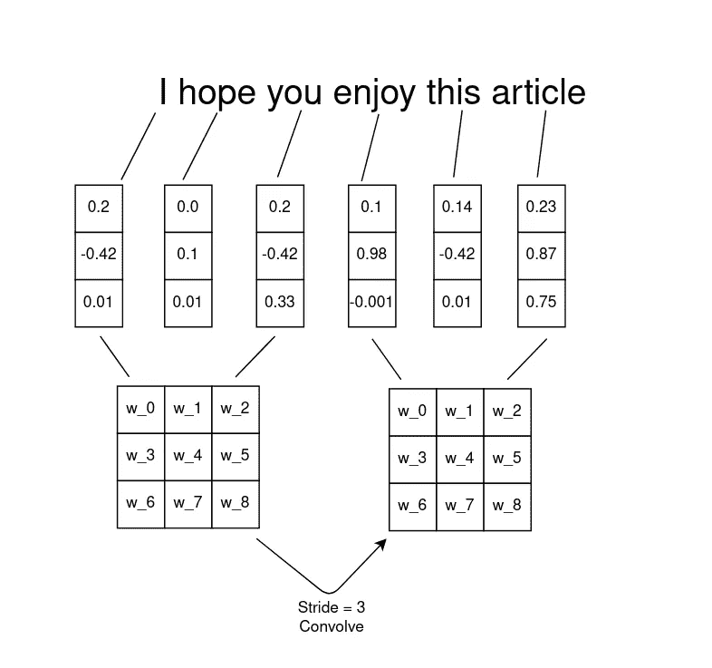
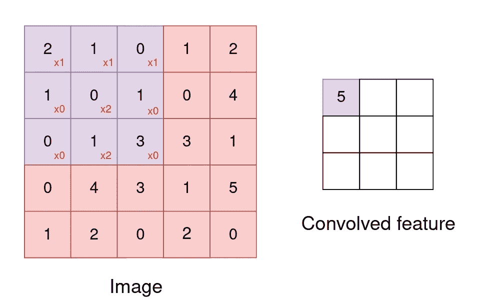
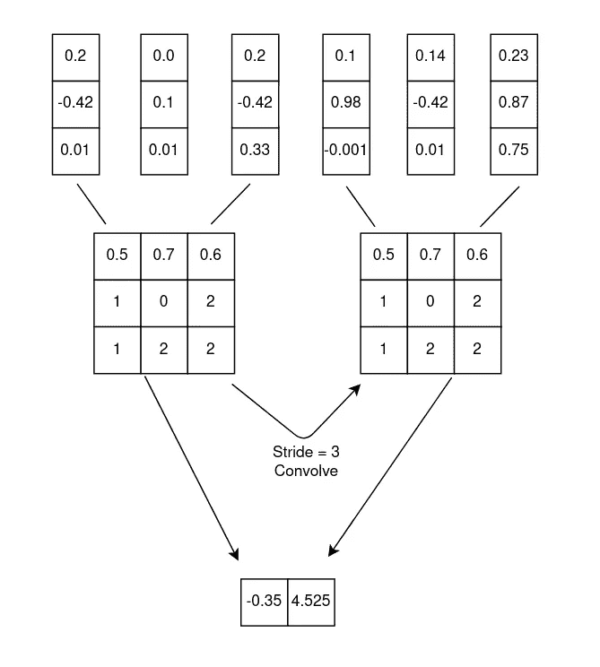
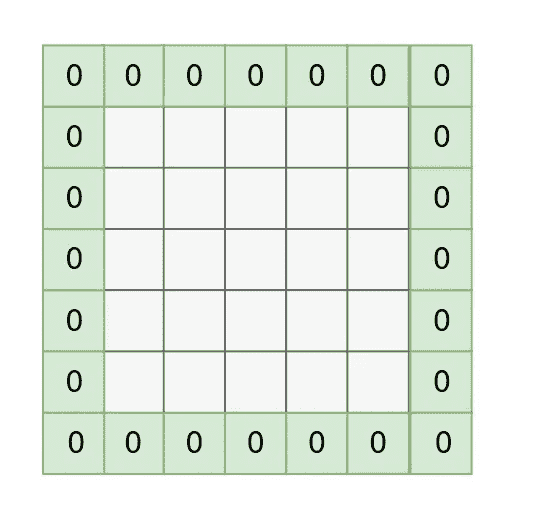
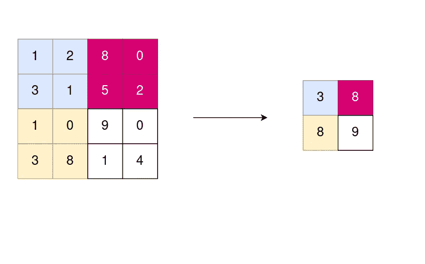

# 带 CNN 的 NLP

> 原文：<https://towardsdatascience.com/nlp-with-cnns-a6aa743bdc1e?source=collection_archive---------8----------------------->

## 一步一步的解释，以及该架构的 Keras 实现。


[https://en.wikipedia.org/wiki/Convolutional_neural_network](https://en.wikipedia.org/wiki/Convolutional_neural_network)

卷积神经网络(CNN)是图像处理和图像识别中最广泛使用的深度学习架构。鉴于他们在视觉领域的至高无上，尝试在机器学习的不同领域实现是很自然的。在本文中，我将尝试从自然语言处理的角度解释有关 CNN 的重要术语，还将提供一个简短的 Keras 实现和代码解释。

滑动或卷积预定数据窗口的概念是 CNN 如此命名背后的核心思想。这个概念的一个例子如下。



作者图片

这里首先要注意的是将每个单词(记号)表示为三维单词向量的方法。然后，一个 3×3 的权重矩阵在句子中水平滑动一步(也称为步幅),一次捕获三个单词。这个权重矩阵被称为过滤器；每个滤波器也由一个激活函数组成，类似于前馈神经网络中使用的那些。由于一些数学性质，激活函数 ReLU(校正线性单元)主要用于细胞神经网络和深度神经网络。回到图像分类，这些滤波器背后的一般直觉是，每个滤波器可以检测图像的不同特征，滤波器越深，就越有可能捕捉到更复杂的细节，例如，Convnet 中的第一批滤波器将检测边缘和线条等简单特征，但最后面的特征可能能够检测某些动物类型。所有这些都是在没有对任何过滤器进行硬编码的情况下完成的。反向传播将确保从数据中学习这些滤波器的权重。
下一个重要步骤是计算输出(卷积特征)。例如，下面我们将考虑一个 5*5 的图像和一个 3*3 的过滤器(在处理 CNN 时，您将主要使用正方形矩阵)。当每个过滤器在数据窗口上滑动一个步长时，通过对元素乘法求和来计算输出图层，每个像素乘以其在过滤器中的相应权重。以下示例说明了如何计算输出图层中的第一个像元；图像中的红色数字代表过滤器中的权重。



作者图片

计算如下:(1∫2)+(1∫1)+(1∫0)+(0∫1)+(2∫0)+(0∫1)+(0∫0)+(2∫1)+(0∫4)= 5

具有激活功能的 python 代码应该是:

z0 = max(sum(x * w)，0)

在 2D 滤波器的情况下，可以使用以下公式计算输出层的大小:

*(N-F)/S +1*

N =图像的大小，F =滤波器的大小，S =步幅(在我们的例子中为 1)

当应用于文本时，您将使用在一维窗口中水平滑动 3 步的过滤器:



作者图片

## **填充**

最后两个示例产生的输出大小小于输入的大小。也不难想象过滤器不完全适合给定数量幻灯片的矩阵的情况。为了应对这些复杂情况，可以通过两种方式使用衬垫:

1.  用零向量填充外部边缘(零填充)
2.  忽略不适合过滤器的矩阵部分(有效填充)



作者图片

## **统筹**

池化相当于 CNN 中的降维。中心思想是，我们必须将输出层划分为子部分，并计算最能代表输出的值。之所以如此有效，是因为它有助于算法学习数据的高阶表示，同时减少参数的数量。联营的类型:

1.  总和池
2.  最大池化
3.  平均池

以下是最大池的一个示例:



作者图片

## 全连接层

末端的全连接层接收来自先前池化和卷积层的输入，然后执行分类任务。在我们的例子中，我们将把 300 个单词的表征窗口分类为 1-积极情绪。0-负面情绪。全连接层中的最后一个神经元将 250 个神经元的加权平均值作为 sigmoid 函数(返回(0，1)之间的值)

## Keras 实施

在这一节中，我们将尽量保持代码对于 NLP 用例的通用性。为了简单起见，我们将不深入数据预处理的细节，但是一般的过程是对数据进行标记化和矢量化。在我们的示例中，使用了 word2vec 嵌入，每个标记表示为一个 300 维的单词向量。我们的数据也被填充，每个句子包含 400 个标记，长句在 400 个标记后被删除，而短句用零填充。每个句子的最终尺寸是 300*400。然后我们把数据分成 x_train 和 x _ test 我们不会在这个项目中使用验证数据集。现在我们已经准备好数据，我们可以定义一些超参数。

```
##hyper parameters
batch_size = 32
embedding_dims = 300 #Length of the token vectors
filters = 250 #number of filters in your Convnet
kernel_size = 3 # a window size of 3 tokens
hidden_dims = 250 #number of neurons at the normal feedforward NN
epochs = 2
```

现在我们可以开始使用 Keras 库构建模型了。

```
model = Sequential()
model.add(Conv1D(filters,kernel_size,padding = 'valid' , activation = 'relu',strides = 1 , input_shape = (maxlen,embedding_dims)))
```

这里我们知道填充是有效的，这意味着我们不会保持输入的大小，得到的卷积矩阵的大小将是 100*1。在两个窗口中取最大值的最大池层。

```
model.add(GlobalMaxPooling1D())
#GlobalMaxPooling1D(n) default = 2.
```

然后，我们以 0.2 的丢失率添加完全连接的层(我们用它来应对过度拟合)。最后，输出神经元将基于 sigmoid 激活函数触发。Keras 会把低于 0.5 的归为 0，高于 0.5 的归为 1

```
model.add(Dense(hidden_dims))
model.add(Dropout(0.2))
model.add(Activation('relu'))
model.add(Dense(1))
model.add(Activation('sigmoid'))
```

最后一步是编译和拟合模型。

```
model.compile(loss = 'binary_crossentropy',optimizer = 'adam', metrics = ['accuracy'])
model.fit(x_train,y_train,batch_size = batch_size,epochs = epochs , validation_data = (x_test,y_test))
```

现在你可以坐下来看你的模型训练了。我们能够使用斯坦福大学 60%的训练数据达到 90%的准确率。你可以在本书的第 7 章找到更多细节:自然语言处理在行动。

## 摘要

1.  在自然语言处理中，细胞神经网络可以用于不同的分类任务。
2.  卷积是在更大的输入数据上滑动的窗口，重点是输入矩阵的子集。
3.  在正确的维度上获取数据对于任何学习算法都是极其重要的。