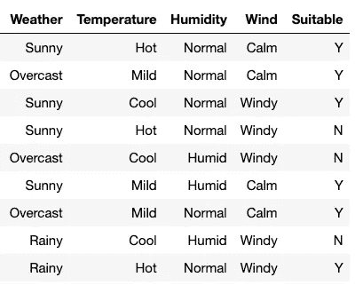
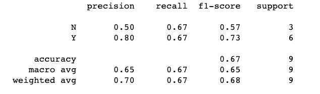
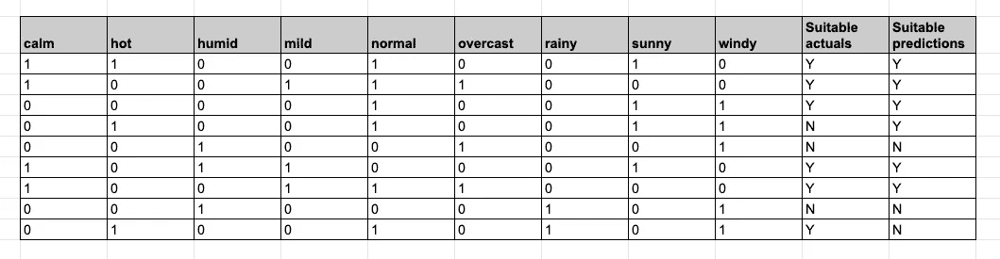
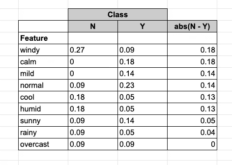
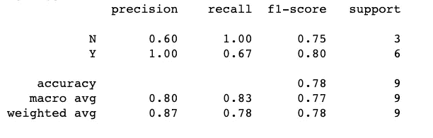
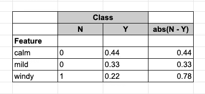
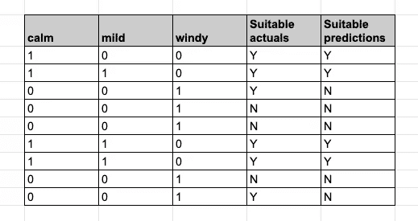

# 使用朴素贝叶斯似然的特征选择的文本分类

> 原文：<https://towardsdatascience.com/nlp-with-naive-bayes-feature-selection-in-python-15c4d327aad5?source=collection_archive---------34----------------------->

## 使用 Python 和一个小型说明性数据集的教程

在本文中，我将讨论如何使用朴素贝叶斯似然法来确定重要的特征，即 P(feature | class)。

假设我们有一个文本分类任务，作为第一步，我们将把单词标记化和词条化成特征。接下来的问题是，在分类任务中，哪些特征具有最强的预测能力。

为了简单起见，我们将考虑这个人工玩具天气数据集，其中的特征包括九个与天气相关的英语术语，因变量使用一些未指定的标准来指示天气是否“适合”。

因为这只是一个说明性的研究，所以我不想分成训练集和测试集。对全部特征集运行朴素贝叶斯分类会得到以下结果:

接下来，计算要素可能性 p(要素|类)得出:

在这里，我按照两个类之间可能性的绝对差异进行排序。你可以看到,*多风*的特征最能说明问题:在不适宜的天气(0.27)发生的频率是适宜天气(0.09)的三倍。*无风*和*温和*特征具有高度预测性，仅在合适的天气中被提及。而特征*多云*根本没有预测能力，在合适和不合适的天气中同样可能发生。

接下来，我将重新运行仅具有前三个特征的朴素贝叶斯分类:*多风*、*平静* & *温和*:

你可以看到准确率提高了 11 个百分点。

另请注意，重要的是，由于我们将特征集从九个减少到三个，朴素贝叶斯分类器使用的特征可能性也发生了变化:

实际值与预测值的比较:

总之，基于条件似然概率区分能力的特征选择可以提高查准率和查全率。

当然，数据集非常简单，结果可能会有所不同。在我的下一篇博文中，我将尝试将这种方法应用于更大的 tweets 语料库。

# Python 代码

我现在将强调实现的一些特性。完整的 Python 代码在这里:[https://github . com/benlaird/tweet _ 情操/blob/master/feature _ selection . py](https://github.com/benlaird/tweet_sentiment/blob/master/feature_selection.py)

函数*compute _ relative _ freq _ df*使用相对频率计算可能性:

内置 Python 函数 SelectKBest 调用的可调用函数:

我使用的管道: