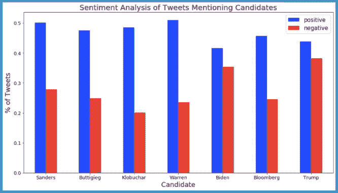
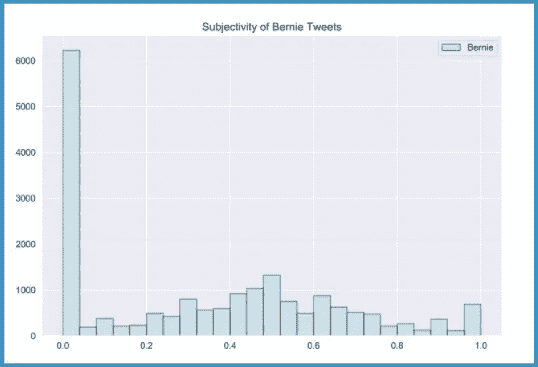
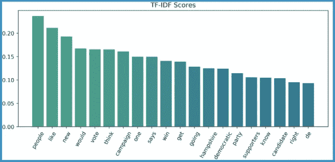
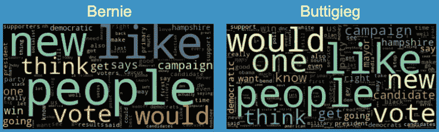
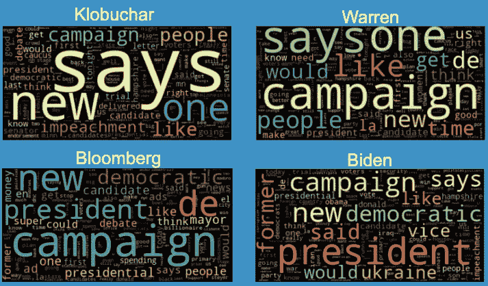

# #原色

> 原文：<https://towardsdatascience.com/nlprimaries-1a97c61b223c?source=collection_archive---------90----------------------->

## **使用自然语言处理分析提及 2020 年民主党总统候选人的推文**


[自由股](https://unsplash.com/@freestocks?utm_source=unsplash&utm_medium=referral&utm_content=creditCopyText)在 [Unsplash](https://unsplash.com/s/photos/twitter?utm_source=unsplash&utm_medium=referral&utm_content=creditCopyText) 上的照片

*** ***该分析在二月中旬进行***

虽然今年早些时候民主党初选激烈激烈，但我和我的合作伙伴 [Julia](https://medium.com/@juliaychong) 认为，在我们的数据科学训练营期间，对政治推特进行自然语言处理(NLP)项目是一个好主意。由于 Twitter 是一个非常受欢迎的新闻和人们分享观点的论坛，我们想看看我们是否可以根据 Twitter 的活动发现关于这场比赛将如何进行的任何见解。

我们是这样做的:

# 数据

为了获得推文，我们使用了一个名为 [**Twint**](https://github.com/twintproject/twint) 的高级 Twitter 抓取工具，它允许您在不使用 Twitter API 的情况下抓取推文。为了避免明显的偏见，我们专注于*提到*候选人的推文，而不是候选人自己写的推文*。*

1.  每条推特只包含一个候选人的名字和/或推特账号
2.  使用来自*验证过的账户的推文，只使用*来限制推文的数量，因为推文太多了
3.  从推文中移除了*链接*和*图片*，并使用 [**语言检测**](https://pypi.org/project/langdetect/) 移除了*非英语*

# 情感分析

为了运行情感分析——从文本中提取感觉/情感——我们使用了 [**VADER 情感分析**](http://VADER) (价感知词典和情感推理机)。正如其文档所述，VADER 是“一个词汇和基于规则的情绪分析工具，专门适应社交媒体中表达的情绪。”

1.  获得每位候选人推文的正面、负面、中性和复合得分:

```
# Create sentiment analysis functions analyzer = SentimentIntensityAnalyzer()def positive_sentiment(row):
    scores = analyzer.polarity_scores(row['tweet'])
    positive_sentiment = scores['pos']
    return positive_sentimentdef neutral_sentiment(row):
    scores = analyzer.polarity_scores(row['tweet'])
    neutral_sentiment = scores['neu']
    return neutral_sentimentdef negative_sentiment(row):
    scores = analyzer.polarity_scores(row['tweet'])
    negative_sentiment = scores['neg']
    return negative_sentimentdef compound_sentiment(row):
    scores = analyzer.polarity_scores(row['tweet'])
    compound_sentiment = scores['compound']
    return compound_sentiment
```

2.获得每个候选人在每个类别中的平均极性得分

3.根据哪个分数更高，将每条推文标记为正面或负面

4.为每位候选人创建了一个包含正面和负面推文平均数量的字典，用于可视化:



(将特朗普总统纳入分析进行比较)

我们看到，总体而言，大多数关于每位候选人的推文都被认为是“积极的”，围绕更具争议性的候选人的“消极”情绪有所上升。

# 主观性分析

对于我们的主观性分析——提取个人意见/观点/信念——我们求助于 [**TextBlob**](https://textblob.readthedocs.io/en/dev/quickstart.html) ，这是一个用于处理文本数据的 Python 库。“TextBlob”提供了一个一致的 API，用于处理常见的自然语言。

1.  获得每条推文的情感
2.  使用 [**正则表达式**](https://docs.python.org/3/library/re.html) 捕获浮点值，然后将字符串转换为浮点值



*主观性是在[0.0，1.0]范围内的浮动，其中 0.0 非常客观，1.0 非常主观*

正如我们所看到的，大多数关于伯尼·桑德斯的推文似乎都非常*客观*，而其余的主观性得分呈正态分布。

# TF–IDF

[**TF–IDF**](https://en.wikipedia.org/wiki/Tf%E2%80%93idf)(词频–逆文档频率)，在这种情况下，反映了一个词在整个推文中对一条推文有多重要。“TF–IDF 值随着一个词在[Tweet]中出现的次数成比例增加，并被包含该词的[Tweet 集合]中的[Tweet]数量抵消。”对于我们的 TF–IDF 分析，我们使用 Scikit-Learn 的 [**特征提取**](https://scikit-learn.org/stable/modules/feature_extraction.html) 方法。

1.  [**将**](https://nlp.stanford.edu/IR-book/html/htmledition/tokenization-1.html)[**符号化**](https://nlp.stanford.edu/IR-book/html/htmledition/stemming-and-lemmatization-1.html) 所有的 Tweets 使用 [**NLTK**](https://www.nltk.org/) 函数，并将所有的符号小写
2.  删除了 NLTK 的 [**停用词**](https://www.geeksforgeeks.org/removing-stop-words-nltk-python/) 列表中的词
3.  将我们的推文集合转换为令牌计数矩阵
4.  使用 TfidfVectorizer()、TfidfTransformer()、CountVectorizer()、fit_transform()和 fit()函数获得每个候选人推文的 TF–IDF 向量



通过 TF–IDF 分析，我们可以深入了解我们收集的推文中的重要词汇。

# 单词云

单词云是很好的可视化工具，可以看到候选人的每条推文中哪些单词出现的频率最高。我们利用 NLTK 的 [**FreqDist()**](http://www.nltk.org/api/nltk.html?highlight=freqdist) 函数来制作我们的单词云:

```
word_freqdist = FreqDist(biden_bank)
most_common_biden = word_freqdist.most_common(100)
biden_common_df = pd.DataFrame(most_common_biden, columns=['word', 'count'])
biden_common_df.set_index('word').to_dict()
biden_common_df = pd.DataFrame({biden_common_df['word']:biden_common_df['count']}) # Create the Word Cloud:from wordcloud import WordCloudwordcloud = WordCloud(colormap='Spectral').generate_from_frequencies(biden_dictionary)  # Display the generated image w/ Matplotlib:plt.figure(figsize=(10,10), facecolor='k')
plt.imshow(wordcloud, interpolation='bilinear')
plt.axis("off")
plt.tight_layout(pad=0)
```

这个词在“云端”出现得越大，它在推特上的使用频率就越高:



与 TF–IDF 类似，我们从每位候选人的推文中反复出现的词语中获得了洞察力。

# 基于 LDA 的主题建模

[**LDA**](https://en.wikipedia.org/wiki/Latent_Dirichlet_allocation) 或潜在的狄利克雷分配，根据潜在的、未被观察到的相似主题来分离推文中的标记，以帮助用户解释它们。对于我们的 LDA，我们使用了 [**pyLDAvis**](https://pyldavis.readthedocs.io/en/latest/readme.html) ，这是一个用于主题建模可视化的 Python 库。

1.  创建了一个候选人所有推文的列表，并删除了给定和选择的停用词
2.  对 Tweets 运行 CountVectorizer()和 TfidfVectorizer()函数，然后运行 LatentDirichletAllocation()函数
3.  尝试使用 TF 或 TF–IDF 创建七个不同主题的主题模型(民主党初选候选人各一个，特朗普总统一个):

每个泡泡代表一个不同的主题，由算法决定

总体而言，提到候选人的推文都非常相似，因此很难区分彼此。Twitter 经常是一个非常两极分化的平台，意见从光谱的两端传达，可能导致整体中立。朱莉娅和我觉得，将这一分析与 2016 年总统选举期间大约同一时间的推文进行比较，或者建立一个分类模型，试图区分候选人的推文，这将是有趣的未来工作。然而，就目前而言，看看提到拜登和特朗普的推文可能会很有趣，因为他们是 2020 年总统大选的最后两个人。

## 如果你有兴趣看我们项目的完整代码，请查看我的 GitHub！