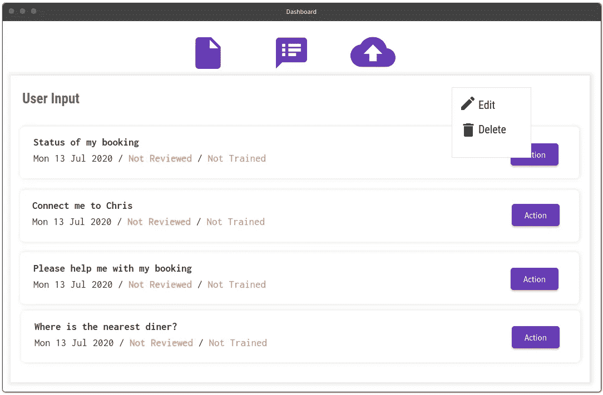
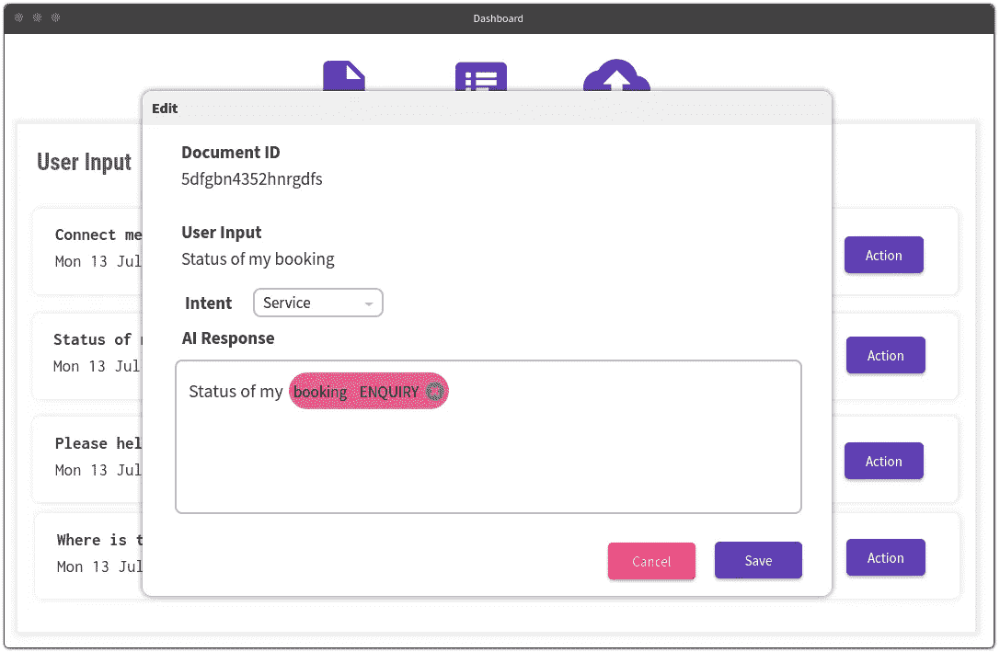

# 你的 B2B 人工智能项目没有足够的数据？

> 原文：<https://towardsdatascience.com/no-adequate-data-for-your-b2b-ai-project-5e05a40fb4c8?source=collection_archive---------43----------------------->

## 别担心，这种方法可能会让你留住你的客户。

艾米丽·莫特在 [Unsplash](https://unsplash.com/s/photos/data?utm_source=unsplash&utm_medium=referral&utm_content=creditCopyText) 上的照片

人工智能现在比以往任何时候都更受科技行业的青睐。你会发现全球各地涌现出新的创业公司，试图利用炒作赚钱，有时他们在人们中间制造更多的混乱，他们将人工智能描绘成某种将永远改变你生活的超人机器。真的是这样吗？

技术上来说是的，但不是这些人说的那样。人工智能是真实的，并且会一直存在。它将增强人类的能力，重新定义人机交互，这已经在发生了。

但是不久的将来会怎样呢？嗯，我觉得这将是智能自动化，我们已经可以看到趋势朝着有利于它的方向转变。

越来越多的公司正在采用更智能的工作方法，并走上全面数字化转型的道路。现在是从事人工智能和人工智能的创业公司和小公司向更大的客户群提供专业知识和知识的时候了，以帮助他们实现数字化转型。说起来容易做起来难，对吧？

构建生产就绪的机器学习(ML)或深度学习(DL)应用程序在许多方面都具有挑战性。需要考虑的事情太多了，以至于你经常会得到一个训练很差的模型，或者你有一个 ML 后端，这对于响应时间来说是一个灾难。

但这是否意味着你正在解决的问题太复杂了，或者不能用统计学习工具来解决？

嗯，也许吧，但在做出任何结论和失去一个潜在客户之前，看看我们帮助客户理解他们的人工智能项目的范围的策略，并告诉他们我们可以提供什么样的附加值。也许它可以帮助你根据你公司的投资组合设计你自己的方法。

照片由[普里西拉·杜·普里兹](https://unsplash.com/@priscilladupreez?utm_source=unsplash&utm_medium=referral&utm_content=creditCopyText)在 [Unsplash](https://unsplash.com/s/photos/talk?utm_source=unsplash&utm_medium=referral&utm_content=creditCopyText) 拍摄

与任何人工智能或人工智能项目一样，成功或失败在很大程度上取决于学习机(LM)可用的数据。我们经常会遇到各种规模的公司，要么拥有大量非结构化数据，要么根本没有数据。

后者更具挑战性，因为没有数据或数据非常少，我们无法理解问题的规模，开发一个好的人工智能模型变得很困难，因为我们可能无法为现实世界的突发事件准备模型。

如果你觉得用例没有什么开创性的东西，很容易走开，但是如果用例看起来很酷，如果你决定处理它，你可能会发现一些东西，但是数据是垃圾，那该怎么办？

我学到的是，缺乏数据不应该成为你放弃它的理由。

> 我们采用了一些方法来帮助我们的客户利用人工智能的能力来转变他们的工作流程。一个叫做反馈学习或迭代学习的简洁的小概念是这个的关键。这一步更关注正确的数据采集，而不是模型的完善。

它帮助客户提前接触人工智能技术，并帮助他们以正确的方式教育自己如何定位这项技术。这种方法也可以用于大量非结构化数据的情况，这些数据只能由领域专家进行注释。

例如，如果您有一个数据集，其中包含一组定义人们贷款资格的属性。只有来自银行领域的专家才能确定定义一个人是否合格的属性的正确组合。这种见解决定了数据的质量和基于数据训练的模型的能力。

这种洞察力在大多数时候可能会从数据集中消失，因为现实生活与 Kaggle 数据集相去甚远。那么在这种情况下你会怎么做呢？

> 反馈学习到救援！！！

正如我提到的，反馈学习的主要目的是从客户端获取正确的数据集，模型改进是次要的。反馈学习有一些关键要素。

交互式仪表板是拼图的主要部分。它让用户/客户/数据操作员能够快速与我们的后端进行交互，以进行数据注释、模型训练、版本控制模型、管理部署、查看数据集等。

数据列表屏幕(图片由 Vysakh S Mohan 提供)

数据注释编辑器(图片由 Vysakh S Mohan 提供)

上图显示了智能 IVR 的反馈学习仪表板。该模型的目的是基于从语音到文本模型转录的文本来学习意图和实体。

该应用程序的主要挑战是良好数据集的可用性，而可用的数据是非结构化的。客户需求决定了需要一个高度可扩展和可移植的学习后端，该后端可以迁移到不同的服务提供商，以满足不同用户群的需求。

这意味着模型必须动态地学习识别各种意图和实体，这使得我们很难考虑所有可能的场景。

除此之外，该模型还需要轻量级和超快的响应时间，因为它将在 IVR 之后运行，那里的呼叫流量将非常高，我们不希望该模型在工作流中造成任何延迟。

我们最初是通过查阅现有的数据开始的。根据客户的观点，我们确定了构建基线模型所需的意图和实体。一旦构建了模型并确定了超参数，我们就交付了具有端到端能力的仪表板来构建数据集、对其进行注释、训练模型等。人工智能后端被集成到 IVR 系统中。这通常是我们的 alpha 版本。

现在，无论何时来电，转录的文本都可以被发送到人工智能后端以获得预测，在那里模型试图从句子中提取意图和实体。

该信息被记录到数据库中，并且可以由客户端操作员查看。如果他在人工智能解析的输出中发现错误，他可以编辑并发送它来重新训练模型。操作员可以根据用例添加/删除意图和实体。

最终，随着时间的推移，我们会获得一个良好的基线数据集来构建一个合适的人工智能模型。这将作为我们的生产测试版发布。

上面的例子很基本，但是你也可以扩展到许多其他的用例。我们还没有在计算机视觉问题上进行尝试，但对于自然语言处理(NLP)、预测建模、时间序列等用例，我们已经用这种方法取得了相当大的成功。

是的，它确实有其局限性。例如，超参数调整就是其中之一。由于模型训练是由非人工智能专家通过仪表板迭代完成的，因此正确的模型训练和基准测试可能是不可能的。此外，根据数据类型和注释方案，可能会出现过拟合或欠拟合的情况。

那么真正的目的是什么呢？这个练习的真正目的是建立适当的带注释的数据，以防你的客户想要用 AI 自动化他的工作流，但是缺少适当的数据或者可用的数据太零碎。

这也有助于他们了解人工智能如何帮助他们实现数字化转型路线图。

这种方法是一年前由我们孵化的，在它的帮助下，我们已经成功地交付了 NLP、预测建模等多个人工智能项目。一家领先的制药公司、欧盟的一家食品配送服务公司、美国的一家电信公司是我们的一些主要客户，他们从上述方法中受益匪浅。

希望这能启发你制定更新的方法来扩展和帮助你的客户用人工智能的力量无缝地转变他们的工作流程。