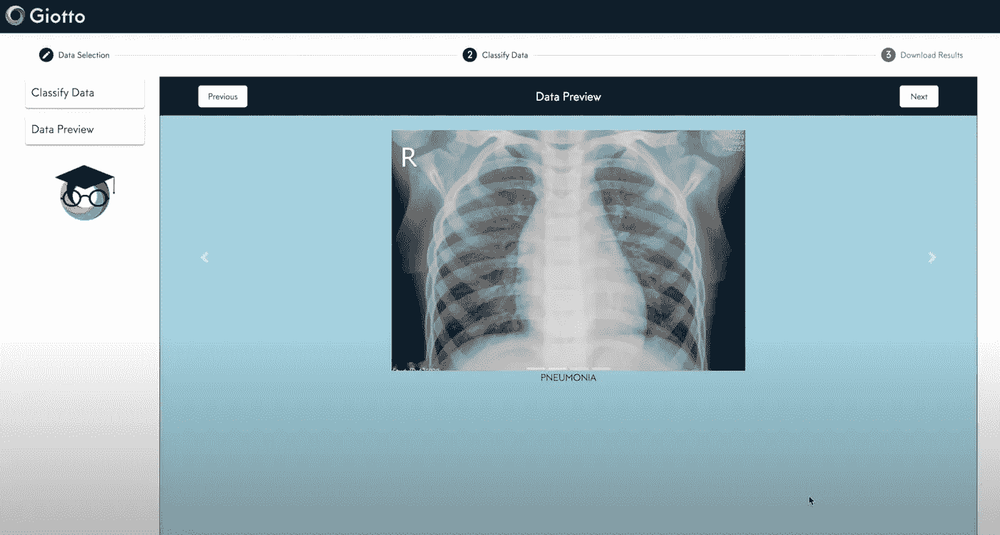
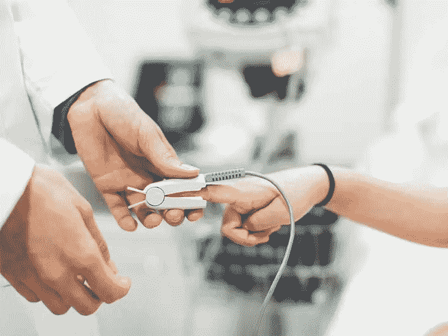
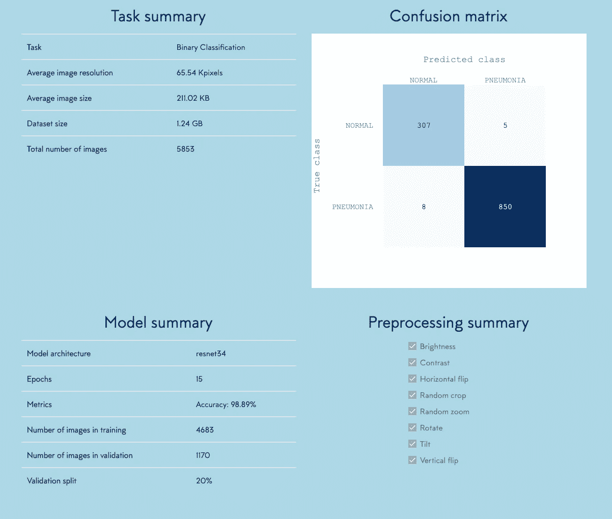

# 用于小儿肺炎检测的无代码人工智能

> 原文：<https://towardsdatascience.com/no-code-ai-for-pediatric-pneumonia-detection-1641f9c89f31?source=collection_archive---------61----------------------->

## 使用胸部 X 射线图像创建并公开部署 98%准确的图像分类模型。

> 由弗朗切斯科·帕尔马和厄恩·纪勤撰写

> 小儿肺炎是 5 岁以下儿童的主要杀手，每年有超过 800，000 人死亡。世卫组织报告称，大多数儿童临床肺炎病例发生在东南亚和撒哈拉以南非洲等地区。

尽管肺炎导致的儿童死亡大多发生在发展中国家，但在发达国家，仍有大量与肺炎相关的医疗相关费用。

肺炎导致的死亡人数超过了疟疾、脑膜炎、营养不良和艾滋病的总和。

**细菌和病毒病原体**是肺炎的主要原因(Mcluckie，2009)，但需要非常不同的管理形式。细菌性肺炎需要紧急转诊和**立即使用抗生素治疗**，而病毒性肺炎则接受支持性治疗。因此，**准确及时的诊断至关重要**。诊断的一个关键方法是使用放射数据，因为胸部 X 射线是常规获得的，以确定这些症状的原因，并有助于区分不同类型的肺炎。然而，**图像的快速放射学解释并不总是可用的**，特别是在儿童肺炎最流行且死亡率最高的低资源环境中。

在本文中，**我们创建并部署了一个人工智能模型**，以 98.89% 的准确率从胸部 x 光图像中自动识别肺炎。所有的开发都不需要写一行代码，也不需要专家的监督。如果给系统数百张看不见的图像，分析它们只需要不到一秒钟的时间。

我们部署的可以用来分类看不见的图像的网络应用程序可以在这里找到:[**https://cloud.giotto.ai/ic/pneumonia**](https://cloud.giotto.ai/ic/pneumonia)

**密码**:肺炎

Web 应用程序显示

# 当前的检测方法和局限性

除了 X 射线和血液检测，还有多种方法用于检测儿童肺炎，但它们往往缺乏同样的准确性和可靠性，或者对于这种类型的疾病来说过于先进。其中包括:

*   **痰培养**:通过测试从肺部咳出并进入口腔的粘液来识别感染(通常很难从幼儿身上收集到这些样本)
*   **脉搏血氧仪**:测量血液中的含氧量
*   **胸部 CT 扫描**:使用胸部结构的图像(很少进行)
*   **支气管镜检查**:用于观察肺部气道内部的分析(也很少使用)
*   **胸膜腔液体培养**:从胸膜腔(肺和胸壁之间的区域)抽取液体样本进行测试

脉搏血氧仪使用光和光电探测器来测量远离心脏的身体最深处(通常是手指或脚趾)的血氧含量。

在医疗基础设施相对较差的国家，诊断通常依赖于非常基本的方法，如呼吸率(高呼吸率通常被标记为肺炎的潜在迹象)，或呼吸时胸腔内的视觉迹象(当他们吸气时，他们的下胸部可能会收缩或收缩，健康人的胸部在吸气时会膨胀)。

> 由于该地区缺乏强大的医疗基础设施，并且缺乏 x 光或血液检测的效率和准确性，这些方法经常被使用。

即使在有基础设施的地方，**医学专家也不总是能够及时提供准确的评估**，这正是自动化系统派上用场的地方。

# 直观、易用:使用 Giotto 对 X 射线进行分类

人工智能的美妙之处在于它可以**向该领域的专家学习**，使技术传播到可能无法接触到这些专业人员或复杂技术系统的社区，从而改善疾病的诊断和治疗，并最终拯救无数生命。

我们的目标是创建和部署一个人工智能图像分类模型，该模型能够及时地以**高准确度从 X 射线中识别肺炎病例**。该系统需要对之前由训练有素的医疗专业人员标记的图像进行训练，但之后可以被任何有互联网接入的人用来对新图像进行分类**。**

****

**对于我们的任务，我们使用了**无代码 AI** 平台 **Giotto** ，在这里可以访问**。Giotto 的目标是在一个易于使用的平台上提供最先进的人工智能技术，所有人都可以访问，不需要编码技能。最重要的是，**网络应用部署功能**允许用户与每个人分享他们的模型。****

> ****有了 Giotto 等**无代码人工智能平台**，任何有互联网连接的人都可以**点击几下**就能访问最高效的深度学习基础设施和 GPU 计算系统，并将其用于自己的目的。****

****如果你想通过 [**一步一步的教程**](/step-by-step-flower-classification-without-coding-c652a7f73251) 来了解如何开始使用 Giotto，你可以看看我们之前的博客帖子，在那里我们使用包含各种花卉物种的大型数据集上的图像分类模型来探索这个平台。****

****在这项任务中，我们使用了来自一项名为*“通过基于图像的深度学习识别医疗诊断和可治疗疾病”*的研究的数据(Kermany 等人，2018 年)****

**** [## 通过基于图像的深度学习识别医疗诊断和可治疗的疾病

### 开发了一个采用迁移学习技术的人工智能系统

www.cell.com](https://www.cell.com/cell/fulltext/S0092-8674%2818%2930154-5) 

在本文中，该团队使用迁移学习模型来创建**生物医学成像中的通用、高效应用**。该数据集由 5，853 张人工标记的胸部 x 光图像组成，分为两类:**正常**和**描述肺炎**。数据可以通过[在这里](https://data.mendeley.com/datasets/rscbjbr9sj/2)访问。

为了训练我们的模型，我们在两个文件夹中上传了之前标记为的**图像，正常和描绘肺炎。Giotto 上的流程非常**直观**并且**不需要任何监督**。上传数据后，您将被要求选择**数据增强**技术。在模型选择阶段，您选择 **resNet 大小**和您希望用来训练它的**历元数**。**

> 如果您在过程中的任何步骤不确定，您可以随时使用“**使用 Giotto** 自动选择”选项。

# **模型性能，以及在医疗保健中使用人工智能的进一步含义**

医学成像的临床决策支持算法经常面临审查。让一台机器来诊断潜在威胁生命的疾病的想法仍然让许多人对其可靠性和可解释性产生怀疑。这就是为什么对我们来说，达到至少相当于(如果不是更好的话)医疗专业人员的精确度水平是很重要的。

一旦通过我们的机器学习模型，我们就能够在我们的测试数据集上实现 98.89% 的**准确性，使用 **resnet 34** 和少至 **15 个时期**。通过查看混淆矩阵，我们还观察到特异性、灵敏性和精确性都在 98%以上。这一结果类似于一个由训练有素的放射科医师组成的团队，他们拥有多年的放射影像解释经验。而且只需要 30 分钟**就可以教会我们的机器区分两组肺所需的细微差别。****

Giotto 在培训后展示的模型结果

鉴于胸部 X 射线成像的**复杂性(即相对大量的可变对象，包括与肺炎检测无关的肺外大面积)，结合我们的模型所达到的令人印象深刻的准确性，这表明类似的模型将能够使用**相对较小的数据集**从**日益复杂的图像**中学习，具有**高度的泛化能力**。**

这个迁移学习框架为生物医学图像的进一步探索和分析提供了一个有趣的机会，它使用一个直观的模型，世界各地的人，无论他们在该领域的背景和专业知识水平如何，都可以很容易地训练和部署(T21)。 **Giotto** 因此可用于使用类似的 X 射线成像数据集区分不同形式的肺炎，但也可用于其他基于胸部的呼吸问题的**进一步应用**，甚至不同且更复杂的医学成像应用。

# 结论

使用人工智能平台促进对医学图像的快速准确诊断有助于减少疾病对发达国家和发展中国家的影响。它不仅有助于减轻识别疾病的经济负担，还可以通过减少诊断疾病所需的时间来拯救无数的生命，从而确保更快地实施拯救生命的治疗。

降低与人力相关的成本，如训练有素的放射科医生和其他医疗专业人员，也可以让政府和非政府组织更多地投资于医疗基础设施，如 x 光机，以抗击疾病。

随着时间的推移，我们可以预测这种技术的成本会降低，可部署性会提高。将这一点与 Giotto 这样的平台的好处结合起来，可能确实会对全球数百万人产生**真正的积极影响**。****