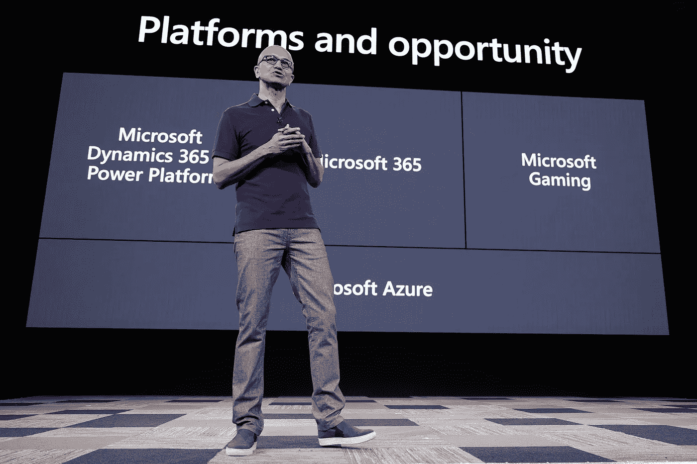
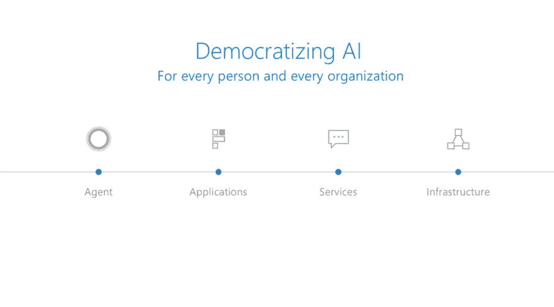
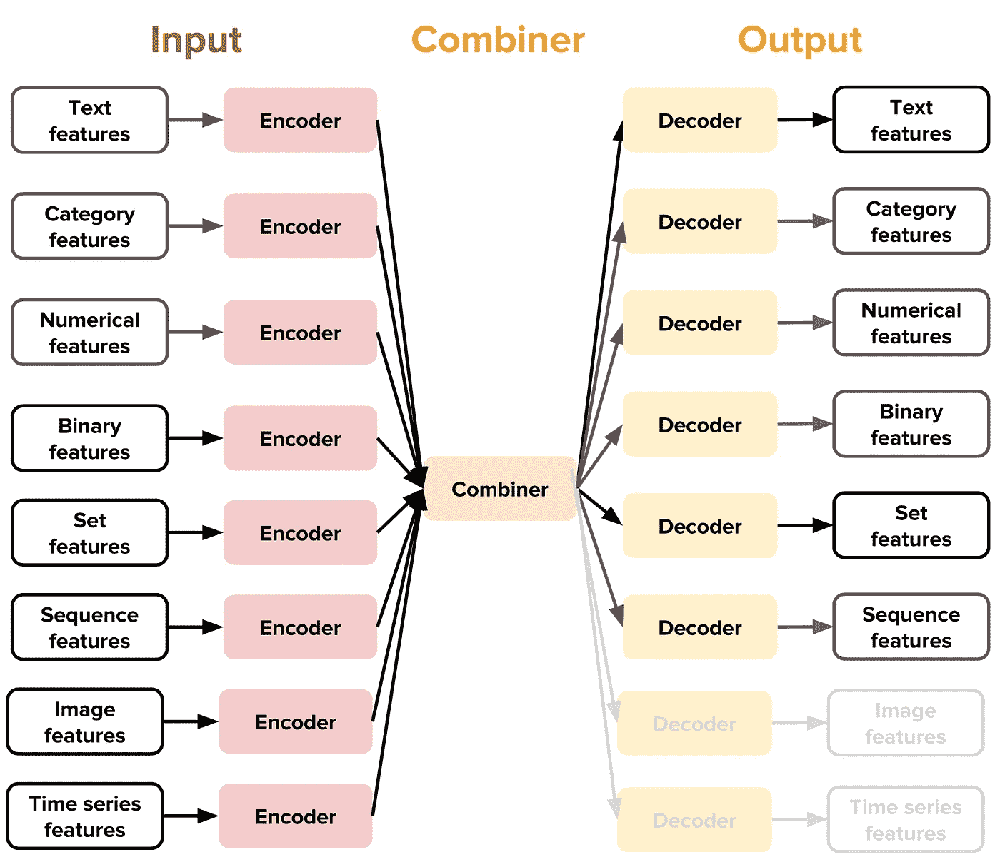
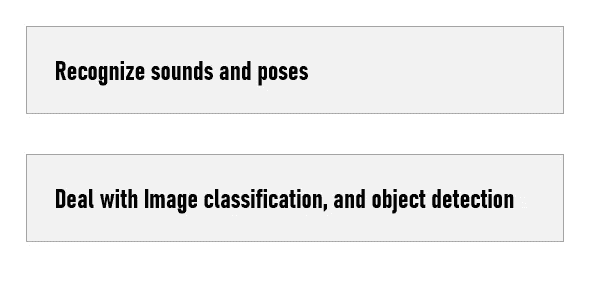
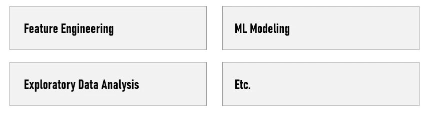

# 无代码/低代码人工智能:新的商业模式和数据科学家的未来

> 原文：<https://towardsdatascience.com/no-code-low-code-ai-new-business-models-and-future-of-data-scientists-a536beb8d9e3?source=collection_archive---------6----------------------->

## 无代码人工智能和低代码人工智能平台:正在使用哪些商业模式，数据科学家的未来是什么？

[来源](https://www.geekwire.com/2019/microsoft-adds-no-code-ai-blockchain-tools-power-platform/)

随着无代码/低代码人工智能平台的兴起，我想写这篇文章来解释这些解决方案背后的商业模式，以及它对数据科学家意味着什么。**数据科学家的工作会消失还是会进化？**

这些无代码的解决方案通常出现在引导平台中，为适合初学者和机器学习专业人员的全自动机器学习服务提供经典的拖放功能。

# 未开发市场

今天的现实是，机器学习专家很难找到，也很难留住。将你的企业转变为人工智能驱动的组织需要时间和投资。因此，一些公司几乎不可能采用人工智能。

就中型公司而言，对数据科学家的需求很高，因为公司缺乏构建可扩展人工智能解决方案所需的技术人才，但无法雇用开发人员的公司面临着被落在后面的风险。因此，越来越多的公司转向**机器学习的无代码平台**。

> **无代码平台:**这种平台可以让公司和没有或只有很少编程经验的商务人士构建应用程序，填补他们组织中的人才缺口。

## 帮助数据科学家的新工具

除了无代码人工智能解决方案，我们还看到了许多低代码解决方案。事实上，越来越多的工具有望让数据科学领域变得更加触手可及。显然，考虑到数据科学和机器学习管道的复杂性，这不是一项容易的任务。然而，包括 Keras、FastAI 和 Weka 在内的许多库和工具为我们提供了一个易于使用的高级界面和许多预构建的组件，从而使创建数据科学项目变得非常容易。

我意识到，一家公司通常很难吸引到高素质的机器学习专家，这种需求正在增长，很多时候超过了供应。这里的解决方案可能是提供对自动化机器学习工具的访问。

> **自动化机器学习:**将机器学习应用于现实世界问题的过程自动化的过程。AutoML 涵盖了从原始数据集到可部署的机器学习模型的完整管道。

这个想法是为了挑战传统的学习技术机器学习的方法，并引入更容易理解的机器学习。

# 新的商业模式

这些商业模式的潜在目标是利用没有数据科学团队或数据科学团队有限的中小型企业的规模和国际范围。

其次，通过构建低代码或无代码的人工智能平台，市场领导者将更容易将自己确立为中央人工智能生态系统，并进一步建立联盟来扩展用例及交付。

我还认为，大型科技公司投资于无代码人工智能模型构建平台，以加速**人工智能民主化**，并从品牌的角度建立这种顶级意识。此外，它有助于公司赢得将构建自己模型的程序员或最终用户。商业模式可能是创建一个相对容易使用但有限的平台，并为更好的人工智能相关服务(培训、协助等)提供高级订阅。).**从今天开始，我希望这些公司根据用户的请求数量来收费。**

[来源](https://news.microsoft.com/features/democratizing-ai/)

我相信大型科技公司实际上正在建立人工智能生态系统，拥有一个无代码人工智能平台可以帮助客户提供一种无需大脑的方法来保持在那个**品牌的生态系统和路线图**，这加强了客户**锁定效应**。此外，它增加了大型科技公司的用户覆盖范围，使他们能够不仅向数据科学家，而且向商业用户提供服务。

> 领先的人工智能公司正在开发各种平台战略，以加速大型企业的采用，但与此同时，中小企业市场仍未开发…

理想情况下，这些公司希望企业用户从小型概念验证开始，看看这项技术能做什么，并消除所有可能的进入壁垒。随着他们对技术和流程越来越熟悉，他们会对人工智能如何解决具体的业务问题有其他想法。

我相信现在人工智能领域实际上正在进行两场竞赛:

—一个拉拢程序员，一个拉拢用户。“问题是，有多少最终用户会真正构建他们自己的模型，即使它像使用拖放机制一样简单？”。

大型科技公司开源或开发无代码应用程序，因为他们希望成为其他人创新的基础。**通过这样做，他们将能够收集许多中小企业的所有最具战略意义的数据……**

开源和无代码人工智能平台服务于这些公司保持技术前沿的更广泛目标。从这个意义上说，他们没有放弃成功的钥匙:他们在为自己的未来铺路。

除了所有这些元素，无代码人工智能平台还使这些公司有可能通过顾问和计算资源提出额外的人工智能专业知识，快速高效地完成人工智能在线培训，从而进行一些交叉/向上销售。

另一个有趣的观点是，无/低代码人工智能平台可以帮助缺乏正式人工智能实践的初创公司快速构建更好的应用程序和解决方案，而无需任何编码经验，成本低得多。**这也是另一个非常有趣的市场……**

# 解决方法

数据科学家执行的许多任务都将实现自动化…事实上，每个主要的云供应商都在某种类型的 AutoML 计划或无/低代码 AI 平台上进行了大量投资。

如今，大多数解决方案都提供了**预建算法**和简单的工作流，具有拖放建模和可视化界面等功能，可以轻松连接数据，加快服务/应用的上市速度。

*   谷歌的 [Cloud AutoML](https://cloud.google.com/automl/?hl=es-419) 训练**无代码机器学习模型**，界面简单(基于拖放)。它侧重于人工视觉、自然语言和翻译。谷歌还提供 Teachable Machine，这是一个更简单的工具，专为对机器学习实验和理解其工作原理感兴趣的业余爱好者设计。Teachable Machine 只需一个摄像头(网络摄像头或手机摄像头)，就可以在浏览器中为**小型神经元网络提供信息，而不必将图像发送到服务器，并将其导出到网站、应用程序、物理机器等。**
*   **优步·艾**开发了路德维希(Ludwig)这款无代码深度学习工具箱，让深度学习更容易被非专家使用。非专家可以快速训练和测试深度学习模型，而不必编写代码。专家可以获得强大的基线来比较他们的模型，并拥有一个实验设置，通过执行标准的数据预处理和可视化来轻松测试新想法和分析模型。

[来源](https://eng.uber.com/introducing-ludwig/)

*   **百度的 EZDL** 是一个简单的拖放平台，允许用户设计和构建定制的机器学习模型。
*   显然，ai 是一家初创公司，用户只需用自然语言提问，就可以对数据进行复杂的预测和分析。

这些无代码的机器通常出现在引导平台中，提供经典的拖放功能到适合初学者和机器学习专业人员的全自动机器学习服务

我认为，这种不断增长的无/低代码人工智能解决方案将对应用平台供应商构成更大的竞争威胁，包括缺乏低代码战略的 MEAP 和 PaaS 提供商。

## 通过无/低代码 AI 有什么可能？

大多数现有解决方案可以:

**当谈到用例时，可以创建一个算法，它可以**

*   从房屋内部图像中自动识别设计风格和房间类型
*   识别制造环境中的缺陷产品
*   监控道路和人行道的裂缝
*   检测客户是否可能流失
*   贷款是否会被批准等。

在这一点上，领先的只是帮助网络的实际实现和训练，而不是功能工程、数据分析或测试。

# 数据科学家呢

## 当前解决方案的局限性

**这些解决方案听起来很棒，但是……你肯定仍然需要数据专家。**的确，商业用户必须知道拖动什么和放在哪里...然而，复杂的项目有成千上万的任务，需要数据科学家。

如果你只需要拖放一些东西，拖放工具看起来很棒，但是现实并不那么容易。我看过很多人工智能项目的工作流程，我可以向你保证，为了**扩大规模并达到生产**，你的人工智能项目将有数千个任务。

## 关于数据科学家

可以肯定的是，您的数据科学家不会对使用无代码/拖放工具感到舒服。事实上，他们已经知道如何编写代码，所以他们不需要拖放式 UI。你可能会听到他们抱怨这些工具缺乏可扩展性…

**尽管有这些合理的因素，数据科学家的收获是提高他们在不可自动化的事情上的技能。**

我相信数据科学家的角色将仍然是人工智能项目成功的一个重要因素(**取决于复杂性**)。

在我看来，没有，也永远不可能有一个人工智能或无代码工具，你可以用最温和的商业规则来喂养它，让它生成一个应用程序。**总会有人的因素来完成功能工程、架构、测试和维护。**

此外，随着无/低代码人工智能解决方案的兴起，我们可能会看到数据科学家最终花费太多时间来修复他们同事的工作，因为他们可以完成自己的任务。

可以有把握地假设，随着我们继续让人工智能民主化，许多机器学习元素的任务将会自动化。这种转变将使数据专家在解决问题时更具战略性和创造性。

没有数据专家的帮助，人们很难指望企业能够使用自动化机器学习的结果。无论如何，人工智能项目的数据准备、结果解释和其他阶段仍然需要数据专家。

在我看来，数据科学将继续具有战略意义，但世界正在向功能性数据科学转变，从业者可以进行自己的分析。您需要数据工程师，而不是数据科学家来启用数据管道和集成数据结构。

未来的数据科学家应该更加专业化，解决最关键、最复杂的业务挑战，帮助他们的业务创造附加值。

所有这些平台和工具仍然有其局限性，但这是业余爱好者的 ML——简化和几乎自制的 AI——越来越近的一个标志。