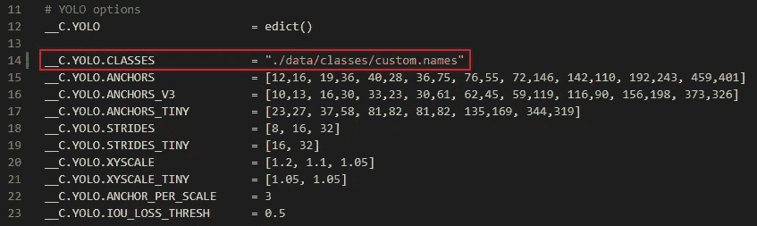
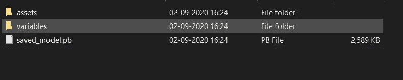

# 逐步增加自定义对象检测中的每秒帧数(FPS)

> 原文：<https://towardsdatascience.com/no-gpu-for-your-production-server-a20616bb04bd?source=collection_archive---------7----------------------->


由 [Unsplash](https://unsplash.com?utm_source=medium&utm_medium=referral) 上的 [chuttersnap](https://unsplash.com/@chuttersnap?utm_source=medium&utm_medium=referral) 拍摄

## *如何提高物体检测中的 FPS 率*

你可能用过很多机器学习或者深度学习模型。但是，当谈到在云中或任何服务器上部署您的模型时，我们面临许多问题。如果你正在云中部署深度学习模型，那么主要问题是 GPU。云对在你的模型中使用 GPU 收取大量费用。您的行业不想投资 GPU，但仍然需要更好的准确性和对象检测速度。那你来对地方了。在本文中，我将介绍如何在云机器或“本地主机”机器上使用 CPU 获得更好的性能和准确性。

喝杯茶，好好休息，享受旅程。

> **物体检测**是一种计算机视觉技术，它允许我们**识别、定位、**和**跟踪图像或视频中的物体**。通过这种识别、定位和跟踪，**对象检测**可以对场景中的**对象**进行计数，并确定和跟踪它们的精确位置，同时准确标记它们。

# **所需步骤:**

在这里，我将简要地向您介绍我们计划提高每秒帧数(FPS)的所有其他必要步骤。FPS(每秒帧数)定义了对象检测模型处理视频并生成所需输出的速度。

1.  任何自定义对象检测的第一步都是获取图像进行标记。你可以从互联网上抓取照片，或者你可以出去寻找需要训练你的模型的对象，然后自己点击一些图像。
2.  **给你的图片贴上标签。为这一步提供大量数据，因为这对你的准确性至关重要。您可以使用任何工具来标注数据。没有自动标记自定义数据的方法。你必须手动操作。这是客体滞留中最令人沮丧也是最费时的部分，但是如果你把你的奉献给这一部分，你肯定会得到一个丰硕的成果。我使用了“LabelImg”工具进行标注。要了解更多关于这个工具是如何工作的，请跟随这篇文章[如何为物体检测标记图像](https://medium.com/@pranjalAI/how-to-label-images-for-object-detection-step-by-step-7ee317f98583)。**
3.  您必须选择适当的对象检测算法。在这里，我们将使用 YOLO-泰尼。您可以参考这里的自定义对象检测代码[https://github.com/pranjalAI/Yolo-tiny-insurance](https://github.com/pranjalAI/Yolo-tiny-insurance)。
4.  在从步骤 3 中获得 Yolo 体重文件后，您需要将 Yolo 生成的体重文件转换为 TensorFlow 服务，以便使用 TensorFlow 服务于我们的网页。
5.  要将暗网格式的重量文件转换为 TensorFlow 格式，您需要遵循以下步骤。

克隆这个目录【https://github.com/pranjalAI/tensorflow-yolov4-tflite 


照片由[约书亚·苏考夫](https://unsplash.com/@joshuas?utm_source=medium&utm_medium=referral)在 [Unsplash](https://unsplash.com?utm_source=medium&utm_medium=referral) 上拍摄

您需要使用命令提示符进入目录。

> 安装库

如果您安装了 Anaconda，您需要按照下面指定的命令在一个环境中安装所有需要的库。执行完命令后，将创建一个新环境。环境名的名称可以在。yml 文件。

```
# Tensorflow CPU
conda env create -f conda-cpu.yml
conda activate yolov4-cpu

# Tensorflow GPU
conda env create -f conda-gpu.yml
conda activate yolov4-gpu
```

如果您没有安装 Anaconda，那么请使用 pip 命令。我建议使用 Anaconda。

```
# TensorFlow CPU
pip install -r requirements.txt

# TensorFlow GPU
pip install -r requirements-gpu.txt
```

因此，创建了具有各自依赖性的新环境。现在，要使用新创建的环境，您需要激活它。(这一步是为那些使用 Anaconda 创建环境的人准备的。)


照片由 [Serghei Trofimov](https://unsplash.com/@sergeytrofimov?utm_source=medium&utm_medium=referral) 在 [Unsplash](https://unsplash.com?utm_source=medium&utm_medium=referral) 上拍摄

> 环境激活

```
conda activate yolov4-gpu
```

这里“yolov4-gpu”是环境名。您可以在中更改它。yml 文件。(这一步是为那些使用 Anaconda 创建环境的人准备的。)如果您使用的是 pip，那么直接进行下一步。

现在，如果您进入了刚刚克隆的文件夹，并且已经激活了环境，最后，您需要在克隆的文件夹中进行两项更改。

首先，复制并粘贴您的自定义。重量文件到'数据'文件夹，并复制和粘贴您的自定义。“数据/类/”文件夹中。

其次，您需要对代码进行的唯一更改是“core/config.py”文件的第 14 行。更新代码以指向您的自定义。names 文件，如下所示。(我的习俗”。names”文件称为“custom.names ”,但您的文件可能会有不同的名称)



**注意:**如果你使用的是已经训练好的 yolov4，确保第 14 行保持 **coco.names** 。

开始了。！现在，我们需要一个命令行来使代码 TensorFlow 兼容。

python save_model.py - weights。/data/your _ weight _ file . weights-output。/check points/yolo-tiny-416-input _ size 416-model yolov 4

这里，416 是您在训练“Yolo-tiny”模型时在配置文件中定义的图像大小。运行上面的命令后，您将得到一个“.pb”文件



的”。pb”文件给 yolo-tiny

现在，您需要在检测对象时给出这个文件夹的位置。而且，跑了”。py”文件来使用您训练过的对象检测器。

在这里，使用 GPU，我用 YoloV4-Tiny 达到了 70 FPS，甚至有更好的准确性，可以进一步提高。使用 CPU，我达到了大约每秒 7 帧的速度。

> 进一步提高 FPS 速度的技巧

我用过 416 的图像尺寸。通过将图像大小缩小到 32 的倍数，可以获得更高的帧速率。这里是速度和准确性之间的权衡。您可以减小图像尺寸，直到您的用例达到满意的精度。

> *你走之前……*

如果你喜欢这篇文章，并希望**关注更多关于 **Python &数据科学**的**精彩文章**——请点击这里[https://pranjalai.medium.com/membership](https://pranjalai.medium.com/membership)考虑成为中级会员。**

请考虑使用[我的推荐链接](https://pranjalai.medium.com/membership)注册。通过这种方式，会员费的一部分归我，这激励我写更多关于 Python 和数据科学的令人兴奋的东西。

还有，可以随时订阅我的免费简讯: [**Pranjal 的简讯**](https://pranjalai.medium.com/subscribe) 。