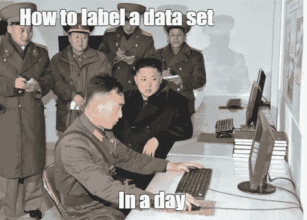
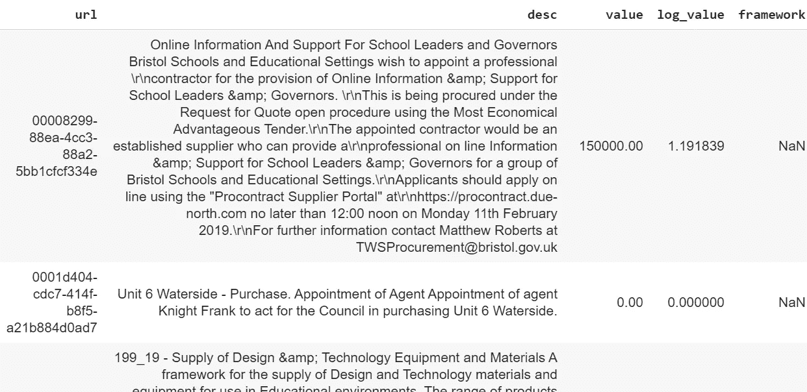
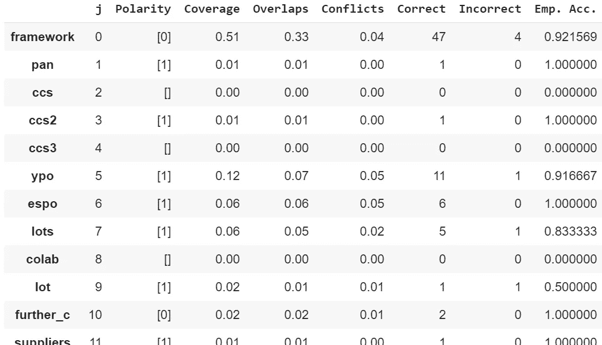

# 没有标签？没问题！

> 原文：<https://towardsdatascience.com/no-labels-no-problem-30024984681d?source=collection_archive---------16----------------------->

## **使用通气管的无标签机器学习**


浮潜可以使标记数据变得轻而易举

具有一定讽刺意味的是，机器学习，一种用于任务和过程自动化的工具，往往始于高度手工的数据标记过程。

创建标签以教会计算机新任务的任务正迅速成为 21 世纪的蓝领工作。

它创造了复杂的供应链，而这些供应链往往以低收入国家为终点，如 T2、肯尼亚、印度和菲律宾。虽然这一新兴行业创造了数千个工作岗位，但工人们可能会受到低薪和剥削。

> 数据标签市场在 2018 年超过 5 亿美元，到 2023 年将达到 12 亿美元。它占了构建人工智能技术时间的 80%。
> 
> [*人工智能正在向人类学习。许多人类。纽约时报*](https://www.nytimes.com/2019/08/16/technology/ai-humans.html)

因此，从成本、时间甚至伦理的角度来看，使创建数据标签的过程自动化的能力是非常需要的。

在本文中，我们将通过 Python 中的一个工作示例，使用优秀的通气管库来探索如何实现这一点。



有更智能、更快捷的方法来标记您的数据

## **进入通气管**

浮潜是一个真正创新的概念；创建一系列“杂乱”的标签函数，并以智能的方式组合这些函数来为数据集构建标签。然后，这些标签可以用于以与标准机器学习工作流完全相同的方式训练机器学习模型。虽然这超出了本文的范围，但值得注意的是，该库也有助于促进增加训练集的过程，并监控数据集的关键区域，以确保模型被训练为有效地处理这些问题。

自 2016 年以来，浮潜本身已经存在，但仍在继续发展。它现在被行业中的许多大公司(Google、IBM、Intel)使用。2019 年的 0.9 版本带来了一种构建标签模型的[更复杂的方式](https://arxiv.org/abs/1810.02840)，以及一套覆盖软件所有关键领域的[文档齐全的教程](https://www.snorkel.org/use-cases/)。即使你以前遇到过，这些更新也值得你再看一眼。

## 何时使用通气管

在我们开始一个工作示例之前，值得考虑一下什么时候应该使用这个库而不是传统的(手动)创建标签的方法。如果以下所有问题的答案都是肯定的，那么就值得考虑浮潜:

*   您有一个没有标签或标签集不完整的数据集。
*   手动标记数据集将花费大量的时间和精力。
*   你有数据的领域知识(或者可以和有知识的人密切合作)。
*   您可以想出一个或多个简单的函数来将数据分成不同的类(例如，通过使用关键字搜索，或者为某个值设置特定的阈值)。

## 浮潜是怎么工作的？

使用通气管的过程很简单:

1.  🏅**【可选】为数据集中的项目创建一小部分“黄金”标签**(这有助于审查最终模型的性能，但不是必需的。另一种方法是“目测”结果，以了解模型的表现。)
2.  ⌨ **写了一系列的‘标签函数’**，定义了训练数据的不同类别。
3.  🏗**构建一个标签模型**并将其应用于数据集以创建一组标签。
4.  📈**在你正常的机器学习管道中使用这些标签**(即使用产生的标签训练一个模型)。

这个过程是迭代的，你会发现自己在评估结果，重新思考和提炼标签函数，以提高输出。

## 成功的例子

让我们用一个现实生活中的问题来展示如何将浮潜用于机器学习管道。

我们将尝试在一个开源的商业数据集中从“合同”中分离出“框架”(来自 [Contracts Finder](https://www.gov.uk/contracts-finder) ，这是一个英国透明系统，记录了所有超过 10k 的政府合同)。

**什么是框架？**

一个框架可以被认为是一个“母协议”。这是一种与一个或多个供应商解决“条款和条件”的方式，这样就可以达成合同，而不必从头再来一遍。

问题是，由于框架和契约之间存在父子关系，这可能导致在分析数据时重复计算。因此，能够将框架从合同中分离出来是很重要的。

**数据**

本例中的数据由合同标题、描述和值组成。下面是我们必须处理的一个例子:



请注意“框架”列中缺少的标签

我们有一个名为“框架”的占位符列，我们将使用它来添加标签。我们将使用的命名约定是:

```
 **1** = Framework
 **0** = Not Framework
**-1** = Abstain (ie not sure!)
```

## **创建我们的第一个标签函数:**

我们将从创建一系列标签函数开始。这些函数本质上可以是任何标准的 Python 函数，并且可以根据您的需要而变得简单(或复杂)。

我们将从数据集上的简单关键字搜索开始。本示例搜索短语:

*“英国公共部门机构使用”*

因为这只可能出现在框架的描述中。通气管让这变得非常简单，你所要做的就是用装饰器`@labeling_function()`包装一个标准的 Python 函数:

```
from snorkel.labeling import labeling_function@labeling_function()
def ccs(x):
    return 1 if "use by uk public sector bodies" in x.desc.lower() else -1
```

太好了，我们刚刚创建了第一个标签函数！我们现在构建了许多其他的函数来帮助将框架从契约中分离出来。

**创建有效标签功能的技巧**

使用该库后，以下指导原则将有助于设计有效的标签函数:

*   🤔**设计标签功能时，始终牢记最终结果**。特别是思考[精度，回忆](https://en.wikipedia.org/wiki/Precision_and_recall)。这将有助于决定在生产的标签中是覆盖面更重要还是特异性更重要。
*   📑**在对潜在的功能进行编码之前，仔细考虑它们**。用简单的英语创建一个列表有助于让你在编码之前优先考虑最有效的标签功能。
*   🎯**少即是多。**采用散弹枪的方法来构建函数通常很有诱惑力，但是少量的经过深思熟虑的函数总是比大量不太精确的标签函数更有效。
*   ⚗️ **在添加标签函数之前，总是要单独测试数据集上的任何新函数。它返回什么结果？这是你所期待的吗？**

## 应用和评估我们的标签功能

一旦您建立了一个或多个标签函数，您需要应用它们来创建一组数据点。这可以通过使用`PandasLFApplier`来实现，它允许你直接从熊猫数据框架中建立这些数据点。

```
from snorkel.labeling import PandasLFApplier

lfs = [ccs,Other_label_functions...]

applier = PandasLFApplier(lfs=lfs)L_train = applier.apply(df=df_train) #unlabelled dataset
L_dev = applier.apply(df=df_test)    #small label dev set
```

请注意，在本例中，我们有一组训练和“开发”数据。dev 集是一个手动标记项目的小型数据集(我们的“黄金”标签)。这使得快速了解标签函数的执行情况变得更加容易(这是目测结果的替代方法)。

一旦您应用了您的标签功能，通气管提供了使用`LFAnalysis`轻松访问标签性能

```
LFAnalysis(L=L_dev, lfs=lfs).lf_summary(Y=Y_test)
```

由于我们有一组带标签的开发信息，这将为我们提供以下信息:



这些术语的含义如下(直接来自[通气管文件](https://www.snorkel.org/use-cases/01-spam-tutorial)):

*   **极性**:该 LF 输出的唯一标签集合(不包括弃权)
*   **覆盖率**:LF 标记的数据集的分数
*   **重叠**:该 LF 和至少一个其他 LF 标签所在数据集的分数
*   **冲突**:该 LF 和至少一个其他 LF 标记和不一致的数据集部分
*   **正确**:该 LF 正确标注的数据点数(如果有金色标注)
*   **不正确**:该 LF 标注错误的数据点数(如果有金色标注)
*   **经验精度**:该 LF 的经验精度(如果有金标)

## 创建标签模型

一旦我们对我们的标签函数满意了，我们就可以把它们放在一个概率模型中。这是浮潜的“神奇来源”,它结合了每个函数的输出，或者返回具有特定标签的数据点的概率，或者返回标签本身。

```
from snorkel.labeling import LabelModellabel_model = LabelModel(cardinality=2, verbose=True)label_model.fit(L_train=L_train, n_epochs=500, lr=0.001, log_freq=100, seed=123)
```

**过滤数据集**

根据我们标签函数的覆盖范围，在使用标签训练机器学习模型之前，我们需要过滤掉一些训练数据。原因是一些数据点不会被我们的任何标签函数拾取。我们希望删除这些项目，因为它们会给训练数据增加噪声。通气管有一个内置的功能，使这很容易:

```
from snorkel.labeling import filter_unlabeled_dataframe#For label probabilities (optional):
probs_train = label_model.predict_proba(L=L_train)#For actual labels:
probs_train = label_model.predict(L=L_train,return_probs=False)#filtering the data:
df_train_filtered, probs_train_filtered = filter_unlabeled_dataframe(X=df_train, y=probs_train, L=L_train)
```

## 你们都完了！

现在，您拥有了一个带有标签的训练数据集，而无需对数据集执行任何手动标签操作。

您可以将这些作为监督机器学习任务的起点。

## 进一步阅读

正如前面所强调的，关于通气管的文档非常优秀，并且有许多深入的教程深入介绍了库中可用的功能:

[](https://www.snorkel.org/) [## 通气管

### 手工建立标签和管理训练数据集是机器学习的最大瓶颈之一。在…

www.snorkel.org](https://www.snorkel.org/) 

*图像来源:*

*   *封面图片* [*来自 needpix.com*](https://www.needpix.com/photo/1639565/label-paper-kraft-template-blank-empty-decoration-tag-design)
*   *通气管* [*标识来自项目网站*](https://www.snorkel.org/)
*   *迷因来自* [*迷因武库*](https://www.meme-arsenal.com/en/create/template/94341)