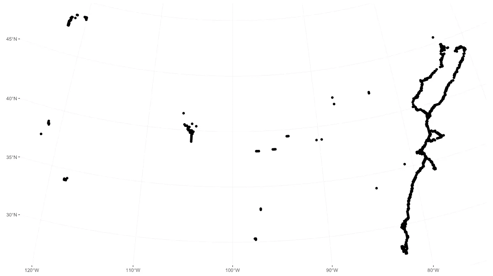

# 没人需要你的数据

> 原文：<https://towardsdatascience.com/no-one-needs-your-data-a175756b2c16?source=collection_archive---------53----------------------->

## 降低数据产品不增值的风险

尼克·西格雷夫在 [Unsplash](https://unsplash.com?utm_source=medium&utm_medium=referral) 上的照片

*本文是系列文章的第一部分。* [*查看这里的介绍*](https://medium.com/@berdaniera/data-products-introduction-f8fe6bb2ef65) *。*

我的手机跟随着我，并与谷歌分享我的位置。他们每年收集大约 22 万条关于我所在位置的观察信息，我把这些信息交给他们，以换取地图服务和广告(他们还让我访问我在 timeline.google.com⁠的数据——如果你还没有的话，可以看看，这很有趣)。

当然，这些数据是有价值的。位置数据包含丰富的信息。谷歌用它们来做广告。但是它们的原始形态有多少价值呢？ [TechCrunch 报道](https://techcrunch.com/2015/10/13/whats-the-value-of-your-data/)通过数据经纪人和交易所，一个位置数据本身价值约 0.0007 美元，这意味着我可以以每年约 150 美元的价格出售我的数据。这并非一无是处，但对我来说，出售数据可能不值得努力。

让我们把这个放大一点。拼车公司 Lyft 在 2018 年完成了 6.2 亿次乘车。假设上述定价估算有效，Lyft 的旅行目的地数据在 2018 年⁠将价值约 43.4 万美元——同样有价值，但与他们 2018 年 22 亿美元的收入相比微不足道。

尽管有潜在的额外收入，拼车公司不愿意向他人提供他们的数据是出了名的。为什么？除了原始数据的直接货币价值，Lyft 还对他们正在收集的数据有更大的计划。Lyft 正在完善他们的原始位置数据，以[得出支持他们自己平台的结果](https://eng.lyft.com/what-is-data-science-at-lyft-4101a69be028)，从提高到达估计到测试自动驾驶汽车。

# 数据本身不会增加价值

2019 年我的手机在北美去哪儿。图片作者。

原始位置数据是有价值的，但它们本身不会增加价值。这是因为最终目标永远不是获取数据。最终目标是完成工作。因此，人们获得的价值并不是数据所固有的，而是取决于与备选方案相比，它能在多大程度上实现结果。

如果我的个人位置数据带有额外的衍生信息，比如我是谁，我喜欢什么，那么它的价值就会上升。这些额外的数据增加了更多可操作的信息。对于一家广告公司来说，*去年我只去过我当地的咖啡店七次*(尽管 114 次都在 100 米范围内)，这一事实比知道我也是一名年龄在 24 岁至 39 岁之间的男性(这一人群中，[比其他人花费更少但消费更多的咖啡，并且更有可能在家而不是在咖啡店喝咖啡](https://myfriendscoffee.com/usa-coffee-statistics/))更不具信息性。

根据我的人口统计，我会在杂货店买很多当地烘焙的咖啡，在家里煮。一家咖啡公司会发现，知道我喝咖啡的概率比仅仅知道我去其他咖啡店的频率更有价值，更不用说知道我的年龄和性别或获得一堆我去过的地方的数据了。

类似地，尽管原油公司和运输公司都使用石油作为投入，但它们向完全不同的客户提供完全不同的产出。大多数人不提炼他们自己的原油来给他们的汽车提供燃料，或者甚至不关心它是如何提炼的或者在哪里提炼的。当我给汽车加满汽油时，我是在购买一种衍生产品，这样我就可以四处走动了。如果我使用拼车服务或购买电动汽车，我甚至不需要那种精致的产品来满足我的主要需求:*四处走动*。

# 数据中不同类型的值

数据的价值会因其产品化方式的不同而发生巨大变化。如上所述，原始数据通常不如经过进一步处理的表单有价值，因为使用它们进行工作更加困难。更高层次的 outputs⁠——例如构建算法来支持甚至自动化 decisions⁠——涉及更多的复杂性，但会产生不同的结果。

这在数据产品类型的金字塔中得到了很好的体现:

数据产品金字塔。作者图片，基于[设计数据产品](/designing-data-products-b6b93edf3d23)中的内容。

我喜欢这个概念，因为它阐明了结果。从根本上说，你的数据产品只是原始信息。在中间，你的数据产品是基于一些输入的计算。在顶部，您的数据产品是决策。

这个金字塔恰好符合[对产品](https://hackernoon.com/the-ai-hierarchy-of-needs-18f111fcc007)不断增长的要求和需求。原始数据是最基础的，因为它们是最不精确的，在数据科学家和工程师的需求层次结构中，每一个连续的层次都建立在前一个层次之上(更高的层次通常需要更多的技术开发)。因此，它也与您对用户的要求密切相关。金字塔的较低层次必然需要更多的技术用户。

*数据产品金字塔*是一种工具，用于考虑您的数据能为谁带来什么结果。言下之意是，数据产品和生产这些产品的公司并不都一样。它们相当多样化。 [Cassie Kozyrkov，谷歌的首席决策科学家，用面包解释了商业的后果](https://hackernoon.com/why-businesses-fail-at-machine-learning-fbff41c4d5db):

> 如果你要开一家面包店，雇佣一名经验丰富的面包师是个好主意，他精通制作美味面包和糕点的细微差别。你也会想要一个烤箱。虽然它是一个重要的工具，但我敢打赌，你不会让你的顶级糕点师承担知道如何制作烤箱的任务；那么，为什么你的公司专注于机器学习的等价物呢？
> 
> 你是做面包的吗？还是做烤箱？

# 有时候，替代方案已经足够好了

想象一下，我想把我的位置数据卖给一家自动驾驶汽车制造商(并得到我的 150 美元！).他们为什么要我的数据？自动驾驶汽车制造商面临的一个市场问题是[让消费者安全地从 A 点到 B 点](https://www.oreilly.com/radar/evolution-of-data-products/)。获取新数据可以帮助这些公司更好地完成这项工作，方法是根据我在哪里开得快或慢来训练它们的车辆。

我的数据的价值随着它为特定结果的提炼而上升。例如，我是否提供我的车辆位置(原始数据)或我加速和减速的导数(派生数据)？使用数据产品金字塔，从原始车辆位置数据到推导出的速度数据，再到根据交通状况建议速度的算法，再到警告乘客车辆将减速让行人过街的自动决策系统，都会增加价值(和工作量)。

但自动驾驶汽车如何训练对消费者来说并不重要，只要它经过训练。(培训是厂商的终极问题。)对于上面的第一步，制造商可能能够利用我的数据实现飞跃，但他们也可以只是在赛道上进行一些现场测试。第二或第三，他们可以从另一家供应商那里购买总流量数据。如果最后一步是他们的主要目标，他们[可能甚至不需要真实的位置数据](/the-future-of-data-is-fake-694d2aa0d3d5)。这些都是我的数据的替代品(竞争对手),最终，如果不做一些额外的工作，我的数据可能无法真正满足他们的需求。

我认为这可能就是为什么福特*等公司[决定收购模拟公司来支持自动驾驶汽车开发](https://medium.com/self-driven/how-algorithm-and-simulation-work-is-helping-fords-autonomous-vehicle-operations-5259fafd552)，而不是仅仅购买一堆位置数据。他们正在[购买比通过收集真实世界数据更快](https://www.automotiveworld.com/articles/why-simulation-is-the-cornerstone-of-autonomous-vehicle-development/)获得高阶结果的能力。

**披露:我在一家福特公司的全资子公司工作。*

# 如何确保数据产品增值

确保数据产品的价值就像任何其他产品一样:它需要考虑客户问题、产品解决方案和备选方案。但是，数据产品对每一步都有一些独特的限制。

## *识别客户需求。*

数据产品解决的问题不一定是新颖的，即使方法或输出是新的。另外，[你的客户不太可能是技术型的](https://www.bls.gov/emp/tables/emp-by-major-occupational-group.htm)。事实上，有时通过发现客户现有的效率低下问题，可以更容易地确定数据可以解决的问题，这些客户在其他解决方案方面有很好的框架问题。例如， [sabermetrics](https://en.wikipedia.org/wiki/Sabermetrics) 发展成为棒球队获得战略竞争优势的量化方法。你的问题需要验证吗？如果你在过程的早期，也许不会，但是记住，没有问题的产品是一个假设。(Sabermetrics 用了大约 20 年才开始流行[，因为客户没有认识到](https://medium.com/joeblogs/the-ballad-of-bill-james-1979c8d2d62d)的价值。)

确定客户需求几乎就像任何其他产品发现一样。但是，如果您正在阅读本文，您可能会认为数据产品是解决某些问题的好方法。鉴于此，数据产品的一个主要挑战是从对话中移除解决方案，以避免[确认偏差](https://fs.blog/2017/05/confirmation-bias/)。数据产品、机器学习和人工智能是[超级装载的嗡嗡声](https://www.gartner.com/smarterwithgartner/top-trends-on-the-gartner-hype-cycle-for-artificial-intelligence-2019/)，如果你不小心，可能会给你假阳性。[在未来的版本中，我会用一些警示故事来阐述！]

## *阐明您的数据提供的结果。*

通过在转向数据产品金字塔之前从问题开始，您可以保护自己免受针对数据产品的[常见批评，这些数据产品没有解决预期结果](https://hbr.org/2016/12/why-youre-not-getting-value-from-your-data-science)。先了解客户问题有什么帮助？因为您定位解决方案的方式(以及您提供的解决方案类型)将取决于用户及其需求。比如，你是否在帮助其他软件公司了解他们的产品使用情况？如果您的用户是产品经理(例如 Pendo)，那么您可能需要在漂亮的图表中提供一些派生输出。如果您的用户是软件工程师和数据科学家(例如，Segment)，那么您可能需要一个原始数据 API。

了解您在*数据产品金字塔*中的位置将有助于您明确您可以向客户交付哪些成果。一般来说，金字塔顶端的结果更复杂，可以吸引更多的价值，但情况并非总是如此，在接下来的几周，当我谈到**复杂对复杂**和**环中人**时，我们会看到这一点。因此，选择合适的解决方案对于实现价值最大化非常重要。如果您不能确定您的数据产品如何有助于解决问题，那么您可能需要先做一些验证，以确保您的问题需要解决。

## *解释与备选方案的区别。*

所有产品都有竞争对手。对于数据产品，这些也可能包括不依赖于您的数据类型的替代方案。你可以通过区分你的产品和其他产品来展示你的价值。没有你的产品，人们怎么能做同样的事情呢？可能有人在手工记录信息或者需要做大量的手工重新整理信息。也许他们需要自己进行计算。也许有人在依靠直觉做决定…也许有人需要做决定！关注这些竞争优势也将有助于您阐明您可以提供什么样的结果。

数据产品的一个常见卖点是它们“[更快、更准确、更一致、更透明](https://www.mckinsey.com/business-functions/mckinsey-analytics/our-insights/the-age-of-analytics-competing-in-a-data-driven-world)”他们有时也更昂贵，无论是在金钱上还是在努力。正因为如此，保持怀疑和批判性地询问为什么你的产品真的比替代品更有价值是有益的。例如，当一个公司可以用更少的钱让一个人做到 80%的准确率时，为什么要花更多的钱去买一个准确率为 90%的新系统呢？有人能在电子表格中得到类似的结果吗？额外的 10%是否提供了足够的附加值？如果你不能区分你的结果，那么你可能需要回到数据产品金字塔，重新评估你所提供的。

# 摘要

没有人需要你的数据，但这可能有助于他们更好地完成工作。您的数据增加了多少价值取决于您可以支持什么类型的结果。

确保你为客户增加价值取决于发现需求，阐明你如何解决它，并解释为什么你的方法比其他方法更好。对于数据产品，对炒作保持中立，关注有形的结果，并对你的产品与众不同的原因保持怀疑，可以降低不增加价值的风险。

跟随系列？[看看第二部分](https://medium.com/swlh/strategically-multiply-the-impact-of-other-data-d0b527d356ba)，这是关于为你的企业增加数据产品可行性的策略。*联系*[*LinkedIn*](https://www.linkedin.com/in/aaronberdanier/)*或*[*Twitter*](https://twitter.com/berdaniera)*想多聊聊，我很想听听你的看法。*