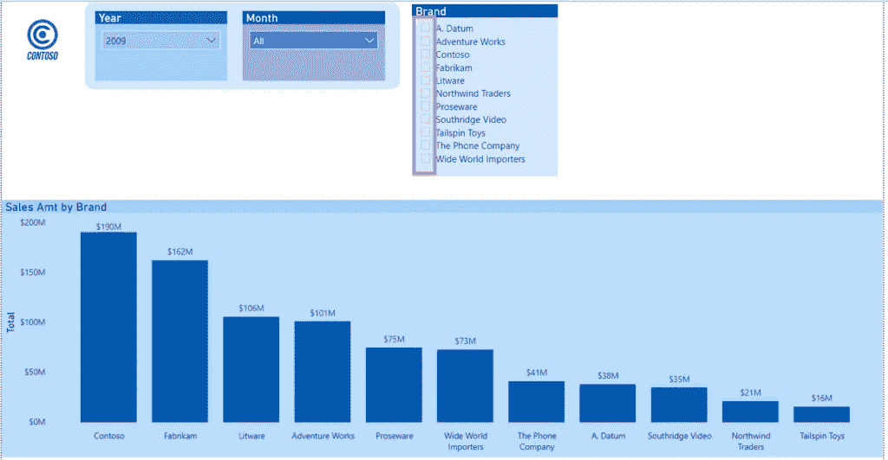
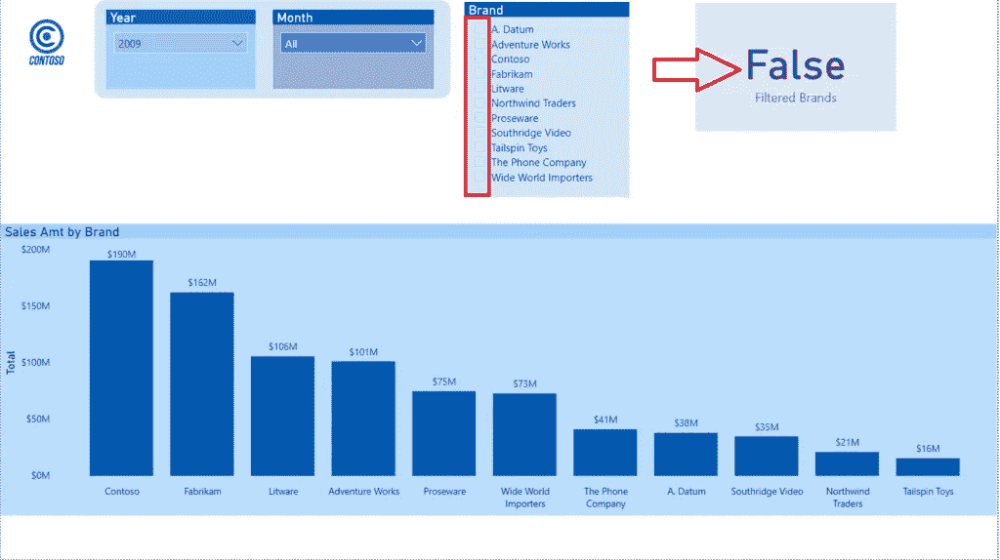
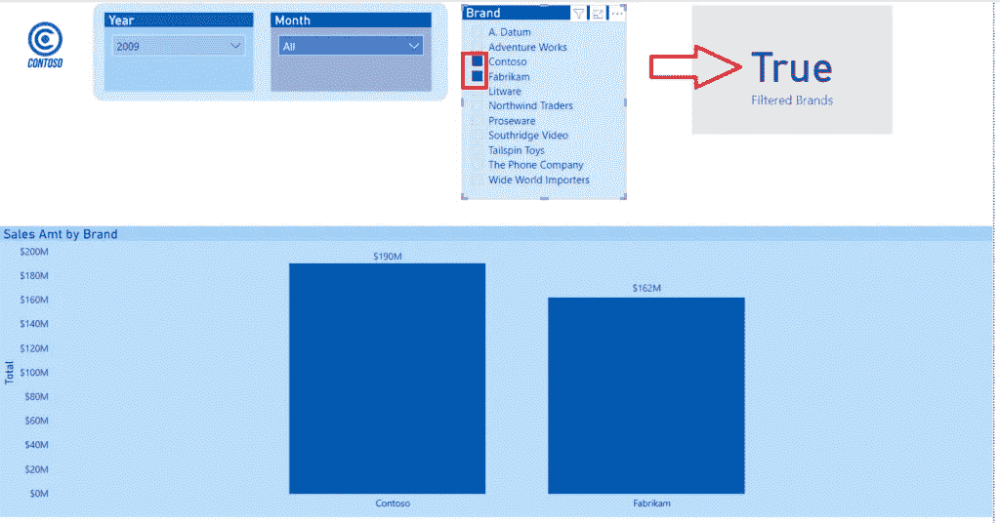
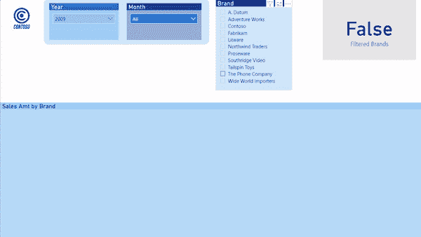
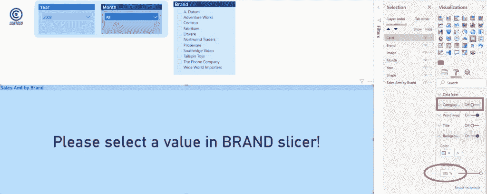
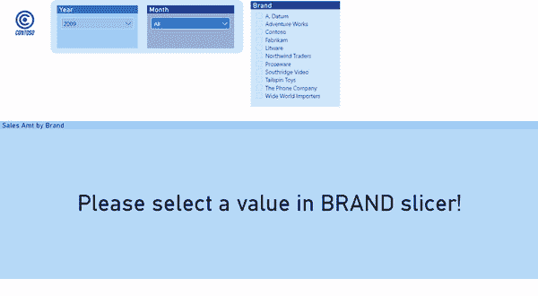

# 未选择切片器 Power BI 中没有图表

> 原文：<https://towardsdatascience.com/no-slicer-selected-no-chart-in-power-bi-17ce5d36cd40?source=collection_archive---------7----------------------->

## 了解如何轻松定制您的 Power BI 报告并更改默认设置


卡罗琳娜·格拉博斯卡在 Pexels.com 拍摄的照片

在日常使用 Power BI 时，我喜欢不时地[“挑战”工具](/how-i-speed-up-my-power-bi-report-5x-155255415895)，看看它在一些非标准设置中的表现。我的意思是，我们都喜欢在短时间内完成任务，Power BI 有一个[的各种功能](/5-tips-to-boost-your-power-bi-development-a44d7e782037)来帮助我们实现这一点，但有时我觉得改变默认行为可以增强用户体验。


## 方案

比方说，我想创建一个图表，只有在切片器中选择了至少一个特定值时，该图表才会显示。像往常一样，我将使用示例 Contoso 数据库进行演示。

您可能知道，默认情况下，如果在切片器中没有选择特定的值，Power BI 将显示所有切片器值的数字:



现在，我们的想法是隐藏这些条，直到在切片器中至少有一个选择。如果不是这样，我们想显示一个空白图表。我们如何实现这一目标？

*达克斯是你的朋友！*

我们将使用 [*ISFILTERED()*](https://docs.microsoft.com/en-us/dax/isfiltered-function-dax) 函数来检查指定的列是否被直接过滤。在我们的例子中，它是来自 Product 维度的列 BrandName。该函数的结果属于布尔类型(真/假)。

让我们写下我们的度量:

```
Filtered Brands = ISFILTERED('Product'[BrandName])
```

我将把这一措施放在卡片视觉中，只是为了检查一切是否如预期那样工作:



一旦我在切片器中选择了一个特定值，我的度量将返回一个不同的结果:



我们需要做的下一件事是删除当前的过滤器上下文。为此，我们将使用[*all selected()*](https://docs.microsoft.com/en-us/dax/allselected-function-dax)函数。这是一个相当复杂的函数，可以用于各种不同的事情，所以如果你想完全理解 ALLSELECTED()函数，我推荐你阅读 Marco Russo 和 Alberto Ferrari 的这篇文章。

所以，让我们扩展一下我们的衡量标准:

```
Filtered Brands = CALCULATE(
                        ISFILTERED('Product'[BrandName]),
                        ALLSELECTED('Product'[BrandName])
)
```

基本上，我们报告的当前外观不会发生任何变化，但我们扩展了衡量标准的逻辑，并为我们试图实现的最终目标奠定了基础。

## 三，二，一…我们到了！

现在，让我们创建我们的最终度量:

```
Filtered Sales Amt = IF(
                        [Filtered Brands] = TRUE,
                        [Sales Amt],
                        BLANK()
                        )
```

让我停下来解释一下我们在这里做什么:通过使用 IF，我们可以控制度量的最终结果。简单地说，如果我们之前创建的 measure *Filtered Brands* 的结果为真，我们希望返回 Sales Amt measure 值；如果没有，我们将返回空白。

让我们看看这是否可行:



看起来不错，我会说:)

## 抛光以获得更好的体验

尽管我们实现了最初的目标，但乍一看这似乎有悖常理。想象一下当用户打开一个报告，看到默认切片器设置的空白画面时的反应！我打赌你会接到一些电话，抱怨什么东西坏了…

所以，让我们做最后的润色，让我们的用户开心！我要做的第一件事是创建一个度量，它将为我的用户保存消息:

```
Message = IF ( 
            [Filtered Brands] = TRUE,
            "",
            "Please select a value in BRAND slicer!" 
            )
```

同样，IF 函数将允许我们定义流:如果用户在切片器中进行选择，它将返回一个空字符串；如果没有，它将显示指定的文本。

现在，让我们在报告画布上放置一个可视卡片，将我们的消息度量放入其中，并在可视卡片的格式窗格中进行一些重要的调整:



我们将关闭类别，并将透明度设置为 100%。当我把卡片放到我的簇状柱形图上时，我会看到我的消息显示在上面，指示用户他需要做什么。一旦他在品牌切片器中选择了一个或多个值，他将看到数据条而不是消息出现。

让我们检查一下这是否如预期的那样工作:



挺牛逼的吧:)

## 结论

正如我一直喜欢强调的，Power BI 是一个了不起的工具！它为您提供了以多种不同方式讲述数据故事的灵活性。这个例子展示了如何根据特定的业务需求，轻松地更改默认设置和定制报表的外观。

当然，您不应该在每一个场景中都使用这种技巧——老实说，在 99%的情况下，您应该坚持使用默认行为。但是，拥有另一个工具也不错，而且您知道您可以使用它来定制您的 Power BI 报告。

[成为会员，阅读媒体上的每一个故事！](https://datamozart.medium.com/membership)

订阅[这里](http://eepurl.com/gOH8iP)获取更多有见地的数据文章！