# 无应力高斯过程

> 原文：<https://towardsdatascience.com/no-stress-gaussian-processes-40e238597864?source=collection_archive---------29----------------------->

## 如何处理无穷多个函数的分布？

当人们第一次接触到**高斯过程**时，他们会听到类似“高斯过程允许你在回归任务中使用无限空间的函数”这样的话。这是一件很难处理的事情。事实上，简而言之，高斯过程非常简单，这一切都始于(多元)正态(高斯)分布，它具有一些我们可以用于 GPs 的良好特性。作为这篇文章的经验法则，我建议当有疑问时，看一看 GP 方程，然后文本应该变得清晰。

**高斯过程有什么好处？**从理论的角度来看，它们是通用函数逼近器，所以答案是你需要拟合某种函数的任何东西。但是**有一些计算上的考虑要做**，我们稍后会得到这些考虑，它们会影响是否使用它们的决定，以及数据的可用性。

高斯过程在机器学习的大背景中处于什么位置？首先，GPs 是非参数模型，也就是说我们对于某种基于训练数据的模型参数并没有一定的更新规则。非参数算法的另一个例子是 k-最近邻。总而言之，这里(在 GPs 最基本的情况下)我们没有梯度，没有可以直接优化的目标函数。

其次，在机器学习中，GPs 很好地服从贝叶斯观点(我建议当看到贝叶斯时，考虑量化预测中的不确定性或信息量)。

因此，在我们进入 GPs 之前，我们需要了解高斯分布的这些良好特性。正如您将在后面看到的，除了使用众所周知的多元高斯分布的结果，GPs 并没有带来更多的东西。为简单起见，让我们只看高斯的二元情况，它是用均值向量μ和协方差矩阵σ定义的:

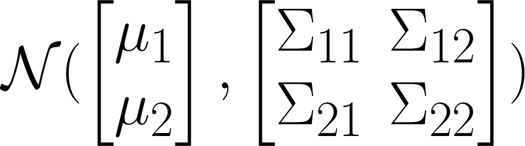

为了有个感觉，下图显示了以 0(零均值)为中心的二元高斯分布的密度。试着找出不同高斯分布下的协方差矩阵。

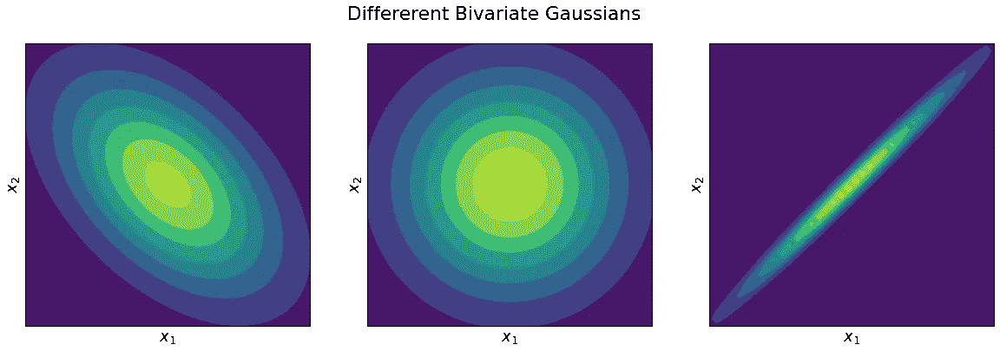

**洗牌属性。我们可以分别取均值向量和协方差矩阵，并将它们混洗，使得各自的协方差和均值归在一起。新的发行版和旧的一样，没有变化。**

**边际财产。**多元高斯分布定义了一组变量的联合分布。这些变量中的每一个也是按照高斯分布分布的，事实上我们可以从协方差矩阵中读出这个分布的协方差，例如，我们可以取第一维的平均向量，μ₁和所属的协方差矩阵将是σ₁₁.边际高斯则是σ₁₁).的 N(μ₁

**调节性质。**如前所述，多元高斯定义了变量的联合分布。事实上，对这些变量中的一个进行调节也会产生高斯分布。此外，计算得到的分布的协方差和均值是简单的，并且可以以封闭的形式进行。这是我们将在 GPs 中使用的一个基本属性。

## 从多元高斯到推论

现在我们已经讨论了高斯函数的性质，我们可以谈谈 GPs 是如何工作的。首先，让我们记住我们有一个回归的一般任务，我们有一个( **x，y** )对的训练数据集。正如我先前所说的:

> 高斯过程完全由均值函数 **μ** 和核函数 **k** 指定

下面的等式只是说函数 f 的概率分布是按照 GP 分布的:

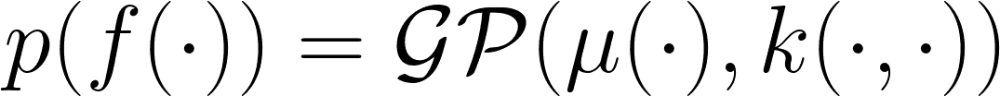

核函数将是数据点相似性的度量，或者更好地说， **k(** x **₁，** x **₂)** 告诉我们 y₁和 y₂.有多接近本质上，通过指定均值函数和核函数，我们指定了无限多个函数的先验分布。我们可以把这个 GP 分布看作是多元正态分布的占位符，因为最终，我们将只处理多元正态分布，但是我们计算多元正态分布的均值和协方差的方式是高斯过程的美妙之处。当我们将前面的等式扩展一点时，这可能会更清楚:

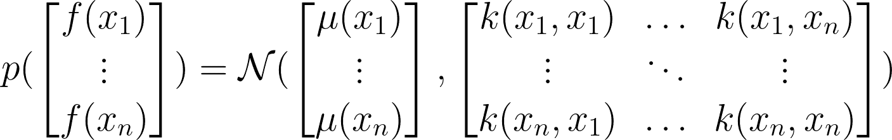

我们可以看到，为了计算这个多元正态分布的均值向量和协方差矩阵，我们只需要将均值函数应用于训练集中的每个点，将核函数应用于训练集中的所有点对，这就产生了协方差矩阵。这里值得注意的是，我们显然不能使用任何函数作为核函数，协方差矩阵必须是正定的，因此需要相应地选择核函数。

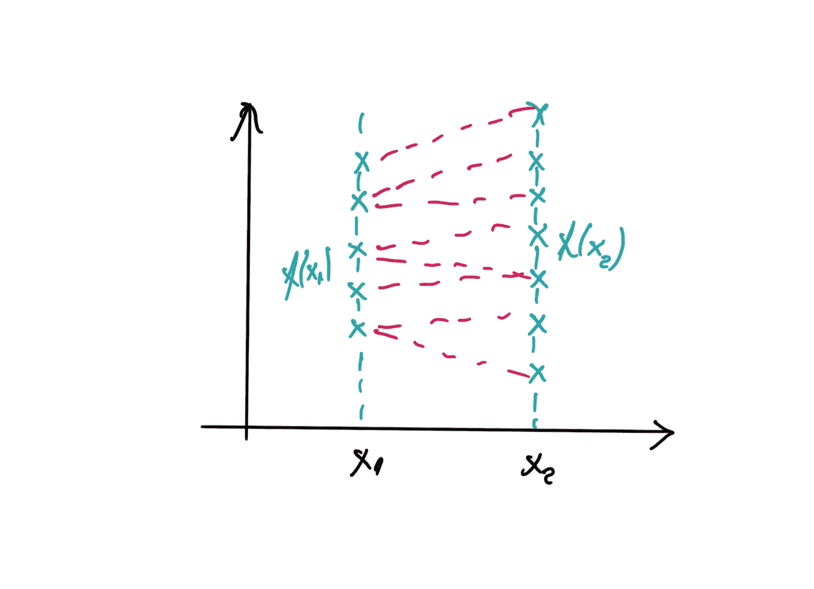

现在我想把你的注意力再次转移到句子“**在函数上的分布**”。为什么我们会这样看？为了更清楚地说明这一点，请看下图。 **x** 轴定义输入变量，y 轴定义函数值。在蓝色部分，我们看到特定值 **x** 的不同函数实现。红线指定在 **x** 上的函数的采样实现。我们如何进行这样的采样？从全科医生的定义来看，这一点非常清楚。我们可以从变量的联合分布中抽取某一组 **Y** ，即 **f(X)** 。我们说一个多元高斯的边际分布也是高斯的，这就是我们从同一个 **x** 得到多个值 **f(x)** 的原因，因为 **x** 是正态分布。

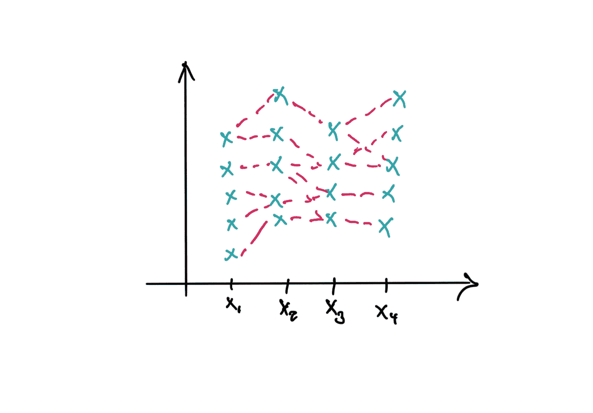

这是如果我们有更多的数据，更多的 **xs** 时的样子，同样，它只是从多元高斯定义的联合分布中取样。

但是当然，我们还没有做任何适当的推论，不是吗？我们刚刚看到，我们可以对无限数量的函数进行采样，我们希望实际预测未知点 **x** 处的函数值。这正是我们通过调节所实现的，让我们假设我们的训练数据集包含变量 **x₂** 和 **x** ₄.我们想预测 x₁ 和 x₃ 的函数值。合乎逻辑的做法是以已知值为条件。通过调节，我们减少了靠近点的不确定性(函数 **f** 的可能值)。“接近”的实际含义是由内核函数定义的。

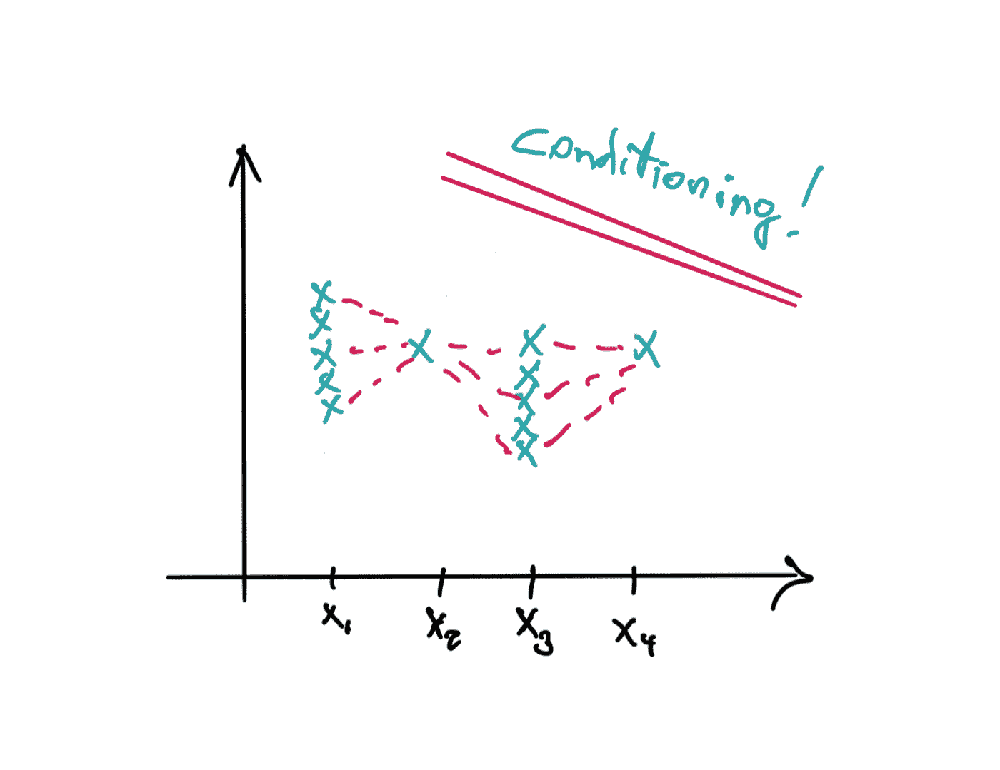

或者用多一点的函数来展示(说多一点，并没有固定数量的函数，我们只是从无限的函数集中抽出 N 个函数):

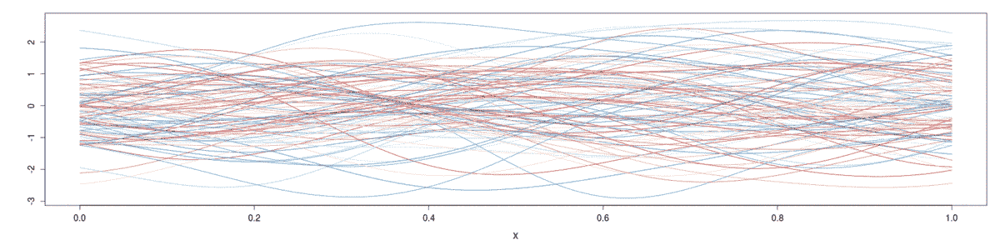

你可能想知道:“但是，等等，我们是以某种值 **f(x)** 为条件的，但是 **f(x)** 甚至没有出现在分布的定义中”。我承认，当谈到 GPs 时，这可能会令人困惑。但实际上， **f(x)** ，也就是 **y** 确实出现了。它出现在条件分布和预测点的均值和协方差的封闭解中。等式如下所示(在我们的均值函数μ为 0 的情况下):

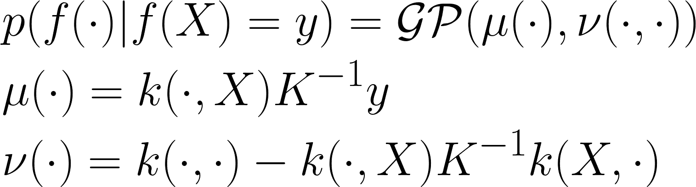

小 K 是核函数，不要与大 K 混淆，大 K 是我们通过将核函数应用于训练集 x 而指定的“设计矩阵”。μ是新的均值，ν是条件分布的协方差。

如你所见， **y** 对于计算新的平均值是必不可少的，这基本上是我们在预测中最有信心的一点。这是我们不假设噪声数据的情况。但是如果我们的数据实际上是有噪声的呢？在机器人应用中，这种情况很常见，我们通常假设噪声正态分布，均值为 0。对条件方程的改变很小，正如你所看到的，我们只是在设计矩阵中增加了对角方差。直观来看，这意味着什么？这意味着我们正在增加我们的边缘的不确定性，这正是我们的训练数据点，这就是我们在存在噪声的情况下想要做的。

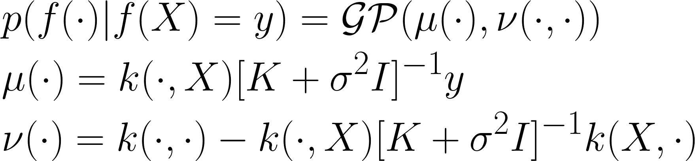

通过向协方差矩阵添加额外的不确定性，我们考虑了噪声训练数据/观察值。

做完这一小部分线性代数后，我们可以画出函数的条件分布:

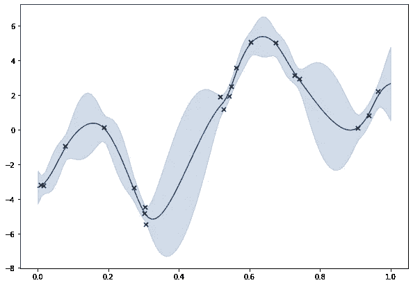

## **其他注意事项和有趣的事实**

这里也许还有一些值得思考的事情。

**计算协方差的倒数。**众所周知，计算协方差矩阵的逆矩阵在数值上是不稳定的，尤其是在大型数据集的情况下。请注意，在高斯过程中，推理的计算复杂度与数据集大小成比例，而在参数模型中并非如此。因此，您选择的求逆方法对性能至关重要，最常用的方法之一就是采用乔莱斯基分解。

**推理的计算复杂度是多少？严峻的事实是，增加训练数据量会增加推理的计算复杂性。为了缓解这种情况，一些人研究稀疏高斯过程，该过程基本上以一种聪明的方式选择以矩阵 K 的哪一部分为条件。直觉上，我们不需要使用所有的训练点来进行预测，我们只需要使用那些“接近”的训练点。通过减小调节中使用的协方差矩阵的大小，我们降低了计算复杂度。**

**我应该使用高斯过程还是深度神经网络？这是一个争论激烈的问题。当然，提出随着数据集规模的增加，推理的计算复杂性增加的观点可能是神经网络的一个论点，但有工作表明高斯过程在许多任务上大大优于神经网络。也有理论工作表明，一个非常“大”的神经网络基本上是一个 GP。**

**高斯过程有过拟合的问题吗？**不一定。原因是我们在预测中有一个不确定性的度量，它高度依赖于设计矩阵的核函数的选择。

**这些果仁到底是怎么回事？我写了一篇关于这个话题的[博文](/kernel-secrets-in-machine-learning-2aab4c8a295f)，内容可能很丰富。简而言之，核是两个事物之间相似性的度量，或者你可以称之为距离度量。这是一个有点不幸的名字，因为术语“内核”在 ML 的不同上下文中使用，例如“卷积内核”与内核函数无关，或者内核技巧。**

哪里有数据，我就确定，哪里没有，我就不确定，这不是太傻了吗？不，不仅仅是“哪里有数据”，“确定性”的大小高度依赖于内核函数的选择以及“接近”意味着什么。但是，是的，它和为当前问题选择的核函数一样愚蠢。

## 一些有用的链接

[高斯过程暑期学校](http://gpss.cc/)

[高斯过程游乐场](https://durrande.shinyapps.io/gp_playground/)

[高斯过程书](http://www.gaussianprocess.org/gpml/)

[我关于内核的博文](/kernel-secrets-in-machine-learning-2aab4c8a295f)

谢谢！