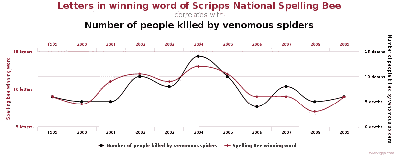
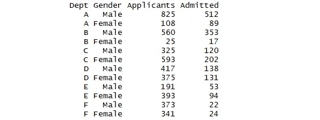
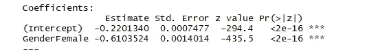
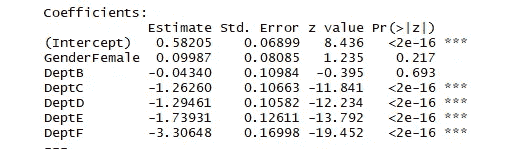
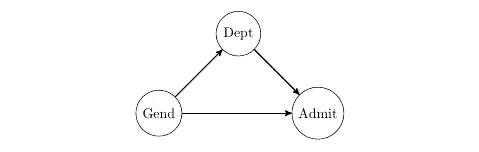

# 数据本身不会说明任何问题

> 原文：<https://towardsdatascience.com/no-the-data-never-says-anything-510edbd9b43a?source=collection_archive---------32----------------------->

## 不要让数据说话

丽贝卡·巴里在 Flickr 上的图片

我被类似“很明显，数据表明……”或“从数据来看，很明显……”的陈述所困扰。很多时候，既不清晰，也不明显。我们需要推理。数据甚至不会说话——它怎么可能自己说话呢？

等等，不，让我试试。听起来很有趣。咳咳。这里的结论很清楚:

图片由[泰勒·维根](https://commons.wikimedia.org/wiki/File:Spurious_correlations_-_spelling_bee_spiders.svg)提供

我遇到过一些种族至上主义者，他们引用一些统计数据作为某些种族或性别不如其他种族或性别的“证据”，这让我很不高兴。当然，如果“数据不言自明”，我们应该同意他们的观点？然而，我们许多人不同意。即使那些没有统计背景的人也能感觉到一些东西——统计数据没有捕捉到更大的画面，并且有一些复杂性(强大的不可测量的混杂因素或中介因素)阻止我们从表面上看数字。如果我们可以将这种健康的怀疑态度正式化，那不是很好吗？

很长一段时间，我很难表达这个想法，直到我看到[凯西的文章](/the-saddest-equation-in-data-science-e60e7819b63f)。她指出:

> 推断=数据+假设

是我们的假设赋予了数据声音。我想进一步分解这一点，因为有一个微妙但重要的区别:

> 推断=数据+统计假设+因果假设

为什么要分开？即使是像“人口的平均高度是 X”或“森林中有 Y 棵树”这样的单参数估计，我们也需要假设一些数据生成机制，比如简单的随机抽样——一种因果陈述。

数据科学家/数据分析师可能是统计假设方面的专家，但他们可能不太了解因果假设。例如，如果你是一名处理医疗数据的统计学家，你会疯狂地认为你比医学博士或公共卫生硕士更了解医学。有些人是统计学和科学领域的专家，但他们很少。

假设的质量极大地影响了洞察力的质量。然而，人们很少谈论假设。团队最好召开会议来讨论这些问题。

推理意味着抛开你的自我。你必须表现出谦逊，尊重他人的专业知识，这样你才能将他们的知识融入到模型中。这是一个团队的努力。

# 辛普森悖论

UCB 招生数据集是说明因果假设重要性的最简单和最好的例子之一。你可能会从辛普森悖论中了解到这一点。数据(列名不是我的):

问题:**UCB 的录取过程中存在性别歧视吗？**

安娜计算了一些数字。她把计数加起来，像这样:

并运行逻辑回归:

安娜总结道:“女性的系数是负值，p 值很小。**很明显，数据显示招生过程存在性别歧视。**

芭芭拉也处理了这些数据，但她保留了原始数据。她运行逻辑回归，控制部门:

Barbara 总结道“女性的系数是正的，p 值很大。很明显，数据显示招生过程是性别歧视。”

# 等等，什么？

他们都使用相同的数据。他们都有合理的统计假设。然而，由于方法不同，他们得出了截然不同的结论。谁是对的？

我重申我希望在统计学课程中教授的内容:

> 数据+统计假设不足以得出推论。我们需要因果假设。

那么我们应该如何解决这个问题呢？为了简化，假设我们已经测量了所有相关变量。我们提出了一些因果假设:

1.  性别直接影响录取率(性别歧视)
2.  院系直接影响录取率(有些院系比较难进)
3.  性别直接影响部门(男性申请者比女性申请者更喜欢不同的专业)

(1)是我们要测试的。出于形式上的考虑，我们假设(1)为真，这样我们就可以通过将它放入模型中来测试它。

那(2)和(3)呢？如果你问我，这两个都是合理的假设，我们可以假设它们是真实的。

“哇，别着急！”有人可能会说。“那太不舒服了！不能随便假设那些东西！”但是，但是，但是！我们必须做出这些选择；我们不能成为不可知论者。当我第一次了解因果建模时，我也有同样的保留，并最终对这个想法产生了兴趣。对于任何给定的变量对 X 和 Y，我们必须选择其中之一:

*   x 直接影响 Y
*   y 直接影响 X
*   x 和 Y 并不直接相互影响

在(2)的情况下，“录取率影响院系”没有意义，而“院系和录取率没有直接关系”肯定是假的(取决于其他假设，这可能意味着“所有院系的录取率相同”)。剩下的唯一说得通的就是“院系影响录取率”。

尽管一种方法可以对应多组假设，但是即使没有口头说明，假设的选择也是由分析师的方法暗示的。没有说出来并不意味着这些假设不存在。如果有什么不同的话，那些没有明说的假设往往是最没有意义的(见[我以前的文章](https://medium.com/analytics-vidhya/how-this-frequentist-turned-bayesian-7066e210a301))。这几乎就像为了显得“客观”而通过省略来撒谎。

我们所有问题的解决方案:如果我们看不到假设，它们就不存在。([来源](https://www.publicdomainpictures.net/en/view-image.php?image=80963&picture=ostrich-clip-art))

这三个假设合在一起暗示了这个因果图:

为什么要经历这么多麻烦？如果你不熟悉因果图，我建议阅读我关于因果关系的文章的后三分之一。事实证明，假设告诉我们应该如何分析数据:

*   (1)或(1) + (3)规定我们汇总所有数据，并使用性别作为预测值
*   (1) + (2)规定我们使用原始数据并使用性别作为预测值
*   (1) + (2) + (3)规定我们使用原始数据，并使用性别**和**部门作为预测值

安娜的方法论假设院系和录取率没有直接关系。我对此深表怀疑，所以她的分析是错误的。(小心。即使错误的分析也可能意外地得出正确的结论。)

芭芭拉的方法论假设(2)和(3)。这比安娜的假设合理多了，所以我更倾向于相信她的结论，录取过程没有性别歧视。

# 因果建模

“控制 X”与“通过 X 切割”是一样的，除了你的变量不必是绝对的。

> 因果建模是以“正确”的方式分割数据的艺术。

FiveThirtyEight 制作了一个[有趣的互动页面](https://projects.fivethirtyeight.com/p-hacking/)，在这里你可以 p-hack 你的方式进入统计学意义。试试看。如果你回归州长的就业率，共和党对经济有积极的影响(p 0.01)。如果你回归总统的就业率，共和党对经济有负面影响(p = 0.02)。**那么数据说明了什么？不要混淆建模选择和数据的内在质量。**

一个老笑话说“当你把 10 个经济学家放在一个房间里，你会得到什么？11 条意见。”一个更准确的笑话应该是“当你把 10 个统计学家放在一个房间里，你会得到什么？10 估计。”

这就是问题所在。人们根据他们对数据的选择得出不同的结论。甚至“正确”的结论是什么？存在吗？是神话生物吗？柏拉图式的理想？

与其争论我们不同的结论，不如讨论一下因果假设？也许我们可以让整个团队同意用一种方式来分割数据。而且，希望所有相关方都有足够的宽容度来接受这种分割方式得出的结论。本质上，这就是因果建模。

我们把你的头发切得恰到好处！相信我。我是专家。(照片由 Flickr 上的 [MTSOfan 拍摄](https://www.flickr.com/photos/mtsofan/44262446092)

A/B 测试是有价值的，因为这是我们完全知道因果图的唯一时间(警告:如果你有缺失的数据，或者如果有来自其他部分重叠实验的效应修正，或者如果新奇效应很强，或者…)不成立。这是我们不必做因果假设的唯一情况。我们确切地知道*如何正确地分割数据。这个问题纯粹归结为统计假设。*

当然，因果建模有很多问题，比如这个[批评](/causal-inference-for-data-scientists-a-skeptical-view-f8c294cfea0)。然而，尽管有缺陷和限制，因果建模是我们得到的最好的工具。

# 这会让你成为一个应声虫吗？

本着[贝特里奇定律](https://en.wikipedia.org/wiki/Betteridge%27s_law_of_headlines) : **不**。

在 UCB 招生的例子中，我们可以就假设(1) + (2) + (3)达成一致，但有人反对这个结果。我们可以问:你对哪些假设有异议？

例如，如果他们不同意(3)，只要团队作为一个整体诚信行事，其他团队成员应该附和说(3)是最合理的选择。假设是团队的努力。

如果他们同意所有的因果假设，但仍然反对，那么问题可能出在统计假设上。这是一整篇文章本身，所以我将跳过它。

如果他们同意所有的因果和统计假设，但仍然怀疑结论，那么，团队更容易看到这种反对是不合理的。

而且，就像如何通过双盲来改进实验一样，团队可以在任何人都不知道这些假设的结果的情况下讨论这些假设。

我想知道当假设驱动的分析成为常态时，团队会变得更加快乐和协作吗？每个人在分析中都有发言权，而不是只留给统计人员，通过事先就条款达成一致，结果和决定将被认为更加公平。

# 预测模型被高估了

好了，我说了。

我总是告诉人们，在做任何事情之前，先问问自己:预测还是推理？**两者不可兼得**。(嗯，好吧，可以，但只是有时候，作为一种享受。不幸的是，许多人甚至没有意识到这种区别，因为大多数数据科学都与预测有关。

对于许多应用程序，我们只关心预测——想想将模型投入生产。我们需要得出的唯一结论是“这个模型能做出好的预测吗？”这是一种特权。

然而，根据数据做出决策需要推理。从数据中得出结论需要推理。从数据中推荐行动需要推理。

自然，纯粹的预测模型对这些任务是不利的。考虑像 random forest 这样的模型，除了 [LIME](https://www.oreilly.com/content/introduction-to-local-interpretable-model-agnostic-explanations-lime/) 之外，没有任何可解释性的外表，它在一个地点之外不做任何陈述。根据可变重要性图，您应该采取什么措施？它如何以任何方式帮助决策？

是的，但这意味着什么？我不知道数据科学是抽象艺术！(照片由 Flickr 上的[戴尔·克鲁斯](https://www.flickr.com/photos/dalecruse/8570711353)拍摄)

即使你使用一个像 elasticnet 这样更容易解释的模型，你也不能把所有东西都扔进去，最大化预测能力，并期望得到好的推论。你可能会在对撞机上进行条件反射，得到虚假的关联，或者你可能会阻断因果路径，隐藏影响(如果你不明白这意味着什么，请阅读我关于因果关系的文章[的后三分之一](/beyond-a-b-testing-primer-on-causal-inference-d8e462d90a0b))。一个例证:

> 控制气压，珠穆朗玛峰与死海的高度相同。([来源](https://www.econlib.org/archives/2016/07/immigrant_quali.html))

这肯定是一个愚蠢的结论，但是人们总是通过“控制一切”来不知不觉地得出这种结论。很少很明显。或者，同样糟糕的是，人们认为打开洒水装置可以防止下雨。(嘿，它*是*一个优秀的预测器。)

因果建模是一个“我们有客户(商业利益相关者)需要的产品，但是客户不知道这是他们需要的”的例子。

“可操作的见解”已经成为数据科学中的一个流行词。然而，人们追逐纯粹的预测模型，这些模型不可能产生“可操作的见解”，同时他们忽略了推理/因果建模。很奇怪。**因果建模应该是分析的核心。**

# 最后

如果有人试图用数据吓唬别人，说“数据明明说 X！”，试着问问他们的因果假设是什么。很有启发性。如果他们声称没有假设，要么数据来自 A/B 测试，要么它可能是:

我对数据研究得越多，对结论就越不确定。那些在统计数据周围炫耀的人，就像是对真理的一瞥一样，很可能处于 T2·邓宁-克鲁格效应之下:他们做出了强有力的推论，却不知道假设在推论中的作用。

我们很少知道我们是否以“正确”的方式分割数据，尽管有些方式比其他方式更可信。尽管我们喜欢认为科学和信仰是截然相反的，但许多科学都建立在无法证实的假设之上，这需要信仰的飞跃。永远不要忘记出错的可能性。