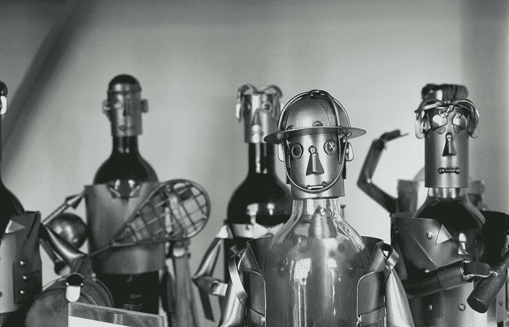
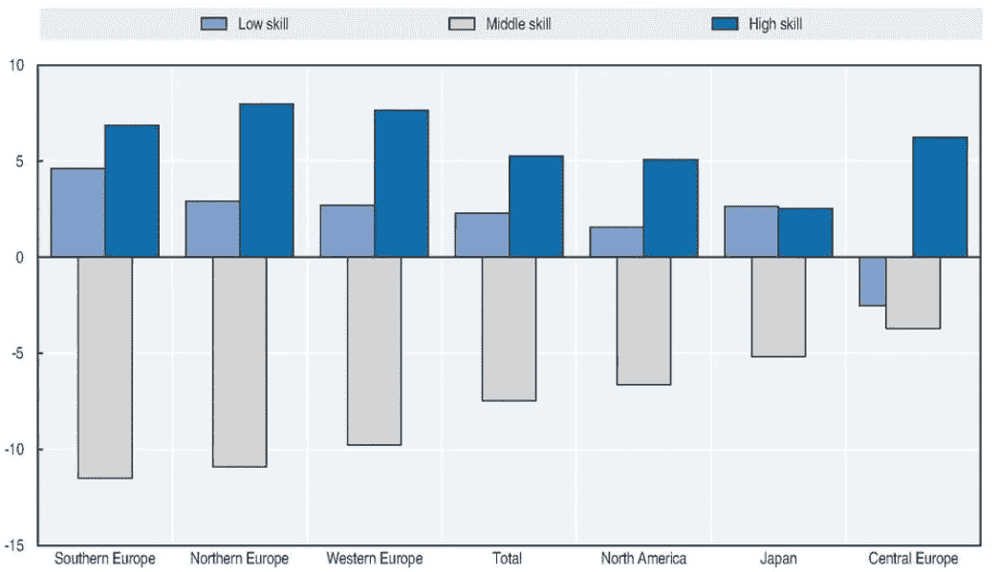

# 不，你不会和机器人一起工作

> 原文：<https://towardsdatascience.com/no-you-wont-work-alongside-robots-dbc716175d78?source=collection_archive---------40----------------------->

## 人工智能的新进展预示着人机共生时代的到来

照片由 [Jehyun Sung](https://unsplash.com/@jaysung?utm_source=unsplash&utm_medium=referral&utm_content=creditCopyText) 在 [Unsplash](https://unsplash.com/s/photos/killer-robot?utm_source=unsplash&utm_medium=referral&utm_content=creditCopyText) 上拍摄

1997 年，IBM 的“深蓝”击败了当时的世界象棋冠军加里·卡斯帕罗夫。世界震惊了。似乎迄今为止被认为只不过是美化了的计算器的计算机，最终侵入了人类想象力和创造力的领域。

担心是徒劳的。深蓝没有创造力。它仅凭蛮力就赢了，每秒钟评估 2 亿个位置。将如此初级的算法与人类的创造力相提并论是令人厌恶的。当这个没有头脑的机器在试错中辛苦工作时，卡斯帕罗夫被他的潜意识温柔地召唤着采取有希望的行动。他有直觉，*它*仍然只是一个装有类固醇的算盘。

和之前无数的人工智能一样，深蓝也不得不抑制自己的雄心。它不是取代我们，而仅仅是补充。卡斯帕罗夫意识到“计算机擅长的就是人类薄弱的地方，反之亦然。”在这种洞察力的鼓舞下，他组织了一场比赛，让人类和机器可以搭档比赛。果然，一对人机，一个凭直觉，一个精于计算，证明了它比任何纯人工对手都优越。即使只有一个屁股，我们人类仍然可以证明我们坐在游戏凳上是合理的。

深蓝的寓言经常被认为是人类和计算机天生互补的证明。“当然，机器一天比一天聪明”，碳-硅共生体承认，“但是只渴望我们发现平凡的乏味任务，它们永远不会完全取代我们。自动取款机并没有让银行出纳员变得过时。相反，这些设备解放了职员，让他们从事更有意义的工作，比如提供金融专业知识。

人类和计算机不可分割地交织在一起，没有对方就不完整，这种观点和计算机本身一样古老。早在 1843 年，世界上第一个计算机程序的作者阿达·洛芙莱斯就宣称，她所工作的现代计算机的前身“没有任何创造任何东西的野心”。它可以跟随分析，但它没有能力预测任何分析关系或真理。”

艾伦·图灵后来称之为“洛夫莱斯夫人的反对意见”，大约一个世纪后，控制论先驱诺伯特·维纳将其引入主流。当他在麻省理工学院的同事马文·明斯基和约翰·麦卡锡正在寻求创造在各方面都超过人类的智能机器时，维纳认为一条更有成效的道路是“设计出能与人类思维很好合作的机器，而不是试图取代它们。”

他的信念或许更适合宗教领袖，而不是头脑冷静的科学家，他宣扬道:“计算机越强大，将它与想象力、创造力和高级人类思维联系起来的价值就越大。”

在众多被维纳福音带走的研究人员中，有约瑟夫·利克里德。作为一名多才多艺的科学家，Licklider 在技术和心理学方面都游刃有余，他是想象人和机器如何在合作伙伴关系中一起工作的大师。他开创了去中心化网络和分时共享的概念，这两个概念在现代互联网的创建中都是不可或缺的。

但在 Licklider 的所有贡献中，他在 1960 年发表的具有里程碑意义的论文《人机共生》在硅谷的精神景观中留下了最大的陨石坑。“计算机技术的大多数重大进步——包括我的团队在 PARC 施乐公司所做的工作——都只是对利克设想的推断，”PARC 计算机科学实验室的创始人罗伯特·泰勒证实道。

幸运的是，在 70 年代末，乔布斯和沃兹尼亚克将其中的一些进步，包括鼠标和图形用户界面，整合到苹果 2 中，这是世界上第一台大规模销售的个人电脑。最后，计算机进入了普通美国人的家庭，不是为了嘲弄，而是为了增强主人的智力。乔布斯将新机器比作一种工具，称之为“大脑的自行车”。

从苹果手中接过接力棒的软件远见者也有类似的倾向:人类应该被赋予权力，而不是被取代。微软将开发一些程序，把办公室工作人员从手工文档管理的恐惧中解放出来。MATLAB 将帮助科学家进行机械计算，允许他们以前所未有的速度测试原始假设。谷歌地图将弥合从比特到原子的鸿沟，帮助我们在现实世界中导航。

甚至是 IBM 的沃森，*的 Jeopardy！*-在节目中扮演支配人类对手的计算机，是在增强意识的基础上开发的。至少有一段时间，它在医生身边找到了自己的家，帮助他们理解病人表现出的无数症状。正如 IBM 研究部主任约翰·凯利所说:“……在认知系统的时代，人类和机器将合作产生更好的结果，每个人都为这种合作带来自己的优势技能。”

在今天，有了智能助手在我们手中，我们向 Licklider 预言的人机共生体的蜕变一如既往地完整。但是，即使计算的历史讲述了无数人与机器之间的友谊故事，我们也不能自欺欺人地认为，后者融入劳动力大军无疑对所有人都有好处。

当数字时代的技术专家沉浸在个人电脑革命的兴奋中时，他们在社会科学部门的朋友们却在焦虑不安。西方世界自 20 世纪 70 年代以来经历的经济不平等的急剧上升似乎与个人电脑的出现完全吻合。

衡量财富不平等的一种方法是使用 T4 技能的概念，或者一个人的正规教育水平。不管是好是坏，这个看似粗糙的近似值[与工人的工资](http://piketty.pse.ens.fr/files/Autor2014.pdf)密切相关。现在，经济学家绘制了每一个职业在过去几十年中平均工资(或在总就业中的份额)的变化，作为该工作所需技能水平的函数。他们所看到的使他们震惊。历史上第一次，图表被扭曲成 u 形。

新技术似乎对低技能和高技能工人都有帮助，但对中等技能的工人帮助不大。正如经济学家丹尼尔·苏斯金德(Daniel Susskind)在他的新书《一个没有工作的世界》(A World Without Work)中所说，“许多经济体传统上为中产阶级提供高薪工作的丰满腹部正在消失。”。我们可以在下图中清楚地看到这一趋势:

1995 年至 2015 年选定经济区域总就业份额的百分点变化。来源:[OECD 2017 年就业展望](https://read.oecd-ilibrary.org/employment/oecd-employment-outlook-2017/how-technology-and-globalisation-are-transforming-the-labour-market_empl_outlook-2017-7-en#page1)。

“作为整体就业的一部分，现在有更多的高收入专业人士和经理，以及更多的低收入护理人员和清洁工，教学和医疗助理，护理员和园丁，服务员和理发师。但中等收入的秘书和行政职员、生产工人和销售人员却越来越少。更重要的是，尽管劳动力市场已经变成了两级市场，但是高技能人群的工资却大幅上涨。

为了理解新的经济现实，一个由三名麻省理工学院经济学家组成的小组提出了一个理论，这个理论后来以“[奥托-利维-默南(ALM)假说](https://economics.mit.edu/files/11574)”而闻名首先，男人们认识到许多中产阶级的工作很大程度上由日常任务组成，这些任务可以通过遵循明确、易于表达的规则来完成。第二，他们观察到这样的任务特别适合自动化，因为遵循一套清晰的指令正是现代计算机擅长的。

因此，ALM 假说在劳动力市场的空心化和 Licklider 的人机互补理论的广泛采用之间建立了联系。它表明，即使我们认知能力的部分自动化也会对我们的就业前景产生有害影响。是的，人和机器现在确实在办公室里并肩工作。但是一双这样的鞋被证明是如此的有效，以至于每一双鞋就有十个人在麦当劳从穿西装变成穿围裙。

至少就目前而言，还有一线希望。经济学家一致认为低技能和高技能工作是安全的。在光谱的一端，遛狗者和出租车司机，在另一端，工程师和医生，没有可辨别的正式规则可循。这类任务缺乏可以翻译成计算机代码的明确说明手册，因此不受自动化的影响。也就是说，直到最近…

大约在阿达·洛芙莱斯宣称她怀疑计算机能“创造”任何东西的时候，与她同时代的作家玛丽·雪莱构想了一个完全不同的装置。她笔下的弗兰肯斯坦怪物不仅具有想象力，而且还拥有一大堆人类天赋。与阿达的客观机器形成鲜明对比的是，这种生物感受到了情感，它巨大的爱的能力——以及令读者恐惧的恨——甚至挑战了我们自己的情感。

1956 年，雪莱的文学思考在如今颇具传奇色彩的达特茅斯研讨会上以严格的数学形式化，在那里，一群志趣相投的科学家在弗兰肯斯坦式的渴望驱使下，创造出比 Licklider 和他的追随者认为实用的更接近他们形象的机器，为他们称为*人工智能的研究领域奠定了基础。这个研讨会的提议是“……学习的每个方面或智力的任何其他特征原则上都可以被精确地描述，以至于可以用机器来模拟它”，这是这个新领域的主要原则。*

模拟智力的确切方法还没有具体说明。很快，一些根本不同的方法开始崭露头角，这个新生的学科一分为二。

大多数研究人员认为人类的知识可以直接提取到软件中。他们试图记下专家在执行任务时遵循的所有可能的逻辑规则，并费力地亲手将它们硬编码到计算机中。IBM 的深蓝和沃森就是这种方法的例子，也是《经济学人》的资产负债管理假说的基础。这种技术在解决算法问题上结出了丰硕的果实，我们大多数人都觉得这是一项脑力劳动，比如定理证明，但事实证明，当面对人类下意识完成的任务时，比如从大量像素中识别出一只猫的轮廓，这种技术完全不够用。

另一小组科学家很早就预见到了这些局限性。他们没有刻意将大脑建模为事实和规则的固定组合，而是试图让计算机自己学习世界是如何运转的。

*机器学习*阵营强势冲出盖茨。1958 年，就在达特茅斯研讨会两年后，哈佛大学心理学家弗兰克·罗森布拉特从我们大脑的工作中获得灵感，开发了一个能够学习识别数字的生物神经元的简化模型。这个模型被称为*感知器*，引发了一阵兴奋，《纽约时报》*甚至宣称它“……将能够走路、说话、看、写、自我复制并意识到自己的存在。”*

尽管最初大肆宣传，单个神经元只能做这么多。赋予大脑巨大能力的是数以百万计的神经元，它们被组织成一个深层次的堆栈，每一个连续的层都形成了对感官所感知的事物的更好理解。然而，将罗森布拉特的感知器组织成这样的层级结构，却比预期更困难。目前还不清楚不同层次的神经元应该如何相互交流，以形成对世界的共同理解。在接下来的几十年里，进展甚微。

20 世纪 80 年代，当几个独立的研究人员，其中包括图灵奖获得者杰弗里·辛顿，发现了通过神经元层次传递的正确信号时，事情又有了转机。随着主要障碍的克服，狂热的研究随之而来。1989 年，另一位图灵奖获得者 Yann LeCun 开发了一个能够识别手写数字的人类视觉皮层的原始模型。八年后，德国科学家 Juergen Schmidhuber 和 Sepp Hochreiternd 将神经网络提升到序列领域，赋予它们理解长段文本、音频和 DNA 的能力。

不幸的是，在 21 世纪初，研究遇到了另一个障碍。虽然在图像和语音识别等任务上已经取得了很大的进步，但模型的表现远不及人类。很明显，进一步的进展需要更大的模型。人类大脑由数十亿个神经元组成，形成数万亿个连接，但它们的人工对应物只有数万个参数。即便如此，那些相对较小的型号已经达到了当代 CPU 硬件的极限。研究人员陷入了僵局。

2012 年，当 Hinton 的门徒 Alex Krizhevsky 意识到神经网络背后的数学几乎与计算机图形学中的数学相同时，一个解决方案出现了。两者的核心都是巨大的矩阵乘法，游戏行业已经投入了数十亿美元进行优化。在这种观点的驱动下，Krizhevsky 放弃了通用 CPU，转而使用显卡。后者支持的模型比迄今为止所设想的任何模型都要大一个数量级，这导致了 Krizhevsky 在当年所有领先的图像识别比赛中的尤塞恩·博尔特式的统治地位。

其他研究人员很快跟上，开始了对越来越大的神经网络的军备竞赛。建立了一个又一个图形卡仓库，其中有超过一亿个参数的巨大模型。在过去几年中，这些非常强大的模型已经在语音转录、物体检测和视频游戏等多种任务中超越了人类。他们甚至创作音乐和艺术。简而言之，他们终于摆脱了非原创性的枷锁，步入了直觉和创造力的领域。当然，艾达在九泉之下也不会安宁。

他的新科技景观留给人类的空间很少。21 世纪初提出的 ALM 假说没有考虑到机器学习革命。计算机只限于执行有明确指令的任务这一假设不再成立。向低技能劳动力和高技能专家承诺的安全港正在消失。

以送餐为例。没有任何其他领域的人机共生像这里这样堪称典范，机器处理数据以找到最佳路线，而人则做实际的跑腿工作。但是，随着车轮上的电脑证明了它们比车轮上的青少年优越，这种原始的安排已经开始瓦解。自动送货机器人充斥着街道，很快，人类不再能够对送货过程的任何部分做出有意义的贡献。机器正在接管整个管道。

或者参加医学诊断。Alphabet 的人工智能部门 DeepMind 开发了一种神经网络，在诊断五十多种眼病方面优于眼科医生。它还推出了一种算法，能够在 x 射线中准确地发现乳腺癌，甚至比放射科医生更好。更引人注目的是，牛津的一个团队利用机器学习开发了一种“指纹”，可以用来预测未来几年的致命心脏病发作。趋势很明显:未来的诊断医生将由硅制成。

诸如此类的例子并非个别现象，而是常态。现在，在蛮力计算和直觉模式匹配方面都优于我们的机器，正在让我们变得多余。我们不再增加合作的价值。随着机器人涌向街头工作，我们被集体推到街头乞讨。人们只能希望他们给我们一两个季度。