# 节点嵌入

> 原文：<https://towardsdatascience.com/node-embeddings-e28799478cb9?source=collection_archive---------32----------------------->

## [入门](https://towardsdatascience.com/tagged/getting-started)

[乌列尔 SC](https://unsplash.com/@urielsc26?utm_source=medium&utm_medium=referral) 在 [Unsplash](https://unsplash.com?utm_source=medium&utm_medium=referral) 上的照片

# 介绍

这是从[克里斯特斯·齐亚卡斯](https://www.linkedin.com/in/christos-ziakas-5783079a/)、[扬·吕廷格](https://www.linkedin.com/in/janruettinger/)、[到里希特](https://www.linkedin.com/in/till-richter-659334157/)的节点嵌入调查。它是在 TUM 数据分析和机器学习小组的[机器学习实验室](https://www.in.tum.de/daml/lehre/machine-learning-lab/)中进行的。我们感谢 [Oleksandr Shchur](https://www.in.tum.de/daml/team/oleksandr-shchur/) 监督我们的项目，并感谢[günnemann 博士教授](https://www.in.tum.de/daml/team/guennemann/)让我们有可能在他的团队中进行研究。

这个项目的代码可以在 [GitHub](https://github.com/richtertill/node_embeddings) 上找到。

我们希望这篇文章有助于理解现代节点嵌入模型的基础，并提供一些不同方向的最佳实践。当然，类似的评估协议也是公开的。

# 为什么是图表？

图表已经变得无处不在。你不能只把社交网络理解为图形结构，还可以理解为生物结构、搜索引擎等等。甚至图像分类任务也在用图结构进行探索。因此，对信息强大表示的研究兴趣增加了。然而，很难将经典的机器学习模型应用于图结构，因为它们是为不同的数据表示而设计的。此外，天真地将它们应用于图结构被证明是低效的。

# 应用程序

节点嵌入的潜在动机在于捕捉图或图的节点的特征的可能性。社区、邻近或节点的角色只是有趣应用的几个例子。利用嵌入式空间中的计算，可以利用矢量数据的标准机器学习模型。这样，就可以应用广泛和成熟的方法，如分类、预测或聚类。

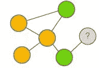

节点分类，按作者分类的图像

节点分类可用于对节点进行分类，例如，如果某个机构的社交网络中的人更可能是博士生或教授。在我们的实验中，这种分类完全依赖于非属性图，基于图的结构和已知节点的类别。

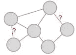

链接预测，作者图片

例如，在给定两个人已经见过的人的情况下，链接预测可以回答这两个人见面的可能性有多大的问题。在这种情况下，甚至不需要考虑节点的类。

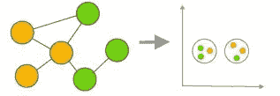

节点聚类，按作者分类的图像

由于社交网络中的人彼此接近，节点聚类可以应用于将他们分组在一起，例如，为了将大学教职员工中的机构聚集在一起。在这个例子中，来自一个研究所的员工比来自其他研究所的员工彼此更接近。这种接近可以表述为“相互了解”。

# 动机

许多科学家正在研究这一有趣的现象。在不同的想法之后，取得了巨大的成果。然而，这导致了不可比性。使用不同的评估协议，并且大多数资源当然被投入到新颖的方法中，而不是要击败的前辈。因此，进步的其他原因，如技术优势或更多的投入资源，可能不会在比较中进行审查。这些和其他方面导致在该领域中不完全可比的结果。这项工作的目标是提供一个基本原则的可靠比较，这些基本原则是大多数新颖想法的基础。为了实现这一目标，尽可能使用相同的环境和相同的评估协议。这使得结果具有可比性。在这个项目中，我们只依赖于非属性图，这意味着只有节点的类和图的结构是已知的。

# 嵌入技术

我们遵循嵌入技术，除了流行的图形神经网络，奠定了节点嵌入的大多数新方法的基础。相比之下，我们更多地放弃了调整模型的现代方法。因此，这项工作为节点嵌入的基础技术提供了比较。这些模型被细分为不同的相似性得分，即显示图中节点邻近性的度量。

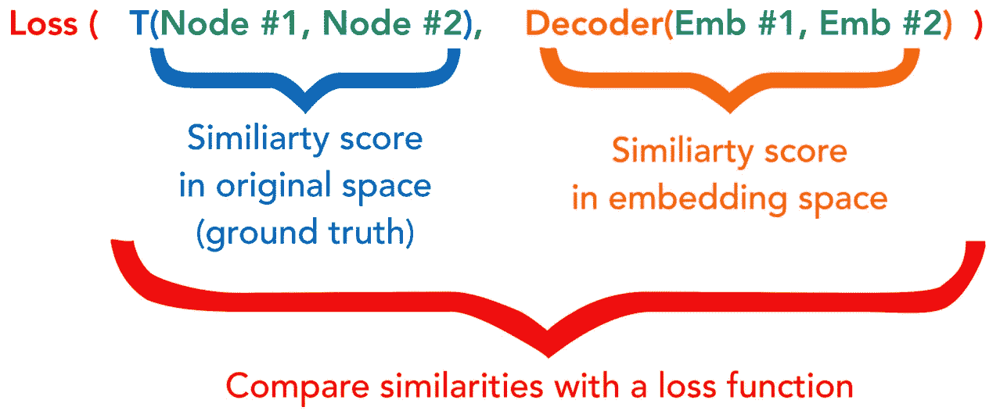

图 1:节点嵌入的损失，作者图片

## 伯努利(4 种型号)

对于伯努利模型，真实图的相似性得分以邻接矩阵的形式给出。因此，如果两个节点相连，则条目为 1，否则为 0。解码器给出嵌入空间中的相似性得分，其可以是 sigmoid、指数、高斯或基于距离的嵌入。因此，给定嵌入矩阵，我们对损耗建模以生成邻接

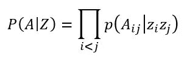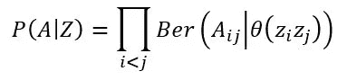

伯努利可能性，作者图片

其中内核可以是

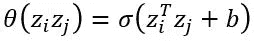

Sigmoidal，作者提供的图像

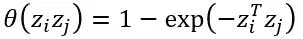

指数，作者图片

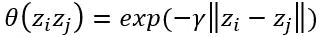

高斯(也是径向基函数核)，图片作者

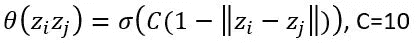

基于距离的#2，图片由作者提供

训练模型，即。让嵌入尽可能接近原图，对数似然最大化。

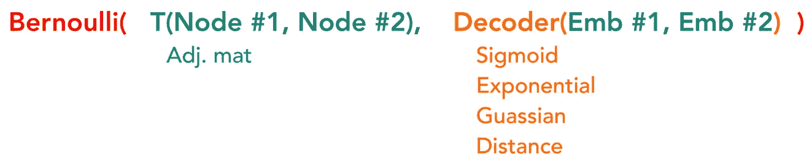

伯努利可能性，作者图片

## KL 分歧(3 个模型)

KL 散度是一个概率分布与另一个概率分布的不同程度的度量。在我们的例子中，图表被建模为一个概率分布，即。图形矩阵的行数总和为 1。使用不同的模型来捕获概率分布中的真实图形特征，即个性化页面排名、转移的幂和以及转移矩阵。当然，嵌入空间中的图也需要是有效的概率分布，以便 KL 散度有意义，因此 Softmax 应用于嵌入节点。为了使嵌入的图形尽可能接近原始图形，或者更准确地说，接近在各个编码器中捕获的图形特征，KL 散度被最小化。

KL Divergence，作者图片

## 奇异值分解(7 种型号)

在奇异值分解中，众所周知的方法被应用于能够捕捉图形特征的不同矩阵。这样，矩阵被嵌入到低维空间中。

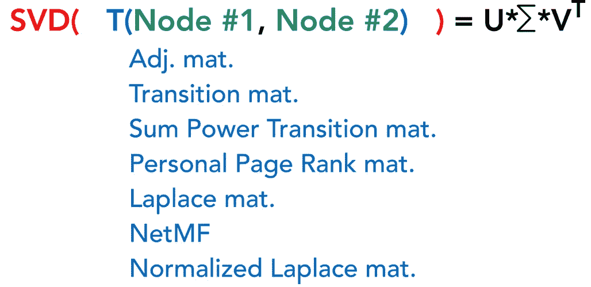

奇异值分解，作者图片

# 实验

总共 14 种嵌入方法使用 3 个评估任务在 4 个流行的图数据集上进行比较。

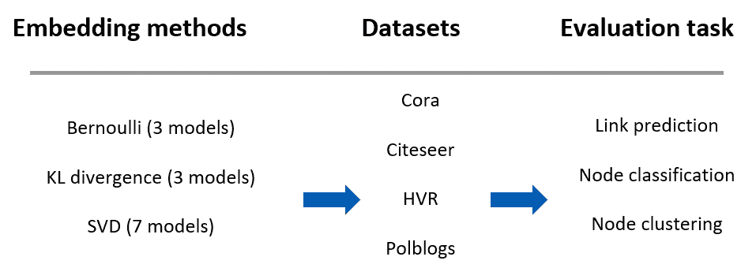

实验概述，作者图片

# 调查的结果

对于结果，在不同的嵌入技术下，相同的相似性度量(例如邻接矩阵)之间的比较是特别有趣的。

## 关于链路预测:

对于相同的相似性度量，对于随机矩阵，基于 KL 的模型优于基于 SVD 的模型。

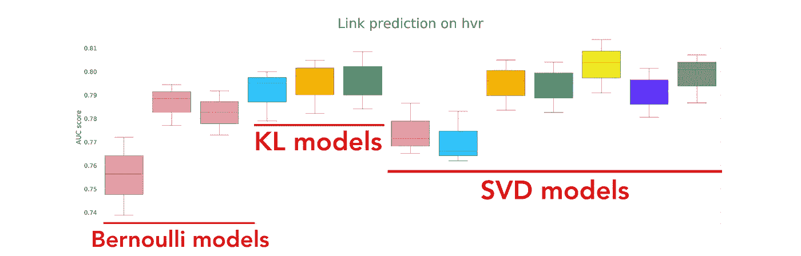

链接预测的结果，图片由作者提供

## 关于节点分类:

对于节点分类，所有模型都表现出相似的性能。

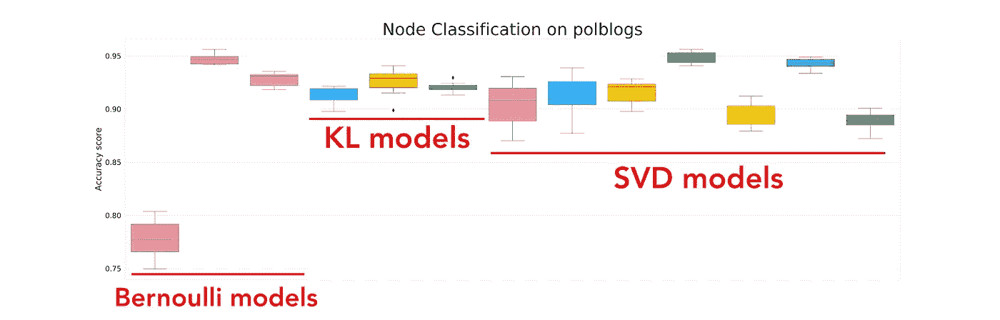

节点分类结果，按作者分类的图像

## 关于节点群集:

基于 KL 的模型比基于 Bernoulli 和 SVD 的模型表现更好。特别是 SVD 由于在更高的维度中包含了太多的噪声而失去了这种比较。在奇异值分解结果中，对此进行了进一步分析。

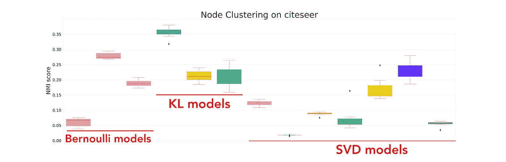

节点聚类的结果，按作者分类的图像

## 在 SVD 上:

随着嵌入维数的增加，SVD 模型的节点聚类性能下降。

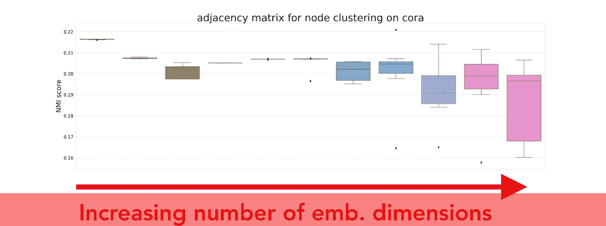

增加嵌入维数下的奇异值分解结果，图片由作者提供

## 关于伯努利:

基于 z_i - z_j 的模型比基于 ZZ^T 的模型表现更好。其原因可能是随着乘法运算而出现的正则化的必要性。为了便于比较，正则化被排除在外。

## 关于收敛时间:

尤其引人注目的是，基于 KL 的模型比基于 Bernoulli 的模型收敛得更快。

# 结论

在这项工作中提供了节点嵌入的基本原则的基准。所进行的实验证明了这样的假设，即在开发新方法之前，应该重新考虑基本原理，因为结果可能是显著不同的性能。我们公开提供我们实验的代码。如有疑问和反馈，请随时联系我们！