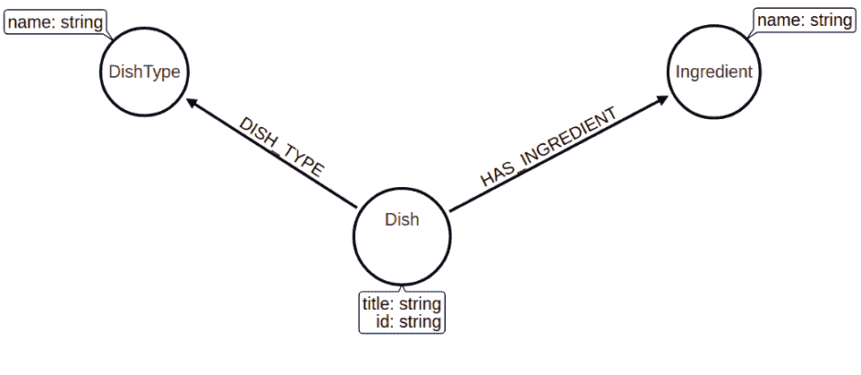

# 节点嵌入:使用 Neo4j 的 Node2vec

> 原文：<https://towardsdatascience.com/node-embeddings-node2vec-with-neo4j-5152d3472d8e?source=collection_archive---------23----------------------->

## 了解如何使用 Neo4j 图形数据科学训练您的自定义 node2vec 算法

我上一篇关于[将图形与 NLP](/nlp-and-graphs-go-hand-in-hand-with-neo4j-and-apoc-e57f59f46845) 技术相结合的博文是迄今为止最成功的。这促使我写更多关于这个话题的东西。在我的研究过程中，我偶然发现了 node2vec 算法，并注意到用 [Neo4j](https://neo4j.com/) 和[图形数据科学库](https://github.com/neo4j/graph-data-science)来实现它是多么容易。我想这让我别无选择，只能戴上我的 [Neo4j 数据科学眼镜](https://imgur.com/a/eR1t5Sk)并展示实现它是多么容易。

# 图形导入

今天我们将使用 Kaggle 上的[匙羹鱼食物数据集](https://www.kaggle.com/hawkash/spoonacular-food-dataset)。它包含营养信息以及 1600 多种菜肴中使用的配料。不幸的是，它没有包含酸奶面包的配方。



图表模式

图形模式中有三种类型的节点。一道菜由一种或多种食材组成，我们将其表示为一道菜与其食材之间的联系。食谱分为不同的类别或类型，如午餐、早餐等等。我们使用`apoc.schema.assert`过程来定义图表模式。它允许我们在一个查询中描述多个索引和唯一约束。

```
CALL apoc.schema.assert(
  // define indexes
  null,
  // define unique constraints
 {Ingredient:['name'], Dish:['id'], DishType:['name']})
```

在执行导入查询之前，我们必须下载数据集并将其复制到 Neo4j 导入文件夹中。在导入查询中，我们做了一点点预处理，将配料的名称小写，并用空格替换破折号(`-`)。

```
LOAD CSV WITH HEADERS FROM "file:///newfood.csv" as row
CREATE (d:Dish{id:row.id})
SET d += apoc.map.clean(row, ['id','dishTypes','ingredients'],[])
FOREACH (i in split(row.ingredients,',') | 
    MERGE (in:Ingredient{name:toLower(replace(i,'-',' '))}) 
    MERGE (in)<-[:HAS_INGREDIENT]-(d))
FOREACH (dt in split(row.dishTypes,',') | 
    MERGE (dts:DishType{name:dt}) 
    MERGE (dts)<-[:DISH_TYPE]-(d))
```

# 基本图形探索

首先，我们将进行一些图形探索。我们来看看哪些食材用的最多。

```
MATCH (n:Ingredient) 
RETURN n.name as ingredient, 
       size((n)<--()) as mentions
ORDER BY mentions DESC 
LIMIT 10
```

结果

橄榄油是迄今为止最受欢迎的，因为它在超过一半的食谱中使用。慢慢接着是大蒜、盐和黄油。我不知道黄油如此受欢迎。我也发现凤尾鱼被如此广泛地使用是相当令人惊讶的。或者也许数据集只是偏向于含有凤尾鱼的菜肴。

我们可以在这个数据集的基础上构建一个应用程序，根据我们想要烹饪的配料来搜索食谱。我从[马克·尼达姆](https://twitter.com/markhneedham)和 [Lju Lazarevic](https://twitter.com/ElLazal) 写的[什么是烹饪系列](https://dzone.com/articles/whats-cooking-part-2-what-can-i-make-with-these-in)中借用了这个密码查询。比方说，你今天想吃西葫芦和羊乳酪，但不知道该吃哪种食谱。幸运的是，我们的应用程序可以通过下面的 cypher 查询帮助我们解决这个问题。

```
WITH ["feta cheese", "zucchini"] as ingredients
MATCH (d:Dish)
WHERE 
  all(i in ingredients WHERE exists(
  (d)-[:HAS_INGREDIENT]->(:Ingredient {name: i})))
RETURN d.title AS dish
ORDER BY size(ingredients)
LIMIT 10
```

结果

我们可以配沙拉或鱼。我想我会跳过去 node2vec 吃甜点。

# Node2vec 算法

node2vec 算法相对较新。它是在 2016 年由 Jure Leskovac 和 Aditya Grover 在一篇文章 [node2vec:可扩展的网络特征学习](https://arxiv.org/abs/1607.00653)中提出的。要了解它是如何工作的，首先要了解 word2vec 算法。Word2vec 算法是由谷歌的托马斯·米科洛夫领导的研究团队在 2013 年提出的。使用神经网络来学习单词嵌入是一种流行的技术。它将一个句子列表作为输入，并为文本语料库中出现的每个单词生成一个向量或嵌入。词义相近的词在嵌入空间上要更近一些。比如苹果和梨应该比苹果和汽车更相似。word2vec 有两种训练算法。第一种方法被称为连续单词袋(CBOW)，它使用单词的上下文来预测目标术语。上下文被定义为出现在文本中目标单词附近的单词。第二种方法叫做跳格法。它不是试图从上下文中预测目标单词，而是试图预测给定术语的上下文。如果您想了解更多关于 word2vec 算法的知识，互联网上有大量关于它的好文献。

你可能会问我们是如何从 word2vec 到 node2vec 的。这其实很简单。我们不使用句子列表作为输入，而是使用随机漫步列表。这是唯一的区别。

# Neo4j 图形数据科学库

[Neo4j 图形数据科学](https://github.com/neo4j/graph-data-science)库支持[随机游走算法](https://neo4j.com/docs/graph-data-science/current/alpha-algorithms/random-walk/)，这使得我们实现 node2vec 算法变得非常容易。如果你需要快速复习一下 GDS 图书馆是如何运作的，你可以看看我之前的博客文章。我们将从投影内存中的图形开始。我们将所有三个节点标签和项目关系描述为无向的。

```
CALL gds.graph.create('all',
    ['Dish', 'Ingredient'],
    {undirected:{type:'*', orientation:'UNDIRECTED'}})
```

现在我们准备训练我们的第一个 node2vec 模型。该流程将包括三个部分:

1.  从图中的每个节点开始执行随机行走算法
2.  将随机漫步输入 word2vec 算法
3.  通过查看最相似的邻居来检查结果

随机行走算法有一个可选的`start`参数，可以用来定义行走的起始节点。我们还可以用`steps` 设置指定行走的长度，用`walks`参数指定行走的次数。请注意，每次执行随机漫步时，我们都期望得到不同的结果。

我们将使用 [gensim 库](https://radimrehurek.com/gensim/)中的 Word2vec 算法实现。它还有几个我们可以定义的超参数。最值得注意的是:

*   **大小**:嵌入向量的维数
*   **窗口**:当前字和预测字之间的最大距离
*   **min_count** :训练模型时要考虑的最小字数；出现次数少于此计数的单词将被忽略。
*   **sg** :训练算法:跳格 1；否则默认 CBOW

查看[官方文档](https://radimrehurek.com/gensim/models/word2vec.html)了解更多关于 word2vec 超参数的信息

结果

```
[('anchovy fillet', 0.6236759424209595),
 ('pork shoulder roast', 0.6039043068885803),
 ('penne', 0.5999650955200195),
 ('cherry', 0.5930663347244263),
 ('cooked quinoa', 0.5898399353027344),
 ('turkey', 0.5864514112472534),
 ('asiago cheese', 0.5858502388000488),
 ('pasillas', 0.5852196216583252),
 ('fresh marjoram', 0.5819133520126343),
 ('prunes', 0.5735701322555542)]
```

如果我知道有这么简单，我早就写 node2vec 算法了。另一方面，结果有点可疑。我不知道这个数据集和凤尾鱼有什么关系。看起来食谱大多是由真正喜欢它们的人写的。你可能会得到完全不同的结果。

在[最初的 node2vec 论文](https://arxiv.org/abs/1607.00653)中，作者定义了两个控制随机漫步执行的参数。第一个是返回参数。

> ***返回参数*** *，p .参数 p 控制在行走中立即重访一个节点的可能性。将其设置为较高的值(> max(q，1))确保我们不太可能在接下来的两步中对已经访问过的节点进行采样(除非遍历中的下一个节点没有其他邻居)。该策略鼓励适度探索，并避免采样中的 2 跳冗余。另一方面，如果 p 较低(< min(q，1))，它将导致遍历返回一步(图 2)，这将使遍历“局部”靠近起始节点 u。*

第二个参数称为输入输出参数。

> ***In-out 参数*** *，q .参数 q 允许搜索区分“向内”和“向外”节点。回到图 2，如果 q > 1，则随机行走偏向于靠近节点 t 的节点。这种行走相对于行走中的开始节点获得基础图的局部视图，并且在我们的样本包括小局部内的节点的意义上近似 BFS 行为。相反，如果 q < 1，walk 更倾向于访问离节点 t 更远的节点。这种行为反映了鼓励向外探索的 DFS。然而，这里的一个本质区别是我们在随机游走框架内实现了类似 DFS 的探索。因此，被采样的节点与给定的源节点 u 的距离不是严格递增的，但是反过来，我们受益于易处理的预处理和随机行走的优越采样效率。注意，通过将πv，x 设置为行走 t 中前一节点的函数，随机行走是二阶马尔可夫的。*

总之，return 参数指示随机漫步多长时间回溯一步或两步。进出参数控制随机行走是更侧重于局部探索(类似于 BFS)还是更倾向于向外探索(类似于 DFS)。尽管随机游走算法仍处于 alpha 层，但它支持这两个 node2vec 参数。让我们在实践中尝试一下。

结果

```
[('leg of lamb', 0.7168825268745422),
 ('anise seeds', 0.6833588480949402),
 ('basic bruschetta', 0.6759517192840576),
 ('dried chilli flakes', 0.6719993352890015),
 ('tuna in olive oil', 0.6697120666503906),
 ('spaghetti pasta', 0.669307291507721),
 ('prime rib roast', 0.661544919013977),
 ('baby artichokes', 0.6588324308395386),
 ('rice vermicelli', 0.6581511497497559),
 ('whole wheat fusilli', 0.6571477651596069)]
```

看结果让我很饿。羊腿和橄榄油要不要算类似食材，真的不好说。如果我们观察图表，在八个包含羊腿的食谱中，有七个也使用橄榄油。按这种逻辑，两者颇为相似。

在下一个例子中，我们将展示如何运行 node2vec 算法并将结果嵌入存储回 Neo4j。我们将返回内部的 Neo4j 节点 id，而不是返回菜肴和配料的标题。这将有助于我们有效地将结果链接回 Neo4j。

这些嵌入现在在 word2vec 模型的词汇表中可用。我们将使用`UNWIND` cypher 语句将它们一次性存储到 Neo4j 中。如果可能的话，尽量避免每行提交一个事务，因为这不是很高效。

Word2vec 模型使用余弦相似度来查找最相似的单词。图形数据科学库还支持[余弦相似度算法](https://neo4j.com/docs/graph-data-science/current/alpha-algorithms/cosine/)，可用于推断相似度算法。与所有相似性算法一样，我们必须微调`similarityCutoff`和`topK`参数以获得最佳结果。它们直接影响推断的相似性图的稀疏程度。

```
MATCH (node) 
WITH id(node) as id, node.embedding as weights 
WITH {item:id, weights: weights} as dishData 
WITH collect(dishData) as data 
CALL gds.alpha.similarity.cosine.write({
    nodeProjection: '*', 
    relationshipProjection: '*', 
    similarityCutoff:0.5, 
    topK:5, 
    data: data,
    writeRelationshipType:'COSINE_SIMILARITY'}) 
YIELD nodes, similarityPairs 
RETURN nodes, similarityPairs
```

结果

为了完成这个分析，我们将使用[标签传播算法](https://neo4j.com/docs/graph-data-science/current/algorithms/label-propagation/)检查推断网络的社区结构。由于我们只对社区结构的大致轮廓感兴趣，我们可以使用算法的`stats`模式为我们提供一些基本的社区结构统计数据。

```
CALL gds.labelPropagation.stats({
    nodeProjection:'*', 
    relationshipProjection:'COSINE_SIMILARITY', 
    maxIterations:20}) 
YIELD communityCount, communityDistribution
RETURN communityCount,
       apoc.math.round(communityDistribution.p50,2) as p50,
       apoc.math.round(communityDistribution.p75,2) as p75,
       apoc.math.round(communityDistribution.p90,2) as p90,
       apoc.math.round(communityDistribution.p90,2) as p95,
       apoc.math.round(communityDistribution.mean,2) as mean,
       apoc.math.round(communityDistribution.max,2) as max
```

结果

标签传播算法在相似性网络中找到 118 个组。其中大多数成员不到 40 人。有一些大型社区，最大的有 393 名成员。

# 结论

node2vec 算法是一种学习图中节点的低维表示的有用方法，可以在机器学习管道的下游使用。在这篇博文中，我意识到改变随机游走算法参数以及 word2vec 超参数可以产生非常不同的结果。尝试一下，看看什么最适合你。

和往常一样，代码可以在 [GitHub](https://github.com/tomasonjo/blogs/blob/master/custom_node2vec/node2vec%20algorithm.ipynb) 上获得。