# 正则化方法:用于改进深度学习模型的噪声

> 原文：<https://towardsdatascience.com/noise-its-not-always-annoying-1bd5f0f240f?source=collection_archive---------16----------------------->


## 将随机噪声引入训练过程

当你开始学习神经网络时，你学到的第一个概念是 [**过拟合**和**欠拟合**](/what-are-overfitting-and-underfitting-in-machine-learning-a96b30864690) 的含义。有时，训练一个完美概括数据的模型是一项挑战，尤其是当您有一个小数据集时，因为:

*   当您使用小数据集训练神经网络时，网络通常会记住训练数据集，而不是学习我们数据的一般特征。因此，该模型在训练集上表现良好，在新数据(例如:测试数据集)上表现不佳
*   一个小的数据集不能很好地描述我们的问题，因此，它可能会导致一个难以学习的问题。

获取更多的数据是一项非常昂贵和艰巨的任务。然而，有时你可以应用一些技术(正则化方法)来获得更好的模型性能。

在本文中，我们将重点关注使用**噪声作为神经网络**中的正则化方法。这种技术不仅减少了过度拟合，而且还可以更快地优化我们的模型，提高整体性能。

你可以在我的 [GitHub](https://github.com/alejandrods/Noise-Regularization-Method-Neural-Network) 中找到完整的代码！:)

# 目标

这一条的目标如下:

*   使用 sklearn 生成合成数据
*   正则化方法
*   训练一个基本的神经网络作为基线(MLP)
*   使用噪波作为正则化方法-输入图层
*   使用噪波作为正则化方法-隐藏层
*   使用噪声作为正则化方法-输入和隐藏层
*   网格搜索以查找模型最佳性能的值

# 正则化方法

训练一个机器学习模型是一个挑战，它将在以前看不见的输入上表现良好，而不仅仅是那些我们的模型被训练的输入。这个特性被称为 [**泛化**](https://books.google.es/books?id=Np9SDQAAQBAJ&pg=PA107&lpg=PA107&dq=The+central+challenge+in+machine+learning+is+that+our+algorithm+must+perform+well+on+...&source=bl&ots=kROllLy-_Z&sig=ACfU3U1FzdT_Vg1GkcsBupzbmt8YHWQvhw&hl=es&sa=X&ved=2ahUKEwiph6T22YfnAhW9DWMBHVkNDkgQ6AEwAHoECAwQAQ#v=onepage&q=The%20central%20challenge%20in%20machine%20learning%20is%20that%20our%20algorithm%20must%20perform%20well%20on%20...&f=false) **，**对未观测到的输入表现良好。有一些像**训练测试分割**或**交叉验证**的方法来衡量我们的模型有多一般化。

我们可以将模型的性能分为三种情况:

*   该模型在训练数据集和新数据上表现不佳— **欠拟合模型。**
*   该模型在训练数据集上表现良好，而在看不见的数据上表现不佳— **过拟合模型。**
*   该模型学习我们的训练数据集，并在看不见的数据上表现良好，它能够进行归纳— **良好拟合模型**

在我们的问题中更有可能面临**过拟合模型**因此，在训练期间监控性能以检测其是否过拟合是很重要的。通常在训练过程中绘制**准确度的演变和**损失，以检测常见模式。

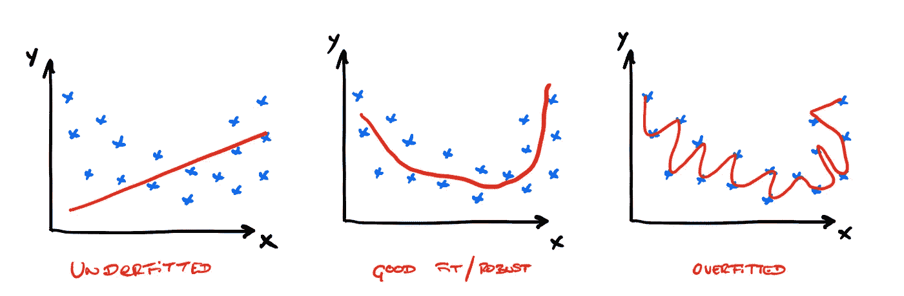

合身、合身和合身

[**正则化**](/regularization-in-machine-learning-76441ddcf99a) 是修改我们的学习算法，减少它的泛化误差而不是训练误差。神经网络中最常见的正则化方法有:

*   [**丢弃**](https://medium.com/konvergen/understanding-dropout-ddb60c9f98aa) :以概率 *p.* 在每次迭代中关闭某个神经元
*   [**提前停止**](https://medium.com/swlh/early-stopping-in-polynomial-regression-d1183bd363a7) **:** 提供在模型开始溢出之前可以运行多少次迭代的指导。
*   [**权重约束**](https://arxiv.org/abs/1207.0580) **:** 将权重缩放到预定义的阈值。
*   [**噪声**](https://pdfs.semanticscholar.org/d79b/a428e1cf1b8aa5d320a93166315bb30b4765.pdf) **:** 将随机噪声引入训练过程。

这些方法在神经网络中很流行，其中大多数已被证明可以减少过拟合。然而，噪声对深度学习模型的影响从未被系统地研究过，准确性提高的潜在原因也没有。[上述观察的一个假设是放松一致性将随机噪声引入训练过程](https://pdfs.semanticscholar.org/d79b/a428e1cf1b8aa5d320a93166315bb30b4765.pdf)。这隐含地减轻了模型的过度拟合，并且更好地概括了模型以分类测试数据。

# 使用 Sklearn 生成数据

我们想了解在过度拟合的神经网络中使用**噪声作为正则化方法**的效果，我们决定使用二元分类问题来解释这一点。因此，我们将应用 sklearn 生成一个二进制数据集，具体来说就是生成 2 个二维同心圆的`make_circles`。这些参数是:

*   `n_samples=100`(生成的总点数)
*   `noise=0.09`(加到数据上的高斯噪声的标准偏差)
*   `param_random=24`(通过多个函数调用传递一个 int 以获得可再现的输出)

生成并绘制数据我们数据

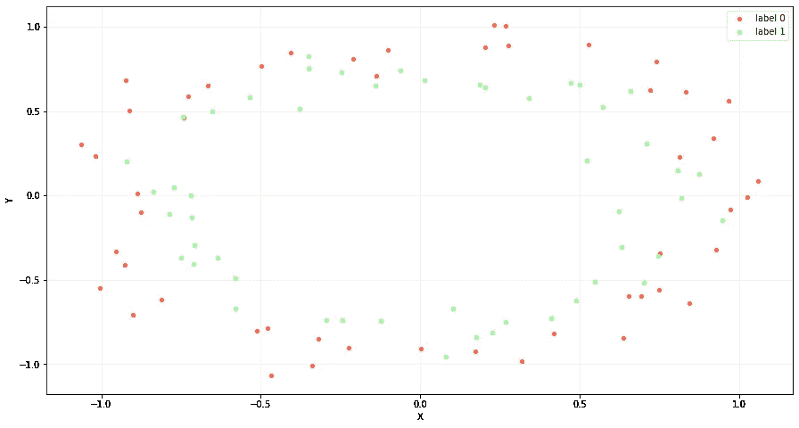

培训用数据

我们需要评估我们的网络的性能，看看我们是否有过度拟合，因此，我们需要分割我们的数据，以生成另一个数据集`x_test`进行测试。我们将数据分为`train_set` (30%)和`test_set` (70%)。

因为我们需要强制过度拟合，所以我们为我们的训练集选择了较小的大小(30%)，因为我们希望创建一个不会概括我们的数据并且在测试数据集上具有较高错误率的神经网络。

分割和绘制我们的训练和测试数据

我们可以绘制出`X_train`和`X_test`的分布图:


训练和测试集的分布

我们选择了这种类型的数据，称为**圆形数据，**，因为这些类是**不可线性分离的**(我们不能使用直线分割我们的数据)。为此，我们需要一个神经网络来解决这个非线性问题。

因为我们需要在我们的模型中找到过度拟合，以作为一种正则化方法来研究噪声的影响，所以我们只生成了 100 个样本。这是一个训练神经网络的小样本，它使我们能够过拟合训练。

# 第一步:基本神经网络——MLP

为了研究噪音如何影响我们的训练，我们训练了一个基本的神经网络作为基线。**我们定义了一个多层感知器(MLP)** 来解决我们的二元分类问题。

第一层是使用`400 nodes`和`relu`激活函数的隐藏层。在输出层，我们使用了一个`sigmoid`,因为我们想要预测 0 或 1 的类值。我们使用`binary_crossentropy`作为损失(适用于二元分类),使用`adam`作为优化器。

我们为`5000 epochs`训练神经网络，并使用`X_test`和`y_test`作为验证数据。

基本神经网络作为基线

我们绘制了一个图表来表示训练集和测试集的准确性和损失。可以观察到，我们的神经网络具有过拟合，因为该图具有过拟合模型的预期形状，`test accuracy`增加到一点，然后再次开始降低。同时，`loss`是发散性的。

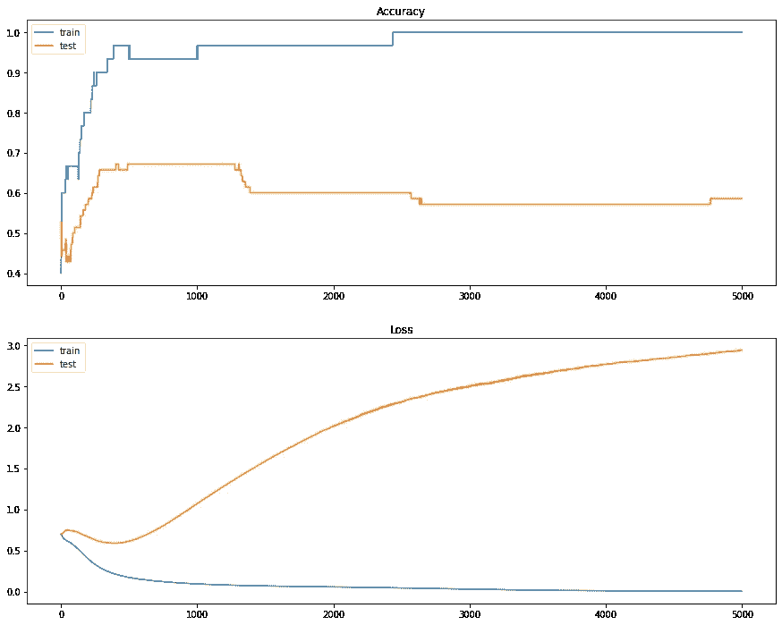

基本神经网络训练精度和损失的演变

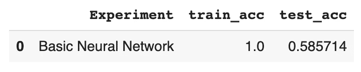

结果基本神经网络

我们可以观察到，测试机组的**精度**约为`train_acc=1`，测试机组的**精度约为`test_acc=0.5857`。它在训练集上表现出比在测试数据集中更好的性能；**这可能是过度合身的迹象。****

现在，我们将使用 Keras 的`Gaussian Noise Layer`添加噪声，并比较结果。该层应用加性的零中心高斯噪声，这对于减轻过拟合是有用的。**高斯噪声(GS)是实值输入破坏过程的自然选择。**

> *这个正则化层只在训练时有效。*

# 但是什么是高斯噪声呢？

[**高斯噪声**](https://en.wikipedia.org/wiki/Gaussian_noise) 是概率密度函数(PDF)等于正态分布的统计噪声。它也被称为高斯分布。高斯随机变量𝑧的概率密度函数𝑝由下式给出:

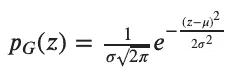

概率密度函数

其中𝑧代表灰度级，𝜇代表平均值，𝜎代表标准差。综上所述，噪声可能呈现的值是高斯分布的。

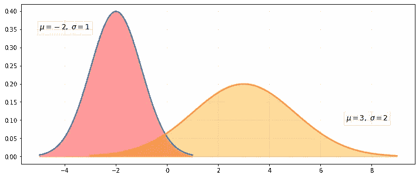

2 个概率密度函数—高斯噪声

为了理解高斯噪声的含义，假设我们有一幅图像，并绘制了两个概率密度函数。如果我们观察红色 PDF: **噪声的平均值将是-2** 。因此，平均而言，图像的所有像素将减去 2。但是，如果我们观察橙色的 PDF，**平均值是 3** 。所以平均来说，所有像素加 3。例如，如果我们拍摄这张图像，并应用高斯噪声:

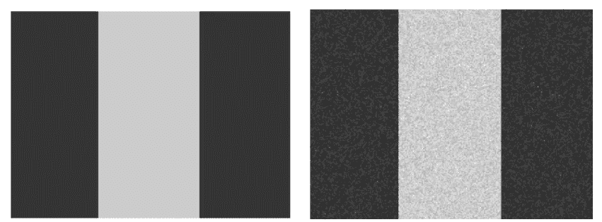

左:原始图像—右:带有高斯噪声的图像

我们可以检查每个图像的直方图，以评估应用高斯噪声的效果:

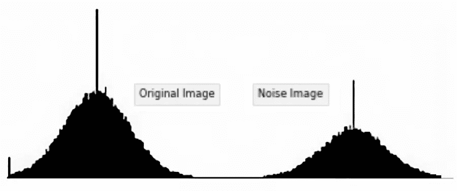

直方图—左侧:原始图像。右图:带有高斯噪声的图像

虽然我们已经用图像解释了高斯噪声，但是在 Keras 中应用**高斯噪声作为正则化方法的方法应用了相同的理论。**

添加噪声会增加我们的训练数据集的大小。当我们训练神经网络时，随机噪声被添加到每个训练样本中，这是数据扩充的一种形式。此外，当我们使用噪声时，我们增加了数据的随机性，并且模型不太能够从训练样本中学习，因为它们在每次迭代中都是变化的。**因此，神经网络学习更多的一般特征，并具有更低的泛化误差。**

当我们应用噪声时，我们在训练样本的附近创建新的样本，因此，输入数据的分布被平滑。这使得神经网络更容易从我们的数据中学习。

# 神经网络中的输入层噪声

我们将添加一个**高斯噪声层作为输入层**，我们将分析这是否有助于提高泛化性能。当我们添加噪声时，我们会创建更多的样本，并使数据分布更加平滑。

具有输入层噪声的神经网络

在线图中可以看出，由于我们在训练中引入的具有噪声的点与训练数据集的点冲突，噪声导致模型的准确性和损失跳跃。我们使用`std=0.1`作为输入噪声，这可能有点高。

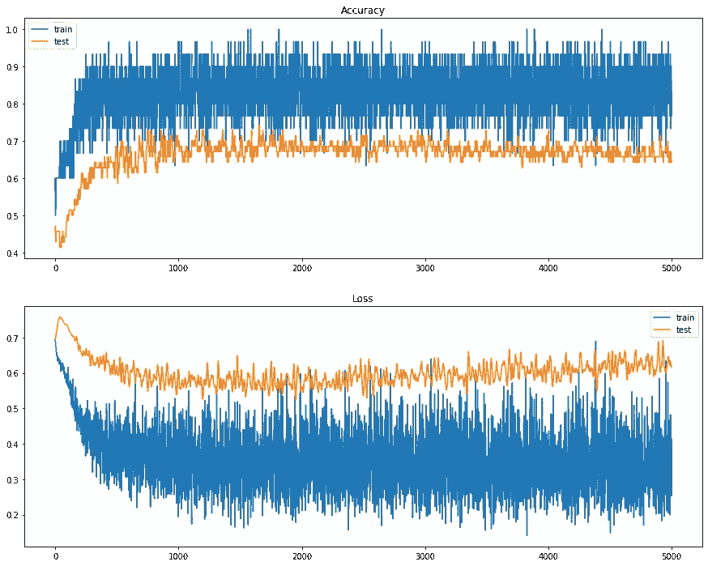

精度的演变和训练损失——输入层噪声

通过在输入层使用噪声作为正则化方法，我们减少了模型中的过拟合，此外，我们还改进了`test_accuracy=0.642`。

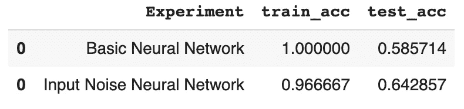

结果神经网络-输入层噪声

# 神经网络中的隐含层噪声

现在，我们将尝试**用高斯噪声**创建一个隐藏层。这必须在应用激活功能之前完成。我们将使用 0.1 的标准偏差，也是任意选择的。

具有隐含层噪声的神经网络

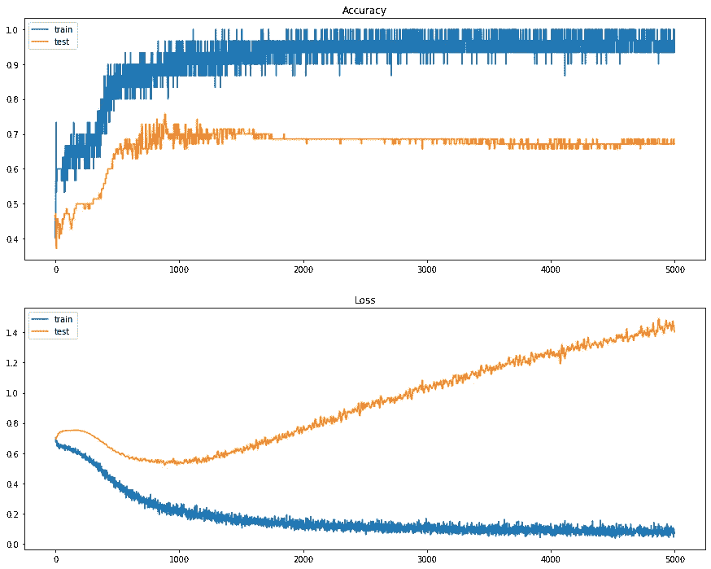

训练精度的演变和损失——隐含层噪声

在这种情况下，可以看到`train_accuracy`保持不变，尽管我们设法增加了`test_accuracy=0.671`。似乎将**噪声**添加到我们的模型中允许改进神经网络的训练，并且对于减轻过拟合是有用的。

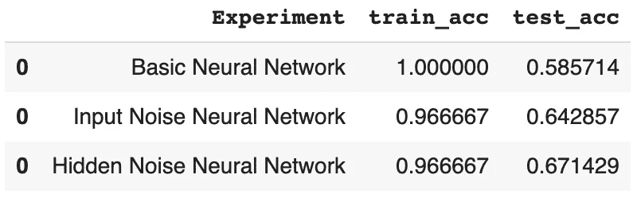

结果神经网络—隐藏层噪声

# 神经网络中的输入+隐含层噪声

我们结合了前面的两个例子，通过同时添加一个`input layer noise`和一个`hidden layer noise`来研究我们的模型的性能。我们将使用 0.1 的标准偏差，也是任意选择的。

输入+隐含层噪声的神经网络

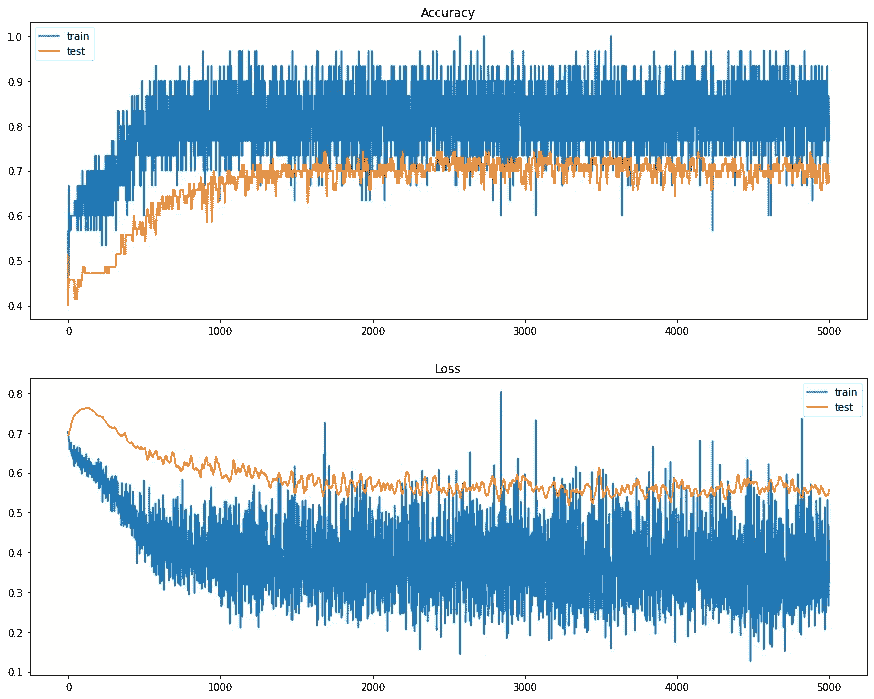

训练——输入+隐含层噪声——精度和损失的演变

再次可以看到，随着噪声的使用，如`input_layer`和`hidden_layer`，同时，我们减少了模型中的过拟合。此外，它增加了`test_accuracy=0.6857`，似乎**高斯噪声**作为一种正则化方法允许模型更好地概括我们的数据。

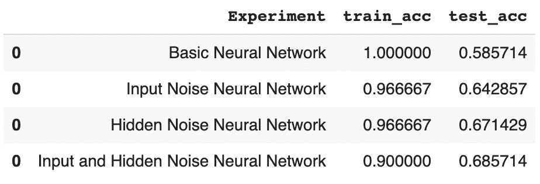

结果神经网络—输入+隐藏层噪声

> 应用噪声，我们在训练样本附近创建新的样本，从而平滑输入数据的分布。

# 网格搜索-噪波图层

我们将开发一个**网格搜索**来找出噪声的确切数量和隐藏层中的节点，从而使我们能够获得性能最佳的模型。

我们将使用带有隐藏层噪声的**神经网络**作为网格搜索的例子。我们需要用模型创建一个函数来搜索噪声的最佳值。

网格搜索-隐藏图层噪波

我们已经创建了一个名为`grid_values`的字典，其中包含了模型中每个参数的值的范围。最后，我们将模型`create_model()`插入到名为`KerasClassifier`的包装器中，该包装器实现了 Scikit-Learn 分类器接口。

计算网格搜索

```
**Best: 0.833333 using {'nodes': 300, 'noise_amount': 0.001} 0.766667 (0.133333) with: {'nodes': 50, 'noise_amount': 0.001} 0.766667 (0.133333) with: {'nodes': 50, 'noise_amount': 0.01} 0.766667 (0.133333) with: {'nodes': 50, 'noise_amount': 0.1} 0.766667 (0.081650) with: {'nodes': 50, 'noise_amount': 0.2} 0.700000 (0.066667) with: {'nodes': 50, 'noise_amount': 0.7} 0.633333 (0.124722) with: {'nodes': 50, 'noise_amount': 1} 0.800000 (0.163299) with: {'nodes': 100, 'noise_amount': 0.001} 0.800000 (0.163299) with: {'nodes': 100, 'noise_amount': 0.01} 0.766667 (0.133333) with: {'nodes': 100, 'noise_amount': 0.1} 0.800000 (0.124722) with: {'nodes': 100, 'noise_amount': 0.2} 0.766667 (0.169967) with: {'nodes': 100, 'noise_amount': 0.7} 0.666667 (0.105409) with: {'nodes': 100, 'noise_amount': 1} 0.833333 (0.149071) with: {'nodes': 300, 'noise_amount': 0.001} 0.800000 (0.163299) with: {'nodes': 300, 'noise_amount': 0.01} 0.766667 (0.133333) with: {'nodes': 300, 'noise_amount': 0.1} 0.833333 (0.105409) with: {'nodes': 300, 'noise_amount': 0.2} 0.666667 (0.105409) with: {'nodes': 300, 'noise_amount': 0.7} 0.633333 (0.124722) with: {'nodes': 300, 'noise_amount': 1} 0.800000 (0.163299) with: {'nodes': 500, 'noise_amount': 0.001} 0.800000 (0.163299) with: {'nodes': 500, 'noise_amount': 0.01} 0.800000 (0.124722) with: {'nodes': 500, 'noise_amount': 0.1} 0.833333 (0.105409) with: {'nodes': 500, 'noise_amount': 0.2} 0.600000 (0.133333) with: {'nodes': 500, 'noise_amount': 0.7} 0.600000 (0.133333) with: {'nodes': 500, 'noise_amount': 1}**
```

我们可以看到，使用在隐藏层中具有`300 neurons`和具有大约 83%精确度的`noise_amount=0.001`的网络获得了最好的结果。

# 未来的实验

我们可以用下面的想法来改进这个添加噪声作为正则化方法的实验:

*   用噪波添加更多的层来研究他的效果。
*   用更深层次的神经网络重复同样的实验。
*   在没有过度拟合的情况下，在模型中研究噪声作为正则化方法的影响。
*   尝试在激活和权重中添加噪声。

欢迎建议和评论。关注我，感谢你的阅读！:)