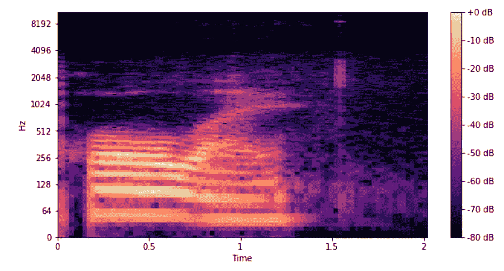
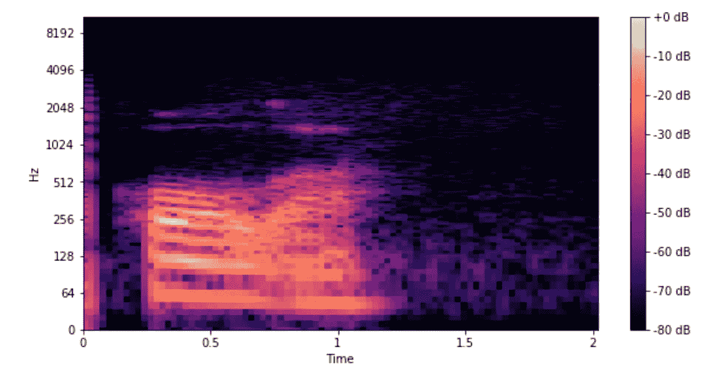

# 带 ML 的非母语口音反馈

> 原文：<https://towardsdatascience.com/non-native-spanish-speaker-accent-feedback-with-ml-7f33f9a0fbb7?source=collection_archive---------37----------------------->

## 使用谷歌云平台评估 20 多种语言的口音


乔恩·泰森在 [Unsplash](https://unsplash.com?utm_source=medium&utm_medium=referral) 上的照片

一位非母语人士正在学习西班牙语。你如何利用机器学习对他们的发音提供实时反馈？在本帖中，我们将介绍如何使用谷歌的语音转文本 API 在 20 多种语言中实现这一点。

如果您可以访问包含给定单词的非本地和本地语音记录的数据库，则可以很容易地进行口音识别。事实上，机器学习甚至可能不是必要的——人们可以比较音频片段的频谱图和梅尔频率倒谱系数。对于那些不熟悉的人来说，频谱图和 Mel 系数代表录音中的频率/音高。对本地和非本地录音的系数进行简单的比较就可以做到这一点。



重音不正确的“Hola”声谱图



适当重音的“Hola”声谱图

图中是两张“Hola”的光谱图。第一个声谱图显示不正确的重音，而第二个声谱图显示正确的重音。人们可以计算两个图形之间的差异来量化发音之间的相似性。然而，这种方法并不可靠。不同的音调会改变计算结果以及说话的速度。此外，如前所述，这种方法需要来自母语使用者的录音数据库。

然而，如果没有录音数据库，我们必须采用不同的解决方案。**我们可以使用谷歌的语音转文本 API，而不是创建自己的模型。谷歌的模型已经根据母语人士的声音进行了训练，因此只能识别与母语人士的声音足够相似的录音。**因此，如果谷歌的文本到语音模型能够识别我们的发音，我们就可以假设我们正确地发音了。正如我们将看到的，如果我们提供一个带有刺耳口音的音频剪辑，模型将无法识别该语音。

我们开始吧

1.如果您还没有 Google Cloud 帐户，请务必先创建一个。[https://cloud.google.com/](https://cloud.google.com/)

2.在 Google Cloud 中创建一个新项目(您可以从您的 Google Cloud 控制台执行此操作)。

3.启用语音转文本 API[https://console . cloud . Google . com/APIs/library/speech . Google APIs . com](https://console.cloud.google.com/apis/library/speech.googleapis.com)

4.录制自己朗读西班牙语单词，并将音频剪辑保存为 MP3。

5.安装 python 谷歌云语音库

```
pip install google-cloud-speech
```

6.如果您没有应用程序密钥，请创建一个。[https://cloud . Google . com/docs/authentic ation/get-started](https://cloud.google.com/docs/authentication/getting-started)。

7.将这一行添加到 python 文件的开头，以使用密钥

```
import os
os.environ["GOOGLE_APPLICATION_CREDENTIALS"] = PATH TO YOUR APPLICATION KEY.json
```

7.将这段 python 代码添加到语音到文本识别中。该功能将转录音频，并给出一个置信度得分。

```
from google.cloud import speech_v1p1beta1
client = speech_v1p1beta1.SpeechClient()def sample_recognize(local_file_path):
    """
    Print confidence level for individual words in a transcription of a short audio
    file.Args:
      local_file_path Path to local audio file, e.g. /path/audio.wav or .mp3
    """client = speech_v1p1beta1.SpeechClient()# When enabled, the first result returned by the API will include a list
# of words and the confidence level for each of those words.

    enable_word_confidence = True# The language of the supplied audio
    language_code = "es-ES"
    config = {
        "enable_word_confidence": enable_word_confidence,
        "language_code": language_code,
        "encoding": "MP3",
        "audio_channel_count": 2}
    with io.open(local_file_path, "rb") as f:
        content = f.read()
    audio = {"content": content} response = client.recognize(config, audio, ) if len(response.results == 0):
        return "FAILED" result = response.results[0] alternatives = result.alternatives[0]

    return result
```

请注意几个要素:

*   通过设置 enable_word_confidence = True，模型将输出每个单词的概率，这允许我们更精确地看到用户的表现如何
*   language_code = "es-ES "将语言从西班牙设置为西班牙语。如果你想改变语言或国家，语言代码是 https://cloud.google.com/speech-to-text/docs/languages
*   “audio _ channel _ count”:2 对应于您的话筒设置方式。大多数电脑使用立体声音频(双声道)录音，但如果您的电脑只在一个声道录音，您可能需要更改这一点
*   请注意，如果 Google 的 API 无法识别这个单词，它将返回一个空列表，因此 if len(response.results) == 0
*   变量 alternatives 提供了该函数中未使用的替代结果列表

通过检查该函数的输出是否等于您试图发音的单词，您可以评估您的口音。为了得到更精确的分数，你可以在结果中使用置信度这个词。

我已经在 react 网站上实现了这种口音识别算法:【https://hablame.org/accent。

带口音识别软件的 Flask App 代码:[https://github.com/DanielLongo/AccentRecognition](https://github.com/DanielLongo/AccentRecognition)