# 非参数元学习

> 原文：<https://towardsdatascience.com/non-parametric-meta-learning-bd391cd31700?source=collection_archive---------42----------------------->

## 这个故事涵盖了非参数少镜头学习算法，其中包括暹罗网络，匹配网络和原型网络。本课程是对课程[‘斯坦福 CS330:多任务和元学习，2019 |第四讲——非参数元学习者’](https://www.youtube.com/watch?v=bc-6tzTyYcM&list=PLoROMvodv4rMC6zfYmnD7UG3LVvwaITY5&index=4)的简短总结。

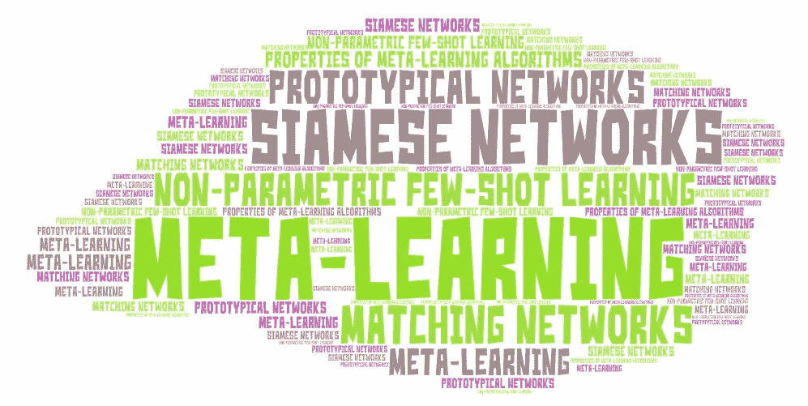

via W[or tart](https://wordart.com/)

这个故事涵盖了非参数少镜头学习算法，其中包括暹罗网络，匹配网络和原型网络。它还涵盖了元学习算法的属性。这是课程的总结[‘斯坦福 CS330:多任务和元学习，2019 |第四讲——非参数元学习者’](https://www.youtube.com/watch?v=bc-6tzTyYcM&list=PLoROMvodv4rMC6zfYmnD7UG3LVvwaITY5&index=4)。

# 非参数方法

非参数方法是简单的，并且在 ML 中的低数据状态下工作良好，例如最近邻。在元测试期间，少量学习正好处于低数据状态，因此这些非参数方法可能表现得相当好。但是在元训练期间，我们仍然希望参数化，因为我们希望能够扩展到大型数据集。非参数方法的关键思想是我们能使用参数元学习器来产生有效的非参数学习器吗？

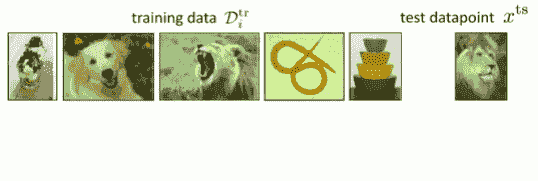

将测试图像与训练图像进行比较。来源:[课程幻灯片](http://cs330.stanford.edu/slides/cs330_lecture4.pdf)

关键思想是使用非参数学习器，例如最近邻。方法是获取一个测试数据点，并将其与所有训练数据集数据点进行比较，找到看起来最相似的一个训练数据，然后返回与该训练数据对应的标签。问题是你在什么空间比较？用什么距离度量？我们可以在像素空间中用 L2 距离来做这件事。

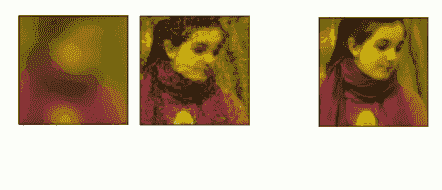

像素空间中的 L2 距离效果不佳。来源:[课程幻灯片](http://cs330.stanford.edu/slides/cs330_lecture4.pdf)

但是 L2 距离效果不佳。例如，L2 距离会选择右边的图像作为与中间的图像最相似的图像。因此，我们可以使用元训练数据***来学习比较，而不是使用像素空间中的 L2 距离。***

# 暹罗网络

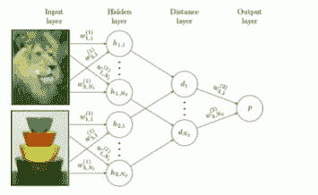

暹罗网络。来源:[课程幻灯片](http://cs330.stanford.edu/slides/cs330_lecture4.pdf)

一种方法是训练**连体网络**来预测两个图像是否是同一类。所以你本质上只是在学习比较成对的图像，并对它们是否属于同一类进行分类。你可以在两个图像之间了解到更多的语义距离。因此，您可以从 met-training 数据集中获取两幅图像，并根据它们是否属于同一类，将这两幅图像标记为 1 或 0。对元训练数据集中的不同图像对重复这一过程。在元测试时，我们将每个图像 X-test 与该任务的训练数据集中的每个图像进行比较，然后输出与最接近的图像对应的标签。简而言之，在元训练时，我们训练这个二元分类器，然后在元测试时，我们通过进行每一个两两比较来执行 N 向分类。既然元训练(训练一个二元分类器)和元测试(测试一个 n 路分类器)互不匹配，我们能不能做得更好来匹配这两个过程？

在[匹配网络论文](https://papers.nips.cc/paper/6385-matching-networks-for-one-shot-learning)中的关键思想是:如果我们要在测试时做最近邻以便将我们的测试查询图像与我们的每个训练数据点匹配，我们 ***训练一个嵌入空间以便最近邻产生准确的预测*** 怎么样？

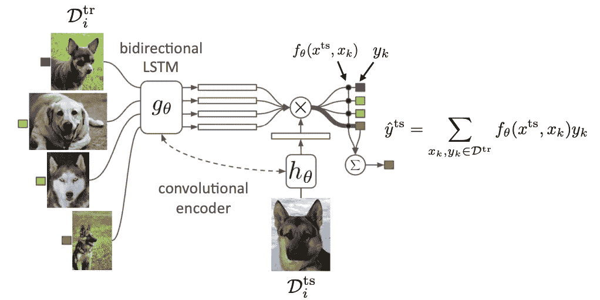

匹配网络。来源:[课程幻灯片](http://cs330.stanford.edu/slides/cs330_lecture4.pdf)

*因此，我们将训练数据集中的每幅图像放入一个学习过的嵌入空间。我们还将测试查询图像嵌入到一个嵌入空间中。我们比较每一个嵌入来做一个预测。*因此，这些黑点中的每一个(其中 fθ点)将对应于测试嵌入和训练嵌入之间的比较。我们取对应于我们的每个训练图像的标签，并且我们的预测将对应于由它们的相似性分数加权的训练标签。 ***对模型进行端到端训练。*** 最重要的是，元训练是为了展示元测试中发生的事情。在元训练期间，你对训练数据集中的所有图像进行比较，在元测试时，你做同样的事情，对每个 n 向分类问题进行预测。

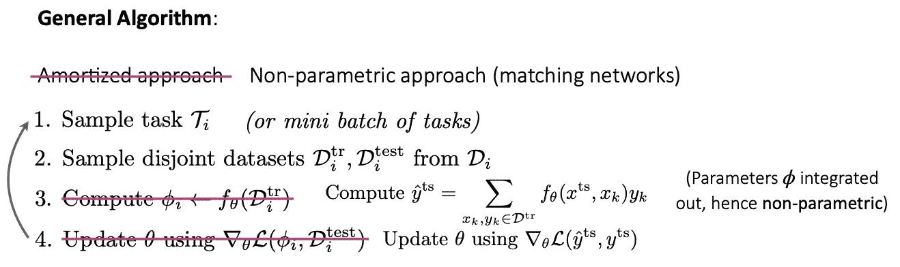

非参数方法的一般算法。来源:[课程幻灯片](http://cs330.stanford.edu/slides/cs330_lecture4.pdf)

非参数方法的**通用算法**与摊销(黑盒)方法的算法基本相同。我们首先对一组任务进行采样(步骤 1)，对每个任务的训练和测试数据集进行采样(步骤 2)，然后使用学习到的相似性度量计算预测(步骤 3)。注意这里不同于参数方法，*我们没有参数 phi，它本质上被整合到这个比较中。*然后，一旦我们有了这些预测，我们就根据我们的预测在测试集上有多准确的损失函数来更新这个学习的嵌入函数的参数(步骤 4)。例如，这个损失函数类似于交叉熵，我们使用测试标签上的预测分布，而不仅仅是 max 标记的输出。

对于每个类都有一个示例的一次性分类，匹配网络非常简单，因为它会对每个类进行比较。但是如果我们有不止一次机会呢？**如果每个类别有多个数据点，那么匹配网络会独立执行这些比较**。也许我们可以用一种比执行这些独立的比较更聪明的方式来聚合每个类的信息。这就是**原型网络**所做的。

# **原型网络**

***原型网络聚集类信息以创建该类的原型嵌入，然后对这些原型类嵌入中的每一个进行比较，以便预测对应于我们的测试图像的标签。***

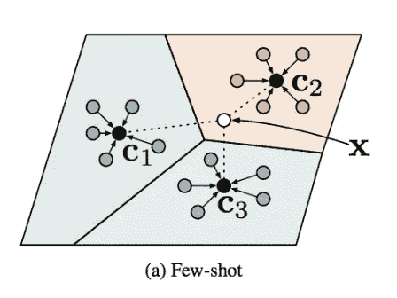

*原型网络。*来源:[课程幻灯片](http://cs330.stanford.edu/slides/cs330_lecture4.pdf)

所以这看起来更具体的是，*我们将有许多不同类别的图像*。在左图中，不同的颜色对应于我们针对特定任务的训练数据集中的不同图像类别。我们将每个训练图像嵌入到这个嵌入空间中。然后在这个嵌入空间中取平均值，以便计算类别 1、2 和 3 的原型嵌入。然后，我们将测试图像嵌入到相同的空间，相同的精确空间，并计算到每个原型类嵌入的距离。最后，我们可以输出它在这个嵌入空间中最接近的类。

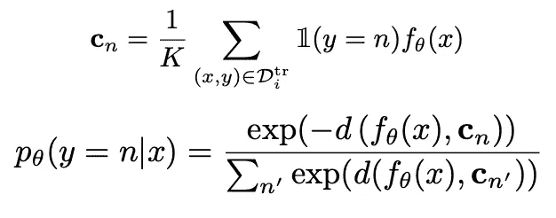

*原型网络方程。*来源:[课程幻灯片](http://cs330.stanford.edu/slides/cs330_lecture4.pdf)

该等式表明，它会将特定类别的每个图像嵌入到该嵌入空间中，然后对这些图像中的每个图像取平均值。为了计算我们的测试数据点的类别，我们将获取每个类别中嵌入的测试数据点之间的距离，并对每个负距离执行 softmax，以便计算测试数据点的概率。在这种情况下，d 对应于欧几里德距离或余弦距离。

# 其他非参数方法

基本上，这些非参数方法嵌入你的数据点，然后在学习嵌入空间做最近邻。一个挑战是，如果你想推理数据点之间更复杂的关系，而不仅仅是在你的嵌入空间中做最近邻怎么办？ 原则上，如果你的嵌入空间中有一个足够有表现力的编码器，那么最近邻应该能够表示广泛的复杂关系，特别是对于高维嵌入空间。但是在实践中，人们发现考虑用更有表现力的方式来进行这种比较是很有用的。

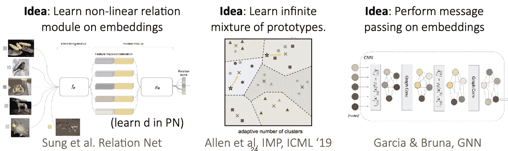

其他非参数方法。来源:[课程幻灯片](http://cs330.stanford.edu/slides/cs330_lecture4.pdf)

例如， [**关系网络**](http://openaccess.thecvf.com/content_cvpr_2018/papers/Sung_Learning_to_Compare_CVPR_2018_paper.pdf) **基本上采用原型网络，并在那些嵌入的基础上学习非线性关系模块。**这基本上对应于在原型网络中学习函数 D，而不是使用欧几里德距离度量或余弦距离度量。所以它学习嵌入和距离度量。[**另一种方法**](https://arxiv.org/pdf/1902.04552.pdf) **是代替每个类有一个单一原型，每个类有一个混合原型**。举例来说，这允许你在一个类中表现更多的多模态类分布。最后， [**另一篇论文**](https://arxiv.org/abs/1711.04043) **对我们所有的数据点执行嵌入，然后执行某种消息传递方案**，以便思考这些不同的数据点如何相互关联，并做出预测的输出。它所做的是使用图形神经网络来执行这种信息传递，并通过它进行区分。

# 元学习算法的性质

参数方法。首先，我们从计算图的角度对此进行比较。

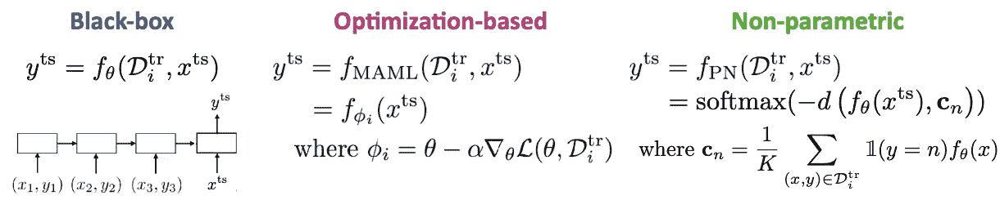

来源:[课程幻灯片](http://cs330.stanford.edu/slides/cs330_lecture4.pdf)

**黑盒方法以完全的黑盒方法抑制了这个计算图。**基于优化的方法可以视为将优化嵌入到计算图中。这种观点也适用于非参数方法。对于您的测试数据点，原型网络将其嵌入并与您的每个类原型进行比较，其中每个任务原型是使用嵌入的每个类的数据点计算的。

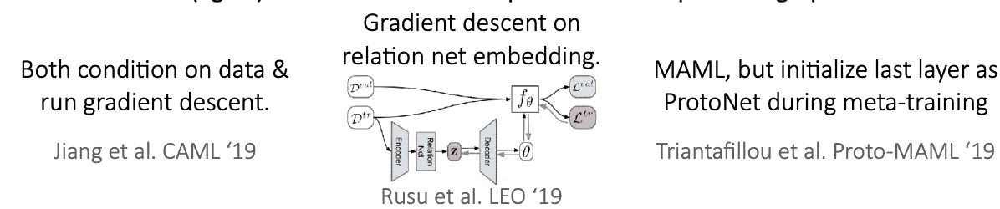

混合动力车型。来源:[课程幻灯片](http://cs330.stanford.edu/slides/cs330_lecture4.pdf)

有了这个视图，我们还可以混合计算图的组件来生成混合模型 ***。因此，*** [***一种方法***](https://openreview.net/forum?id=BJfOXnActQ) ***有点像是黑盒和基于优化的方法*** 的混合，或者可能是基于优化的非参数方法(这取决于你看待事物的方式)。这种混合方法试图*在嵌入训练数据集的基础上调整模型，并在该模型上运行梯度下降。*尽管通过直接方式以及梯度下降对数据进行调节的这些信息来源可能是多余的，但在实践中效果很好。 [***另一种方式***](https://arxiv.org/abs/1807.05960) ***就是对你的函数进行嵌入，然后在那个嵌入空间上做梯度下降。因此，本文使用关系网络来嵌入您的训练数据集，并考虑不同的数据点如何相互关联。然后他们将这种嵌入解码到神经网络的参数中，对新的数据点进行预测。他们不是在那个函数的参数上运行梯度下降，而是在学习过的嵌入空间 Z 中运行梯度下降，这产生不同的函数。本质上，你可以把它看作是在你的权重的低维空间中运行梯度下降，而不是在你的权重的原始空间中运行梯度下降。 [***最后一种方法***](https://arxiv.org/abs/1903.03096) ***是做一些看起来完全像 MAML 的事情，但是将网络的最后一层初始化为对应于原型网络*** 。它基本上是 MAML 网络架构的特定选择的特定形式，初始化它以做类似基于比较的预测的事情。***

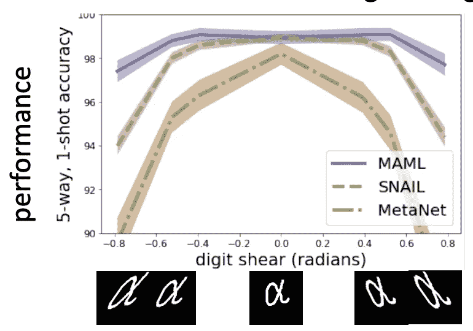

基于优化的方法(s. tMAML 和 SNAL)在歪斜数字上工作得很好，这在训练时间期间没有被训练；而黑盒方法(metaNet)在非分发任务上表现不佳。来源:[课程幻灯片](http://cs330.stanford.edu/slides/cs330_lecture4.pdf)

我们也可以在 ***算法属性透视图*** 中比较这三种方法。 ***一致性*** 和 ***表现力*** 是对大多数应用都很重要的两个属性。E *表达能力是代表一系列学习过程的能力，它衡量一系列领域的可扩展性和适用性*。*一致性意味着学习的学习程序将解决具有足够数据的任务，而不管该任务的性质如何*。例如，梯度下降方法对应于一致的学习过程，因为如果我们只是在测试时运行梯度下降，你可以期望给定足够的测试任务数据，无论你的元训练数据是什么，你都能够解决一个任务。*一致性将减少对元训练任务的依赖，从而带来良好的分布外(ood)性能*。

***对于监督学习，非常深度的模型通常是富有表现力的*** (这对于一些 RL 算法不成立)。因此，黑盒方法具有完全的表达能力，而基于优化的方法对于非常深的模型具有表达能力，而非参数方法对于大多数架构具有表达能力。就一致性而言，**黑盒根本不一致**，而基于 o **优化的方法是一致的**，因为它简化为梯度下降问题。**非参数方法在这个意义上是一致的** *如果你的嵌入没有丢失关于输入的信息，这对于做决策是很重要的，* *那么随着你积累越来越多的数据，它最终会渐近地到达一个任意接近你的测试数据点的数据点，然后能够对那个测试数据点做出正确的预测*。

这些方法还有其他一些优点(缺点)。**由于黑盒方法容易与各种学习问题**结合，如监督学习和 RL；但是**它通常是数据低效的**，因为你需要从头开始训练一个神经网络，并且优化是具有挑战性的**，因为在初始化**时没有归纳偏差。** **基于优化的方法在肉学习**开始时具有正归纳偏差，并且它**很好地处理变化的 k 和大 k。**例如，如果你的数据比你训练的数据多，这些方法仍然可以很好地工作，因为它们是一致的。它是与模型无关的。**但它包括**二阶优化，**这导致这种方法**计算和内存密集型**。非参数方法**完全是前馈**，它们不会在计算图中演化出任何反向传播，因此，它们往往在计算上非常**快速**并且**易于优化。但是，如果你在比它们被训练的更多的 k 上测试它们，它们的表现往往不如其他算法能够达到的。因此，它们很难推广到变化的 K 值**和**很难扩展到非常大的 K 值**。况且，到目前为止，他们**仅限于分类**。

一般来说，在现有的少数几个基准测试中，每个版本的性能都相当。**使用哪种方法取决于您的用例**。

# 参考

1.  [斯坦福 CS330:多任务和元学习，2019 |讲座 4——非参数元学习者](https://www.youtube.com/watch?v=bc-6tzTyYcM&list=PLoROMvodv4rMC6zfYmnD7UG3LVvwaITY5&index=4)
2.  T [何航向滑梯](http://cs330.stanford.edu/slides/cs330_lecture4.pdf)
3.  [深度特征作为感知度量的不合理有效性](https://arxiv.org/abs/1801.03924)
4.  [用于一次性图像识别的连体神经网络](https://www.cs.cmu.edu/~rsalakhu/papers/oneshot1.pdf)
5.  [用于一次性学习的匹配网络](https://arxiv.org/abs/1606.04080)
6.  [少量学习的原型网络](https://arxiv.org/abs/1703.05175)
7.  [用于少量学习的无限混合原型— arXiv](https://arxiv.org/pdf/1902.04552)
8.  [用图形神经网络进行少量学习](https://arxiv.org/abs/1711.04043)
9.  [学习比较:少投学习的关系网络](https://arxiv.org/abs/1711.06025)
10.  [概率模型不可知元学习— arXiv](https://arxiv.org/pdf/1806.02817)
11.  [具有潜在嵌入优化的元学习](https://arxiv.org/abs/1807.05960)