# 使用 Python 中的 Choropleth 地图可视化印度尼西亚学校参与率

> 原文：<https://towardsdatascience.com/noobs-guide-to-create-choropleth-map-using-python-geopandas-d6269e9e9a0c?source=collection_archive---------25----------------------->

## 逐步了解印度尼西亚不同年龄组的学校参与率如何使用 python geopandas 绘制 choropleth 地图

在本文中，我们将通过利用地理空间数据来了解 2019 年印度尼西亚不同年龄组的入学率。这些数据将会用一个 choropleth 图来可视化，我们将会一步一步地分解它来制作它。


费利佩·斯基亚罗利在 [Unsplash](https://unsplash.com?utm_source=medium&utm_medium=referral) 上的照片

如今，我们可以很容易地利用地理空间数据。各种应用程序和编程语言为使用这些空间数据提供服务。例如，众所周知，ArcGIS 和 QGIS 是处理空间数据的常用应用程序。

另外，数据科学家常用的两种编程语言，如 R 和 Python，提供了一个可以处理这项任务的库。但是这次我们将只讨论 python 中的一个库，它就是 GeoPandas。

这个 choropleth 是什么？根据维基百科:

> 宗谱图是一种专题地图，其中各区域按照代表每个区域内地理特征汇总的统计变量的比例进行着色或图案化。

简单来说，这个 choropleth 图是一个用不同颜色表示不同值的图。

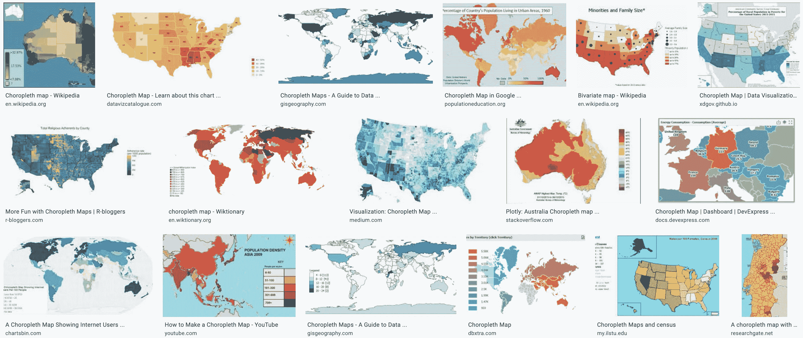

谷歌 Choropleth 地图搜索结果

该等值线图可用于显示该区域内某一区域的不同测量值。

因此，让我们深入了解如何使用 Python 中的 GeoPandas 创建 Choropleth 地图。我们将看到印度尼西亚不同年龄组的入学率。

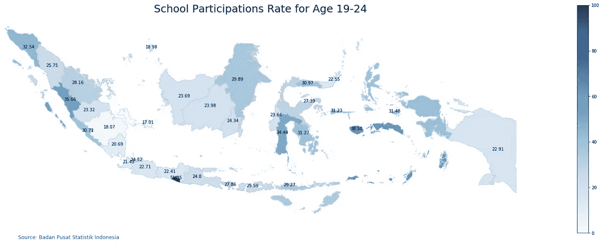

**第一步:安装需要的 Python 库**

在制作地图之前，我们应该安装 Geopandas 库及其依赖项。GeoPandas 是一个可以帮助我们使用 python 处理地理空间数据的库。该库使用了 pandas 的数据框概念，但具有几何功能。在这个 geopandas 中，几何运算由 [shapely](https://shapely.readthedocs.io/) 执行。Geopandas 进一步依赖 [fiona](https://fiona.readthedocs.io/) 进行文件访问，依赖 [Descartes](https://pypi.python.org/pypi/descartes) 和 [matplotlib](http://matplotlib.org/) 进行绘图。

安装 geopandas 的一种方法是使用 conda，这也是我们将用来创建地图的另一个库。

```
conda install pandas
conda install matplotlib
conda install numpy
conda install geopandas
conda install descartes
```

其他方法可以从 geopandas 文档[这里](https://geopandas.org/install.html)查看。然后把图书馆叫进笔记本。

```
# Library usedimport pandas as pd
import numpy as np
import matplotlib.pyplot as plt
import geopandas as gpd
```

**第二步:下载数据集**

在本练习中，我们将使用两个数据集:

*   将被映射到我们的地图的数据。在这种情况下，我们将使用不同年龄组的印度尼西亚学校参与率。该数据最初来自 Badan Pusat Statistik。然而，在我对数据做了一些预处理之后，我也在我的 GitHub 中做了一个拷贝。你可以在这里下载这些数据
*   包含几何信息的 shapefile。我们将使用 GADM[的印尼省 GeoJSON 格式。这个数据也可以从我的 Github 页面](https://gadm.org/download_country_v3.html)[这里](https://github.com/bimaputra1/School_Partitipation_Rates_with_GeoPandas/blob/master/gadm36_IDN_1.json)下载。其次，是将被映射到我们的地图的数据。

**第三步:数据准备**

现在，所有的数据都应该已经下载了。因此，我们可以通过将数据导入笔记本来开始准备数据。

首先，我们导入学校参与率数据。该数据由 5 栏组成，第一栏是一个省，其余是不同年龄组的入学率。

```
# Import School Partitipations Ratepath = './Angka Partisipasi Sekolah.xlsx'
df = pd.read_excel(path)
display(df.head())
```

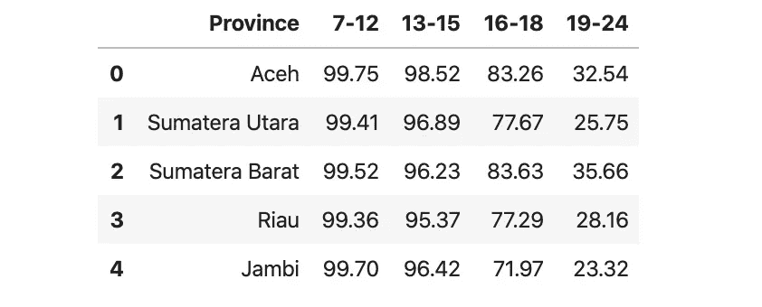

其次，我们用 geopandas read_file 函数导入 GeoJSON 数据。此函数将创建地理数据框架类型的数据。

```
# Import GeoJSON Datapath = './gadm36_IDN_1.json'
df_geo = gpd.read_file(path)
display(df_geo.head())
```

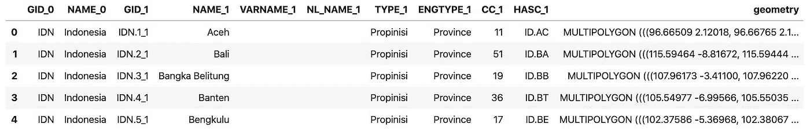

然后，我们将这些数据集组合成一个地理数据框架，并检查结果。

```
df_join = df_geo.merge(df, how='inner', left_on="NAME_1", right_on="Province")df_join = df_join[['Province','7-12', '13-15', '16-18', '19-24','geometry']]df_join.head()
```

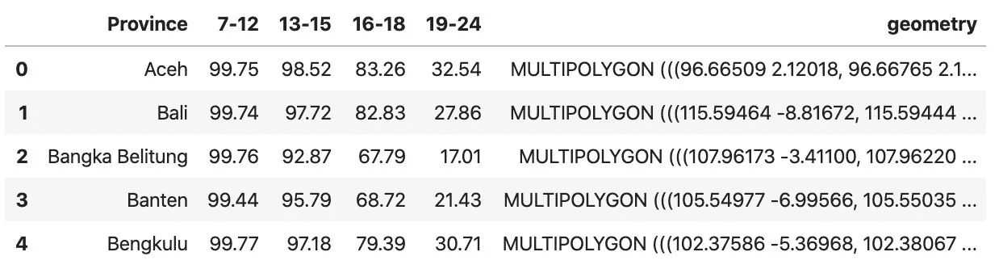

**第四步:创建地图**

通过使用 GeoPandas，此地理数据框架可以在没有数据的情况下轻松绘制。

```
df_geo.plot()
```

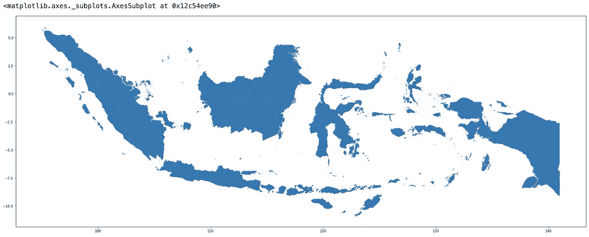

然而，我们将超越添加数据和一些可定制的地图。我们将在地图底部添加地图标题、颜色条和注释。我们还将删除地图上的轴。

```
# set a variable that will call whatever column we want to visualise on the mapvalues = '19-24'# set the value range for the choroplethvmin, vmax = 0,100# create figure and axes for Matplotlibfig, ax = plt.subplots(1, figsize=(30, 10))# remove the axisax.axis('off')# add a titletitle = 'School Participations Rate for Age {}'.format(values)
ax.set_title(title, fontdict={'fontsize': '25', 'fontweight' : '3'})# create an annotation for the data sourceax.annotate('Source: Badan Pusat Statistik Indonesia',xy=(0.1, .08),  xycoords='figure fraction', horizontalalignment='left', verticalalignment='top', fontsize=12 ,color='#555555')# Create colorbar as a legendsm = plt.cm.ScalarMappable(cmap='Blues', norm=plt.Normalize(vmin=vmin, vmax=vmax))# add the colorbar to the figurecbar = fig.colorbar(sm)# create mapdf_join.plot(column=values, cmap='Blues', linewidth=0.8, ax=ax, edgecolor='0.8',norm=plt.Normalize(vmin=vmin, vmax=vmax))
```

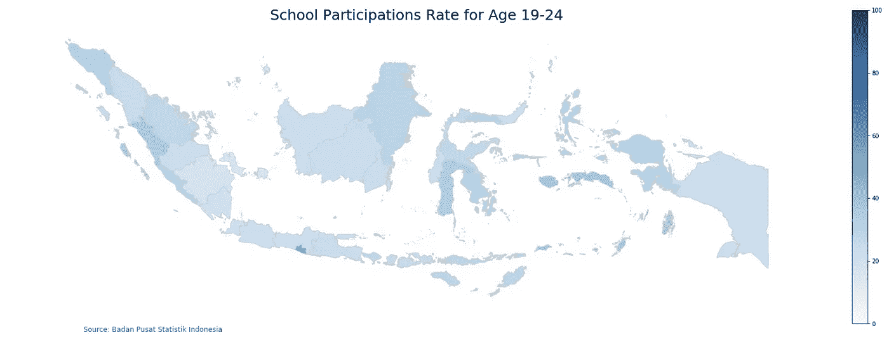

接下来，我们可以添加这行代码来在地图上添加省份名称或覆盖值。

```
# Add Labels Province Namedf_join['coords'] = df_join['geometry'].apply(lambda x: x.representative_point().coords[:])
df_join['coords'] = [coords[0] for coords in df_join['coords']]
for idx, row in df_join.iterrows():
    plt.annotate(s=row['Province'], xy=row['coords'],horizontalalignment='center')
```

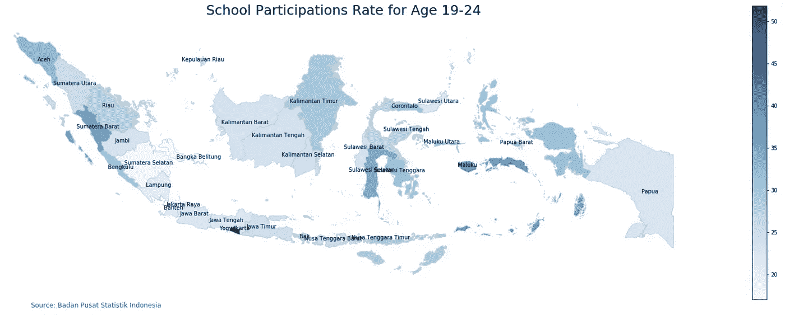

```
# Add Value Labelsdf_join['coords'] = df_join['geometry'].apply(lambda x: x.representative_point().coords[:])
df_join['coords'] = [coords[0] for coords in df_join['coords']]
for idx, row in df_join.iterrows():
    plt.annotate(s=row['19-24'], xy=row['coords'],horizontalalignment='center')
```

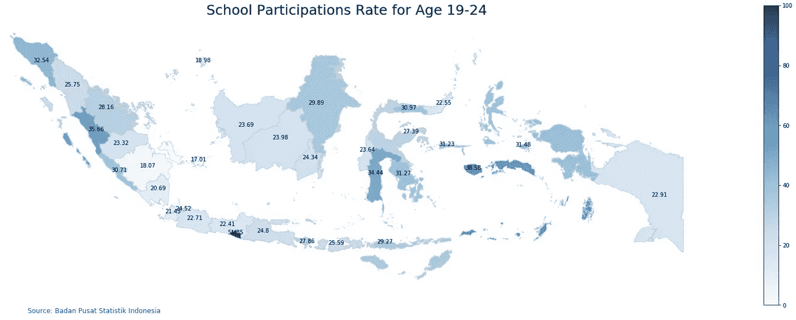

搞定了。我们的 choropleth 地图已经可以保存和共享了。我们可以通过添加这行代码来保存我们的情节。

```
fig.savefig('map_export.png', dpi=300)
```

**第五步:制作所有地图**

在最后一步中，我们将把代码封装到一个 python 函数中，这样我们就可以循环该函数来绘制地理数据框中的所有值。

```
def make_plot(geo_df,values):
    # set a variable that will call whatever column we want to visualise on the map
    values = geo_df.columns[values]# set the value range for the choropleth
    vmin, vmax = 0,100# create figure and axes for Matplotlib
    fig, ax = plt.subplots(1, figsize=(30, 10))# remove the axis
    ax.axis('off')# add a title
    title = 'School Participations Rate for Age {}'.format(values)
    ax.set_title(title, fontdict={'fontsize': '25', 'fontweight' : '3'})# create an annotation for the data source
    ax.annotate('Source: Badan Pusat Statistik Indonesia',xy=(0.1, .08),  xycoords='figure fraction', horizontalalignment='left', verticalalignment='top', fontsize=12 ,color='#555555')# Create colorbar as a legend
    sm = plt.cm.ScalarMappable(cmap='Blues', norm=plt.Normalize(vmin=vmin, vmax=vmax))# add the colorbar to the figure
    cbar = fig.colorbar(sm)# create map
    geo_df.plot(column=values, cmap='Blues', linewidth=0.8, ax=ax, edgecolor='0.8',norm=plt.Normalize(vmin=vmin, vmax=vmax))

    # Add Labels
    geo_df['coords'] = geo_df['geometry'].apply(lambda x: x.representative_point().coords[:])
    geo_df['coords'] = [coords[0] for coords in geo_df['coords']]
    for idx, row in df_join.iterrows():
        plt.annotate(s=row['Province'], xy=row['coords'],horizontalalignment='center', color = 'Red')
```

然后我们调用函数来绘制所有数据。

```
for i in range(1,5):
    make_plot(df_join,i)
```

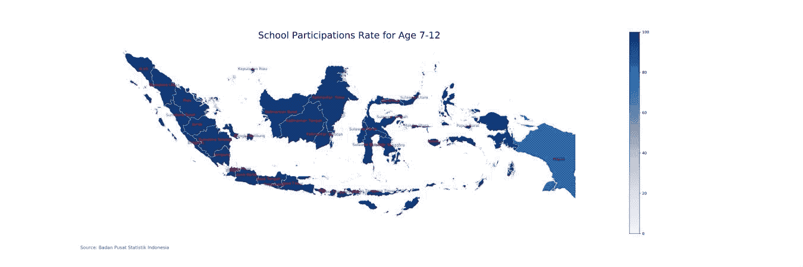

作为总结，我们可以看到不同年龄组的学校参与率在 choropleth 图中的变化。通过这样做，我们可以看到，与早期年龄组相比，老年组的参与率较低。我们可以看到 16 -18 岁年龄段的人数下降，随后是 19-24 岁年龄段的人数大幅下降。这告诉我们，一些印度尼西亚学生只在初中之前上学，没有继续上高中和大学。

查看 19-24 岁年龄组 choropleth 的更多细节，日惹的颜色最深。这意味着这个地区的参与率最高。

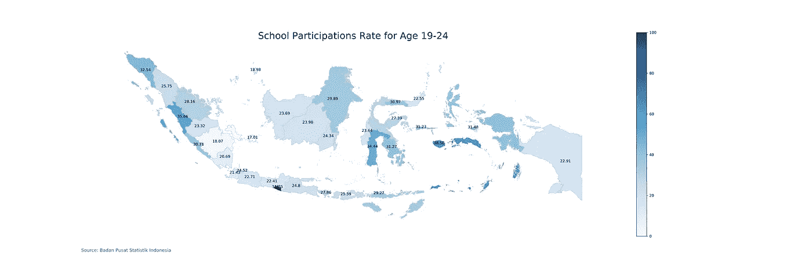

在日惹特区，有四所国立大学，大约 16 所私立大学，以及许多专门从事艺术、科学、技术、教育、农业和商业管理等学科的研究所和学院。与其他地区相比，日惹为 19-24 岁年龄段的人提供了更多的学习场所。这也是高中分区背后的原因之一。此外，日惹也因此被印尼人称为“学生城”。