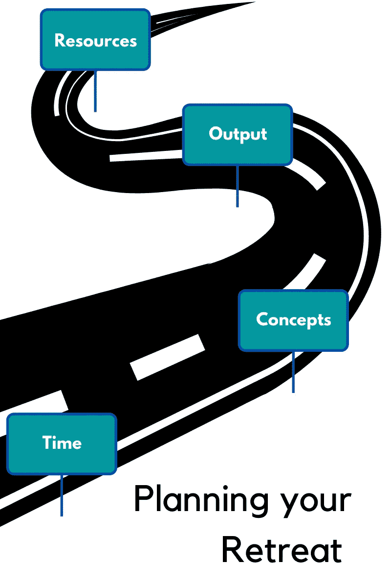

# 不，从项目中学习不是一件容易的事情

> 原文：<https://towardsdatascience.com/nope-learning-from-projects-is-not-an-easy-task-eb35c64da6e7?source=collection_archive---------52----------------------->

## 从自己的迷你项目中最大化学习的五个步骤

micha Parzuchowski 在 [Unsplash](https://unsplash.com?utm_source=medium&utm_medium=referral) 上的照片

一个月前，我发表了[这篇文章](/sorry-online-courses-wont-make-you-a-data-scientist-8639d5f00889)，在这篇文章中，我阐述了自己的观点，即为什么单靠在线课程无法帮助我们成为更好的数据科学家。这篇文章的关键是关于应用学习在数据科学中的重要性，它获得了很多积极的关注，并在社交媒体上得到积极的分享。然而，我确实意识到基于项目的学习并不容易，因为它固有的缺乏框架。因此，在这篇文章中，我将尝试更深入地从项目中学习，以及如何最大限度地利用我们在新项目上花费的时间。

虽然我是基于项目或实践学习的严肃支持者，但我想首先说明这种方法的一些局限性。

# 通过项目自学并非没有缺点

当我们提倡项目和应用学习时，我们需要认识到一个基本事实， ***“在线课程和 MOOCs 仍然非常受欢迎，是全世界学习者的需求”*** ！就连你和我也经常每周花至少一个小时浏览热门 MOOC 网站，调查所提供的课程类型，我们中的一些人甚至加入了一些课程，但由于其他活动，未能坚持完成。但是，真正的问题是 ***“如果不是为了证书，为什么课程仍然受到青睐？”*** 。在我看来，这有三个主要原因—

*   **课程是从接触和理解能力远胜于我们的人那里学习新概念的好方法**。从别人已经清楚理解并用更简单的语言解释的东西中学习总是更容易。
*   **基于项目的学习是非结构化的**，充满了不确定性。我们大多数人在自学时缺乏制定计划并坚持下去的信念。此外，善变是每个初学者的天性。这并不是因为初学者缺乏专注，只是他们被新概念的虚饰和刺激所驱使。这导致在某个特定领域出类拔萃的能力悄然下降。
*   **基于项目的学习要求我们“量化”我们的进展**，这正是我们最害怕的事情之一。我们如何衡量自己在某个领域的专业知识？什么时候我们知道我们已经不仅仅是一个初学者了？

上述三个原因中的两个是基于项目的学习的直接限制，因此，认识到这种学习没有灵丹妙药是相当直观的。

但是等等！如果我们能找到解决这些限制的方法，并打开从我们的迷你项目中有效学习的机会，会怎么样？

# 周末静修的时间到了

[娜塔莉亚·扎里茨卡娅](https://unsplash.com/@goodmood77?utm_source=medium&utm_medium=referral)在 [Unsplash](https://unsplash.com?utm_source=medium&utm_medium=referral) 上的照片

谁不喜欢周末度假呢？我们都渴望周末能从繁忙的工作日中解脱出来休息一下。对我个人来说，周末意味着自由。这些时候，我可以工作或学习一些我在大学里由于大量的课堂作业和其他课外活动而无法学习的东西。

废话说够了。让我们开门见山吧。

这个想法是将我们的个人迷你项目视为远离我们必须履行的日常职责的周末休假。对学生来说，这些“日常职责”可以是日常的作业和课程，而对专业人士来说，这些可以是他们的工作。所以，这里有 5 个步骤可以帮助我们把迷你项目当作周末静修，更有效地学习这些！

## 第一步。计划你的撤退

大多数周末静修都从这一步开始，如果不是每一步的话。我们都会制定一个计划，规划我们的整个旅程，在网上寻找我们可以去的地方和我们可以做的事情，甚至可能拿起一张地图，描绘出我们希望的旅程。

现在，这就是我们需要扩展到我们的迷你项目中的内容——我们需要制定一个计划，并创建我们自己的地图，标出我们在接下来的两天中可以学习的内容。

当我们试图学习时，没有“放之四海而皆准”的计划方法。当我们有一个固定的目标时，计划会起作用，而不是当它像“在 X 领域学习新东西”那样抽象时。然而，既然我们正在谈论把我们的项目作为一个周末静修，让我们同意像计划我们的假期或旅行那样计划我们的项目大纲——一丝不苟。

做到这一点的一个好方法是在我们的计划中创建 4 个部分(如下图所示),并根据我们希望通过个人周末项目实现的目标来填充这些部分。

演职员表:Ramshankar Yadhunath

*   时间:我们愿意在这件事上花费多少时间，不受其他截止日期或职业约定的干扰？如果你回到你的日常工作中，这就不再是一次静修了！
*   **概念:**我们想通过这个迷你项目学习什么概念或工具？事实上，我们想要学习的主题可能会有一个很大的列表，但是我们需要将列表精简为几个主题，这些主题可以作为整个项目的单独部分一起学习。
*   **产出:**这个项目的产出会是什么？它会是一个分析报告，可能是一篇博客文章，它会是一个端到端的应用程序，甚至会是公开的吗？没有必要写下或展示我们所做的每一个小项目，尽管互联网强烈建议这样做。
*   **资源:**互联网上有哪些文章/链接/资源库/教程/课程可以帮助我们完成这个项目？*现在，*很多好的资源只有当我们开始真正的工作时才会被发现*。*因此，以后追加到这个列表也没问题。但是，在开始之前至少有一些链接将有助于保持专注。

虽然以上几节提供了一个很好的方法来制定一个明确的计划，但这并不意味着我们要完成或使用其中的所有内容。这样想吧— ***多少次，我们精心计划去一个新地方的多个景点，但最后总是错过至少一个景点*** 😞。但是，这是否意味着一次糟糕的旅行呢？从来没有。

> 数一数你的点击率比为你的失误而生气要有利得多。

## 第二步。到达目的地

制定计划后，我们接下来需要收拾行李。本质上，这意味着“为大撤退做好准备”。清单被创建，手提箱被放在上面，关于拿什么和留什么的冲突出现了。

在我们的项目中，“做好准备”有几个含义:

*   安装必要的库和包
*   维护一份关于我们想学什么的清单以及监控它的方法
*   最好是笔记本来记笔记
*   我们还需要什么吗

预先安装库通常是不可能的，因为我们可能不知道我们需要的所有库。然而，我们可以确保我们至少有初步的，我们可能需要工作。建立一个[虚拟环境](https://realpython.com/python-virtual-environments-a-primer/)也与我们正在进行的任何项目高度相关。

维护清单和其他生产力提示本质上是高度主观的，如果每个人都遵循一种似乎对他们很有效的方法，那将是最好的。

最后，在基于项目的学习期间，最好尽量减少我们对社交媒体的使用，避免分心，除非你想带着一桶罪恶感结束。

> 前期准备的小行动将在主要任务中发挥重要作用。

## 第三步。享受学习，享受乐趣

到达目的地后，想法通常很简单——玩得开心！

我不知道是否每个读者都觉得学习可以很有趣，但考虑到我们在这个项目中从计划到要使用的工具都是精心挑选的，喜欢我们正在做的事情应该不会有太大的问题！

因为这些迷你项目是我们个人建立技能的尝试，所以最好尝试走出我们在学习中的舒适区。我们最初创建的计划可以作为一个框架，但是不需要考虑这些硬性的规则。我们需要做的就是记录下我们采取的每一个行动。例如，如果我们在进行小型项目时遇到了一个我们感兴趣的新主题或概念，问几个简单的问题可以帮助确定这个主题是否值得追求——

*   这个主题对生成最终输出有帮助吗？
*   与概念列表中的现有主题相比，这个主题是否与行业更相关？
*   有没有好的资源可以深入学习这个话题？
*   它能在剩下的短时间内学会吗？

根据您的个人需求，您可以添加更多内容。

> 聪明一点，行使学习带给你的自由。

## 第四步。记录你的撤退

当然，我们都喜欢拍照和记录我们的假期。这是储存快乐时光记忆的好方法。当然，也是为了向我们的同龄人展示，除了工作，我们还有自己的生活。

然而，我们很多个人迷你项目的最大问题是它们被埋没了。我们甚至不记得我们在一个项目中学到了什么，因为我们从来不愿意把它写下来。所以，当我们最终不得不与某人谈论我们做过的事情时，我们所拥有的只是空洞的话语。老实说，这不太可信。

这里的文档不需要太复杂，简单到足以帮助我们回顾和记住我们曾经做过一些有价值的事情，以及那个项目如何帮助我们学习我们以前不知道的东西。如果我们希望将我们的工作公之于众，这又会有所帮助，因为潜在的采访者或同行会很容易认同我们的努力。 [Github](https://github.com/) 是一个存储你的库和展示你的项目的好地方。

> 没有被记载的努力工作是从未存在过的工作。

## 第五步。你回来后

我们中的许多人喜欢在旅行结束后回来，和我们的同伴讨论所有的事情。但是，我们中的一些人甚至不告诉任何人我们的旅行，我们是保守的那种。

同样，一旦我们完成了项目，也没有必要讨论它。然而，这样做将有助于我们从社区获得积极的反馈，如果我们要改进，这样的反馈总是非常重要的。我们可以将我们的项目以博客的形式发布，或者在我们的个人网站上发布，甚至在社区驱动的平台上分享，比如 [MadewithML](https://madewithml.com/) 。

现在，世界并不都是美好的。当人们批评的时候，他们通常是非常粗鲁的。但是，对我们亲爱的迷你项目的负面评论生闷气就像试图拍一只苍蝇一样没有意义——太费时间，而且通常不值得。相反，我们可以试着认同批评家的思维过程，并利用它来改进。

> 如果你想提高，学会接受反馈。

# 为什么这种荒谬会有帮助？

这个问题很重要。乍一看，试图将从事数据科学项目和周末休假相提并论听起来像是极端疯狂的行为。但是，让我回顾一下我们在本文开始时看到的基于项目的学习的 2 个缺点——

*   基于项目的学习是非结构化的，充满了不确定性
*   基于项目的学习要求我们“量化”我们的进展，这正是我们最害怕的事情之一。

第一步，即计划我们的撤退，帮助我们围绕我们的项目创建一个局部结构。它非常灵活，但它确实有一个框架让我们保持在正确的轨道上。没有严格遵循计划的牢不可破的规则，但是我们所做的每一个决定都受到它对我们的学习成果 ***产生积极影响的能力的指导。*** 在技能培养的宠物项目中，比如这里正在谈论的那些，责任在于我们能学到多少，以及我们如何利用这些来支持我们的成长。

无法量化我们的进展可以通过创建我们自己的度量标准来衡量我们的进展。实现这一点的几种方法(并非详尽无遗)是—

*   计算在这个周末静修项目中学到的全新主题/概念的数量
*   对这些新主题中的每一个，用 1-10 的等级来评价你的理解水平。所以，下次你拿起同样的话题作为另一个周末静修项目的一部分时，你就知道你需要改进多少了。
*   如果你的项目是公开的，向你不认识的人寻求反馈。你可能有很多东西要学。

最后，没有完成我们计划的 100%也没关系。当我们希望通过一个项目学习的 10 个主题对我们来说都是新的时，即使深入学习其中的 5 个也是一项出色的工作(至少对我来说是这样)。

# 最后几点

最后但并非最不重要的，我不想给你留下无根据的证据或提示，因为那对你没有帮助。下面的链接是我大约一周前用我上面详述的“周末静修”方法做的一个项目。

 [## ry05/库里科

### 为在线课程建立一个简单的课程推荐系统 CouReco 是一个建立在……

github.com](https://github.com/ry05/couReco) 

通过参与这个项目，我学到的新概念是—

*   使用 beautifulsoup4 进行网页抓取
*   使用 Streamlit.io 部署 ML 应用程序
*   基于内容推荐器的基本理论

如果这些是你想学习的技能，这个库可能会有所帮助:)

我创建的数据集可以在这里找到。它有 1000 个实例和 14 个特性。你可以在你未来的项目中使用它(如果你曾经使用过它，我会很感激提到它😃)

下一个周末，弄脏你的手，投入到你不懂的事情中去！**相信我。这比我们所能理解的更有帮助。**