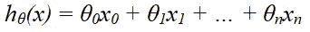
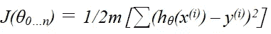
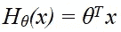
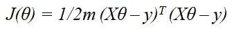
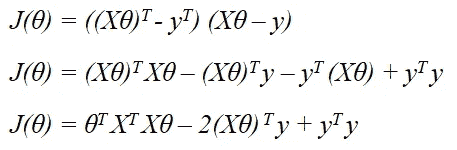
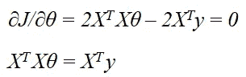
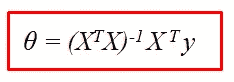

# 正规方程:线性回归的矩阵方法

> 原文：<https://towardsdatascience.com/normal-equation-a-matrix-approach-to-linear-regression-4162ee170243?source=collection_archive---------43----------------------->

## 了解 python 中使用法线方程进行线性回归的推导、实现和限制

在 [Unsplash](https://unsplash.com?utm_source=medium&utm_medium=referral) 上拍摄的 [ThisisEngineering RAEng](https://unsplash.com/@thisisengineering?utm_source=medium&utm_medium=referral)

[线性回归](https://en.wikipedia.org/wiki/Linear_regression#:~:text=In%20statistics%2C%20linear%20regression%20is,is%20called%20simple%20linear%20regression.)可能是数据科学和机器学习中最基础的统计模型，它假设输入变量 **(x)** 和单个输出变量 **(y)** 之间存在线性关系，并试图通过观察到的数据拟合直线**。**虽然您可能熟悉如何使用[梯度下降](https://en.wikipedia.org/wiki/Gradient_descent)作为选择的算法来最小化线性回归问题中的成本函数***【J(θ)****的成本函数*，但是我们可以使用另一种方法来解析地获得最佳值，而无需通过梯度下降的多次迭代来获得全局最小值或选择 alpha(学习速率)。**

# **什么是正规方程？**

**让我们首先推导正规方程，看看矩阵方法是如何用于线性回归的。**

**给定以下将输入映射到输出的假设函数，**

****

**我们希望最小化最小平方成本函数，**

****

**其中 **m =** 训练样本数，**x**s =输入变量，**y**s =第 ***i 个*** 样本的输出变量**

**现在，回归系数 ***θ*** 本质上是一个向量，每一个 **m** 个输入样本也是一个 **n+1** 维的向量(为方便起见，设 x0 = 1)。因此，在矩阵符号中，我们得到**

****

**重写最小平方成本函数并使用矩阵乘法，我们得到，**

****

**让我们应用一些矩阵转置恒等式并忽略 *(1/2m)* ，因为我们将在计算的后面计算导数。我们最后得到一个简化的方程为***【J(θ)】*****

****

**为了找到上述函数的最小值，我们将找到导数 wrt ***θ，*** 并等于 0。**

****

**我们假设矩阵 **( *X'X)*** *(撇号代表转置)*是[可逆](https://en.wikipedia.org/wiki/Invertible_matrix#:~:text=In%20linear%20algebra%2C%20an%20n,used%20is%20ordinary%20matrix%20multiplication.)。两边乘以 ***(X'X)^(-1).*** 我们只剩下了法线方程，**

****

**正态方程**

# **Python 实现:**

**法线方程在 python 中的实现请参考 jupyter 笔记本[这里](https://github.com/akshay-madar/linearRegresssion-using-normalEquations-from-scratch)。我使用了来自 sklearn 库的**波士顿房价数据集**和 **numpy** 包，使用上面推导的矩阵方法计算回归系数。**

# **局限性:**

1.  **计算***(X’X)***然后将其求逆的过程是昂贵的，并且花费 ***O(N )*** 其中 ***N*** 是 ***X*** 矩阵中的行数/观察数。根据斯坦福大学计算机科学兼职教授[吴恩达](https://www.coursera.org/learn/machine-learning)的说法，法线方程应该避免用于超过 10K 的特征。**
2.  *****【X ' X】***可能是不可逆的，违背了我们的假设。在这种情况下，线性相关的冗余特征可能会被删除，或者像[套索](https://en.wikipedia.org/wiki/Lasso_(statistics))这样的正则化方法被用来减少特征的数量。**