# Python 中的 10 个正态性测试(分步指南 2020)

> 原文：<https://towardsdatascience.com/normality-tests-in-python-31e04aa4f411?source=collection_archive---------1----------------------->

## 正态性检验用于检查变量或样本是否具有正态分布。

作者形象

在讨论正态性检验之前，让我们先讨论正态分布及其重要性。

# 正态分布

正态分布也称为**高斯分布**是一种概率函数，描述了变量值的分布情况。这是一种对称分布，其中大部分观察值落在中心峰值附近，远离平均值的值的概率在两个方向上等量递减，在数据范围的高端和低端有较少的异常值。

**高斯分布的术语**指的是德国数学家**卡尔·弗里德里希·高斯。**

正态分布有一些重要的性质:

1.  平均值、中值和众数都代表分布的中心。
2.  分布呈钟形
3.  大约 68%的数据落在平均值的 1 个标准偏差内，大约 95%的数据落在平均值的 2 个标准差内，大约 99.7%的数据落在平均值的 3 个标准差内

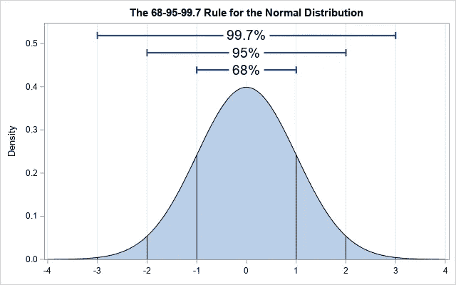

图片来自 Christian Hubicki。

# 为什么它如此重要

正态分布是统计学中最重要的概率分布，因为

1.  自然界中的许多过程都遵循正态分布，例如人的年龄、身高、体重和血压
2.  线性回归假设**误差或残差遵循正态分布**。
3.  有些 ML 算法像**线性判别分析和**二次判别分析都是在正态分布的假设下推导出来的。

# 常态检验

在统计学中，正态性检验用于检查数据是否来自高斯分布，或者简单地检查变量或样本是否具有正态分布。

有两种方法可以检验正态性，

1.  正态性检验图
2.  正态性统计检验

# **1。正态性测试图**

各种图表可以用来检验变量的正态性。使用图表我们可以直观地看到正态性，但是图表作为统计方法并不十分准确。

**1。Q Q 或分位数-分位数图**

它绘制了两组相对的分位数，即理论分位数相对于变量的实际分位数。

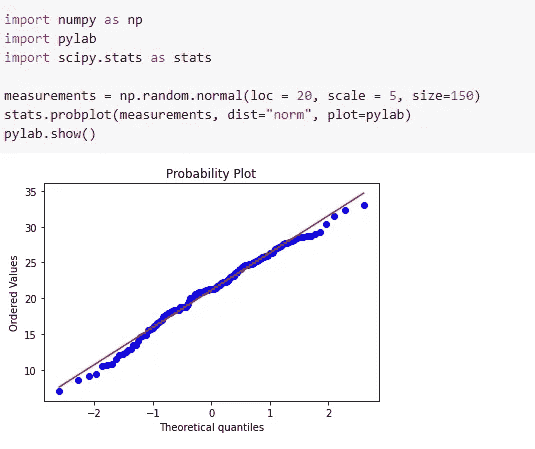

图片来自作者

如果我们的数据来自正态分布，我们应该看到所有的点都位于直线上。

**2。方框图**

盒状图也称为**盒须图**是另一种可视化变量正态性的方式。它显示了基于五个数字汇总的数据分布，即最小值、第一个四分位数(Q1)、中值(Q2)、第三个四分位数(第三季度)和最大值。

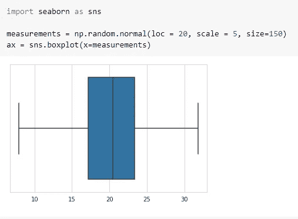

图片来自作者

如果你的变量有一个正态分布，我们应该看到中间的均值和中位数。

**3。直方图**

直方图是一种流行且常用的图形，可以直观地显示数据的分布。它还允许我们检查数据的潜在异常值、偏斜度等。它将数据分成等宽的仓。每个条柱被绘制成一个条形，条形的高度取决于该条柱中数据点的数量。

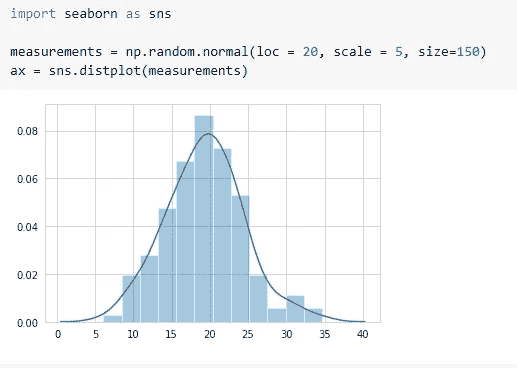

图片来自作者

如果你的变量有一个正态分布，我们应该看到一个钟形曲线。

# **2。正态性的统计检验**

另一方面，有许多统计测试来检查变量的分布是否为正态/高斯分布。在这一部分，我不会谈论背后的数学，但我会向您展示每个测试的 python 代码。

1.  **夏皮罗-维尔克检验**

我们应该从夏皮罗-维尔克试验开始。这是检验变量正态性的最有力的测试。它是由塞缪尔·桑福德·夏皮罗和马丁·维尔克在 1965 年提出的。

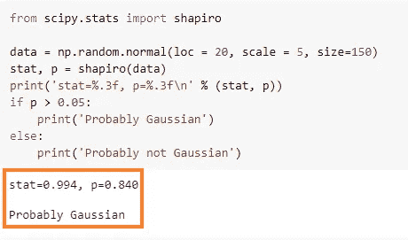

图片来自作者

*   如果p 值≤ 0.05，那么我们拒绝零假设，即我们假设变量的分布不是正态/高斯分布。
*   如果p 值>为 0.05，那么我们无法拒绝零假设，即我们假设变量的分布为正态/高斯分布。

**2。达戈斯蒂诺的 K 平方检验**

达戈斯蒂诺的 K 平方检验基于偏度和峰度检查变量的正态性。它是由拉尔夫·达戈斯蒂诺命名的。

> **偏斜度**是对对称性的一种度量。
> 
> **峰度**是衡量数据相对于正态分布是重尾还是轻尾的指标。

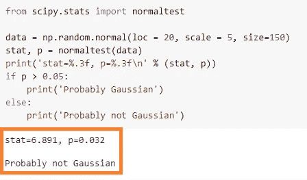

图片来自作者

*   如果p 值≤ 0.05，那么我们拒绝零假设，即我们假设变量的分布不是正态/高斯分布。
*   如果p 值>为 0.05，那么我们无法拒绝零假设，即我们假设变量的分布为正态/高斯分布。

**3。安德森-达林正态性检验**

安德森-达林正态性检验是另一种一般的正态性检验，旨在确定数据是否来自特定的分布，在我们的情况下，正态分布。它是由西奥多·安德森和唐纳德·达林在 1952 年发明的。

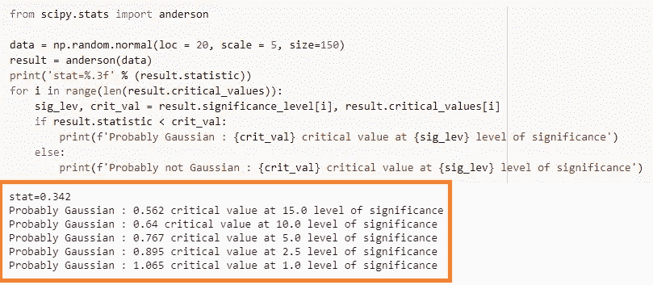

图片来自作者

它给出了一个临界值范围，在该范围内，如果计算的统计量小于临界值，则零假设可能会被拒绝。在我们的例子中，在每个显著性水平上，数据具有高斯分布。

**4。卡方正态性检验**

检验变量正态性的另一种方法是卡方正态性检验。它不像其他方法那样受欢迎。

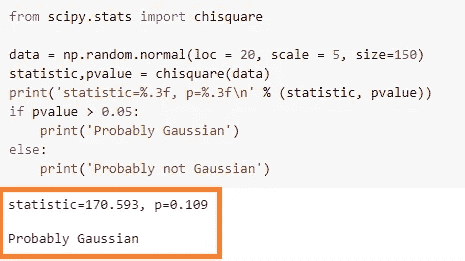

图片来自作者

*   如果p 值≤ 0.05，那么我们拒绝零假设，即我们假设变量的分布不是正态/高斯分布。
*   如果p 值>为 0.05，那么我们无法拒绝零假设，即我们假设变量的分布为正态/高斯分布。

**5。Lilliefors 正态性检验**

Lilliefors 检验是基于 Kolmogorov-Smirnov 检验的正态性检验。与上述所有方法一样，该检验用于检查数据是否来自正态分布。它是以乔治·华盛顿大学统计学教授休伯特·利里福斯的名字命名的。

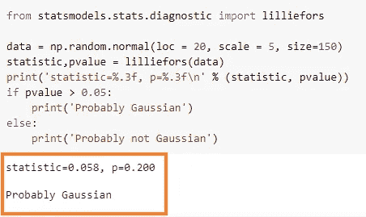

图片来自作者

*   如果p 值≤ 0.05，那么我们拒绝零假设，即我们假设变量的分布不是正态/高斯分布。
*   如果p 值>为 0.05，那么我们无法拒绝零假设，即我们假设变量的分布为正态/高斯分布。

**6。jarque**–**Bera 正态性测试**

Jarque-Bera 检验测试样本数据的偏度和峰度是否符合正态分布。

> 注意:这个测试只对足够大数量的数据样本有效(> 2000)。

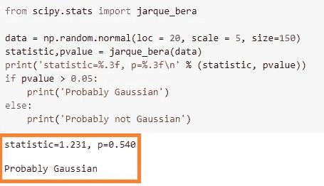

图片来自作者

*   如果p 值≤ 0.05，那么我们拒绝零假设，即我们假设变量的分布不是正态/高斯分布。
*   如果p 值>为 0.05，那么我们无法拒绝零假设，即我们假设变量的分布为正态/高斯分布。

7.**科尔莫戈罗夫** - **斯米尔诺夫正态性检验**

对拟合优度执行(一个样本或两个样本)Kolmogorov-Smirnov 测试。单样本检验针对给定的分布 G(x)(即正态分布)对观察到的随机变量的分布 F(x)进行检验。

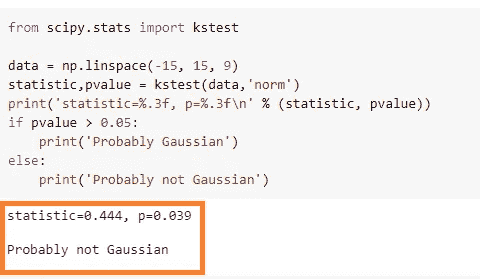

图片来自作者

*   如果p 值≤ 0.05，那么我们拒绝零假设，即我们假设变量的分布不是正态/高斯分布。
*   如果p 值>为 0.05，那么我们无法拒绝零假设，即我们假设变量的分布为正态/高斯分布。

# 结论

我们创建机器学习模型，通过对从群体中提取的样本进行训练来模拟宇宙/群体中的过程。该过程可以是检测癌症、欺诈交易等。我们假设总体的分布是正态的，样本代表总体。代表总体的好样本在生产中工作良好。因此，在训练模型之前，建议用正态性检验来检查样本是否能很好地代表总体(即正态分布)。有很多方法来检查变量的正态性。人们可以选择通过可视化使其易于理解的图，或者选择统计检验，这给出了检验正态性的 p 值。

# 参考

 [## SciPy - SciPy v1.5.2 参考指南

### SciPy(读作“叹息派”)是数学、科学和工程领域的开源软件。已完成的教程…

docs.scipy.org](https://docs.scipy.org/doc/scipy/reference/index.html)  [## 简介-统计模型

### statsmodels 是一个 Python 模块，它为许多不同的统计数据的估计提供了类和函数

www.statsmodels.org](https://www.statsmodels.org/stable/index.html)  [## 维基百科(一个基于 wiki 技术的多语言的百科全书协作计划ˌ也是一部用不同语言写成的网络百科全书ˌ 其目标及宗旨是为全人类提供自由的百科全书)ˌ开放性的百科全书

### 维基百科是一个免费的在线百科全书，由世界各地的志愿者创建和编辑，由维基媒体托管…

www.wikipedia.org](https://www.wikipedia.org/) 

# 感谢您的阅读！

非常感谢您的任何反馈和意见！

我的其他一些帖子你可能会感兴趣，

 [## 4 种超参数调整技术

### 每个数据科学家都应该知道的流行超参数调整技术

medium.com](https://medium.com/swlh/4-hyper-parameter-tuning-techniques-924cb188d199)  [## 超参数调整的数据泄漏

### 超参数调优有时会打乱您的模型，并导致对看不见的数据产生不可预测的结果。

towardsdatascience.com](/data-leakage-with-hyper-parameter-tuning-c57ba2006046)  [## Python 中的“是”和“==”

### 加快字符串比较的速度

medium.com](https://medium.com/swlh/is-and-in-python-f084f36cbc0e)