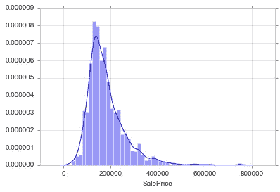
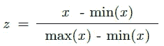
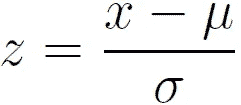
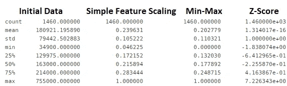
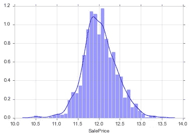

# 2 分钟内标准化和规范化

> 原文：<https://towardsdatascience.com/normalization-and-standardization-in-2-minutes-e0609a01e76?source=collection_archive---------31----------------------->

来源: [Clker](https://pixabay.com/users/clker-free-vector-images-3736/) ，via [pixabay](https://pixabay.com/vectors/giraffes-mammals-animals-four-35518/)

规范化和标准化是相似的-它们重新缩放要素。它们用于数据分析以理解数据，并用于机器学习以通过某些算法进行更好的训练。

这篇文章包括:

*   正常化。为什么要正常化？
*   标准化。为什么要标准化？
*   差异？
*   何时使用，何时不使用
*   用于简单要素缩放、最小值-最大值、Z 值、log1p 变换的 Python 代码

# 导入库，读取数据

使用来自 [Kaggle](https://www.kaggle.com/c/house-prices-advanced-regression-techniques) 的房价数据集。

# 正常化

它是在[0，1]之间重新调整值的过程。

# 为什么要正常化？

1.  归一化使训练对特征的尺度不太敏感，因此我们可以更好地求解系数。离群值已经消失，但在规范化数据中仍然可见。
2.  使用标准化方法将改善某些模型的分析。
3.  规范化将确保收敛问题没有巨大的差异，使优化可行。

# 标准化

这是重新调整要素的过程，使其具有均值为 0、标准差为 1 的高斯分布的属性。

# 为什么要标准化？

1.  比较具有不同单位或比例的要素。
2.  标准化往往使训练过程表现良好，因为优化问题的数值条件得到改善。

# 差异？

1.  当使用标准化时，您的新数据是不受限制的(不像标准化)。
2.  当您不知道数据的分布或您知道它不是高斯分布时，请使用归一化。如果您的数据具有高斯分布，请使用标准化。
3.  有时，当标准化不起作用时，标准化可能会起作用。

# 何时使用，何时不使用

用于以下算法:

*   k-最近邻
*   k 均值
*   逻辑回归
*   SVM
*   感知器
*   主成分分析和线性判别分析

不要用于以下算法:

*   朴素贝叶斯
*   决策图表
*   随机森林
*   XGBoost
*   LightGBM

# 归一化方法 1-简单要素缩放

数据被重新缩放，新值在[0，1]中。我们将每个值除以最大值。

# 归一化方法 2 —最小值-最大值

数据被重新缩放，新值在[0，1]中。

# 标准化— Z 值

这是重新调整要素的过程，使其具有μ=0 和σ=1 的高斯分布的属性

其中，μ是平均值，σ是平均值的标准差；样本的标准分数(也称为 z 分数)计算如下:

最后，让我们看看每种方法是如何转换数据的。

# 加成:转化——log1p 转化。

通常用于将价格值转换为日志。然后，应用统计学习就变得容易多了。

此外，在正偏斜的情况下，对数变换通常工作得很好。

参考资料:

 [## 标准化还是常态化？Python 中的示例

### 一个常见的误解是，什么是标准化数据以及何时标准化数据与标准化日期之间的区别。

medium.com](https://medium.com/@rrfd/standardize-or-normalize-examples-in-python-e3f174b65dfc)  [## 标准化与规范化

### 在整个知识发现过程中，数据挖掘本身之前，数据预处理起着至关重要的作用。其中一个…

www.dataminingblog.com](http://www.dataminingblog.com/standardization-vs-normalization/)  [## 关于特征缩放和规范化

### 部分标准化(或 Z 值标准化)的结果是要素将被重新缩放，以便它们将…

sebastianraschka.com](http://sebastianraschka.com/Articles/2014_about_feature_scaling.html)