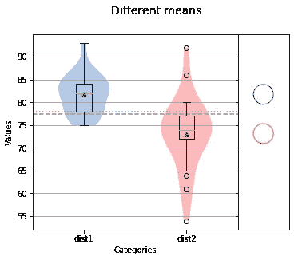
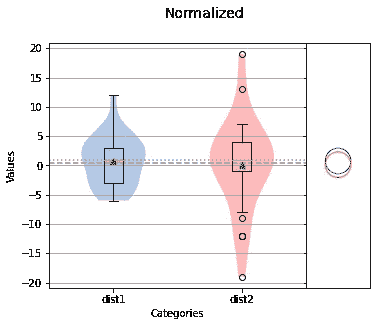
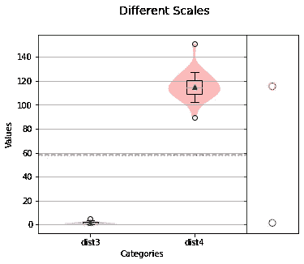
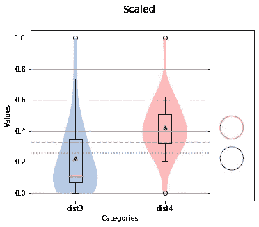

# Python 中使用 NumPy 的规范化技术

> 原文：<https://towardsdatascience.com/normalization-techniques-in-python-using-numpy-b998aa81d754?source=collection_archive---------2----------------------->

## [入门](https://towardsdatascience.com/tagged/getting-started)

## 使用 Python 和 NumPy 规范化数据集以进行分析和建模。


作者通过 [Flickr](https://www.flickr.com/photos/cmmorrow/9654448075/in/album-72157635320846374/) 拍摄的照片

数据科学不仅仅是开发模型。大量工作涉及清理数据和选择要素。将具有相似分布但显著不同均值的要素或比例差异极大的要素插入模型可能会导致错误的预测。这些问题的一个常见解决方案是首先“归一化”特征以消除均值和方差的显著差异。

术语“规范化”可能会引起误解(也不应该与[数据库规范化](https://en.wikipedia.org/wiki/Database_normalization)相混淆)，因为它在统计学中意味着许多事情。然而，标准化技术中有一个共同的主题，就是将单独的数据集对齐，以便于比较。我们将重点介绍的两种技术是残差提取和重新缩放，残差提取会改变数据集的均值，而重新缩放会拉伸和压缩数据集中的值，以适应从 0 到 1 的范围。不用说，这两种技术都将消除应用于数据集的单元。幸运的是，移位和缩放技术都可以在 Python 中轻松完成，并使用 NumPy Python 包高效地进行计算。

## 提取残差

我们先来探讨一下残差提取技术。残差是数据集中的值与数据集平均值之间的相对差值。当数据集具有相似的分布但显著不同的均值，从而使数据集之间的比较变得困难时，这种技术非常有用。例如，假设我们有一个由两个同等规模的不同班级参加的考试。问题一样，顺序一样，答案也一样。但是两个班的平均分不一样。一班在考试中平均得了 82 分，二班平均得了 77 分。我们怎样才能把两个班的分数结合起来呢？

让我们从设置 Python 环境开始:

```
import numpy as np
import scipy.stats as st
from sci_analysis import analyze
%matplotlib inlinenp.random.seed(12)
```

上面的代码导入 NumPy 包作为`np`，SciPy stats 模块作为`st`——它将用于创建我们的数据集，sci_analysis Python 包中的`analyze`函数用于绘制结果，最后，我们设置随机数生成器种子值，以便结果是可重复的。作为参数传递给`np.random.seed()`的数字 12 是任意选择的。现在，让我们创建两个数据集，每个类一个:

```
dist1 = st.norm.rvs(82, 4, size=25).astype(int)
dist2 = st.norm.rvs(77, 7, size=25).astype(int)
print(dist1)
print(dist2)
```

**输出:**

```
[83 79 82 75 85
 75 82 81 78 93
 79 83 86 77 87
 81 86 78 77 86
 84 82 84 84 77][61 65 64 61 72
 73 76 78 74 75
 77 70 72 77 72
 72 76 86 79 74
 72 76 92 54 80]
```

类别 1 由`dist1`表示，类别 2 由`dist2`表示。两个变量都是 25 个正态分布随机变量的 NumPy 数组，其中`dist1`的平均值为 82，标准差为 4，而`dist2`的平均值为 77，标准差为 7。两个数组都被转换成整数，以完成我们的考试分数示例。我们可以用下面的代码来可视化课堂成绩:

```
analyze(
    {'dist1': dist1, 'dist2': dist2},
    title='Different means',
    nqp=False,
)
print(f'dist1 mean: {np.mean(dist1)} std dev: {np.std(dist1)}')
print(f'dist2 mean: {np.mean(dist2)} std dev: {np.std(dist2)}')
```

**输出:**



```
dist1 mean: 81.76 std dev: 4.197904239022134
dist2 mean: 73.12 std dev: 7.7785345663563135
```

从上图以及`dist1`和`dist2`的均值和标准差，我们可以看出分布不匹配。

现在让我们计算`dist1`和`dist2`的残差:

```
dist1_norm = dist1 - int(np.mean(dist1))
dist2_norm = dist2 - int(np.mean(dist2))
print(dist1_norm)
print(dist2_norm)
```

**输出:**

```
[   2  -2   1  -6   4 
   -6   1   0  -3  12 
   -2   2   5  -4   6
    0   5  -3  -4   5
    3   1   3   3  -4][ -12  -8  -9 -12  -1
    0   3   5   1   2
    4  -3  -1   4  -1
   -1   3  13   6   1  
   -1   3  19 -19   7]
```

残差是每个值与该值的分布平均值之间的差。换句话说，每个残差都是距离每个分布的平均值的距离，现在平均值为零。因为现在每个分布的平均值为零，所以它们可以直接相互比较。

```
analyze(
    {'dist1': dist1_norm, 'dist2': dist2_norm},
    title='Normalized',
    nqp=False,
)
print(f'dist1 mean: {np.mean(dist1_norm)} std dev: {np.std(dist1_norm)}')
print(f'dist2 mean: {np.mean(dist2_norm)} std dev: {np.std(dist2_norm)}')
```

**输出:**



```
dist1 mean: 0.76 std dev: 4.197904239022134
dist2 mean: 0.12 std dev: 7.7785345663563135
```

我们可以看到平均值现在接近于零(如果在将值转换为整数时没有舍入误差，平均值应该为零)，但是每个分布的方差没有改变。这显示了计算残差是如何有效地移动每个分布的平均值，使它们对齐以便直接比较的。

## 最小-最大重新缩放

另一种标准化技术是重新缩放数据集。这在尝试比较不同因素或使用不同单位的数据集时非常有用，例如比较英里和米。让我们生成两个新的分布，它们的比例相差 100 倍:

```
dist3 = st.gamma.rvs(1.7, size=25)
dist4 = st.gamma.rvs(120, size=25)
print(dist3)
print(dist4)
```

**输出:**

```
[   0.49529541   1.42598239   0.38621773   0.96738928   0.53575876
    1.72574991   0.3431045    0.80584646   0.77543188   1.84272915
    2.049985     0.76373308   3.54020309   0.36979422   4.67967817
    0.6311116    2.51371776   1.12812921   0.62183125   2.03923847
    1.15269735   0.72795499   1.86093872   0.52560778   0.65314453] [113.88768554 108.94661696 118.40872068 124.94416222 150.91953839
  116.86987547 107.05486021  89.61392457 126.28254195 123.32858014
  108.31036684 114.52812809 109.43092709 114.17768634 114.54545154
  111.21616394 102.08437696 127.42455395 105.82224292 127.28966453
  114.03632754 120.02256655 120.77792085 103.43640076 112.24143473]
```

从上面的输出中，您可以看到`dist3`在 0 到 10 的范围内，而`dist4`比`dist3`大 100 倍。通过检查平均值和标准偏差，我们可以看到这些分布不能相互比较。

```
analyze(
    {"dist3": dist3, "dist4": dist4},
    title="Different Scales",
    nqp=False,
)
print(f'dist3 mean: {np.mean(dist3)} std dev: {np.std(dist3)}')
print(f'dist4 mean: {np.mean(dist4)} std dev: {np.std(dist4)}')
```

**输出:**



```
dist3 mean: 1.3024508282047844 std dev: 1.0372657584518052
dist4 mean: 115.42402875045401 std dev: 11.29662689178773
```

幸运的是，有一种技术可以通过使用每个数据集中每个值与最小值之间的距离与每个数据集中值的范围之比来重新调整分布。该比率由以下等式表示:

```
(x - min) / (max - min)
```

通过在 Python 中应用这个等式，我们可以得到`dist3`和`dist4`的重新缩放版本:

```
max = np.max(dist3)
min = np.min(dist3)
dist3_scaled = np.array([(x - min) / (max - min) for x in dist3])
max = np.max(dist4)
min = np.min(dist4)
dist4_scaled = np.array([(x - min) / (max - min) for x in dist4])
print(dist3_scaled)
print(dist4_scaled)
```

**输出:**

```
[0.03509474 0.24970817 0.00994177 0.14395807 0.04442546
 0.3188336  0\.         0.10670681 0.09969331 0.34580864
 0.39360118 0.09699561 0.7372407  0.00615456 1\.        
 0.06641352 0.50053647 0.18102418 0.0642735  0.39112306
 0.18668952 0.08874529 0.35000771 0.04208467 0.07149424] [0.39594679 0.31534946 0.46969265 0.57629694 1\.        
 0.44459144 0.28449166 0\.         0.59812822 0.54994402
 0.30497113 0.40639351 0.32324939 0.4006772  0.40667608
 0.35236968 0.20341453 0.6167564  0.26438555 0.61455612
 0.3983714  0.49601725 0.50833838 0.22546836 0.36909361]
```

通过重新缩放`dist3`和`dist4`，每个数据集的最大值现在是 1，而最小值现在是 0。这很方便，因为每个数据集现在都在相同的比例上，并且每个分布的形状都得以保留。实际上，每个分布都被压缩并移动到 0 和 1 之间。现在，让我们检查重新缩放的`dist3`和`dist4`的平均值和标准偏差:

```
analyze(
    {'dist3': dist3_scaled, 'dist4': dist4_scaled},
    title='Scaled',
    nqp=False,
)
print(f'dist3 mean: {np.mean(dist3_scaled)} std dev: {np.std(dist3_scaled)}')
print(f'dist4 mean: {np.mean(dist4_scaled)} std dev:{np.std(dist4_scaled)}')
```

**输出:**



```
dist3 mean: 0.2212221913870349 std dev: 0.2391901615794912
dist4 mean: 0.42100718959757816 std dev: 0.18426741349056594
```

我们现在可以看到，`dist3_scaled`和`dist4_scaled`的均值在相似的标准差下有显著的不同。

## 使用 NumPy 规范化大型数据集

残差和重定标都是归一化数据集以进行分析的有用技术。然而，这些数据集通常不只是 25 个值，因此值得考虑如何有效地计算残差和执行重缩放。幸运的是，NumPy 可以帮助快速有效地执行这些计算。

如果您不熟悉 NumPy，它是一个用于高性能科学计算的 Python 包。与使用常规 Python 列表相比，NumPy 有两个使计算更快、更有效的特性。首先，NumPy 使用数组作为其主要数据结构，与 Python 列表相比，它使用的内存更少，并且要求数组中的每个值都是相同的类型。标量也可以对数组进行操作——对数组的每个值应用标量操作。事实上，当我们通过从分布(一个数组)中减去分布(一个标量)的平均值来计算残差时，我们已经看到了这一点。

让我们比较一下使用 Python 列表理解和数组操作计算残差的速度差异。我们将首先创建一个包含 100，000 个值的随机正态分布变量数组:

```
dist5 = st.norm.rvs(82, 5, size=100000)
```

让我们看看使用列表理解计算`dist5`的残差需要多长时间:

```
avg = np.mean(dist5)
%timeit [val - avg for val in dist5]
```

**输出:**

```
10 loops, best of 3: 24.9 ms per loop
```

列表理解需要大约 25 毫秒来遍历`dist5`中的每个值，这还不算太糟糕。然而，让我们再次计算`dist5`的残差，但是使用 NumPy 标量运算:

```
avg = np.mean(dist5)
%timeit dist5 - avg
```

**输出:**

```
10000 loops, best of 3: 144 µs per loop
```

仅仅从`dist5`(这是一个 NumPy 数组)中减去平均值就需要 144 微秒！这得益于 NumPy 阵列的高效设计。

现在，如果我们想用一个函数而不仅仅是一个简单的标量来操作一个数组呢？这是 NumPy 以通用函数的形式对 Python 的第二次性能提升。通用函数是“矢量化”操作，在迭代数组中的每个值时，利用 CPU 优化来实现计算加速。NumPy 内置了无数的通用函数，但是我们也可以使用 NumPy 的`frompyfunc()`函数编写自己的函数。

让我们来看看使用列表理解和自定义通用函数来重新调整数组值在速度上的差异:

```
min = np.min(dist5)
max = np.max(dist5)
%timeit [(val - min) / (max - min) for val in dist5]
```

**输出:**

```
10 loops, best of 3: 47.2 ms per loop
```

通过在 47 毫秒内重新缩放`dist5`,列表理解的表现令人钦佩。让我们把这比作创建一个名为`scale`的定制通用函数。

```
scale = np.frompyfunc(lambda x, min, max: (x - min) / (max - min), 3, 1)
```

我们使用`np.frompyfunc()`函数，它接受一个可调用函数、输入数和输出数作为它的参数。在这种情况下，可调用的是 lambda 函数形式的重定标方程。如果你不熟悉 lambda 函数，你可以把它们想象成一行未命名的函数。我们的 lambda 函数有三个参数，`x`、`min`和`max`。这三个参数是调用`np.frompyfunc()`时指定的三个输入。同样值得注意的是，`min`和`max`是从`dist5`计算的标量，而`x`代表`dist5`中的每个值。现在，让我们计算`min`和`max`并调用`scale`函数:

```
min = np.min(dist5)
max = np.max(dist5)
%timeit scale(dist5, min, max).astype(float)
```

**输出:**

```
10 loops, best of 3: 20.4 ms per loop
```

如你所见，与列表理解相比，自定义通用函数需要一半的时间来完成。

## 结论

我们研究了两种归一化技术——残差提取和最小-最大重新缩放。残差提取可以被认为是移动一个分布，使其平均值为 0。最小-最大重新缩放可以被认为是移动和压缩分布以适应 0 和 1 之间的范围。残差提取对于比较均值不同但形状相似的分布很有用。最小-最大重新缩放对于比较不同比例或不同形状的分布很有用。

当分布用 NumPy 数组表示时，这两种规范化技术都可以用 NumPy 有效地执行。NumPy 数组上的标量操作既快又易读。当需要对数组进行更复杂的操作时，可以使用通用函数来高效地执行操作。