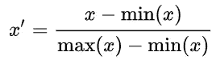
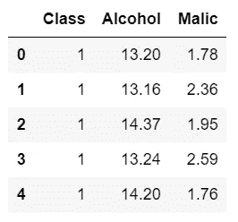
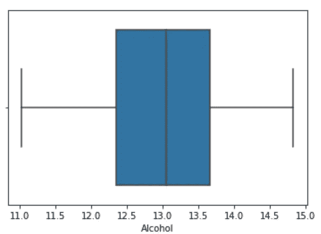
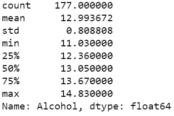
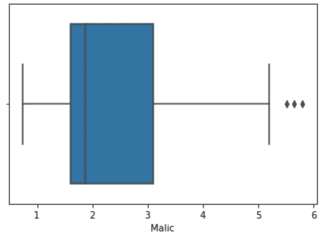
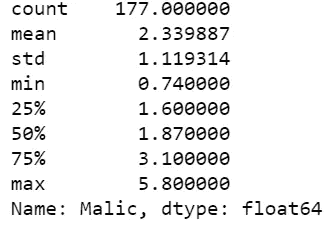

# 规范化与标准化

> 原文：<https://towardsdatascience.com/normalization-vs-standardization-cb8fe15082eb?source=collection_archive---------13----------------------->


[主题客栈](https://unsplash.com/@themeinn?utm_source=medium&utm_medium=referral)在 [Unsplash](https://unsplash.com?utm_source=medium&utm_medium=referral) 拍摄的照片

## 两种最重要的特征缩放技术

在机器学习中，一个模型将和你用来训练该模型的数据一样好(或一样坏)。由于各种原因，不同特征的大小影响不同的机器学习模型。

例如，考虑一个包含年龄和收入两个特征的数据集。这里的年龄范围是从 0 到 100，而收入范围是从 0 到一个很大的数目，大多数都高于 100。收入比年龄大 1000 倍左右。所以，这两个特征在非常不同的范围内。当我们做进一步的分析时，比如多元线性回归，归因收入会由于其更大的值而内在地影响结果。但这并不一定意味着它作为一个预测指标更重要。因此，应缩放所有要素的范围，以便每个要素对最终距离的贡献大致成比例。

为此，使用**特征缩放**是必不可少的。

**在本文中，我们将讨论什么是特性缩放，为什么是特性缩放，实现特性缩放的技术，它的有用性，以及使用这些技术实现特性缩放的 python 片段。**

讨论的*流程如下，*

*   特征缩放
*   正常化
*   标准化
*   履行
*   什么时候用什么？

# **特征缩放**

要素缩放是一种将数据集中数值列的值更改为使用通用比例的技术，不会扭曲值范围的差异或丢失信息。

## 为什么要使用特征缩放？

1.  使用要素缩放比不使用要素缩放时，梯度下降收敛得更快。
2.  许多分类器(如 KNN，K-means)通过欧几里得距离计算两点之间的距离。如果其中一个要素的值范围很大，则距离将由该特定要素决定。因此，应缩放要素的范围，使每个要素对最终距离的贡献大致成比例。

但是，并非每个数据集都需要进行要素缩放。仅当特性具有**不同范围时才需要。**

这可以通过两种广泛使用的技术来实现。

1.  正常化
2.  标准化

# 正常化

归一化(也称为**最小-最大归一化**)是一种缩放技术，当应用该技术时，特征将被重新缩放，从而数据将落入*范围【0，1】*

每个特征的归一化形式可以计算如下:



归一化的数学公式

这里“x”是原始值,“x `”是标准化值。

# 标准化

标准化(也称为 **Z 值归一化**)是一种缩放技术，当应用该技术时，要素将被重新缩放，从而使其具有标准正态分布的属性，具有**平均值、 *μ=0* 和标准偏差、*σ= 1***；其中 *μ* 是平均值，而 *σ* 是平均值的标准偏差。

样本的*标准分*(也称****z****分*)计算如下:*

**

*标准化的数学公式*

*这将缩放特征，使其*范围在[-1，1]* 之间*

# *履行*

*现在让我们使用一个简单的 python 代码来实现这些技术。*

*我们将使用的数据集是来自 Kaggle 的葡萄酒分类器数据。*

*[](https://www.kaggle.com/brynja/wineuci) [## 葡萄酒品种分类

### 测试不同算法的伟大实践

www.kaggle.com](https://www.kaggle.com/brynja/wineuci) 

## 关于数据集:

这个数据集是对意大利同一地区的三种不同品种的葡萄酒进行化学分析的结果。这项分析确定了三种葡萄酒中 13 种成分的含量。

```
import pandas as pd
wine_data = pd.read_csv("wine_data.csv",usecols=[0,1,2])
```

使用 pandas 导入 pandas 并将 CSV 格式(逗号分隔值)的数据读取到数据框中。

```
wine_data.head()
```

输出:



压头的输出()

Head()返回数据中的前五个元素。

现在，让我们来详细研究一下每个专栏/功能。

```
import seaborn as sns
sns.boxplot(x='Alcohol', data=wine_data)
```

输出:



在这里，我们可以看到特性酒精值的范围是 11-15

```
wine_data['Alcohol'].describe()
```

输出:



describe()的输出

我们可以清楚地看到各种统计函数值，最小值约为 11.03，最大值约为 14.83

```
sns.boxplot(x='Malic', data=wine_data)
```

输出:



这里我们可以看到苹果的特性值在 1-6 的范围内，很少有异常值。

```
wine_data['Malic'].describe()
```

输出:



## 观察结果:

*   特性*酒精*范围在[11，15]之间
*   特征*苹果*范围在[0.5，6]
*   当我们执行考虑距离的机器学习算法(如 KNN)时，模型将偏向于特征，*酒精*。因此，*特征缩放对于该数据集*是必要的。

现在让我们执行规范化和标准化。并比较结果。* 

# *应用规范化*

*现在，让我们对每个特性进行标准化，并观察变化。*

```
*from sklearn.preprocessing import MinMaxScaler*
```

*使用*最小最大缩放器可以实现标准化。**

```
*minmax_scale = MinMaxScaler().fit(wine_data[['Alcohol', 'Malic']])
df_minmax = minmax_scale.transform(wine_data[['Alcohol', 'Malic']])*
```

*对特征、*酒精*和*苹果*应用归一化*

```
*print('Min-value after normalization:\nAlcohol={:.2f}, Malic acid={:.2f}'
      .format(df_minmax[:,0].min(), df_minmax[:,1].min()))
print('\nMax-value after normalization:\nAlcohol={:.2f}, Malic acid={:.2f}'
      .format(df_minmax[:,0].max(), df_minmax[:,1].max()))*
```

*输出:*

```
*Min-value after normalization:
Alcohol=0.00, Malic acid=0.00

Max-value after normalization:
Alcohol=1.00, Malic acid=1.00*
```

# *应用标准化*

*现在让我们进行标准化*

```
*from sklearn.preprocessing import StandardScaler*
```

*使用 *StandardScaler( )* 可以实现标准化*

```
*std_scale = StandardScaler().fit(wine_data[['Alcohol', 'Malic']])
df_std = std_scale.transform(wine_data[['Alcohol', 'Malic']])*
```

*在特征上应用标准化，*酒精*和*苹果**

```
*print('Mean after standardization:\nAlcohol={:.2f}, Malic acid={:.2f}'
      .format(df_std[:,0].mean(), df_std[:,1].mean()))*
```

*输出:*

```
*Mean after standardization:
Alcohol=-0.00, Malic acid=0.00*
```

## *比较结果*

*现在让我们一起来理解这个结果。*

```
*import matplotlib.pyplot as plt
fig, ax = plt.subplots(3, figsize=(6,14))for a,d,l in zip(range(len(ax)),
               (wine_data[['Alcohol', 'Malic']].values, df_std, df_minmax),
               ('Input scale',
                'Standardized ',
                'min-max scaled [min=0, max=1]')
                ):
    for i,c in zip(range(1,4), ('red', 'blue', 'green')):
        ax[a].scatter(d[wine_data['Class'].values == i, 0],
                  d[wine_data['Class'].values == i, 1],
                  alpha=0.5,
                  color=c,
                  label='Class %s' %i
                  )

    ax[a].set_title(l)
    ax[a].set_xlabel('Alcohol')
    ax[a].set_ylabel('Malic Acid')
    ax[a].legend(loc='upper left')
    ax[a].grid()plt.tight_layout()plt.show()*
```

*输出:*

******

*原始数据、标准化数据、标准化数据的散点图*

## *观察结果:*

*   *在*原始数据*中，特征*酒精*位于【11，15】，特征*苹果*位于【0，6】*
*   *在*归一化数据*中，特征*酒精*位于[0，1]，特征*苹果酸*位于[0，1]*
*   *在*标准化数据*中，特征*酒精*和*苹果酸*以 0 为中心*

# *什么时候用什么？*

**“规范化还是标准化？”* —这个问题没有明显的答案:真的取决于应用。*

*例如，在聚类分析中，标准化可能特别重要，以便根据某些距离度量来比较要素之间的相似性。另一个突出的例子是主成分分析，我们通常更喜欢标准化而不是规范化，因为我们对最大化方差的成分感兴趣。*

*但是，这并不意味着规范化一点用都没有！一个流行的应用是图像处理，其中像素强度必须被归一化以适合某个范围(例如，RGB 颜色范围为 0 到 255)。此外，典型的神经网络算法需要 0-1 范围内的数据。*

*谢谢你的阅读。我也将在未来写更多初学者友好的帖子。请在[媒体](https://medium.com/@ramyavidiyala)上关注我，以便了解他们。我欢迎反馈，可以通过 Twitter [ramya_vidiyala](https://twitter.com/ramya_vidiyala) 和 LinkedIn [RamyaVidiyala](https://www.linkedin.com/in/ramya-vidiyala-308ba6139/) 联系我。快乐学习！*