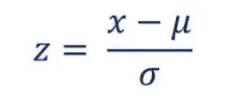
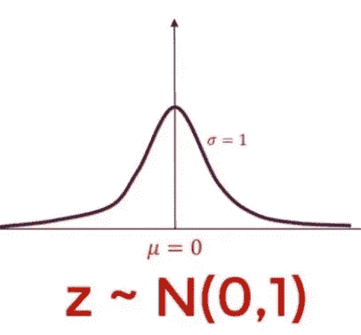

# 解释了规范化与标准化

> 原文：<https://towardsdatascience.com/normalization-vs-standardization-explained-209e84d0f81e?source=collection_archive---------3----------------------->

## 不要互换使用它们！

马克·弗莱彻·布朗在 [Unsplash](https://unsplash.com/s/photos/chart?utm_source=unsplash&utm_medium=referral&utm_content=creditCopyText) 上的照片

术语规范化和标准化在统计学和数据科学中被大量使用。我们有时会互换使用它们。人们通常会混淆这两个术语。但是这两者之间有一个微妙的区别。这就是面试官迈出第一步的地方。你完了。在本文中，我将尽可能用简单的语言解释什么是规范化和标准化，而不使用太多的技术术语。它们在现实生活中的应用使用实例，以及它们之间的区别。所以请耐心听我说，这五分钟是值得的。

**什么是正常化？**

这是一种缩放技术方法，其中数据点被移动和重新缩放，以便它们最终在 0 到 1 的范围内。它也被称为**最小-最大缩放**。

计算标准化分数的公式:

**X new =(X—X min)/(X max—X min)**

这里，Xmax 和 Xmin 分别是特征的最大值和最小值。

如果 X = Xmin 那么 Xnew =0

因为分子会变成 Xmin–Xmin，也就是 0 而已。

如果 X = Xmax 那么 Xnew =1

在这种情况下，分子和分母都相等，并相互抵消，得到 Xnew =1 的值。

太复杂了吧？让我们举一个**的例子**并把它清除掉。

在 CAT(IIM 商学院为选拔印度顶级商学院而进行的能力倾向测试)中，收到的申请太多了。所以他们不能同时对所有的考生进行考试，因此考试是轮流进行的，甚至是在不同的日子进行。不同班次，试卷设置不同。虽然问题的设置方式是每个班次的难度保持不变，但是仍然有可能班次的难度发生变化。所以这对得到一套难题的考生来说是不公平的。为了对所有候选人公平，候选人的分数被归一化。

假设考试分两班进行**A 班**和**B 班**，A 班的问题相对于 B 班的问题相对容易。因为 A 班的问题相对容易，所以 A 班考生在 300 分中的最高分是 280 分，最低分是 80 分，而 B 班考生的最高分和最低分分别是 250 分和 50 分。

所以我们不能比较在 A 班得了 150 分的候选人和在 b 班得了 150 分的候选人。

因此我们将分数标准化

**在班次 A 中获得 150 分的候选人的标准化分数将按如下方式计算**

为了简单起见，让我们把它命名为 Xa

Xa =150-Xmin/(Xmin-Xmax)

Xmax = 280

Xmin = 80

把我们得到的这些值

xa = 150–80/(280–80)

Xa =0.35

**在 B 班中获得 150 分的候选人的标准化分数将为**

为了简单起见，让我们把它命名为 Xb

Xb=150-Xmin/(Xmin-Xmax)

Xmax = 250

Xmin = 50

把我们得到的这些值

XB = 150–50/(250–50)

Xb =0.5

这里我们可以看到 Xb>Xa

CAT 考试的总分=300 分

如果你想在 300 分中进行比较

Xa *300 =105

预算外*300 = 150

我想现在理解什么是正常化以及我们为什么需要它会更清楚。

好吧，让我们跳到第二个

**什么是标准化？**

标准化是另一种缩放方法，其中值以平均值为中心，具有单位标准偏差。这意味着如果我们计算标准分数的平均值和标准差，它将分别为 0 和 1。

标准化值的公式:

在哪里，

=给定分布的平均值

σ =给定分布的标准偏差

这个 Z 值称为标准分数，它代表特定观察值高于或低于平均值的标准偏差数。

即，如果 Z=2，这意味着观察值高于平均值两个标准偏差。

如果我们绘制这些标准分数，它将是一个均值为 0 的正态分布，标准差等于 1。

[https://365 data science . com/WP-content/uploads/2018/10/image4-9 . jpg](https://365datascience.com/wp-content/uploads/2018/10/image4-9.jpg)

均值= 0 且σ =1 的标准差也称为标准正态分布，用 N(0，1)表示。

变得太专业了，不是吗？

为了更好的理解，我们来解决一个**的例子**。

让我们假设你和你的朋友在不同的大学学习，那里的评分系统是不同的。你在一次测验中得了 85 分。这个班的平均成绩是 75 分，标准差是 5。你的朋友得了 615 分，班级的平均成绩是 600 分，标准差是 50。你将如何评价谁表现得更好？由于 85 级不能和 615 级相比。

标准化的作用来了，因为它允许我们用不同的指标直接比较分数，并对它们进行陈述。

你的 Z 值= 85–75/5 = 2

这意味着你比平均成绩高出 2 个标准差。

你朋友的 Z 值= 615–600/50 = 0.3

意味着你比平均成绩高出 0.3 个标准差。

通过查看标准分数，你可以清楚地说你比他或她在班上表现得好得多。

那不是很容易吗？我答应过你。

现在一个大问题出现了

**规范化和标准化哪个更好？**

这取决于你使用的数据类型。

**当我们的数据不符合正态分布时，规范化**优于标准化。它在那些不假设任何数据分布的机器学习算法中很有用，如 k-最近邻和神经网络。

**当我们的数据服从正态分布时，标准化**很好用。它可以用在机器学习算法中，其中我们对数据的分布进行假设，如线性回归等

需要注意的是，与标准化不同，标准化没有边界范围，即 0 到 1。

它也不受我们数据中最大值和最小值的影响，所以如果我们的数据包含异常值，那就好办了。

**最后的话:**

我希望您对规范化和标准化有了很好的了解。如果你喜欢我的工作，那么请欣赏我张贴更多与统计和数据科学相关的好内容。请在社交媒体平台上分享。