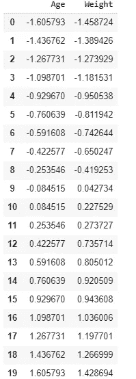

# 规范化与标准化，哪个更好

> 原文：<https://towardsdatascience.com/normalization-vs-standardization-which-one-is-better-f29e043a57eb?source=collection_archive---------14----------------------->

## 在本教程中，让我们看看哪一个是最好的特征工程技术。


图片来源于[作者](https://github.com/Tanu-N-Prabhu/Python/blob/master/Normalization_vs_Standardization_which_one_is%C2%A0better.ipynb)(塔努·南达·帕布)

众所周知**特征工程是一个将原始数据转换成数据集的问题**。有各种各样的特征工程技术可用。两种最广泛使用且最容易混淆的特征工程技术是:

*   **正常化**
*   **标准化**

今天，在这个美好的白天或夜晚，我们将探索这两种技术，并了解数据分析师在解决数据科学问题时做出的一些常见假设。此外，本教程的全部代码可以在下面我的 [GitHub 库](https://github.com/Tanu-N-Prabhu/Python/blob/master/Normalization_vs_Standardization.ipynb)中找到

[](https://github.com/Tanu-N-Prabhu/Python/blob/master/Normalization_vs_Standardization.ipynb) [## 塔努-北帕布/Python

### permalink dissolve GitHub 是 4000 多万开发人员的家园，他们一起工作来托管和审查代码，管理…

github.com](https://github.com/Tanu-N-Prabhu/Python/blob/master/Normalization_vs_Standardization.ipynb) 

# 正常化

## 理论

规范化是将数字特征转换为标准范围值的过程。值的范围可以是[-1，1]或[0，1]。例如，假设我们有一个数据集，包含两个名为“**年龄**和“**体重**的特征，如下所示:


图片来源于[作者](https://github.com/Tanu-N-Prabhu/Python/blob/master/Normalization_vs_Standardization_which_one_is%C2%A0better.ipynb)(塔努·南达·帕布)

假设名为“**年龄**的特征的实际范围是 **5** 到 **100。**我们可以通过从“**年龄**”列的每个值中减去 **5** ，然后将结果除以**95**(100–5)，从而将这些值归一化到 **[0，1]** 的范围内。为了让你的大脑清楚，我们可以把上面的内容写成一个公式。


图片鸣谢 [**安德烈·布尔科夫的百页机器学习书**](http://themlbook.com/)

其中 **min^(j)** 和 **max^(j)** 是数据集中特征 j 的最小**值和最大**值。****

## 履行

现在你知道了它背后的理论，让我们看看如何把它投入生产。通常有两种方法来实现它:**传统的老式手工方法**和另一种使用`**sklearn preprocessing**`库。今天我们就借助`sklearn`库来进行归一化。

**使用 sklearn 预处理-规格化器**

在将“**年龄**”和“**体重**”值直接提供给该方法之前，我们需要将这些数据帧转换成一个`numpy`数组。为此，我们可以使用如下所示的`to_numpy()`方法:

```
**# Storing the columns Age values into X and Weight as Y**X = df['Age']
y = df['Weight']
X = X.to_numpy()
y = y.to_numpy()
```

上述步骤非常重要，因为`fit()`和`transform()`方法都只对数组有效。

```
from **sklearn.preprocessing** import **Normalizer**normalizer = **Normalizer**().**fit**([X])
normalizer.**transform**([X])
```


图片来源于[作者](https://github.com/Tanu-N-Prabhu/Python/blob/master/Normalization_vs_Standardization_which_one_is%C2%A0better.ipynb)(塔努·南达·帕布)

```
normalizer = **Normalizer**().**fit**([y])
normalizer.**transform**([y])
```


图片来源于[作者](https://github.com/Tanu-N-Prabhu/Python/blob/master/Normalization_vs_Standardization_which_one_is%C2%A0better.ipynb)(塔努·南达·帕布)

如上所示，两个数组的值都在范围**【0，1】**内。关于该库的更多细节可以在下面找到:

[](https://scikit-learn.org/stable/modules/preprocessing.html#preprocessing-normalization) [## 6.3.预处理数据-sci kit-学习 0.22.2 文档

### sklearn.preprocessing 包提供了几个常用的实用函数和转换器类来改变 raw…

scikit-learn.org](https://scikit-learn.org/stable/modules/preprocessing.html#preprocessing-normalization) 

## 我们应该在什么时候对数据进行规范化？

虽然规范化不是强制性或必需的(必须做的事情)。有两种方法可以帮助你

*   标准化数据将**提高学习速度**。这将提高构建(训练)和测试数据的速度。试试看！！
*   它将避免**数字溢出**。真正的意思是，标准化将确保我们的输入大致在一个相对较小的范围内。这将避免问题，因为计算机通常在处理非常小或非常大的数字时会有问题。

# 标准化

## 理论

标准化或 **z 值标准化**或**最小-最大缩放**是一种重新调整数据集值的技术，使其具有标准正态分布的属性，其中 **μ** = 0(平均值-要素的平均值)和 **σ =** 1(平均值的标准偏差)。这可以写成:


图片鸣谢 [**安德烈·布尔科夫的百页机器学习书**](http://themlbook.com/)

## 履行

现在实现标准化的方法很多，就像规范化一样，我们可以使用`sklearn`库，使用`StandardScalar`方法，如下所示:

```
from **sklearn.preprocessing** import **StandardScaler**sc = **StandardScaler**()
sc.**fit_transform**([X])
sc.**transform**([X])sc.**fit_transform**([y])
sc.**transform**([y])
```

你可以从下面阅读更多关于图书馆的信息:

[](https://scikit-learn.org/stable/modules/preprocessing.html#standardization-or-mean-removal-and-variance-scaling) [## 6.3.预处理数据-sci kit-学习 0.22.2 文档

### sklearn.preprocessing 包提供了几个常用的实用函数和转换器类来改变 raw…

scikit-learn.org](https://scikit-learn.org/stable/modules/preprocessing.html#standardization-or-mean-removal-and-variance-scaling) 

## z 分数标准化

同样，我们可以用熊猫`mean`和`std`来做必要的事情

```
**# Calculating the mean and standard deviation**df = (df - df.**mean**())/df.**std**()
print(df)
```



图片来源于[作者](https://github.com/Tanu-N-Prabhu/Python/blob/master/Normalization_vs_Standardization_which_one_is%C2%A0better.ipynb)(塔努·南达·帕布)

## **最小-最大缩放比例**

在这里，我们可以用熊猫`min`和`max`来做必要的事情

```
**# Calculating the minimum and the maximum** df = (df-df.**min**())/(df.**max**()-df.**min**())
print(df)
```


图片来源于[作者](https://github.com/Tanu-N-Prabhu/Python/blob/master/Normalization_vs_Standardization_which_one_is%C2%A0better.ipynb)(塔努·南达·帕布)

通常， **Z 分数归一化**是首选，因为**最小-最大缩放**容易导致**过拟合**。

## 什么时候实际使用标准化和规范化？

以上问题没有一个答案。如果你有一个**小数据集**并且**有足够的时间**，那么你可以尝试上述两种技术并选择最好的一种。以下是你可以遵循的经验法则:

*   你可以在**无监督学习算法**上使用**标准化**。在这种情况下，标准化**比规范化**更有利。
*   如果你在数据中看到一个**钟形曲线**，那么**标准化**更可取。为此，您必须绘制您的数据。
*   如果你的数据集有**极高的**或**低值** ( **异常值**)，那么**标准化**更可取，因为通常情况下，标准化会**将**这些值压缩到一个**小范围**。

在除了上述情况之外的任何其他情况下，一个人的**规范化**保持良好。如果你有足够的时间，再次尝试这两种特征工程技术。

好了，你们已经到了教程的结尾。我希望你们今天学到了一些东西。我使用了名为**[**的**](http://themlbook.com/)**[教材](http://themlbook.com/)作为参考(第 5 章)来编写本教程。你可以看一下。如果你们对本教程有任何疑问，可以在下面的评论栏里找到。我会尽量尽快回答。在那之前注意安全，再见。下次见。欲了解更多关于[的更新，请使用](http://www.datafied.world/explore)来读写更多的 python 笔记本。****

**[](http://www.datafied.world/) [## 数据化

### 创建作品集*上传 Jupyter 笔记本*用您的数据讲述故事*创建免费作品集探索笔记本…

www . data fed . world](http://www.datafied.world/)**