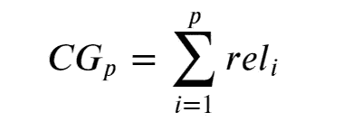
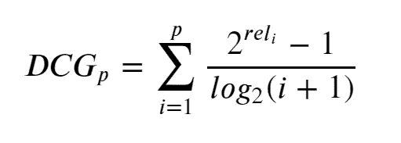
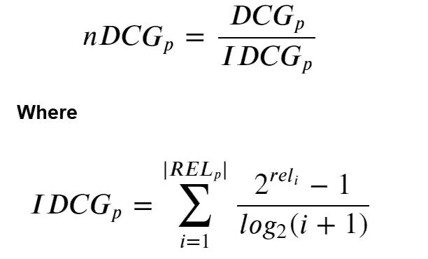

# 标准化贴现累积收益

> 原文：<https://towardsdatascience.com/normalized-discounted-cumulative-gain-37e6f75090e9?source=collection_archive---------2----------------------->

## 一种评估推荐引擎的指标


Graham Ruttan 在 [Unsplash](https://unsplash.com?utm_source=medium&utm_medium=referral) 上拍摄的照片

你还记得曾经和你聊得很愉快的人忘记你名字的尴尬时刻吗？在这个时代，我们有了新的标准，新的期望。当期望没有实现时，感觉就在不远处被问到“我在哪里见过你？”上周和你在酒吧呆了一晚上的那个女人/男人，尴尬！—其实我并不去酒吧，但你明白我的意思。我们正处于个性化的时代，个性化的内容正到处涌现——网飞、Youtube、亚马逊等等。用户需要个性化的内容，企业寻求满足用户的需求。

近年来，许多企业已经采用机器学习来开发有效的推荐系统，以帮助个性化用户体验。就像生活中的所有事情一样，这一壮举伴随着它的挑战。评估推荐引擎的影响是推荐引擎的开发阶段或增强阶段的主要挑战。虽然我们可以肯定推荐系统所带来的积极影响，但为了有效地与利益相关者沟通，或者为了将来我们想增强我们的系统，我们非常需要量化这种影响。

经过一番啰嗦，我在此向大家介绍… *归一化贴现累计收益* (NDCG)。

> 衡量排名质量的一种方法，通常用于衡量 web 搜索引擎算法或相关应用程序的有效性。

如果我们要相应地理解 Nd CG 指标，我们必须首先理解 CG(累积收益)和 DCG(贴现累积收益)，以及理解我们在使用 DCG 及其相关指标时所做的两个假设:

1.  高度相关的文档在搜索引擎结果列表中出现得越早越有用。
2.  高度相关的文档比不太相关的文档更有用，不太相关的文档比不相关的文档更有用

> (来源:维基百科)

## 累积增益

如果每个推荐都有一个相关的分级相关性分数，那么 CG 就是搜索结果列表中所有结果的分级相关性值的总和——参见图 1，我们可以用数学方法来表达它。



图 1:累积增益数学表达式

特定排名位置`p`的累积增益，其中`rel_i`是位置`i`的结果的分级相关性。为了用 Python 演示这一点，我们必须首先让变量`setA`成为搜索查询响应的分级相关性分数，从而每个分级相关性分数与一个文档相关联。

```
setA = [3, 1, 2, 3, 2, 0]
print(sum(setA))11
```

CG 的问题在于，在确定结果集的**有用性**时，它没有考虑结果集的排名。换句话说，如果我们对`setA`返回的分级相关性分数进行重新排序，我们将无法更好地了解结果集的有用性，因为 CG 将保持不变。有关示例，请参见下面的代码单元格。

```
setB = sorted(setA, reverse=True)
print(f"setA: {setA}\tCG setA: {cg_a}\nsetB: {setB}\tCG setB: {sum(setB)}")setA: [3, 1, 2, 3, 2, 0]	CG setA: 11
setB: [3, 3, 2, 2, 1, 0]	CG setB: 11
```

`setB`显然返回了比`setA`更有用的集合，但是 CG 测量表明它们返回的结果一样好。

## 贴现累积收益

为了克服这一点，我们引入了 DCG。DCG 通过降低与结果位置成对数比例的分级相关性值来惩罚在搜索中出现较低的高度相关的文档—参见图 2。



图 2:贴现累积收益数学表达式

下面我们创建了一个名为`discountedCumulativeGain`的函数来计算`setA`和`setB`的 DCG。如果这是一个有效的测量，`setB`应该比`setA`有更高的 DCG，因为它的结果更有用。

```
import numpy as np 

def discountedCumulativeGain(result):
    dcg = []
    for idx, val in enumerate(result): 
        numerator = 2**val - 1
        # add 2 because python 0-index
        denominator =  np.log2(idx + 2) 
        score = numerator/denominator
        dcg.append(score)
    return sum(dcg)print(f"DCG setA: {discountedCumulativeGain(setA)}\nDCG setB: {discountedCumulativeGain(setB)}")DCG setA: 13.306224081788834
DCG setB: 14.595390756454924
```

`setB`的 DCG 高于`setA`，这符合我们的直觉，即`setB`比`setA`返回更多有用的结果。

## 标准化贴现累积收益

当我们想要比较搜索引擎从一个查询到下一个查询的性能时，DCG 出现了一个问题，因为搜索结果列表的长度会根据所提供的查询而变化。因此，通过对查询中选择的值`p`的每个位置的累积增益进行归一化，我们得到 NDCG。我们通过按照相对相关性对语料库中的所有相关文档进行排序来实现这一点，通过位置`p`产生最大可能的 DCG(也称为理想的折扣累积收益)——参见图 3。



图 3:归一化贴现累积收益数学表达式；REL_p 表示语料库中直到位置 p 的相关文档的列表(按照相关性排序)

为了在 python 中执行这一度量，我们创建了函数`normalizedDiscountedCumulativeGain`来帮助实现这一功能。

```
def normalizedDiscountedCumulativeGain(result, sorted_result): 
    dcg = discountedCumulativeGain(result)
    idcg = discountedCumulativeGain(sorted_result)
    ndcg = dcg / idcg
    return ndcgprint(f"DCG setA: {normalizedDiscountedCumulativeGain(setA, setB)}\nDCG setB: {normalizedDiscountedCumulativeGain(setB, setB)}")DCG setA: 0.9116730277265138
DCG setB: 1.0
```

比率将始终在[0，1]的范围内，1 是满分，这意味着 DCG 与 IDCG 相同。因此，可以对所有查询的 NDCG 值进行平均，以获得推荐系统排序算法的平均性能的度量。

## NDCG 的局限性

> (来源:维基百科)

1.  NDCG 不会对搜索结果中的错误文档进行处罚
2.  不惩罚结果中丢失的文档
3.  可能不适合衡量可能经常有几个同样好的结果的查询的性能

## 包裹

我们在使用 NDCG 时面临的主要困难是，当只有部分相关反馈可用时，我们经常不知道结果的理想排序。然而，NDCG 已被证明是评估各种问题排名质量的有效指标，例如[个性化网络搜索挑战](https://www.kaggle.com/c/yandex-personalized-web-search-challenge/overview/evaluation)、 [AirBnB 新用户预订挑战](https://www.kaggle.com/c/airbnb-recruiting-new-user-bookings)和[个性化 Expedia 酒店搜索——ICDM 2013](https://www.kaggle.com/c/expedia-personalized-sort/overview/evaluation)等等。

谢谢你读到这篇文章的结尾。如果你想和我联系，我在 LinkedIn 上很容易找到。

[](https://www.linkedin.com/in/kurtispykes/) [## Kurtis Pykes -人工智能作家-走向数据科学| LinkedIn

### 在世界上最大的职业社区 LinkedIn 上查看 Kurtis Pykes 的个人资料。Kurtis 有一个工作列在他们的…

www.linkedin.com](https://www.linkedin.com/in/kurtispykes/)