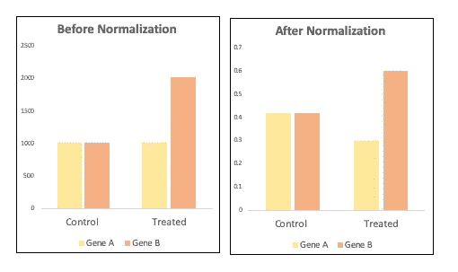
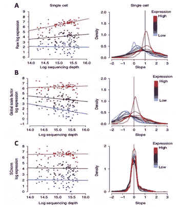

# 归一化单细胞 RNA 测序数据——缺陷和建议

> 原文：<https://towardsdatascience.com/normalizing-single-cell-rna-sequencing-data-pitfalls-and-recommendations-19d0cb4fc43d?source=collection_archive---------17----------------------->

斯文·米克在 [Unsplash](https://unsplash.com?utm_source=medium&utm_medium=referral) 上的照片

单细胞 RNA 测序(scRNA-seq)项目的目标通常是识别亚群和差异基因表达分析。为了避免“维数灾难”，高度可变基因(hvg)被用于聚类分析。几项研究表明，hvg 的选择对用于原始计数矩阵归一化的方法的选择很敏感。

***为什么要正常化？***

原始读数不能直接用于比较细胞间的基因表达，因为它们被技术和“无趣的”生物变异所混淆。有 QC 步骤和其他方法可用于过滤和回归不感兴趣的生物变异。虽然 PCR 扩增偏倚通常通过使用独特的分子标识符(umi)来处理，但需要标准化来消除其他技术变异的影响，如测序深度、细胞裂解和逆转录效率的差异。

标准化过程的主要目标是消除技术效应的影响，保留真正的生物异质性。在标准化良好的数据集中，基因的方差应该与细胞的基因丰度和测序深度无关。“真正”差异表达的基因应该在细胞类型之间表现出高的差异，而看家基因应该表现出低的差异。

因此，标准化是一个关键的预处理步骤，它极大地影响了 scRNA 分析的下游应用。不幸的是，scRNA 数据集通常使用从批量 RNA 测序方法继承的方法进行标准化，正如我们将很快看到的那样，由于这些数据集的技术变异和固有复杂性的性质，这是不合适的。在这篇博文中，我们将看到在 scRNA-seq 分析的背景下，全局比例方法的局限性。我们还将讨论最近引入的 SCNorm 和 SCTransform 归一化方法的潜力，这些方法是专门为单细胞分析量身定制的。

***全局缩放方法***

传统上，使用 RPKM(每千碱基百万的阅读数)、FPKM(每千碱基百万的片段数)或 TPM(每百万的转录数)方法将细胞间的原始表达计数标准化为测序深度。要了解它们是如何工作的，请观看这个视频。虽然这些方法对样品内标准化很有效，但它们被广泛认为不适合样品间的差异表达分析。例如，考虑一种情况，其中两种基因 A 和 B 的表达在两种条件-对照和处理-之间进行比较。基因 A 在两种条件下表达水平相同，而基因 B 在处理过的细胞中表达水平高 2 倍。TPM 标准化将绝对表达转化为相对表达，因此，人们可能会得出基因 A 差异表达的结论，尽管这种效应只是基因 A 与基因 b 比较的结果。

TPM 规范化不适用于差异表达分析。

开发了样品间标准化的替代方法；[TMM](https://genomebiology.biomedcentral.com/articles/10.1186/gb-2010-11-3-r25)(M 值的修整平均值)和 [DESeq](https://www.ncbi.nlm.nih.gov/pmc/articles/PMC3218662/?report=reader) 最受欢迎。这两种策略遵循相同的动机:通过标准化细胞间感兴趣的数量，同时假设大多数基因没有差异表达，将细胞特异性测量带到一个共同的尺度上。基于非差异表达基因通过这些方法计算的**全局比例因子**被应用于样本(每个样本一个)。然后，使用相同的因子对样本细胞中的所有基因进行缩放。这些方法在批量 RNA-seq 中表现出优异的性能，但是由于大量的零表达值，它们在单细胞设置中受到损害。此外，这些方法假设样品中所有细胞的基本 RNA 含量是恒定的，并且单一比例因子可以应用于所有基因。因此，基于全局比例因子的标准化策略在典型的零膨胀和高度异质性的 scRNA 数据集上表现不佳。

***基因群基础方法***

为了解决全局缩放方法的固有问题，最近引入了两种有趣的归一化方法-SCnorm (2017)和 SCTransform (Seurat package v3，2019)。

**SCnorm**

[SCnorm](https://www.nature.com/articles/nmeth.4263) 是在 [Bioconductor](https://bioconductor.org/packages/release/bioc/html/SCnorm.html) 上可用的 R 包。对于每个基因，SCnorm 通过**分位数回归**估计基因表达对测序深度的依赖性。然后将具有相似相关性的基因分组，并使用第二个分位数回归来估计每组的比例因子。最后，使用组特异性比例因子对每个基因组的测序深度进行调整，以产生标准化的表达估计值。

a:原始计数对序列深度，B:归一化的全局比例因子对序列深度，C:单个细胞数据集中 3 个基因的标准计数对序列深度，编辑自 [Bacher 等人](https://www.nature.com/articles/nmeth.4263)。

上图显示了单个细胞数据集中三个基因的计数深度关系。图 A 为未标准化或原始表达计数。很明显，基于全局比例因子的方法(图 B)与图 c 中的 SCnorm 相比，在标准化方面表现不佳。

**SCTransform**

[SCTransform](https://www.biorxiv.org/content/10.1101/576827v2) 是修拉 v3 提供的 R [包](https://cran.r-project.org/web/packages/sctransform/index.html)。该方法使用**正则化负二项式模型**对 UMI 计数进行建模，以消除测序深度引起的变化。简而言之，该方法首先使用测序深度作为自变量，UMI 计数作为响应或因变量，构建每个基因的广义线性模型(GLM)。然后基于基因表达对参数估计进行正则化(或调整)。使用正则化的参数应用第二轮负二项式回归。该模型的输出(残差)是每个基因的标准化表达水平。

这里的要点是，不是使用一个常数因子来标准化所有基因，而是 **SCnorm** 和 **SCTransform** 方法都学习**基因组特定因子**。这些因子分别针对低、中和高表达基因，消除了技术变异的影响，保留了真正的生物异质性。

***总结***

标准化方法的选择影响高度可变基因的选择，从而影响所有下游的 scRNA 数据分析。将批量 RNA 标准化方法直接应用于 scRNA 数据集是不合适的。值得通过选择 SCNorm 或 SCTransform 规范化方法来更新分析管道，并充分利用最新的技术进步。