# 用 Python 实现云上的 NoSQL

> 原文：<https://towardsdatascience.com/nosql-on-the-cloud-with-python-55a1383752fc?source=collection_archive---------6----------------------->

## 与 Google Firestore ——(最好的)NoSQL 数据库交流


照片由[赖](https://unsplash.com/@yaoqiqiqilai?utm_source=medium&utm_medium=referral)在 [Unsplash](https://unsplash.com?utm_source=medium&utm_medium=referral)

作为数据科学家、机器学习工程师或开发人员，熟悉云是改变游戏规则的技能之一。

无论我们在哪个领域工作，数据总是关注的焦点，我们的最终用户紧随其后。一个好的基于云的数据库服务将满足这两种需求。

我们将数据卸载到最终用户能够通过任何人都可以使用的界面访问的位置。这个界面可以是一个网络应用——或者是面向更多技术终端用户的 API。

Firestore 是谷歌的云托管 NoSQL 数据库服务。该服务有几个主要优势，即:

*   **灵活的**数据存储(NoSQL)
*   本地库支持大多数流行的语言( **Python** )
*   你为**免费**学习(超越免费层限制需要大量数据)
*   一切都很简单——我们可以建立一个比煮咖啡还快的数据库
*   **认证**(可以)由谷歌处理，我们以最少的工作实现最大的安全性
*   **自动缩放**以满足需求
*   **直观的文档**，可能是三大云提供商(Azure、AWS、GCP)中最好的

在本文中，我们将设置我们的 Firebase 项目(托管 Firestore 的平台)，使用 web-UI 创建一个数据库，并创建一个执行所有基本 Firestore 功能的简单 Python 脚本。它看起来会像这样:

```
**In Firebase**
> Create a Project
> Initialize Database
> Get Credentials
**In Python**
> Install **gcloud** Libraries (+ venv)
> Authenticate
> Connect to Firestore
> Get
> Create
> Modify
> Delete
> Queries
```

让我们开始吧。

# 重火力点

## 创建项目

幸运的是，谷歌擅长让事情变得简单。进入 [Firebase 网站](https://firebase.google.com/)并点击大**开始**按钮。


我们现在应该看到上面的“欢迎使用 Firebase”页面——创建一个项目，并给它起一个很酷的名字(它应该也与您的项目相关)。

我把它命名为“反重力”。

您应该会看到一个窗口，询问我们是否希望启用 Google Analytics——这完全是您的选择，我们不会使用它，但它也不会花费您任何费用。


我们的项目将初始化，单击**继续，**我们将进入新项目的项目概述页面。

## 初始化数据库


为了初始化我们的 Firestore 数据库，我们导航到侧栏并单击**开发** > **数据库**。在这里，我们将看到上面的“云 Firestore”页面—单击**创建数据库**。

在这里，我们将被询问是以生产模式还是测试模式开始。我们将使用**测试模式**。

接下来，选择您的位置——这是您或您的用户请求数据的地方，所以选择最近的选项！

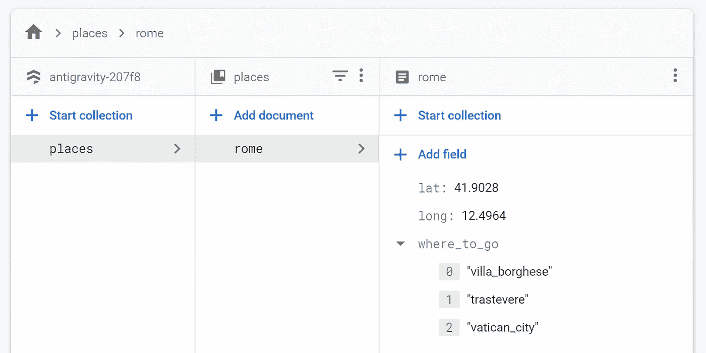

点击**开始收藏**添加“地点”收藏和“罗马”文档——这也是真正的旅行建议。

最后，我们可以访问我们的数据库。对于本教程，我们需要一个名为“places”的集合和一个名为“rome”的文档，如上所示——只需点击 **Start collection** 来添加它们(`where_to_go`是一个数组)。

# 移交给 Python

## 安装依赖项

我们需要 pip 安装`firebase_admin`包:

```
pip install firebase-admin
```

对于 Python 以上的任何版本，当将`firebase_admin`导入到我们的脚本时，我们都会收到一个语法错误:

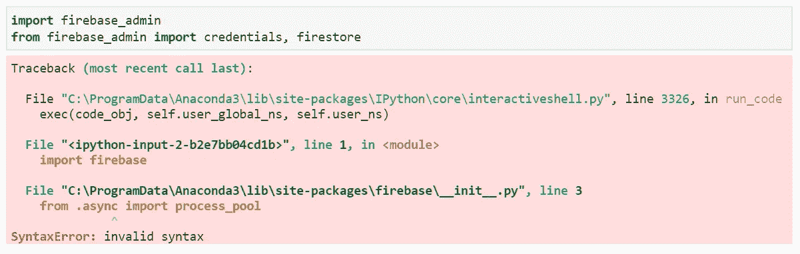

如果使用从 3.7 开始的任何版本的 Python，我们将引发一个**语法错误**。

Python 3.7 中添加了`async`标识符，打破了`firebase_admin`模块。我们有两个选择:

1.  修改`firebase_admin`，用`_async` *(或者你选择的任何关键字)*替换`async`的每一个实例。
2.  通过虚拟环境(venv)使用 Python 3.6。

选项(1)可能是个坏主意。因此，让我们快速介绍一个使用 Anaconda 的 venv 设置(关于如何在其他环境中使用，请咨询 Google 或我)。

打开 Anaconda 提示符并创建一个新的 venv(我们称之为`fire36`):

```
conda create --name fire36 python
```

启动 venv 并安装`firebase_admin`组件:

```
conda activate fire36
pip install firebase_admin
```

如果您使用 Jupyter 或 Spyder，只需输入`jupyter` | `jupyter lab` | `spyder`就可以使用这个 venv 编写代码。PyCharm 和 VSCode 也可以使用这个 venv。

## 鉴定

要访问 Firestore，我们需要大量凭证。谷歌再次让这变得简单。

在 [Firebase 控制台](https://console.firebase.google.com/)中导航到您的项目。


在左上角的“项目概述”旁边，点击齿轮图标并选择**项目设置**。

现在，我们单击“服务帐户”选项卡，在这里可以找到关于使用 Firebase Admin SDK 进行身份验证的说明。

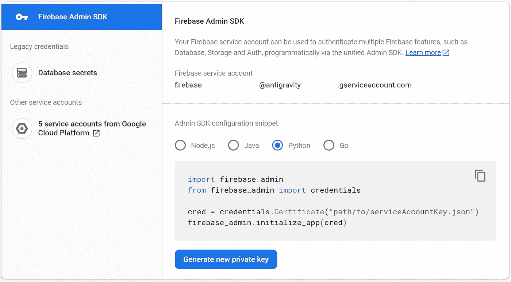

点击**生成新的私有密钥**以 JSON 文件的形式下载我们的凭证。

现在，我们需要点击**生成新的私钥**。我们下载该文件，将其重命名为`serviceAccountKey.json`(或其他名称)，并将其存储在 Python 脚本可访问的位置。

将`serviceAccountKey.json`存储在同一个目录中进行测试是可以的——但是保持 JSON 内容的私有性。 *Public GitHub repos 是一个可怕的* *的地方，为凭据。*

在同一个 Firebase Admin SDK 页面上，我们可以将 Python 代码复制并粘贴到脚本的顶部。我们需要做的就是更新到`serviceAccountKey.json`的路径，并将`firestore`添加到我们的导入中——我们的脚本应该是这样的:

```
import firebase_admin
from firebase_admin import credentials, **firestore**cred = credentials.Certificate(**"path/to/serviceAccountKey.json"**)
firebase_admin.initialize_app(cred)
```

这就是我们认证所需要的一切。现在我们(终于)开始写一些代码了！

## 连接到 Firestore

我们的联系有三层:

> ***数据库>收藏>文档***

```
db = firestore.client()  # this connects to our Firestore database
collection = db.collection('places')  # opens 'places' collection
doc = collection.document('rome')  # specifies the 'rome' document
```

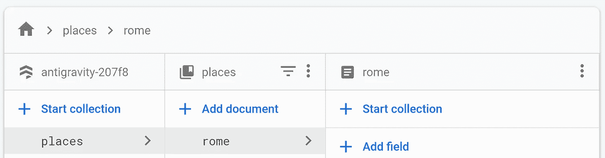

我们依次访问每一层——从**数据库**(反重力-207f8) > **集合**(地点)> **文档**(罗马)。

每一层都有自己的一套方法，允许我们在数据库、集合或文档级别执行不同的操作。

## 得到

我们使用 **get** 方法来检索数据。让我们用这个方法得到我们的`rome`文档:

```
doc = collection.document('rome')
res = doc**.get()**.to_dict()
print(res)**[Out]:** {
    'lat': 41.9028, 'long': 12.4964,
    'where_to_go': [
        'villa_borghese',
        'trastevere',
        'vatican_city'
    ]
}
```

我们还可以对`collection`执行`.get()`操作，返回包含其中所有文档的数组。如果我们有两个文档，它看起来会像这样:

```
docs = collection**.get()**
print(docs)**[Out]:** [
  <google.cloud.firestore_v1.document.DocumentSnapshot object ...>, 
  <google.cloud.firestore_v1.document.DocumentSnapshot object ...>
]
```

这些文档被存储为 DocumentSnapshot 对象——与我们在使用上面的`.document(<doc-id>).get()`方法时收到的对象类型相同。和第一个`get`例子一样——我们可以使用`.to_dict()`将这些对象转换成字典。

## 创造

我们在`collection`上使用`.document(<doc-id>)`和`.set()`方法创建文档。`.set()`方法获取一个字典，其中包含我们希望存储在新`<doc-id>`中的所有数据，如下所示:

```
res = collection.document('barcelona')**.set(**{
    'lat': 41.3851, 'long': 2.1734,
    'weather': 'great',
    'landmarks': [
        'guadí park',
        'gaudí church',
        'gaudí everything'
    ]
}**)**
print(res)**[Out]:** update_time {
    seconds: 1596532394
    nanos: 630200000
}
```

如果操作成功，我们将在响应中收到`update_time`。

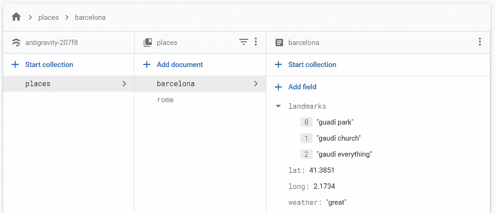

新数据将出现在我们的 Firestore GUI 上。

通过导航回 Firestore 界面，我们可以看到如上所示的新文档数据。

## 修改

有时，我们需要修改现有的文档，而不是创建一个全新的文档。有几种方法可以做到这一点，这取决于我们想要改变什么。

为了更新完整的键-值对，我们使用`update`:

```
res = collection.document('barcelona')**.update(**{
    'weather': 'sun'
}**)**
```

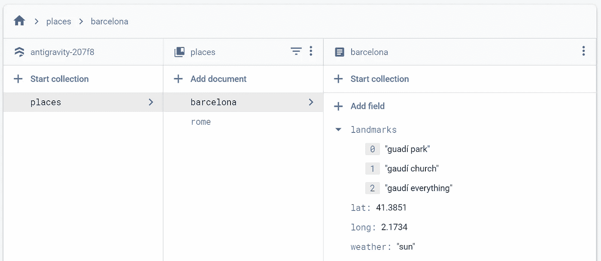

**update** 方法允许我们只修改语句中的键值对。

`update`方法适用于大多数值，但是当我们只想添加或删除数组中的一个条目时，它就没那么有用了。这里我们使用`firestore.ArrayUnion`和`firestore.ArrayRemove`方法分别添加和删除单个数组值，如下所示:

```
collection.document('rome').update({
    'where_to_go': **firestore.ArrayUnion(**['colosseum']**)**
})
```

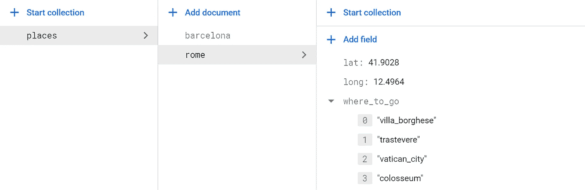

我们已经更新了 **where_to_go** 数组以包含**斗兽场**。

移除`vatican_city`和`trastevere`:

```
collection.document('rome').update({
    'where_to_go': **firestore.ArrayRemove(** ['vatican_city', 'trastevere']
**)**})
```

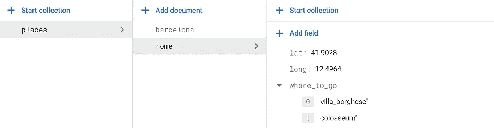

从**去向**阵列中移除**梵蒂冈城**和**斗兽场**后。

## 删除

其他时候，我们可能需要删除全部文档。我们用`delete`方法来做这件事:

```
collection.document('rome')**.delete()**
```

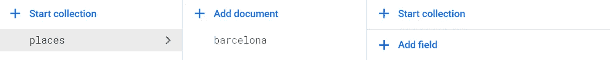

我们的 Firestore 数据库不再包含罗马文件。

如果我们想删除文档中的单个字段，我们可以像这样使用`firestore.DELETE_FIELD`:

```
collection.document('barcelona').update({
    'weather': **firestore.DELETE_FIELD**})
```

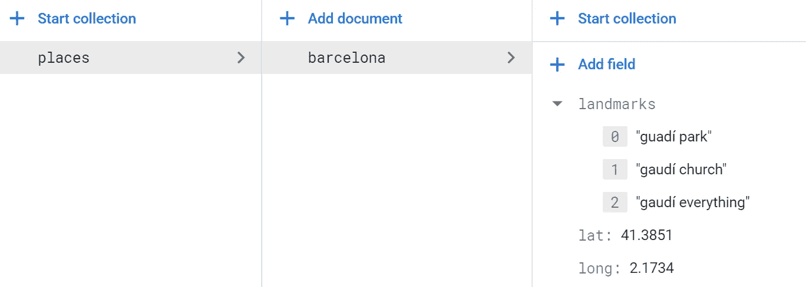

**巴塞罗那**文档不再包含**天气**字段。

## 询问

更进一步，我们可以具体说明我们到底想要什么。

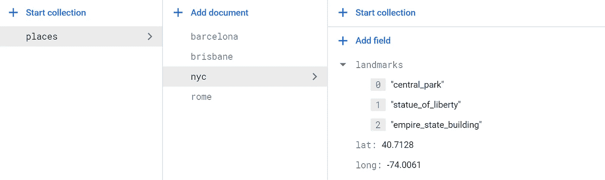

我们的 Firestore 现在包含巴塞罗那、布里斯班、纽约和罗马的条目。

对于这个例子，我们已经向 Firestore 添加了几个全球城市(添加它们的代码是[这里是](https://gist.github.com/jamescalam/854a71460ce31be1bcdd4fc40a49ef0b))。

我们将查询欧洲范围内的所有城市——我们将这些城市定义为经度大于 *-9.4989* (西方)且小于 *33.4299* (东方)的城市。为了简单起见，我们将忽略纬度。

为了查询我们的 Firestore，我们在集合对象上使用了`where`方法。该方法有三个参数，`where(fieldPath, opStr, value)`:

*   `fieldPath` —我们的目标区域，在本例中为`'long'`
*   `opStr` —比较操作字符串，`'=='`检查相等性
*   `value` —我们要比较的价值

我们的查询将返回任何真值。对于我们的示例，我们将找到包含`long > 9.4989`的文档，我们写为:

```
collection**.where('long', '>', 9.4989)**.get()
```

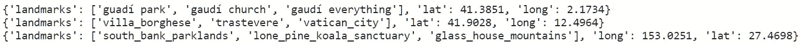

从我们的 **long > 9.4989** 查询返回的所有文档。

对于这个查询，我们返回`barcelona`、`rome`和`brisbane`——但是我们也需要排除欧洲东部的任何东西。我们可以通过添加另一个`where`方法来做到这一点，如下所示:

```
collection**.where('long', '>', -9.4989)** \ **.where('long', '<', 33.4299)**.get()
```


从我们的 **long > 9.4989 和 long < 33.4299** 查询返回的所有文档。

这就是对谷歌 Firestore 的介绍。对于简单、安全和健壮的基于云的数据库，Firestore 真的很棒。

当然，云计算不仅仅是数据存储。AWS 和 Azure 都很棒，但 GCP Firebase 配置的易用性是其他任何产品无法比拟的。

只需很少的时间，就可以轻松学会构建完整应用程序所需的一切，从前端 UI 到数据存储设置。

如果云对你来说有些陌生，不要犹豫，马上加入——这是一项非常宝贵的技能，不容错过。

如果你有任何建议或者想和我讨论 Firestore——或者开始使用云——请随时在 Twitter 上或者在下面的评论中联系我。

感谢阅读！

有兴趣了解更多的另一面吗？请随意阅读我对 Angular 的介绍——这是一个神奇而简单的前端框架:

[](/how-to-use-angular-to-deploy-tensorflow-web-apps-5675b5a042cc) [## 如何使用 Angular 部署 TensorFlow Web 应用程序

### 在角度构建的 web 应用程序中使用 Python 构建的模型

towardsdatascience.com](/how-to-use-angular-to-deploy-tensorflow-web-apps-5675b5a042cc)