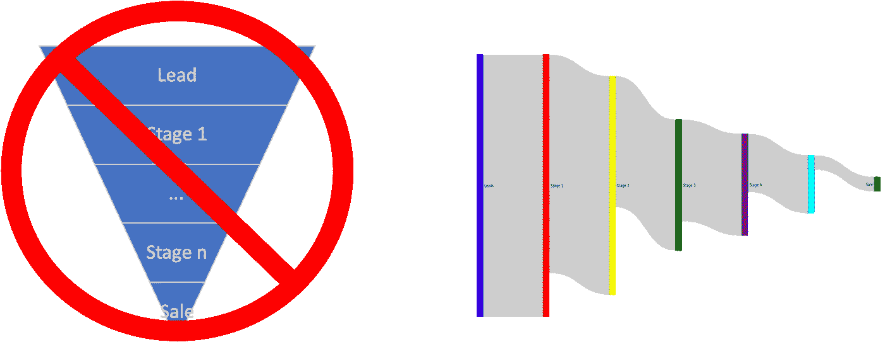
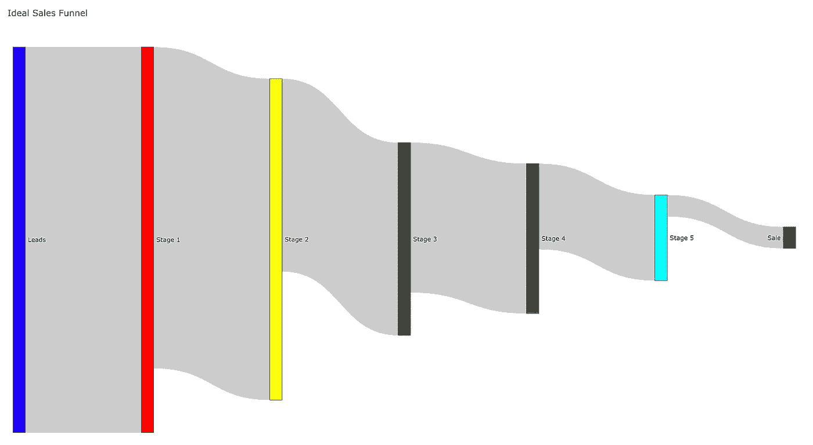
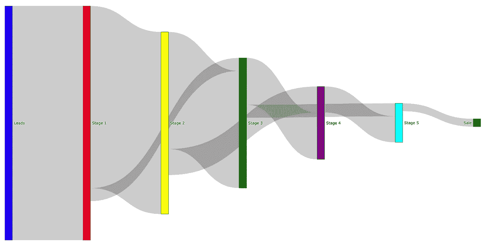
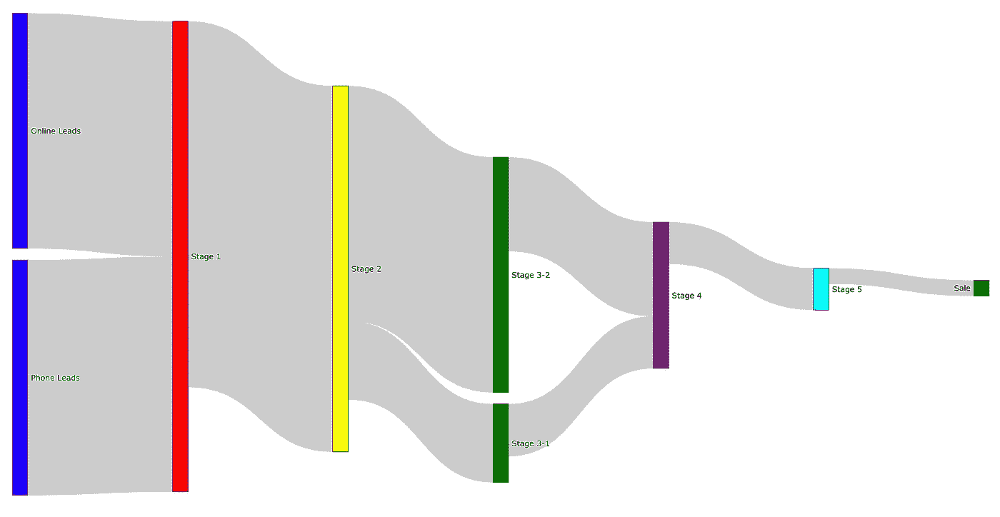
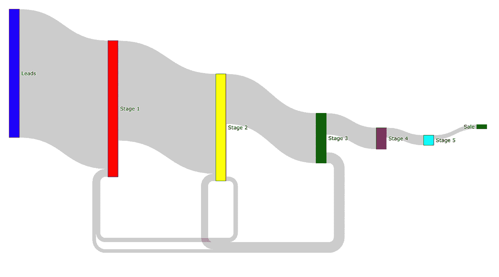

# 不是漏斗！使用 Sankey 代表您的销售过程

> 原文：<https://towardsdatascience.com/not-a-funnel-use-sankey-to-represent-your-sales-process-9621b6578c42?source=collection_archive---------38----------------------->

## 传统的销售可视化错过了销售过程中正在发生的关键信息。

作者图片

与公司的其他部门(营销、运营、财务)相比，销售仍然不是一个以数据为中心的环境。尤其是当我们考虑 B2B 销售时。改变我们看待销售线索的方式可以大大提高您团队的绩效。

# 销售漏斗

多年来，销售主管最重要的实践之一是每周回顾销售漏斗。这个漏斗本质上是每个销售过程中的销售线索量，或可能的收入量(以 PV、一次性收入等形式)。这个工具被广泛使用，几乎包含在所有的 CRM 软件中，作为销售模块的一部分。

漏斗的目标是从 10，000 英尺的高度概括钱在哪里，销售团队的工作应该在哪里。问题是这样的:工具只给我们显示了当前状态的截图。跟踪和预测销售是有用的，但是，可视化上的微小变化可以带来巨大的好处。

理论上，销售线索应该从一个阶段进入另一个阶段，然后在某个时候停止前进或以销售结束。事实上，销售线索会前后跳跃，这使得当前的漏斗视图用处不大。在这里，使用桑基图将改善销售团队的概况，并发现过程中可能存在的问题或不正常的趋势。

## 理想的销售漏斗

让我们从最完美的场景开始。在这种情况下，销售线索从一个阶段平稳地转移到另一个阶段。这非常适合传统的漏斗来显示数据。因此，在这种情况下使用 Sankey 不会为我们提供更多关于销售线索中正在发生的事情的信息或见解。但是，使用桑基图，我们可以直观地获得一个额外的信息，即从一个阶段转移到另一个阶段的销售线索的比例。

作为桑基图的理想销售漏斗(作者图片，源代码[此处](https://github.com/gody/SankeyFunnel/blob/master/Sankey%20Funnel.ipynb)

您可以在此查看互动桑基[。](http://www.damenabar.com/SankeyFunnel/perfect_funnel.html)

所以，我们的理想世界现在结束了，我们将进入 3 种比任何销售经理都喜欢的更常见的情况，有时它们不容易马上发现。

## 跳过销售漏斗阶段

许多销售人员不需要完成销售流程成功所需的所有里程碑。因此，对于一些公司来说，销售线索跳级是很常见的。在一个经典的漏斗中，从一周或一月的回顾到另一周或一月的回顾，你看不到变化是怎样的。这是第一个使桑基图成为销售团队的重要补充的功能。
在下面的桑基图中可以看到一个跳过阶段的例子。

当销售流程允许销售线索跳过一些阶段时，使用传统的漏斗表示意味着信息的丢失。(图片作者，源代码[此处](https://github.com/gody/SankeyFunnel/blob/master/Sankey%20Funnel.ipynb))

您可以在此查看互动桑基[。](http://www.damenabar.com/SankeyFunnel/skip_stage_funnel.html)

## 多输入和分阶段销售漏斗

公司越大，他们的营销组合和销售线索就越广。对于许多公司来说，他们有不同的方法来解决这个问题:为每个营销渠道建立一个单独的漏斗。或者，他们可以在销售线索进入公司后的一个阶段启动销售漏斗。这意味着失去所有以前的历史记录，只显示销售团队关于销售线索起点的绩效。
将两者混合在同一个图表中，可以给出销售和(在某些情况下)营销计划的统一愿景，从而对每个部门起到补充作用。作为一个类似的效果，一个特定的里程碑可能在领导的规模、项目的复杂性或其他区别特征方面有所不同。因此，一个阶段也可以分为两个或更多的子阶段，其中响应时间和其他属性是不同的，没有显示这种效果的经典漏斗将对销售预测产生很大影响。所有这些影响都可以在桑基图中同时显示出来。下图是一个很好的例子，其中销售线索来源于两个不同的渠道(阶段 1)，此细分也在阶段 2 和阶段 3 中进行了描述，以便更好地表示每个渠道在各个阶段的权重。此图还显示了这两种销售线索的其余流程是相同的，并且他们共享资源。

一些销售流程涉及到从多个来源获取销售线索，甚至需要根据销售线索将一个阶段分为两个或更多阶段。通常，会使用多个正常漏斗，但使用桑基图，我们可以将所有信息放在一起。(图片作者，源代码[此处](https://github.com/gody/SankeyFunnel/blob/master/Sankey%20Funnel.ipynb))

可以在这里查看互动 Sankey [。](http://www.damenabar.com/SankeyFunnel/multiple_input_funnel.html)

## 在漏斗上向后移动

漏斗中可能发生的最后一件事是倒退。发生这种情况有不同的原因:流程中的错误、前一阶段的文件丢失，或者仅仅是因为销售流程允许。能够跟踪销售流程逆向移动的数量、金额和渠道将有助于制定可操作的计划，并更好地调整销售和营销策略。
在下图中，我们可以看到所有阶段都有一定比例的销售线索返回到之前的阶段。这种影响增加了工作量和销售线索所需的平均时间。

(图片作者，源代码[此处](https://github.com/gody/SankeyFunnel/blob/master/Sankey%20Funnel.ipynb))

点击可以查看互动桑基[。](http://www.damenabar.com/SankeyFunnel/go_back_funnel.html)

## 最后的话

正如我们所看到的，能够改变一个简单的可视化将大大提高我们从销售数据和流程中获得的洞察力。我们举了几个例子，但通常情况下，不仅仅是其中一种效应会发生，很多效应会同时发生。如果你从事销售或商业智能工作，我邀请你对你的销售过程进行一次全面检查。使用桑基图，检查它是否像你的经典漏斗，你能从中获得什么新的见解。从那里开始改善你的销售流程。

您可以在这里的链接中访问用于创建桑基图的 Jupyter 笔记本:[图代码](https://github.com/gody/SankeyFunnel/blob/master/Sankey%20Funnel.ipynb)