# 不是千与千寻:在分散注意力的工作环境中记笔记

> 原文：<https://towardsdatascience.com/not-spirited-away-keeping-notes-in-a-distracting-working-environment-af43140e1fb1?source=collection_archive---------63----------------------->

尤利娅·卢卡希娜

## 数据科学家在动荡的工作环境中保持高效的一些生活窍门。不包括辞职。主要基于 Jupyter，但也支持其他数据科学工具。

我想总结一下我做笔记、写待办事项清单、写工作日记来对抗分心的实验。

我的第一份正经工作发生在一家重视时间追踪的公司。它使用了一个基于 Confluence 的工具——我现在已经忘了它的名字——将项目分解成一系列任务。

在接下来的工作中，我采用了一些方法。他们证明了他们的必要性，因为我们的伞式项目接近最后阶段，整体压力增加。在上线前的最后几天，我们有很多自发的会议。他们让我在进程中离开我的任务，从我被打断的同一点开始并不容易。

# 没有那么明显的办公室干扰

为什么要费心记笔记，这不是迂腐吗？它与效率和生产力有什么关系，难道不需要更多的时间吗？

让我们想象一个典型的办公室日…

我只想喝杯咖啡。但是因为我们有一个厨房给很多人用，所以总是以不可避免的闲聊结束。我通常是一个内向的人。每一次社交活动都吸引了我并不丰富的社交能力。因此，我花了一些时间来降低我的情绪投入，重新开始工作。

此外，我们有一个非常方便游客的数据科学办公室。门一整天都开着。很多人过来打招呼，谈论晴朗的天气。如此高水平的办公室社交是有代价的。这个代价就是我们的专注。

“恢复”持续了 10 到 15 分钟，然后我才能再次完全集中注意力。一天之内会有很多会谈。

事实上，我们开了很多会。当你知道一个会议将在半小时后召开时，你不可能开始任何需要你全力投入的大事。

# 朱皮特

因为这些挑战，Jupyter 笔记本成了我的最爱。如果我不得不站起来离开，我会留下完整的数据记录，包括成功的和失败的。我想给你一些见解。

在从我的 Mac 电脑迁移到 iPadPro 后，我暂时从 Jupyter 笔记本转向了谷歌合作研究。它有一个相似的界面。我在 Jupyter 只使用了基本的按钮，它们似乎在 Colab 的同一个地方。

实际上，我想使用 Juno，但是在我阅读了一些操作指南之后，我就不再那么有热情了。我偶然发现了 Colab，现在我在浏览器中使用它。我只需要警告那些处理大量数据的人。你应该检查一下，Colab 处理大量数据的速度有多快。目前，我不会为此做广告。

# Microsoft OneNote

由于代码中的注释不是用于进度跟踪的，所以我将笔记保存在不同的工具中。

我没有尝试过很多记笔记的应用程序，但在开始使用 OneNote 后，我不想寻找替代方法。它允许我将笔记组织到文件夹中，并且它提供了许多附件格式。

因为我负责检查在混合迁移期间并行运行的两个平台之间的数据一致性，所以我经常需要在手边准备大量的。CSV 或 Excel 文件。在 OneNote 中，我可以将它们直接插入笔记本。

桌面版也有一种格式样式，可以突出显示我经常直接保存到 OneNote 中的代码块。我最后喜欢的功能是时间戳。我可以看到我什么时候开始任务，什么时候完成任务。可以快速估计每项任务的持续时间。对我和项目经理都有好处。

我的工作日记曾经是这样的:

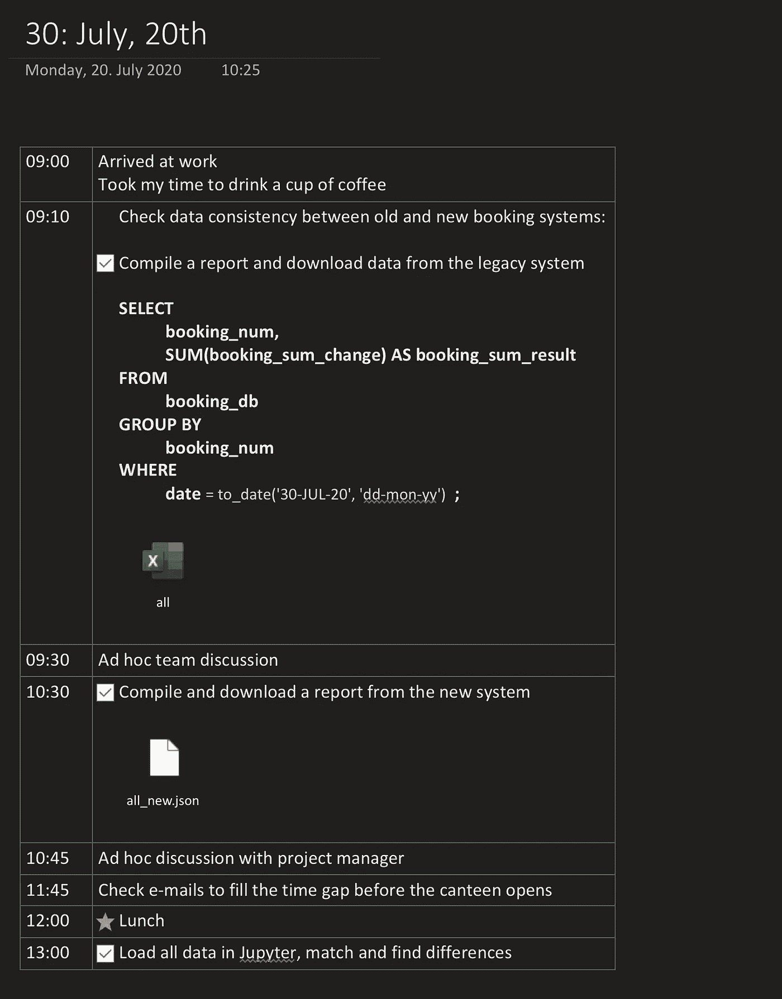

Microsoft OneNote 屏幕截图

我也滥用 OneNote 作为备份工具。我用我的中间结果保存了多个文件。我总是可以通过访问我的日记回到旧版本。

大量的图标选择，尤其是待办事项图标，有助于在笔记变得过大时突出显示重要内容。

我用来写这篇文章的 iOS 版本错过了时间戳(只有日期)和插入代码块。然而，我喜欢再次使用它，我只能推荐它。

# 一个用例

## 把你的一天分成几个任务，然后完成它们！

我想从 OneNote 开始。记笔记训练了我，让我在前一天结束时计划我的一天。这让我在第二天早上节省了时间。白天，我会添加一些临时任务。

那么，让我们从一个例子开始。对于一些说明性的部分——比如代码块——我选择了非常简化的部分，以便为每个读者提供一个共同点。

想象一下，我需要可视化谷歌地理定位位置的实际覆盖范围。它是 Google 定位工具支持的位置及其邮政编码的集合。如果未包含邮政编码，则您无法定制您的活动，也无法将它定位于特定位置。

因此，前一天晚上，我在 OneNote 中记下了以下任务:

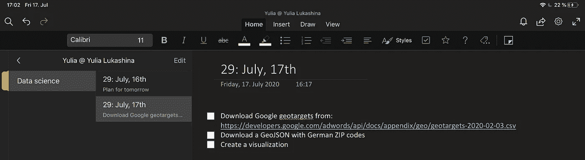

您可能已经注意到，我正在数据科学笔记本上工作。我也可以有其他的笔记本。我在工作日记的每个条目的标题前放了一个日历周数。在我们敏捷工作的日子里，这很方便，我们的工作量被分成了两周的 scrum 冲刺。

除了分心，你还可能在任务中遇到问题。如果你记录下你一天中所做的所有工作，你就不会有太大的麻烦去回忆你为什么停止做某事，转而去做其他的事情。

我们无法下载地理定位位置。我将在下一节展示更多的细节。

让我们把一个失败通知放在我们最初想做的任务旁边，并把它删除掉，而不是把它标记为完成。

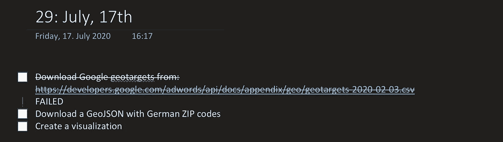

然后，我们仔细考虑情况，并添加一些我们需要的待办事项，以获得我们想要的数据。第一个做完之后，我们有了一些结果。我们把它们写下来。简而言之，数据的原始路径似乎已经过时，我们必须找到新的路径。由于数据会时不时地被更新，我们必须找到一种通用的方法来获取我们每次需要的相关数据。

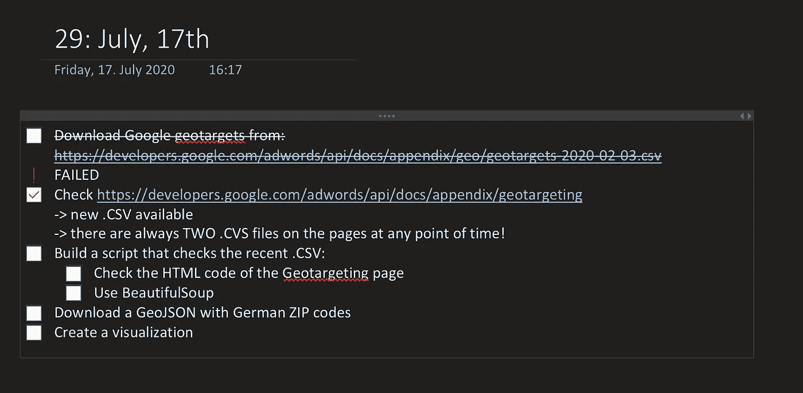

我们转到第一个子任务，完成它并在这里放一些中间结果。午餐后，我们可能会思考这些 HTML 片段，并开始 BeautifulSoup 任务来自动化获取实际数据路径的过程。

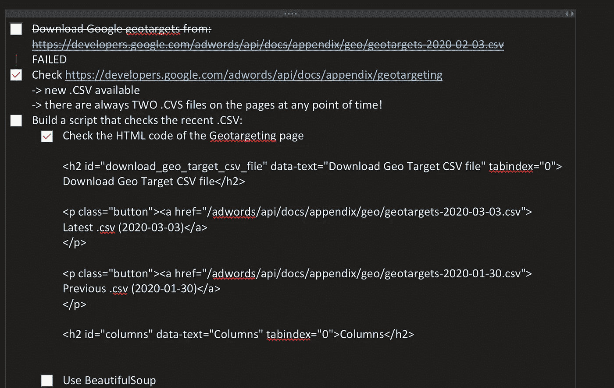

让我们看看在“后端”发生了什么

## 在 Jupyter / Google 联合实验室中保持跟踪

从技术角度来看，我的任务是从一个 URL 下载数据。该 URL 以“.”结尾。csv”，这是一个好迹象。尽管如此，当我添加一个简单的检查——一个列表长度——结果看起来有点可笑。整个地球上只有 1713 个邮政编码？那不可能是真的！

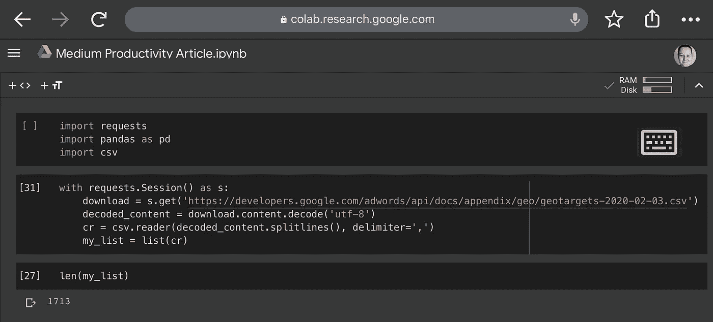

因此，我们打印应该包含列名的零线。它抛出了一些在这种情况下毫无意义的东西。如果我们打印下一行，它看起来也没有意义。

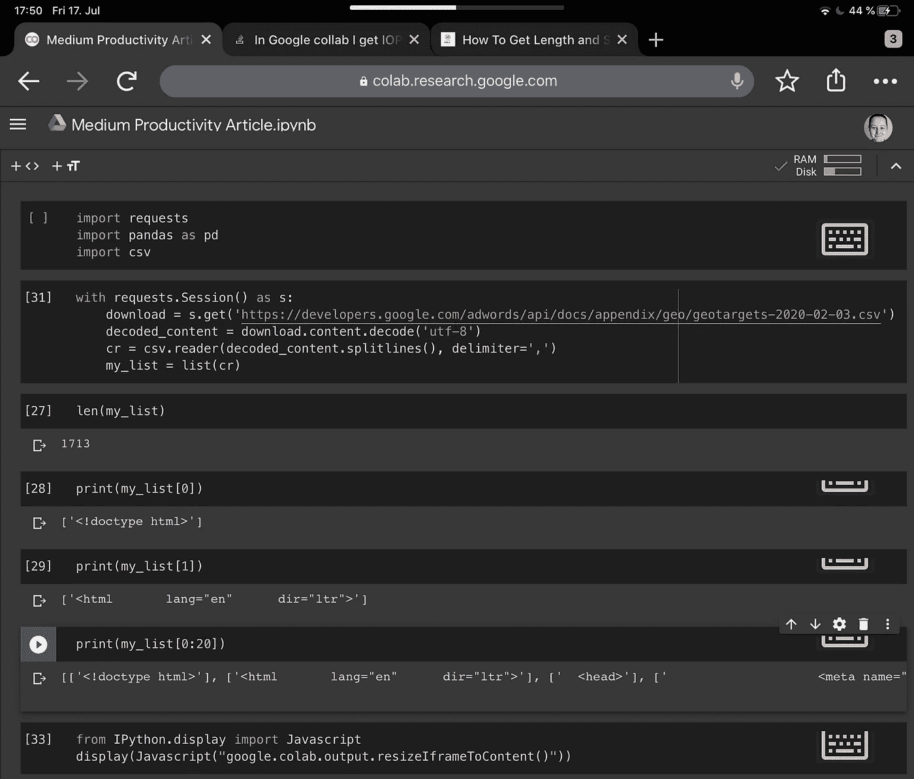

我们尝试通过导入 IPython 包，让 Colab notebook 显示完整的输出，但是没有效果。我们把它往下移几格。将输出复制粘贴到 iOS Notes 中，再看一遍。仍然没有线索。

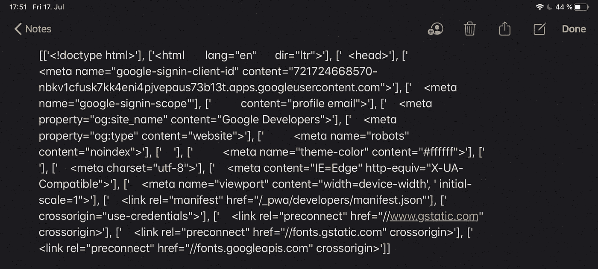

我们发送一个简单的请求并检查响应，结果是一个 404 错误。该页面不存在。

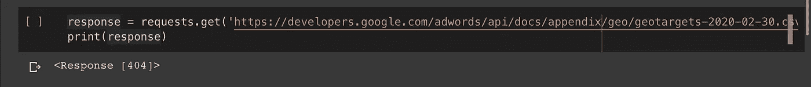

我们可以直接从 BeautifulSoup 包开始，自动解析正确的 URL。但是相反，我们做了一个简单的步骤，缩短网址并打开它。

我们看到的页面在层次结构中比目标页面高一级。我们发现它有不止一条路径。CSV 文件:一个包含退役的位置，一个包含仍在工作的位置。

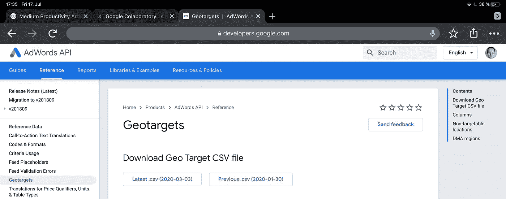

谷歌地理目标(用户视图)

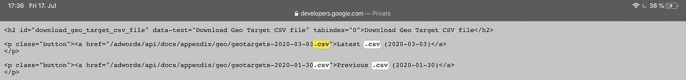

Google 地理目标(HTML 视图)

因此，我们不仅需要从父网页中解析一个 URL，还需要解析正确的 URL。

我们请求父页面，打印前 1000 个符号，以确保我们得到一些可以开始的数据。输出看起来不错。

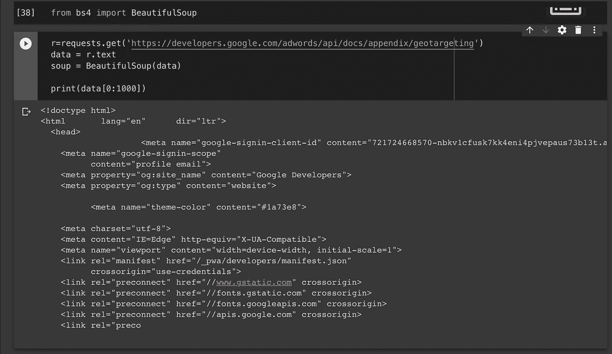

找到页面上的所有链接也很好。

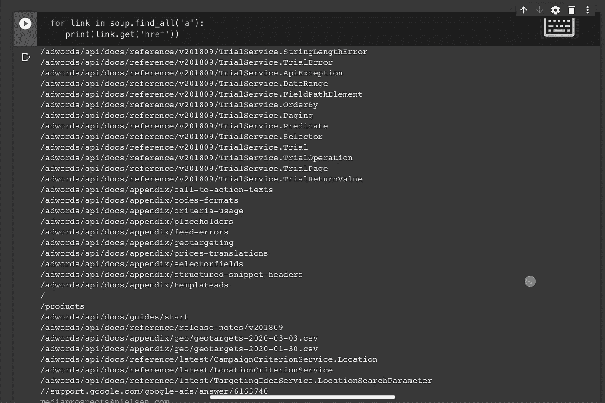

然后，我们尝试只获取包含“，”的链接。CSV”部分，但它不工作。我们试验了不同的语法，并把它们都放在那里。如果在这个过程中宣布开会，那么回来就更容易了，而不是开始我们已经拒绝的方法。

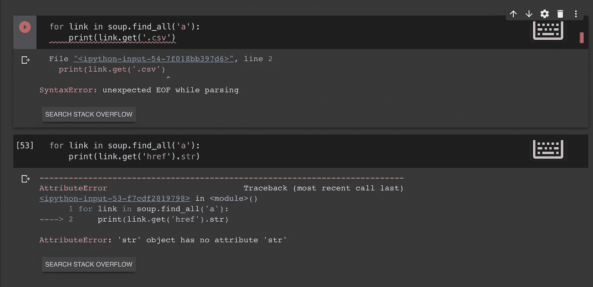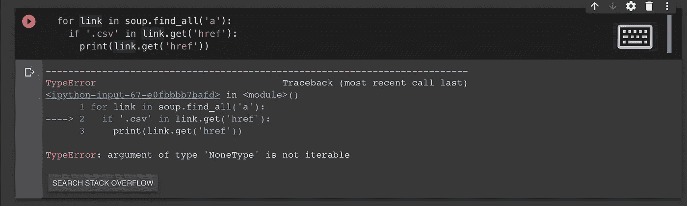

例如，一个输出表明我们使用了不可迭代的数据类型。我们检查它是否为真，类型是否为 NoneType。我们得到 yes，并试图把它转换成字符串。它工作了。

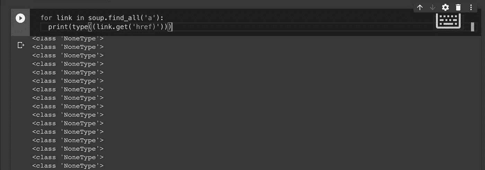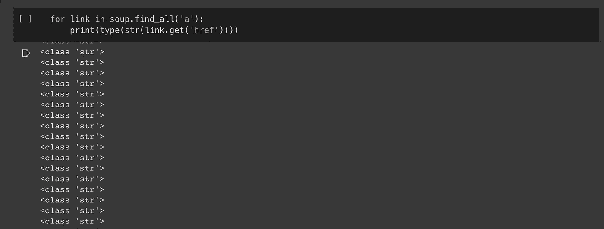

我们调整 if 条件，它抛出两个相关的链接。尽管如此，我们只需要一个。因此，我们检查链接文本——这也是按钮标签——并添加一个 if 条件，以便只选择指向最新位置的链接。我们现在可以保存它，并开始今天最初计划的任务:可视化数据。

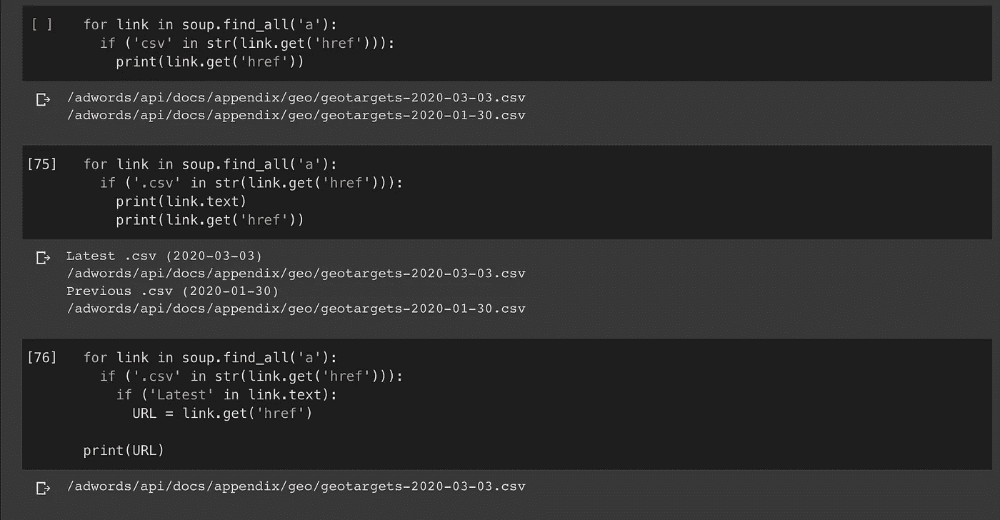

我们在 OneNote 中将待办事项框标记为已完成！

**结论:我们让代码逐渐地、有机地增长，备份每个阶段。**

我希望你已经了解了我的进度跟踪方法。在下一节中，我将在更抽象的层次上总结它们。

# 伟大的八人组

如果你与 Jupyter、Juno、Google 联合实验室研究、Kaggle 或 R Studio 合作，你可以使用这些技巧。对于最后一个，你必须激活降价。

如果你经常在办公室分心，如何避免丢失重要信息？

## #1.

我没有把整个代码放在一个单元格中。这些数据块帮助你记录你对数据的操作。在每个块之后是输出部分，您可以在那里显示您的初步结果。

会议一结束，您就可以通过查看输出来快速编写代码并刷新您的记忆。

## #2.

我做了很多复制粘贴。如果一部分代码不能正常工作，我不会完全删除它，而是将有问题的部分复制到下一个单元中。然后我一步一步改，一次一改。每次修改后都要复制粘贴。我可以随时回到任何代码单元，制作一个新的副本，调整另一个参数或使用另一个函数，等等。

## #3.

我保留那些被证明无效的副本，以便以后能够访问它们的错误信息。为了防止自己忘记已经尝试过的事情。

## #4.

我保留了所有的工作副本，以便能够从中选择最好的。

## #5.

我在每台笔记本电脑的顶部预留了一个单元格，用于打包导入。对于动态加载到笔记本中的每个新包，我稍后会在顶部添加 import 语句。

如果你只运行其中的一小部分，这有助于保持其他部分的工作。例如，您开始用 pyplot 绘图，然后过一会儿您添加了 seaborn，但是您的 import 语句很快就在笔记本中间的某个地方丢失了。第二天，您回到它那里，只想运行使用这些包的代码行，但是它抛出了一个错误，您不得不寻找一个 import 语句或者专门编写它。最终，你的笔记本中会出现大量重复的语句。

除了 import 语句之外，您在试验过程中不会接触到的所有东西也出现在顶部，例如，禁止科学符号的命令行。

## #6.

对于每一个新的试验，我都重新命名用于相同结果的对象。如果我将一些外部数据放入数据帧，每次放入不同的数据，我不会为所有数据帧指定相同的“df”名称。这可能会引起混乱。涉及一个对象的每个新命令，一般命名为，将覆盖前一个对相似对象做了一些转换的命令。如果您以某种方式回到笔记本开头的代码块，您会得到意想不到的结果，因为笔记本会调用最后保存的“df”数据帧。

它仅不适用于图形对象，因为 pyplot show 命令将覆盖当前存储在内存中的任何其他图形。

## #7.

在一行的开头加上#进行评论，并留下有意义的注释，将会在将来节省你的宝贵时间。不要再写日记了——只写下简短解释某个函数或方法用法的信息。

如果您完成了代码构建，并希望保存它以供几周后的应用，那么添加散列标记的注释是必不可少的。您可能不乐意在 OneNote 中寻找使用一个包而不使用另一个包的解释。

## #8.

在我的笔记本的最终版本中，我将大块与标题分开，以便让它们抓住我的注意力，即使我很紧张，向下滚动得太快而无法阅读代码本身。

## 一个完美的例子

由于我在上面的例子中没有完全遵循我自己的最佳实践，这里是我用来为另一篇 [TDS 文章](/television-and-data-science-its-complicated-2c6f7d62c638)构建 viz 的笔记本截图:

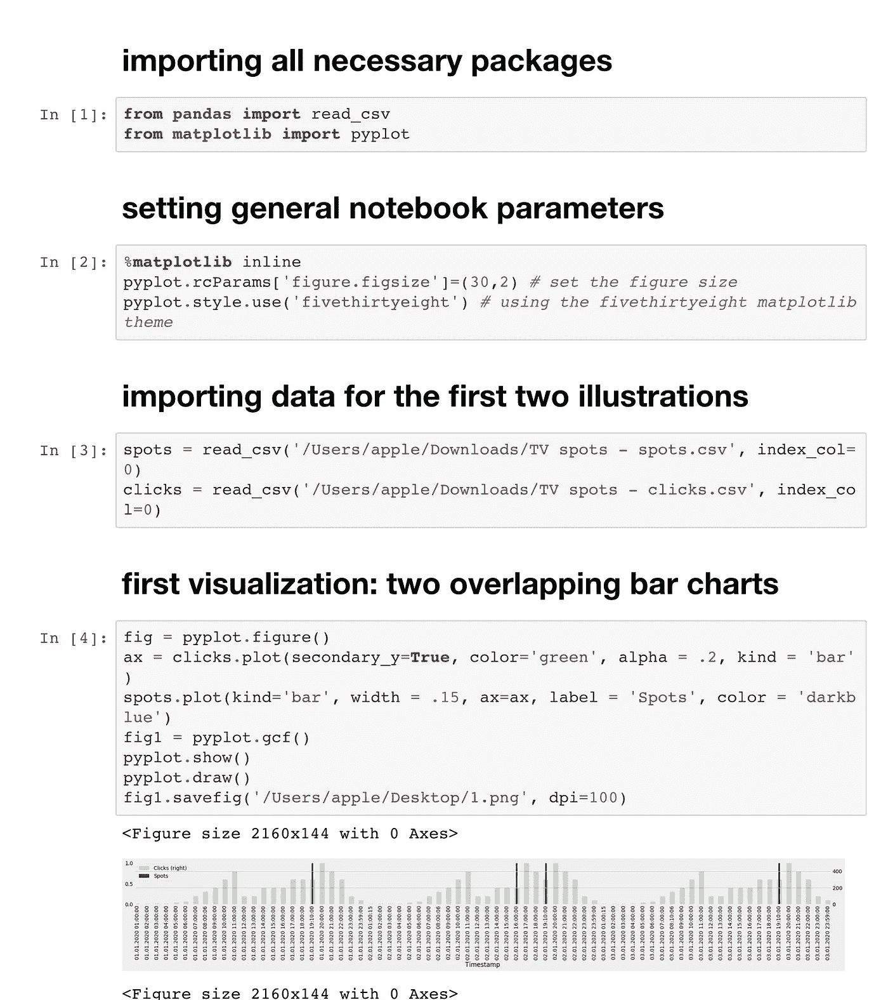

当然，如果你不能在办公室集中注意力，和你的老板谈谈也是值得的。数据科学家每天应该有几个小时不受干扰地工作。