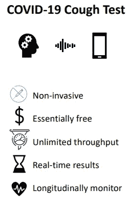

# 人工智能世界的显著进步和发展(11 月 9 日)

> 原文：<https://towardsdatascience.com/notable-progress-and-developments-in-the-artificial-intelligence-world-nov-9-54b5cf5fac33?source=collection_archive---------54----------------------->

## 你应该知道的人工智能世界中相关事件的基本信息。

## 人工智能的世界发展迅速，新技术每天都在发展，更多专注于人工智能的公司正在涌现。

跟上与机器学习从业者相关的发展和进步可能具有挑战性。

因此，我写了一篇文章，提供了机器学习从业者将特别感兴趣的人工智能领域的事件细节。

由 [NASA](https://unsplash.com/@nasa?utm_source=unsplash&utm_medium=referral&utm_content=creditCopyText) 在 [Unsplash](https://unsplash.com/s/photos/world?utm_source=unsplash&utm_medium=referral&utm_content=creditCopyText) 上拍摄的照片

# Palantir 正在商谈向英国提供援助，以处理其联系和追踪系统

Palantir 是一家在过去一个月一直处于商业新闻头条的公司，这主要是由于曾经的私营公司[申请首次公开募股](https://www.forbes.com/sites/elanagross/2020/08/25/palantir-files-for-ipo-revealing-it-has-never-been-profitable/?sh=549cec495b9c)，它已经在美国股票市场[成功上市](https://www.cnbc.com/2020/11/06/peter-thiels-palantir-is-skyrocketing-as-trumps-prospects-grow-dim.html)。

对于那些不知道的人，Palantir 是一家美国公司，专注于创建高效和有效的数据分析软件和工具。

该公司的创始人之一是彼得·泰尔，他是贝宝和许多其他成功的科技企业的联合创始人。

有报道称，Palantir 和英国政府官员一直在进行谈判，以确定 Palantir 如何帮助英国政府围绕其测试和跟踪计划创建一个更有效的分析系统。

Palantir 对于从以数据为中心的角度与各国合作处理新冠肺炎疫情并不陌生。这家数据分析公司已经与全球多个国家和美国疾病控制和预防中心合作。

可能值得注意的是，英国公共医疗保健系统 NHS(国家医疗服务)已经通过利用其一些数据分析软件获得了 Palantir 的帮助。

**点击以下链接了解更多信息。**

 [## 英国正与 Palantir 就测试和追踪计划进行谈判

### 英国政府已与美国数据分析公司 Palantir 举行会谈，试图支持其苦苦挣扎的…

www.ft.com](https://www.ft.com/content/6f6575a8-799f-42a4-b1cc-3f7452b2166f)  [## 英国正与 Palantir 就新冠肺炎测试与跟踪计划进行谈判

### (路透社)-英国政府正在与美国数据分析公司 Palantir Technologies Inc .进行谈判，试图…

uk.reuters.com](https://uk.reuters.com/article/us-health-coronavirus-britain-palantir-idUKKBN27J2HL) 

# 人工智能通过听到你的咳嗽来执行新冠肺炎检测

[视觉摘要](https://ieeexplore.ieee.org/stamp/stamp.jsp?tp=&arnumber=9208795)

麻省理工学院的研究人员开发了一种利用人工智能的新冠肺炎探测方法。

开发的人工智能模型可以从通过手机和网络浏览器捕获的咳嗽音频样本中检测到新冠肺炎。

研究人员报告说，人工智能模型可以拾取指标的微小变化，然后用于检测个体中的新冠肺炎。

在[研究论文](https://ieeexplore.ieee.org/stamp/stamp.jsp?tp=&arnumber=9208795)中，这些指标被称为生物标志物。生物标记是肌肉退化、声带变化、情绪变化以及肺部和呼吸系统内的变化。

人工智能模型是神经网络和设计算法的结合，可以拾取生物标志物的微小变化，并从咳嗽样本中准确检测新冠肺炎。

该模型从可用的咳嗽样本中检测新冠肺炎的准确率达到了令人印象深刻的 98.5%。

研究人员希望人工智能模型可以集成到移动应用程序中。在移动应用程序中工作的人工智能模型可以促进在人群中对新冠肺炎的日常监控。

**以下资源提供了更多信息:**

 [## 仅使用咳嗽记录的新冠肺炎人工智能诊断

### IEEE Xplore，提供对世界上最高质量的工程和…

ieeexplore.ieee.org](https://ieeexplore.ieee.org/document/9208795)  [## 人工智能模型通过手机记录检测无症状新冠肺炎感染…

### 根据定义，感染新冠肺炎病毒的无症状患者没有可辨别的身体症状

news.mit.edu](https://news.mit.edu/2020/covid-19-cough-cellphone-detection-1029) 

# 英特尔正在通过更多的收购来加强其人工智能部门

英特尔最近收购了两家专注于机器学习的公司，以推动芯片制造公司进入人工智能领域。

英特尔最新收购的两家公司包括 [Cnvrg.io](https://cnvrg.io/) 和 [SigOpt](https://sigopt.com/) 。

Cnvrg.io 是一家开发软件和工具来帮助数据科学家构建和部署机器学习模型的公司。

SigOpt 专注于通过自动模型优化和开发来优化机器学习模型。

这两家公司似乎互补，无疑将使英特尔成为全球企业人工智能市场份额争夺战中的一支强大力量。

**更多信息请点击以下链接:**

 [## 英特尔将收购 SigOpt 以提升人工智能的生产力和性能|英特尔新闻编辑室

### 最新消息:今天，英特尔宣布将收购 SigOpt，这是一家总部位于旧金山的领先平台提供商

newsroom.intel.com](https://newsroom.intel.com/news/intel-to-acquire-sigopt-to-scale-ai-productivity-and-performance/#gs.kyc4eu)  [## 英特尔已经收购了 Cnvrg.io，这是一个管理、构建和自动化机器学习的平台

### 英特尔继续收购初创公司，以建立其机器学习和人工智能运营。在最近的行动中，TechCrunch…

techcrunch.com](https://techcrunch.com/2020/11/03/intel-has-acquired-cnvrg-io-a-platform-to-manage-build-and-automate-machine-learning/) 

# IBM 和辉瑞合作开发可以预测阿尔茨海默病的人工智能模型

IBM 和辉瑞研究部门[的合作开发了一种人工智能模型，该模型可以在临床诊断实施之前或个体出现症状之前预测个体阿尔茨海默病的早期发作。](https://www.research.ibm.com/)

人工智能模型的性能得分为 70%，并通过分析一到两分钟长的口头语音样本来工作。利用自然语言处理技术来分析转录的语音样本。

语音样本数据是通过弗雷明汉心脏研究提供的，该研究包含了超过 5000 个人的健康数据点。

在未来，人工智能模型可以用来帮助降低个体早期患阿尔茨海默病的风险。

**更多信息请点击下面的链接。**

 [## 人工智能能帮助临床医生在阿尔茨海默病发展之前预测它吗？IBM 研究博客

### 由 IBM 和辉瑞公司开发的人工智能模型已经使用语音测试来帮助预测阿尔茨海默氏症的最终发作…

www.ibm.com](https://www.ibm.com/blogs/research/2020/10/ai-predict-alzheimers/)  [## IBM 和辉瑞声称人工智能可以预测阿尔茨海默病的发作，准确率为 71%

### 辉瑞和 IBM 的研究人员声称已经开发出一种可以预测阿尔茨海默病的机器学习技术…

venturebeat.com](https://venturebeat.com/2020/10/22/ibm-and-pfizer-claim-ai-can-predict-alzheimers-onset-with-71-accuracy/) 

# 结论

随着时间的推移，利用人工智能检测几种疾病正在成为现实。

很快，我们就可以期待临床医生使用人工智能嵌入式软件和硬件来改善威胁生命的疾病的早期检测。

大型科技公司在收购有前途的初创公司方面没有放缓，研究团队之间的合作越来越多，以进一步开发新技术来解决现实世界的问题，特别是关于健康的问题。

下周会有什么发展和进展，我们只能拭目以待。

# 我希望这篇文章对你有用。

要联系我或找到更多类似本文的内容，请执行以下操作:

1.  订阅我的 [**邮件列表**](https://richmond-alake.ck.page/c8e63294ee) 获取每周简讯
2.  跟我上[中型 ](https://medium.com/@richmond.alake)
3.  通过 [**LinkedIn**](https://www.linkedin.com/in/richmondalake/) 联系我