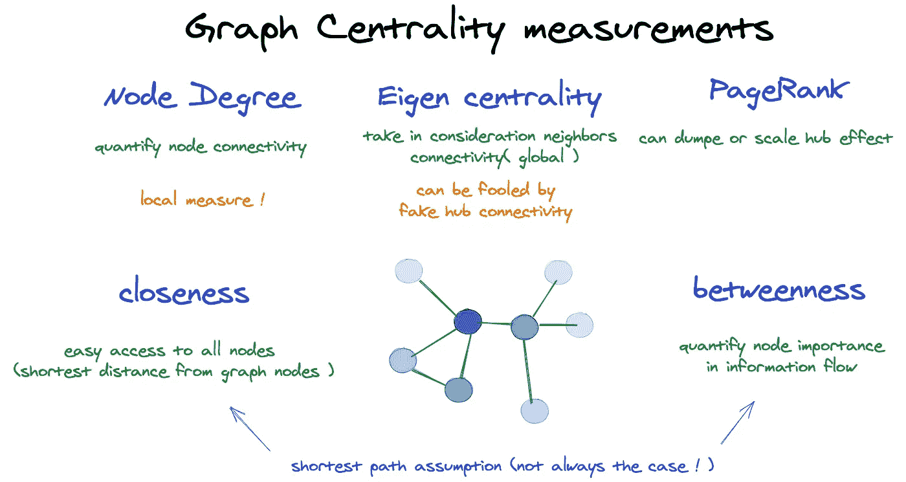
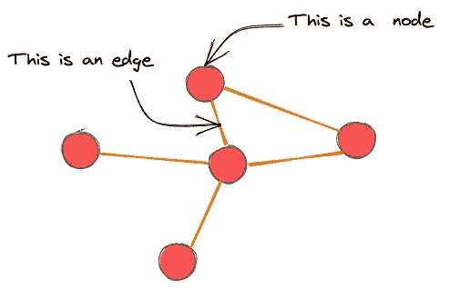
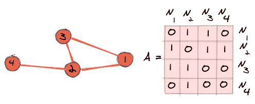
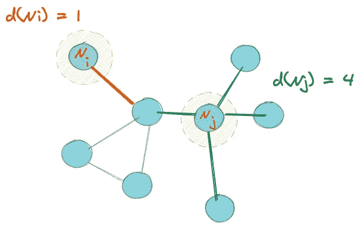
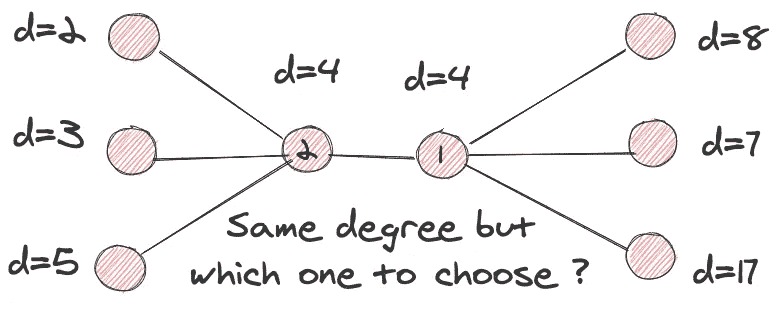
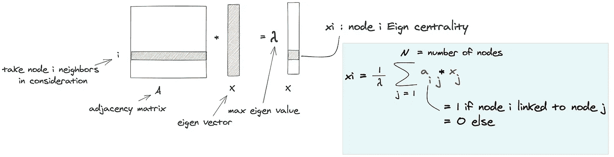
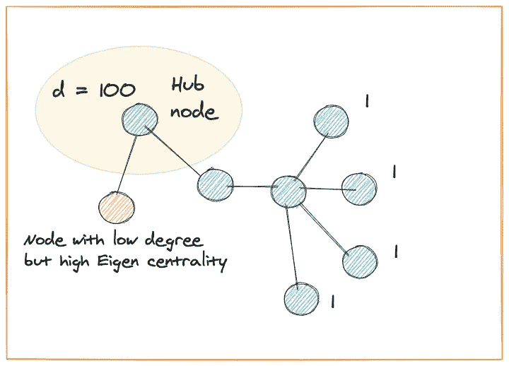
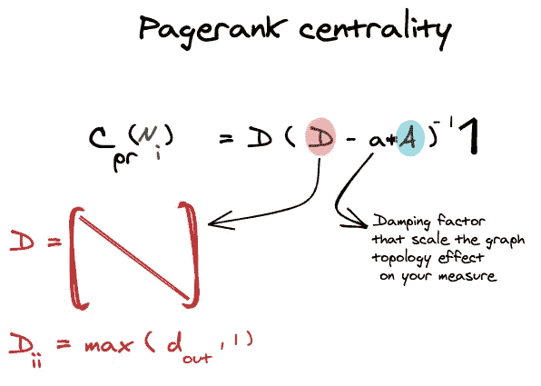
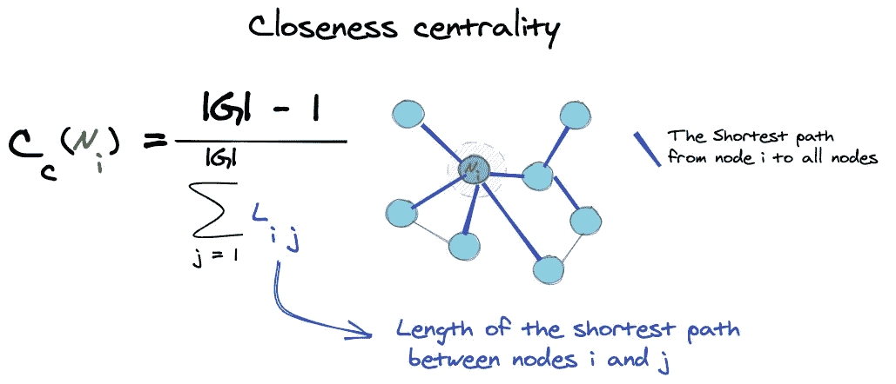

# 图论的注记——中心性测度

> 原文：<https://towardsdatascience.com/notes-on-graph-theory-centrality-measurements-e37d2e49550a?source=collection_archive---------10----------------------->

## 关于不同中心性度量的注记:定义和权衡

作者图片

# 介绍

中心性测量是分析网络的重要工具，无论是国家道路网络还是电力网络，您都希望确定主要城市，并确定需要维护的关键节点，以消除未来对网络的干扰。所有这些分析都可以使用一些简单的拓扑测量来完成，这些测量根据节点作为大网络的一部分的重要性来评分。

# 图论:导论

首先，我将通过给出图形抽象的定义和数学表示来介绍图形抽象，因为我们以后会用到它。

## **图形定义**

图表无处不在，它是一个非常适合的工具来呈现数据，其中连接和链接对于我们理解它很重要。就像分子结构呈现出基本原子的集合，这些原子相互连接，形成复杂的结构，在这个集合中每个原子的连接意味着这个分子的用法或特征，事实上，改变其中一个连接可以给你一个完全不同的分子。

这个例子将帮助我们理解**一个图的基本结构，这个图是由一堆通过边连接的节点生成的**。基础解剖学？是的，但是继续添加这些节点和边，你可以创建一些曾经存在的复杂网络。以脸书为例，节点是用户，边是友谊或追随者。

一个有 5 个节点和 5 条边的图的例子(图片由作者提供)

## **图形数学演示**

如前所述，图表可以发展成为复杂的结构，以脸书社交网络为例。因此，仅仅通过视觉观察很难研究它，因此，我们需要建立数学工具来帮助我们理解或分析我们的图形结构。

我们从作为数学对象的图形定义开始。一个图是由它的一组节点和一组边定义的，所以一个图 G 被定义为:

图表的数学表示(作者提供的图片)

n 表示图中的节点集，E 是边集。我们还将图的范数定义为节点数

## **邻接矩阵**

正如我之前所说的，我们不能仅仅使用图形的几何形状来分析它们，但是我们需要某种工具来封装我们图形中的信息，并且容易对其进行数学分析。

为此，我们将**邻接矩阵**定义为二进制 2d 数组 n*n，其中 n 表示节点的数量。如果两个节点链接，则每个值可以是 1，否则将是 0。正如你在例子中看到的，无向图(一种图形结构)的邻接矩阵是对称的，我们将在接下来的故事中看到更多。

邻接矩阵示例(图片由作者提供)

# 图论:中心性测量

现在我们已经建立了关于图的基本概念，我们准备通过给出它们的定义和用法来发现中心性度量。我还将尝试以一种您可以轻松看到何时使用每种措施的方式对它们进行排序。

中心性度量是给予图中每个节点的标量值，以基于假设量化其重要性。

## 节点度

*   **定义**

节点度是基本的中心性度量之一。**等于节点邻居的数量**。因此，一个节点的邻居越多，它就越是中心的和高度连通的，因此对图有影响。

节点 Ni 的节点度为 1 /节点 Nj 的节点度为 4(图片由作者提供)

*   **节点度是局部的，不是全局的**

虽然节点度给了我们一个关于每个节点连通性的概念，但是它是一个局部的度量，并不能展示全局。让我给你举个例子:

这两个节点具有相同的度数(图片由作者提供)

如您所见，这两个节点具有相同数量的邻居，这意味着它们具有相同的节点度，但看看它们的邻居，节点 1 连接到度数较高的节点，因此如果我们基于连通性进行选择，我们肯定会选择它，因此**节点度作为一种度量没有考虑邻居连通性**这就是为什么我们称之为局部度量。

## 特征中心性

*   **定义**

特征向量中心性测量节点的重要性，同时考虑其邻居，换句话说，**它测量节点的度，但更进一步，通过计算其连接(邻居)有多少条链路**。它使用邻接矩阵的分解。因此**每个节点 I 的特征中心性是具有最大特征值的矩阵特征向量的第 I 个条目。**

特征中心性定义(图片由作者提供)

*   **轮毂偏置**

我们已经看到，特征中心性是全局的，因为它奖励具有高的和重要的连通性(在数量和质量方面的连接)的节点。但是想象一下添加一个新节点并将其连接到一个 hub 节点。该节点将具有较低的度数，但是具有较高的特征中心性，因为它的邻居是集线器(度数较高的节点)。为了澄清这一点，想象一下你刚到脸书，你开始关注巴拉克·奥巴马或一个受欢迎的人，这并不意味着你在网络中是那么重要。

作者图片

## PageRank 中心性

以减少假的或有偏差的中心节点的危险。谷歌创始人拉里·佩奇(Larry Page)和谢尔盖·布林(Sergei Brin)发明了一种新的中心性衡量标准( [PageRank](https://en.wikipedia.org/wiki/PageRank) )，这种衡量标准使用一种阻尼因子来平抑/减弱中枢连接的影响。

页面等级中心性测量使用阻尼因子来控制邻居对您的节点的影响，同时测量其重要性。(图片由作者提供)

## 接近中心性

这种类型的中心性根据与其他节点的连接来衡量节点效率。当尝试使用较少的链路向其他节点发送信号时，哪个节点效率更高？为了更好地理解这一点，让我再举一个例子。

想象一下，我们有一个道路网络，城市是你的节点，道路是边。你拥有一家服装公司，你想安装一个新的仓储设施，为所有城市的客户供货。一般来说，你会选择把它放在一个离所有其他城市都近的城市，以减少你的运输成本。

对于这个用例，接近中心性将是选择您的位置的一个很好的度量，因为它测量平均路径长度**。**因此，你的亲密度中心值越高，你的节点离你网络中的其他节点就越近。

亲近中心性公式(作者图片)

## 中间中心性

在强调最短路径方面，接近接近中心性的度量是中间中心性。它测量我们研究的节点所在的最短路径的百分比**。**因此，具有高介数中心性的节点可能对其他节点之间传递的信息具有相当大的影响**。因此它们代表了网络的关键部分，因为移除它们会破坏图中顶点(节点)之间的链接。**

# 外卖点

正如您所看到的，中心性度量为节点提供了一个易于解释的标量分数，还可以帮助您根据重要性和关键程度比较网络中的节点。

另一个要点是，每个中心性度量都有一个背景假设，例如，紧密度和介数中心性将重要性定义为图中信息流的节点效率。其他如特征中心性或度中心性奖励高度连接的节点。所以我给你的建议是，使用一个基于你的研究案例的中心性测量，如果你想更进一步，你可以把它们结合成一个适合你问题需要的一般中心性测量。

最后，如果你正在使用 python，我建议你使用已经实现了这些中心化措施的 [Networkx 库](https://networkx.github.io/documentation/stable/reference/algorithms/centrality.html)，所以花些时间来使用它们。不久我们将看到另一个关于图论的故事。

# 资源:

*   [巴西拉实验室的图论讲座](https://youtu.be/dEGmpwPMBH0)
*   [特征中心性和 PageRank](https://cambridge-intelligence.com/eigencentrality-pagerank/)
*   [Exalidraw:用于草图的工具](https://excalidraw.com/)