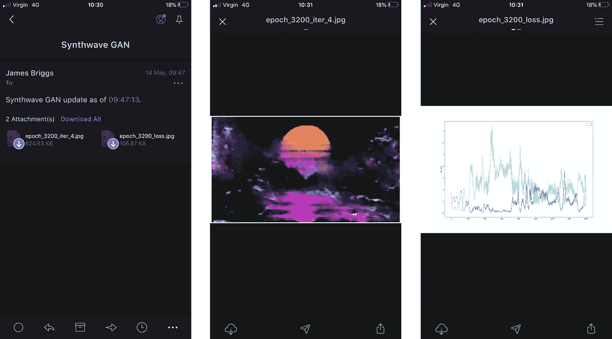
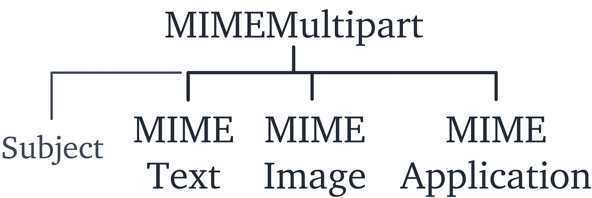

# 用 Python 通知

> 原文：<https://towardsdatascience.com/notify-with-python-41b77d51657e?source=collection_archive---------11----------------------->

## 使用 Python 构建的电子邮件通知让生活更轻松


西蒙·米加杰在 Unsplash[上的照片](https://unsplash.com?utm_source=medium&utm_medium=referral)

在 Python 中工作，我经常运行数据处理、传输和模型训练脚本。现在，对于任何合理程度的复杂性和/或大数据，这都需要一些时间。

虽然在等待这些处理过程完成的时候，我们经常都有一些其他的工作要做，但有时我们并没有。

为此，我整理了一组专门为这个问题构建的 Python 脚本。我使用这些脚本向我的手机发送流程更新、可视化和完成通知。

所以，当我们偶尔有自由的时候。我们可以享受它们，而不用担心模型的进展。

# 我们需要什么

好的，我们需要问的第一件事是— **我们需要知道什么？**

当然，这取决于你正在做的工作。对我来说，我有三个主要的处理任务可能会占用时间:

*   模型**训练**
*   数据**处理**和/或传输
*   财务**建模**

对于其中的每一个，当然都有不同的信息需要我们了解。让我们来看一个例子。

## 模特培训

每 n 个时期更新**，必须包括**关键指标**。例如，训练集和验证集的损失和准确性。**

**完成通知**(当然)。为此，我喜欢包括:

*   **预测输出**，用于文本生成，生成的文本(或其样本)——用于图像生成，一个(希望)酷的可视化。
*   **培训期间关键指标的可视化**(同样，培训和验证集的损失和准确性)
*   其他不太重要但仍然**有用的信息**，如本地模型目录、培训时间、模型架构等

让我们以训练神经网络来再现给定的艺术风格为例。

对于这一点，我们希望看到；从模型生成的图像、损失和精度图、当前训练时间和模型名称。

在这种情况下，每隔 100 个时期，就会发送一封包含上述所有内容的电子邮件。这是其中一封电子邮件:



## 数据处理和传输

这一个稍微不那么迷人，但是就消耗的时间而言，遥遥领先。

我们将使用 Python 向 SQL Server 批量上传数据的例子(对于我们这些没有`BULK INSERT`的人)。

在上传脚本的末尾，我们包含了一条简单的消息，通知我们上传完成。

如果偶尔抛出错误，我们还可以添加一个 try-except 子句来捕获错误，并将其添加到一个列表中，以包含在我们的更新和/或完成电子邮件中。

## 金融建模

在金融建模的情况下，我运行的一切实际上都相当快，所以我只能在这里给你提供一个“示例”用例。

我们将使用[现金流建模工具](/cash-flow-modelling-with-python-59d3cf8f08a2)的例子。实际上，这个过程不超过 10-20 秒，但是现在让我们假设我们是华尔街的热门 quants，处理几百万(而不是几百)贷款。

在这封电子邮件中，我们可能希望包含对所分析的投资组合的高层次总结。我们可以随机选择一些贷款并可视化给定时间段内的关键价值——给我们一个小样本来交叉检查模型性能是意料之中的。

# 代码

上述所有功能都来自一个名为`notify.py`的脚本。

我们将在示例代码中使用 Outlook。然而，将它翻译给其他提供者是非常容易的，我们将在最后快速介绍这一点。

这里我们需要两个 Python 库，`email`和`smtplib`。

*   `[**email**](https://docs.python.org/3/library/email.html)` —用于管理电子邮件信息。这样，我们将设置电子邮件本身，包括主题、正文和附件。
*   `[**smtplib**](https://docs.python.org/3/library/smtplib.html)` —处理 SMTP 连接。简单邮件传输协议(SMTP)是大多数电子邮件系统使用的协议，允许通过互联网发送邮件。'

## 哑剧

消息本身是使用来自`email`模块的`MIMEMultipart`对象构建的。我们还使用了三个 MIME 子类，我们将它们`attach`到`MIMEMultipart`对象:

*   `MIMEText` —这将包含电子邮件“有效载荷”，即电子邮件正文中的文本。
*   `MIMEImage` —很容易猜到，这是用来在我们的电子邮件中包含图像的。
*   `MIMEApplication` —用于 MIME 消息*应用*对象。对我们来说，这些是文件附件。

除了这些子类，还有其他参数，比如`MimeMultipart`中的`Subject`值。所有这些一起给了我们下面的结构。



让我们看看如何将这些放在一起。

这个脚本在很大程度上相当简单。在顶部，我们有我们的导入——这是我们之前讨论过的 MIME 部分，以及 Python 的`os`库。

接下来定义一个名为`message`的函数。这允许我们用不同的参数调用函数，并轻松地构建电子邮件消息对象。例如，我们可以编写一封包含多个图像和附件的电子邮件，如下所示:

```
email_msg = message(
    text="Model processing complete, please see attached data.",
    img=['accuracy.png', 'loss.png'],
    attachments=['data_in.csv', 'data_out.csv']
)
```

首先我们初始化`MIMEMultipart`对象，将其赋给`msg`。

然后我们使用`'Subject'`键设置邮件主题。

`attach`方法允许我们向`MIMEMultipart`对象添加不同的 MIME 子类。这样我们就可以使用`MIMEText`子类来添加邮件正文。

对于图像`img`和附件`attachment`，我们可以什么都不传递，传递一个文件路径，或者传递一个文件路径列表。

这是通过首先检查参数是否是`None`来处理的，如果是，我们通过。否则，我们检查给定的数据类型，如果它不是一个`list`，我们把它变成一个——这允许我们使用下面的`for`循环来迭代我们的项目。

此时，我们使用`MIMEImage`和`MIMEApplication`子类来分别附加我们的图像和文件。对于这两种情况，我们都使用`os.basename`从给定的文件路径中检索文件名，我们将其作为附件名。

## 简单邮件传输协议

现在我们已经建立了电子邮件对象，我们需要发送它。

这就是`smtplib`模块的用武之地。代码也很简单，除了一个例外。

因为我们直接与不同的电子邮件提供商及其各自的服务器打交道，所以我们需要不同的 SMTP 地址。幸运的是，这个真的很好找。

在谷歌中输入*“outlook SMTP”*。甚至不用点击页面，我们就能得到服务器地址`smtp-mail.outlook.com`和端口号`587`。

当用`smtplib.SMTP` 初始化`SMTP`对象时，我们使用这两种方法——在`send`函数的开头附近。

`smtp.ehlo()`和`smtp.starttls()`都是 SMTP 命令。`ehlo`(扩展 Hello)本质上是问候服务器。`starttls`通知服务器我们将使用加密传输级安全(TLS)连接进行通信。你可以在这里了解更多关于 [SMTP 命令的信息。](https://www.samlogic.net/articles/smtp-commands-reference.htm)

之后，我们只需从文件中读取我们的电子邮件和密码，分别存储在`email`和`pwd`中。

然后我们用`smtp.login`登录 SMTP 服务器，用`smtp.sendmail`发送邮件。

我总是将通知发送给自己，但在自动报告的情况下(或出于任何其他原因)，您可能希望将电子邮件发送到其他地方。为此，更改`destination_address` : `smtp.sendmail(email, ***destination_address***, msg.as_string)`。

最后，我们终止会话并关闭与`smtp.quit`的连接。

所有这些都放在一个 try-except 语句中。在网络连接暂时中断的情况下，我们将无法连接到服务器。导致了`socket.gaierror`。

实现这个 try-except 语句可以防止程序在网络连接中断时中断。你如何处理这种情况可能会有所不同，这取决于这封邮件的重要性。

对我来说，我用它来更新 ML 模型训练和完成数据传输。如果一封电子邮件没有被发送出去，那也没关系。因此，这种简单、被动的连接丢失处理是合适的。

## 把它放在一起

现在我们已经编写了代码的两个部分，我们可以发送电子邮件，只需:

```
# build a message object
msg = message(text="See attached!", img='important.png',
              attachment='data.csv')send(msg)  # send the email (defaults to Outlook)
```

[*杰森·法莱特*](https://medium.com/u/8a5a880b2851?source=post_page-----41b77d51657e--------------------------------) *指出，使用 Gmail 的人可能需要“允许访问不太安全的应用程序”。这样做的步骤可以在* [*这个堆栈溢出问题中找到*](https://stackoverflow.com/questions/16512592/login-credentials-not-working-with-gmail-smtp) *。*

这就是使用 Python 实现电子邮件通知和/或自动化的全部内容。感谢`email`和`smptlib`库，这是一个非常简单的设置过程。


通用电子邮件提供商服务器地址和 TLS 端口。如果你有什么要补充的，请告诉我！

对于任何耗费大量时间的处理或培训任务，进度更新和完成通知通常是真正的解放。

我希望这篇文章对你们中的一些人有用，一如既往，如果你有任何问题或建议，请告诉我！

感谢阅读！

我还写了其他“快速修复”文章，让我们的 Python 生活变得更简单，看看这篇关于 Excel 和 Python 集成的文章:

[](/excel-to-python-79b01638f2d9) [## Excel 到 Python

### 为 Python 工具构建前端 Excel 工作簿

towardsdatascience.com](/excel-to-python-79b01638f2d9)