# 网络容量规划的新方法

> 原文：<https://towardsdatascience.com/novel-method-for-network-capacity-planning-7993ef263e07?source=collection_archive---------26----------------------->

# 介绍

一种增强网络容量测量的方法，该方法基于客户在网络上的数据使用与使用近实时大数据架构的客户的位置变化之间的相关性。

在此分析中，我将使用一个模拟热流的模型，并以类似的方式用数学方法表示网络。

此外，我们将通过在偏微分方程和不同来源之间的概率统计相关性建模。

最后，我们将浏览大数据堆栈，在那里我们可以实施该模型并将其可视化。

# 为什么/好处

很难主动检测网络流量，也很难将其映射到消费者行为。

因此，在这个模型中，我们需要克服 3 个问题:

主动减少网络上的数据流量拥塞，这将改善客户体验和网络的净推广分数。

通过主动检测故障，减少因数据网络问题导致的客户流失，因为这始终是客户退出网络的主要原因之一。

我们需要有一个不同的视角，从商业消费者的角度来规划网络整改。

# 用例模拟

在这种情况下，我将通过一个非常简单的网络快照模拟，让一群客户使用数据。

网络的一部分看起来会像这样

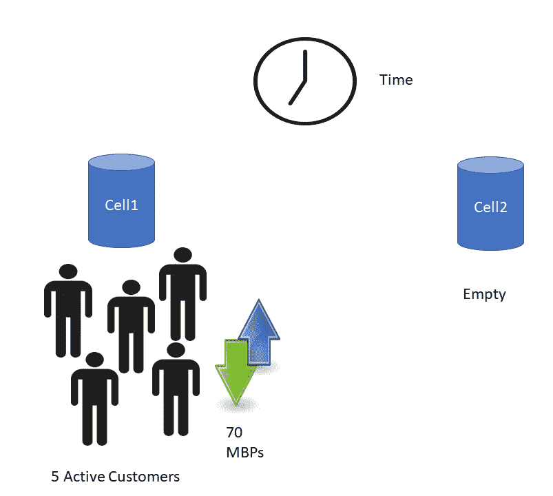

图 1:在第一个例子中，在时间 T 5，小区 1 有 70MBPs 带宽的活跃用户，而小区 2 完全免费。

在一个时间增量之后，一些用户将移动到其他邻居节点，占用一部分带宽

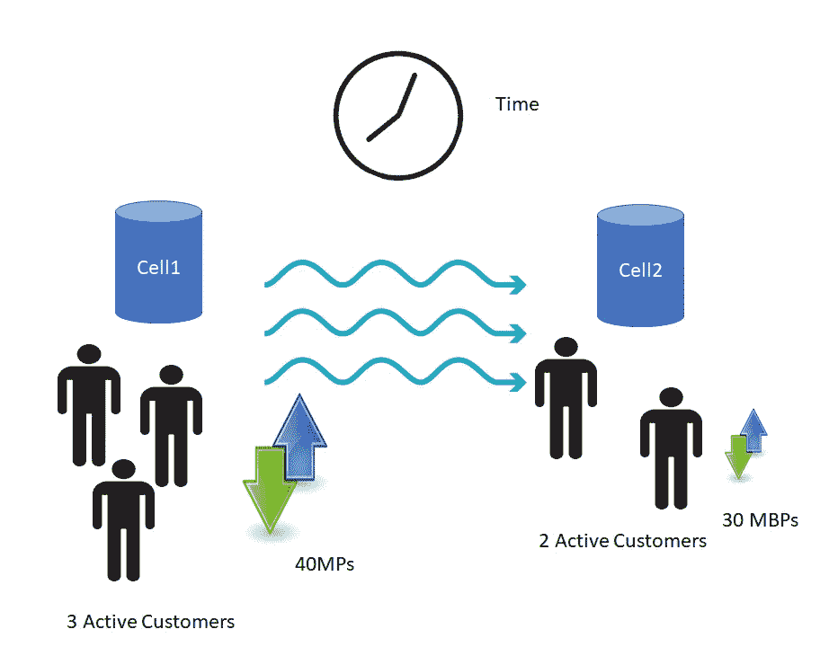

图 2:在第二个例子中，在时间 T++时，一些活跃用户已经移动到小区 2，带走了一部分带宽

因此，添加一个新的邻居节点并使用部分带宽移动一些客户的模拟将是这样的。

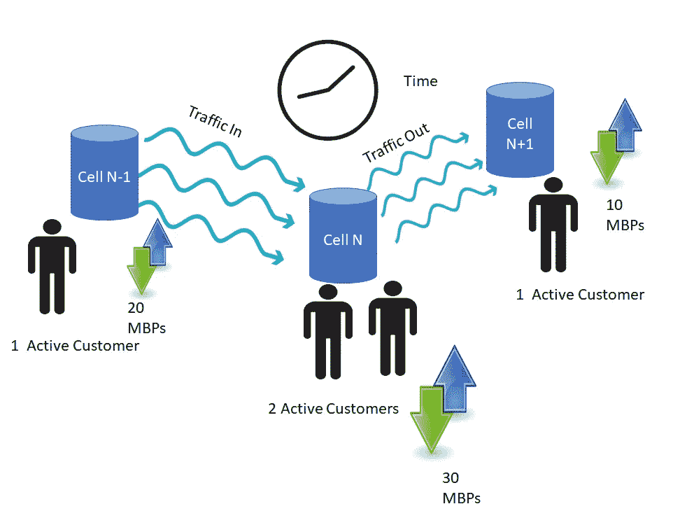

图 3:然后在下一步中，这些用户的一部分移动到其他新的小区，占用部分带宽。

因此，一般来说，在时间 T 有许多节点，我们需要对具有最大流量的小区采取行动，这是总客户和已用带宽的一个因素。

一般来说，通量是单位时间单位面积的能量流的表示，在我们的情况下，通量是单位时间内用户数量和带宽的函数。

所以，我们要经历的最后一个等式。推导过程看起来像这样:一个偏微分方程，对于具有表中定义的最大差分电势“U”的单元，在时间 t 得到建议 R。

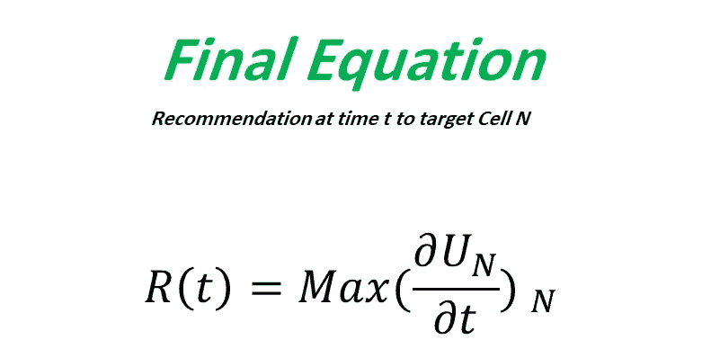

所以，这就是汞金属的扩散方式，它在液态移动中扩散，网络数据就像水银一样珍贵。

这里我们开始进行方程推导。

# **方法总结**:

每个客户进行数据 CDR(呼叫详细记录)并离开该小区到另一个相邻小区的概率方法。

概率基于客户使用的历史频率，如语音、短信和移动到相邻小区。

定义网络流量和决定容量建议的模型是基于传热模型的模拟计算的

基于类比的小区流量计算是小区的最小利用率，加上所有来自其他小区的传入数据流量，减去任何到其他小区的传出数据流量。

为了模型的准确性，模型中使用的一些属性可能会被丢弃

在这一步，我们必须回到热流在两个表面之间的工作原理。

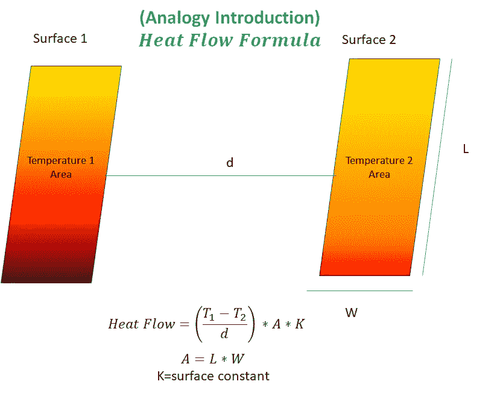

然后，当网络流在单元之间移动时，我们将其与网络上的情况进行类比

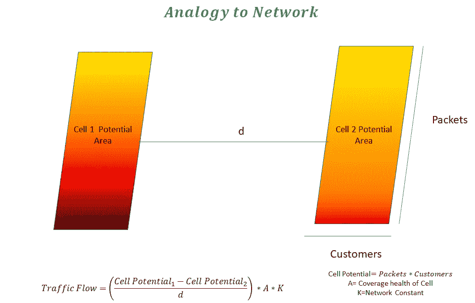

因此，我们在这里有一些符号和变量，我们需要映射的类比，将有以下定义。

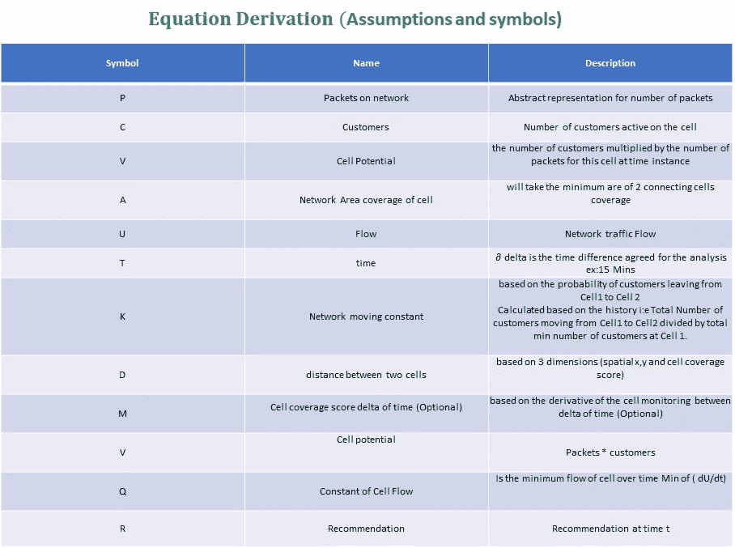

然后流动的偏微分方程将在这些步骤中完成

一般的定义会是这样的

然后，我将 V 定义为包 P 和顾客 C 的函数

然后，通过替换交通流量方程中的所有变量，得到三维距离 d

这里的面积是两个小区之间的两个覆盖区域的最小值，常数 K 将是在小区 1 和 2 之间随时间移动的用户数量对小区 1 上出现的最小用户数量的积分

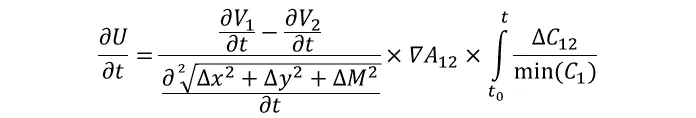

最后，两个细胞之间的流动看起来像这样

类似地映射到小区之间的距离 x，y 的第三维的 M 变量是健康监控检查，其示出了网络节点相对于时间的健康，将时间 t 处的 M 变量作为小区 1 监控和小区 2 监控之间的差的梯度。

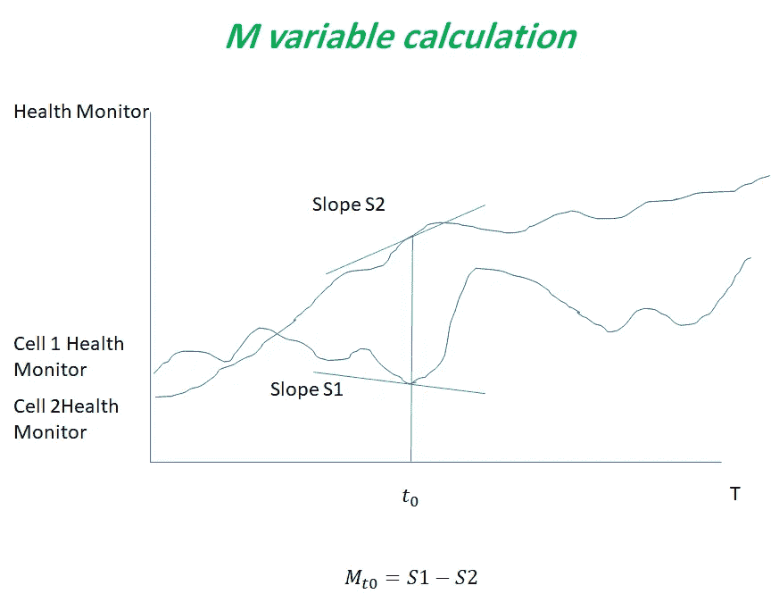

这就是我们如何在两个单元之间映射等式，那么如果我们有多个节点，那么成本函数将像这样分布。

符号为 21 的 u 表示从 cell2 到 cell1 的流量，依此类推。

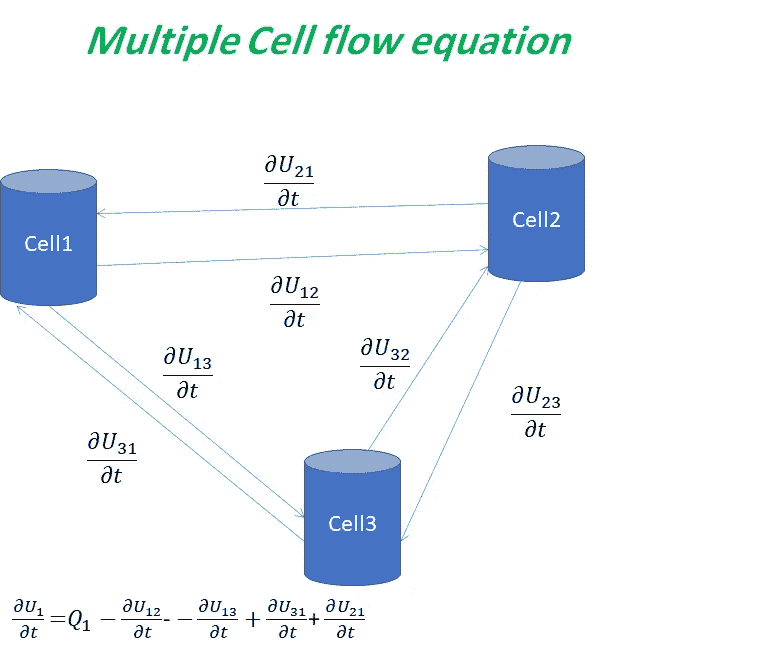

现在，一般来说，我们可以得到如下 3 个像元之间的等式，其中 Q 为网络常数，它映射到变量定义表中定义的整个网络的成本函数的最小值。

现在扩展到 N 个单元格，我们可以将流量求和如下。

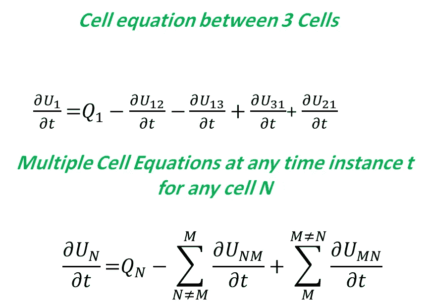

那么问答在这里，我们需要对哪个细胞采取行动，它就是通量(流量)最大的细胞。

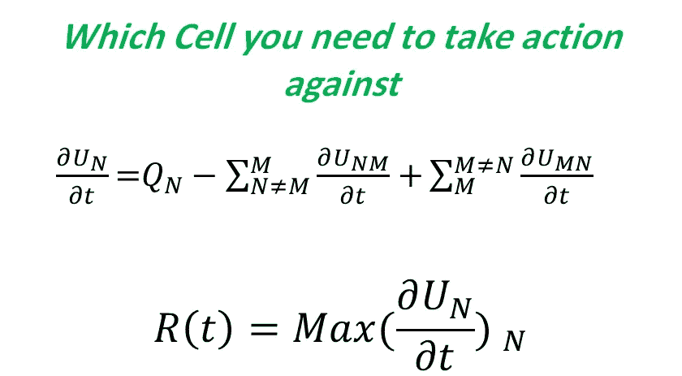

所以最终方程会是这样的。

那么，构建该模型所需的网络资源和流量设计示例是什么呢？我们需要一些网络资源和网络核心数据上的客户行为样本，这些样本将被移动到基础设施的不同逻辑层，如下所示:

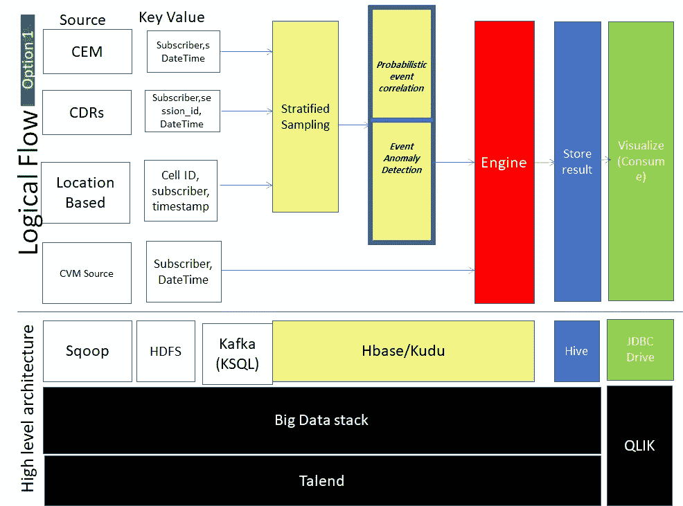

我们如何在没有关联的来源之间进行事件关联？

现在让我们来看看如何在两个未链接的源之间进行事件关联

我们将使用 DAG(有向无环图)概率方法。

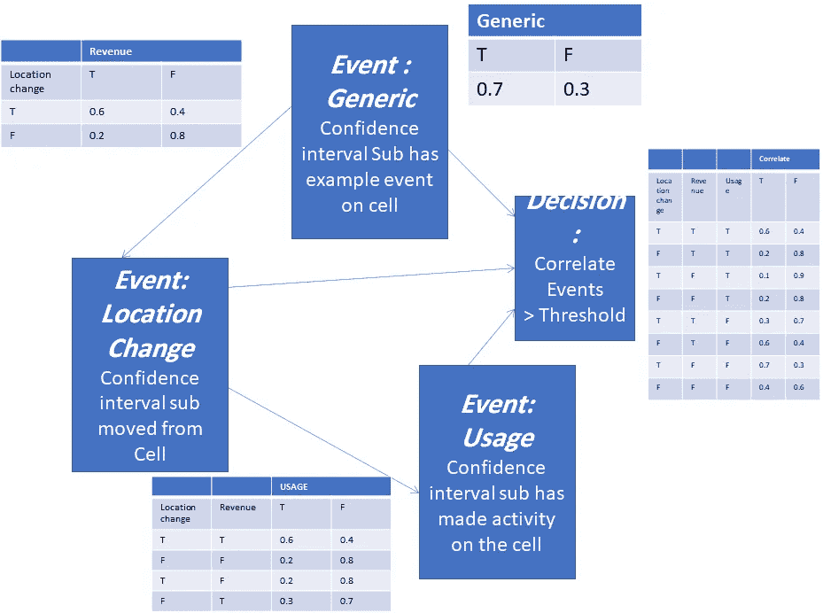

更详细地说，概率计算可以用这个例子的公式来完成

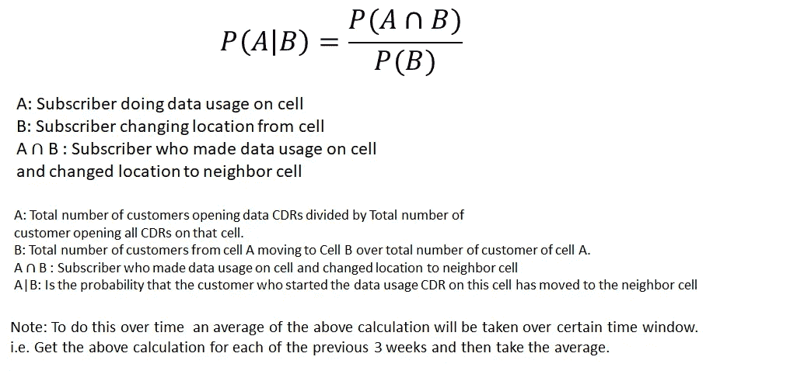

并深入研究开发集群如何实现该模型。

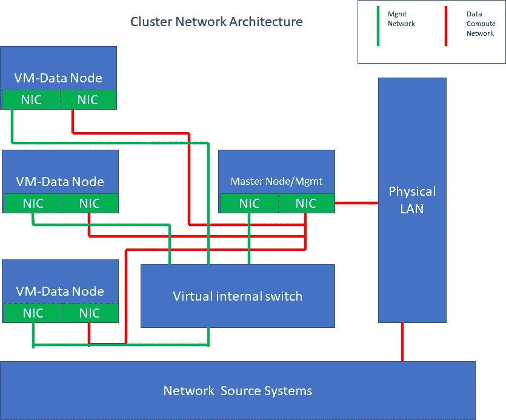

这是 4 个节点，每个节点将提供以下详细服务。

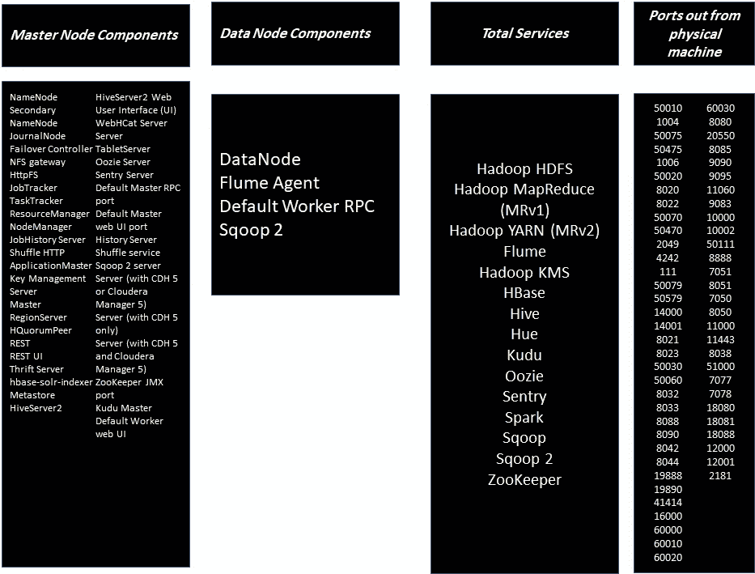

最后，这是大数据开发集群存储体系结构

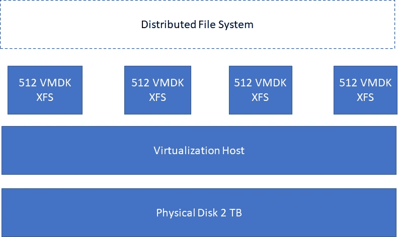

**结论**

因此，在这种方法中，我们设计了一个数学模型，它几乎是线性的，可以使用非链接源之间的相关性来主动分析网络行为，并且我们依赖于一个大数据堆栈。

热传递模型的类比是使用相同方法的入口，以使用相同的方法设计其他成本函数。

实现中的所有微分方程都可以在微批处理中的窗口功能方法中进行，或者以流的方式在移动窗口中进行。

**关于我**

我是一名独立的分析工程师，在该领域拥有丰富的经验。你可以在这里查看我的 LinkedIn，了解更多关于我和我的证书的信息。[https://www.linkedin.com/in/ahmedshaaban90](https://www.linkedin.com/in/ahmedshaaban90)