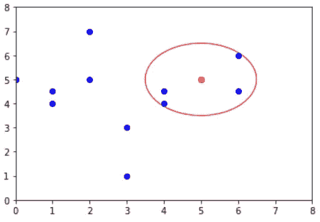
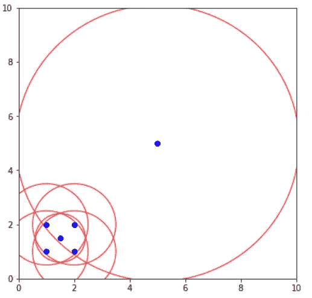
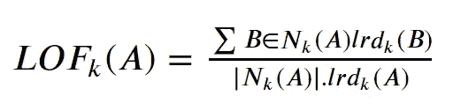
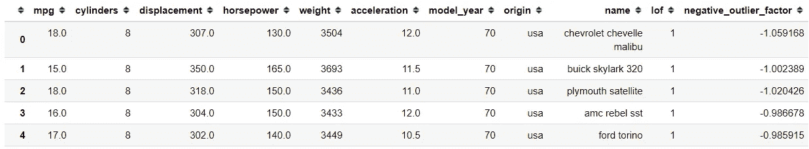
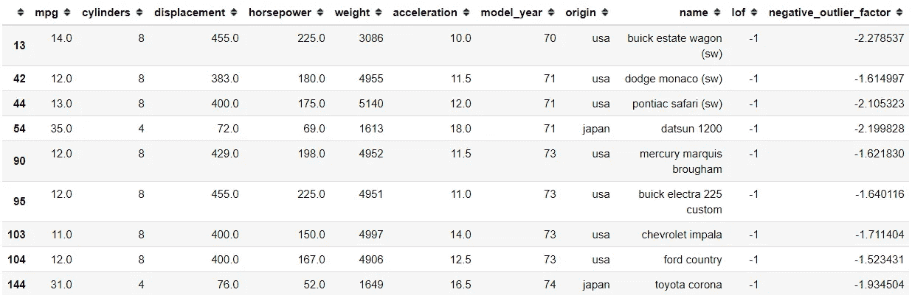

# 具有局部异常因子的新奇检测

> 原文：<https://towardsdatascience.com/novelty-detection-with-local-outlier-factor-4867e89e4f91?source=collection_archive---------25----------------------->

## 检测新数据是否是异常值


兰迪·法特在 [Unsplash](https://unsplash.com?utm_source=medium&utm_medium=referral) 上的照片

**与**异常检测**相比，新奇检测**可能是一些人更难听到的术语。如果离群点检测旨在发现数据集中的异常或显著不同的数据，则新颖性检测旨在确定新的或未知的数据是否是离群点。

新颖性检测是一种半监督分析，因为我们将训练未被异常值污染的训练数据，并且我们感兴趣的是通过使用训练的模型来检测**新**观察值是否是异常值。在这种情况下，离群值也称为新奇值。

在这篇文章中，我将解释如何使用局部异常因子(LOF)进行新颖性检测。让我们开始吧。不过，如果你想跳过所有的理论，只是想接触编码部分，就跳过下一节吧。

# 本地异常因素(LOF)

局部异常因子或 LOF 是由 Breunig 等人提出的一种算法。(2000 年)。概念很简单；该算法试图通过测量给定数据点相对于其邻居的局部偏差来发现异常数据点。在这个算法中，LOF 会给出一个分数，告诉我们的数据是否是异常值。

> LOF(k)～1 意味着**作为邻居的相似密度。**
> 
> LOF(k) < 1 means **密度高于邻居(内/非外值)。**
> 
> LOF(k) > 1 意味着**密度低于邻居(离群值)**

在上式中，我已经给你介绍了一个 *k* 参数。在 LOF 算法中，局部性由 k 个最近邻给出，其距离用于估计局部密度。然后，该距离将用于测量局部偏差并查明异常。

*k* 参数是我们为获取一个 **k 距离**而设置的参数。k 距离是一个点到它的第 k 个邻居的距离。如果 *k* 为 4，k-距离将是一个点到第四个最近点的距离。距离本身是我们可以选择的距离计算的度量。通常它是“欧几里得”，但你可以选择其他距离。



k = 4，该点到达第四个最近的点(由作者创建的图像)

如果您想知道，我们的数据集中的每个数据点都将被测量 k 距离，以便测量下一步。

距离现在被用来定义我们所说的**可达性距离**。这个距离度量是两点距离的最大值或第二点的 k 距离。形式上，可达性距离的度量如下。

> 可达性距离 k(A，B)= max { k-距离(B)，d(A，B)}

其中 A 和 B 是数据点，A 和 B 之间的可达性距离要么是 k-距离 B 的最大值，要么是 A 和 B 之间的距离。如果 A 点在 B 点的 k-邻居内，那么可达性距离 k(A，B)将是 B 的 k-距离。否则，它将是 A 和 B 之间的距离*。*

接下来，我们将通过使用可达性距离来测量**局部可达性密度** (lrd)。测量 lrd 的公式估计如下。

> lrd(A) = 1/(sum(可到达距离(A，i))/k)

其中 I 是点 A 的邻居(从其邻居可以“到达*A**的点)，为了获得点 A 的 lrd，我们计算 A 到其所有 k 个最近邻居的可达性距离之和，并取其平均值。lrd 是平均值的倒数。LOF 概念完全是关于密度的，因此，如果到下一个邻居的距离较长，则特定点位于较稀疏的区域。因此，密度越低——反之亦然。*

这里，lrd 表示该点要移动多远才能到达下一个点或点簇。lrd 越低意味着点必须走得越长，并且组越不密集。



中心点的 lrd 是到其最近邻居的平均可达性距离，这些最近邻居是除(1，1)点之外的左下角的点。但是，这些邻居有其他 lrd，因为它们的最近邻居不包括中心点。(图片由作者创建)

然后，使用以下公式将本地可达性密度与其他邻居的可达性密度进行比较。



将每个点的 lrd 与其 k 个邻居的 lrd 进行比较。LOF 是 A 的相邻点的 lrd 与 A 的 lrd 的平均比率。如果该比率大于 1，则点 A 的密度小于其相邻点的密度。这意味着，从点 A 到下一个点或点簇需要比从 A 的邻居到下一个邻居的距离长得多的距离。

LOF 表示该点相对于其相邻点的密度。如果一个点的密度小于其相邻点的密度(LOF 大于 1)，则该点被视为异常值，因为该点比密集区域更远。

LOF 算法的优点是，即使在异常样本具有不同基础密度的数据集上，它也能很好地执行。这是因为 LOF 不是样本有多孤立，而是样本与周围邻居相比有多孤立。

# 通过 LOF 进行新颖性检测

我们将使用由 [scikit-learn](https://scikit-learn.org/stable/modules/generated/sklearn.neighbors.LocalOutlierFactor.html#sklearn.neighbors.LocalOutlierFactor) 提供的 LOF 来帮助我们训练我们的模型。

```
#Importing the moduleimport pandas as pd
import seaborn as sns
from sklearn.neighbors import LocalOutlierFactor#Importing the dataset. Here I use the mpg dataset as an example
mpg = sns.load_dataset('mpg')
```

作为介绍，在使用模型进行新颖性检测之前，让我们尝试使用 LOF 作为离群点检测模型。

```
#Setting up the model. K is set by passing the n_neighbors parameter with integer. 20 is often considered good already to detect an outlier. By default the distance metric is Euclidean distance.lof = LocalOutlierFactor(n_neighbors = 20)#Training the model, I drop few columns that was not a continuous variablempg['lof'] = lof.fit_predict(mpg.drop(['cylinders', 'model_year', 'origin', 'name'], axis = 1))#Getting the negative LOF scorempg['negative_outlier_factor'] = lof.negative_outlier_factor_mpg
```



下面是结果，我们得到了 LOF 分类和负 LOF 分数。如果 lof 等于 1，那么它被认为是一个 inlier 如果它是-1，那么它是一个离群值。让我们试着得到所有的离群数据。

```
mpg[mpg['lof'] == -1]
```



污染或异常值取决于 LOF 分数。默认情况下，如果 negative_outlier_score 的分数小于-1.5，它将被视为异常值。

现在，让我们尝试使用模型进行新颖性检测。我们需要再次训练模型，因为我们需要传递一个额外的参数。

```
#For novelty detection, we need to pass novelty parameter as Truelof = LocalOutlierFactor(n_neighbors = 20, novelty = True)
lof.fit(mpg.drop(['cylinders', 'model_year', 'origin', 'name'], axis = 1))
```

我们只训练模型，我们根本不会使用训练数据来预测数据。在这里，我们将尝试预测新的看不见的数据。

```
#Predict a new random unseen data, the dimension must match the training datalof.predict(np.array([109, 310, 190, 3411, 15]).reshape(1,-1))Out: array([1])
```

输出可能是 1 或-1，这取决于它是否是一个异常值。如果你想得到负的 LOF 分数，我们也可以用下面的代码来实现。

```
lof.score_samples(np.array([109, 310, 190, 3411, 15]).reshape(1,-1))Out: array([-1.34887042])
```

输出将是数组形式的分数。就是这样，我已经向你们展示了如何用 LOF 做一个简单的新奇感检测。

# 结论

新奇性检测是检测新的看不见的数据是否是异常值的活动。局部异常因子是一种用于异常检测和新奇检测的算法。这取决于我们传递的 *k* 参数。通常情况下，k = 20 是可行的，但是如果您觉得数据中有大量的异常值，您可以增加这个数值。

希望有帮助。

# 如果你喜欢我的内容，并想获得更多关于数据或作为数据科学家的日常生活的深入知识，请考虑在这里订阅我的[时事通讯。](https://cornellius.substack.com/welcome)

> 如果您没有订阅为中等会员，请考虑通过[我的推荐](https://cornelliusyudhawijaya.medium.com/membership)订阅。